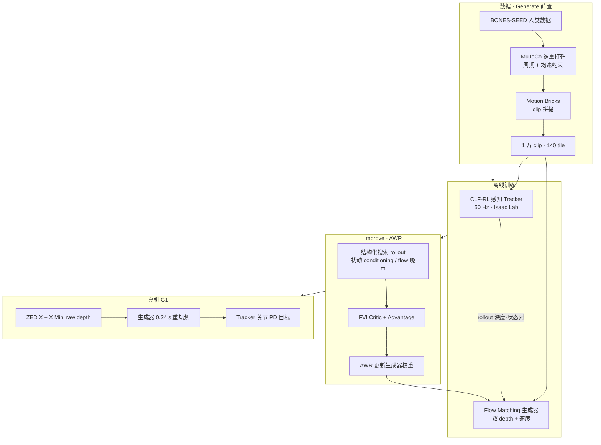

# Generate, Track, Improve（GTI）

**Generate, Track, Improve**（*Perceptive Multi-Skill Humanoid Locomotion with RL-Fine-Tuned Motion Generators*，Olkin / Compton / Ames，加州理工学院 AMBER Lab，arXiv:[2609.31577](https://arxiv.org/abs/2609.31577)，[项目页](https://zolkin1.github.io/generate-track-improve/)）提出 **Generate–Track–Improve** 全链路：把 **动态优化人类参考 + Motion Bricks** 合成的大规模 **地形一致 motion clip 库** 交给 **CLF-RL 感知跟踪器**，再用 **双 raw depth 条件 flow matching Transformer** 在线生成全身轨迹；核心算法贡献是用 **advantage weighted regression（AWR）** 对生成器做 **样本高效的离线 RL 微调**（扰动 conditioning 与 flow 初始噪声，而非对 ~2728 维 plan 加独立高斯噪声）。单对策略使 **Unitree G1** 在 **无里程计/高程图** 下完成走、跑、站、跳箱与多级 **户外楼梯**。

## 一句话定义

**上层 flow matching 看双深度「生成该走哪条全身轨迹」，下层 CLF-RL 50 Hz「跟住它」，再用 AWR 让生成器在闭环 rollout 里自己学会选对技能、贴紧地形。**

## 英文缩写速查

| 缩写 | 英文全称 | 简要说明 |
|------|----------|----------|
| GTI | Generate, Track, Improve | 本文管线与论文简称 |
| AWR | Advantage-Weighted Regression | 用 advantage 加权监督损失做离线策略改进 |
| CLF-RL | Control Lyapunov Function guided RL | 控制李雅普诺夫函数引导的 mimic 式 RL 跟踪奖励 |
| FM | Flow Matching | 连续流匹配生成模型，本文生成器骨干 |
| RL | Reinforcement Learning | 跟踪器 PPO 与生成器 AWR 微调 |
| SDF | Signed Distance Field | 地形一致性/穿透奖励的几何表示 |
| G1 | Unitree G1 Humanoid | 宇树教育科研人形实验平台 |
| Sim2Real | Simulation to Real | DR + 深度噪声支撑真机迁移 |

## 核心信息

| 项 | 内容 |
|----|------|
| **作者** | Zachary Olkin、William D. Compton、Aaron D. Ames |
| **机构** | 加州理工学院（Caltech）控制与动力系统系 / AMBER Lab |
| **平台** | Unitree G1；ZED X（前向）+ ZED X Mini（下视）；Jetson Thor + Orin |
| **任务** | 多技能 **感知 locomotion**：平地走跑、跳箱、上下楼梯；户外与室内 |
| **仿真** | 跟踪：Isaac Lab，8192 env，H100 ~48 h；生成器微调：5×~6 h/H100 |
| **开源** | **待发布** — [项目页](https://zolkin1.github.io/generate-track-improve/) 源码注释预留 Code 按钮，截至 2026-09-30 无官方仓库 |

## 为什么重要

- **生成–跟踪 + 感知同时成立：** 相对 [SONIC](./paper-notebook-architecture-is-all-you-need-diversity-enabled-s.md) 类「非感知生成 + 通用跟踪」，本文 **两层都吃 raw depth**，且真机展示 **多速度与多技能** 而非单向前进。
- **微调对象是对的层：** 论文强调仅 **tracker 闭环微调** 无法修复生成器的 **mode 选择/地形一致 plan**；AWR 直接改生成器权重，OOD 成功率与技能选择有 **+25 pp / +80 pp** 量级增益。
- **探索结构匹配高维 plan：** 对 ~2728 维 plan 逐维加独立高斯噪声的 on-policy 探索数据需求极大；**conditioning 扰动 + flow 噪声重采样** 才对应「换一条轨迹模式」。
- **部署友好：** 不要 odometry/height map；速度指令可与地形解耦，**前向相机** 使机器人在高速接近障碍前自行减速（Table IV：无 upper camera 时 box 成功率 **100%→57.3%**）。

## 方法

| 模块 | 作用 |
|------|------|
| **数据管线** | BONES-SEED → MuJoCo **多重打靶**（周期 + 平均速度约束）→ 140 几何 × **1 万** clip；**Motion Bricks** in-between |
| **Tracker** | **CLF-RL** 跟踪 link 位姿；50 Hz；30×26 下视深度 + 参考/命令 MLP；Isaac Lab + RSL-RL PPO |
| **Generator** | **Flow matching Transformer**；双深度 + 速度 + 前一动作；每 **0.24 s** 输出 **1.24 s** 全身轨迹 |
| **Improve（AWR）** | 冻结 tracker 闭环 rollout → FVI critic → advantage 加权 flow MSE；**5** 迭代 |
| **部署** | 双深度 onboard；室内外同一套权重 |

### 流程总览

## 源码运行时序图

**不适用**（截至 2026-09-30 项目页未发布官方可运行代码；复现需自建 Isaac Lab 训练栈、flow matching 推理与 AWR 数据环，见 [项目页开源核查](../../sources/sites/generate-track-improve-github-io.md)。）

## 实验要点（归纳）

| 设置 | 要点 |
|------|------|
| 对比微调 | AWR ≥ filtered BC / arrival BC / plain BC；去 conditioning 扰动 **−4~6 pp** |
| vs PPO residual | 全维 residual PPO：**>160×** 数据、**30×** 时间，仍低 **~13 pp** 成功率 |
| 双相机 | Box：**100% vs 57.3%**（仅下视）；高速接近障碍时 upper camera 关键 |
| clip 质量 | 优化参考 + Bricks 在中高速 vx RMSE 明显优于单 Bricks（Table III） |
| 真机 | 15 级楼梯、箱跳、户外走跑；同一策略对 |

## 结论

**GTI 的可复用结论是：感知 humanoid 若要「生成 plan + 物理跟踪」分层扩技能，应在生成器上用结构化 off-policy RL（AWR）修 mode 与地形一致 plan，而不是只对 tracker 闭环或在高维 plan 上 brute-force PPO。**

1. **读分层边界** — Tracker 50 Hz 跟轨迹；Generator 0.24 s 换 1.24 s plan；调试时先分离两层误差源。
2. **微调选型** — 高维 flow 输出优先 **conditioning/噪声搜索 + AWR**；全维 Gaussian/on-policy residual 微调需 **>160×** rollout 数据（论文 Fig. 5）。
3. **数据管线值得抄作业** — 动态优化 + Motion Bricks 相对纯 Bricks 降速度 RMSE；相对 motion matching 省 **>7×** clip 合成时间。
4. **感知配置** — 高速 locomotion 需要 **前向 depth** 预减速；单下视在 box 类障碍上可掉 **40+ pp**。
5. **部署** — raw depth、无 odom/height map 降低户外栈复杂度；语义「该不该跳上这个箱子」仍不可表达（纯几何 depth 局限）。
6. **开源** — 待项目页 Code 链接发布后再补 `sources/repos/` 与时序图。

## 与其他工作对比

| 维度 | [ETH 扩散+跟踪](./paper-hrl-stack-27-learning_whole_body_humanoid_locomot.md) | [RPL](./paper-rpl-robust-humanoid-perceptive-locomotion.md) | **GTI（本文）** |
|------|-----------------------------------------------|----------------------------|----------------|
| 规划层 | 地形条件 **扩散** | 无（DAgger 深度策略） | **Flow matching** 全身轨迹 |
| 微调对象 | 主要 **tracker** 闭环 RL | Stage 1–2 蒸馏 | **Generator AWR** |
| 感知 | onboard 深度 | 多视角深度 | **双 raw depth**，无 odom |
| 技能 | 箱攀/栏/楼梯等 | 分地形行走 + 载荷 | 走跑跳箱楼梯 **单对策略** |
| 代码 | 见 ETH 项目页 | Coming Soon | **待发布** |

## 局限与风险

- **奖励与数据仍含人工：** RL 微调奖励虽通用但非万能；clip 库参考挑选与 transition 超参需人工/启发式（论文 §IV-A）。
- **纯 depth 语义盲区：** 几何上像箱子但不应跳上的物体无法区分。
- **复现成本：** Isaac Lab + flow + AWR 全栈未开源；与 [Chasing Autonomy](../methods/chasing-autonomy-pipeline.md) 共享 CLF-RL/优化文化但本文管线更长。
- **计算：** 双 Jetson 分工与 ZED 同步是部署隐含假设。

## 工程实践

| 项 | 建议 |
|----|------|
| 跟踪器 | 先确认 CLF-RL link 跟踪误差与 30×26 depth 延迟 DR 过关再开生成器闭环 |
| 生成器微调 | 固定 tracker；优先 log **contact/SDF 罚** 与 **技能 one-hot 正确率** 再盯 vx RMSE |
| 相机 | 保留 forward depth；消融 Table IV 作 acceptance test |
| 开源跟进 | 监视 [项目页](https://zolkin1.github.io/generate-track-improve/) Code 按钮与 [`sources/sites/generate-track-improve-github-io.md`](../../sources/sites/generate-track-improve-github-io.md) |

## 关联页面

- 方法：[Chasing Autonomy Pipeline](../methods/chasing-autonomy-pipeline.md)、[Diffusion-based Motion Generation](../methods/diffusion-motion-generation.md)
- 任务：[Humanoid Locomotion](../tasks/humanoid-locomotion.md)、[楼梯与障碍感知移动](../tasks/stair-obstacle-perceptive-locomotion.md)
- 对照：[Shooting for Contact / DSMS](./paper-shooting-for-contact.md)（同 lab 动态优化参考）、[Walk the PLANC](./paper-notebook-walk-the-planc-physics-guided-rl-for-agile-human.md)
- 平台：[Unitree G1](./unitree-g1.md)

## 参考来源

- [generate_track_improve_arxiv_2609_31577.md](../../sources/papers/generate_track_improve_arxiv_2609_31577.md) — arXiv 策展摘录
- [generate-track-improve-github-io.md](../../sources/sites/generate-track-improve-github-io.md) — 项目页与开源核查
- 论文：<https://arxiv.org/abs/2609.31577>

## 推荐继续阅读

- [项目页](https://zolkin1.github.io/generate-track-improve/) — 真机视频与 AWR 消融
- [Chasing Autonomy（arXiv:2603.25902）](https://arxiv.org/abs/2603.25902) — 同作者动态优化 + CLF-RL 跑步
- [Learning Whole-Body Humanoid Locomotion（2604.17335）](https://arxiv.org/abs/2604.17335) — 扩散生成 + 跟踪闭环对照
- [Motion Bricks（arXiv:2604.24833）](https://arxiv.org/abs/2604.24833) — clip in-between 模块
