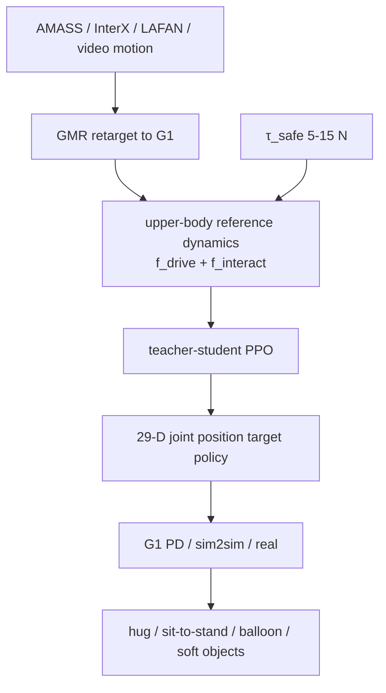
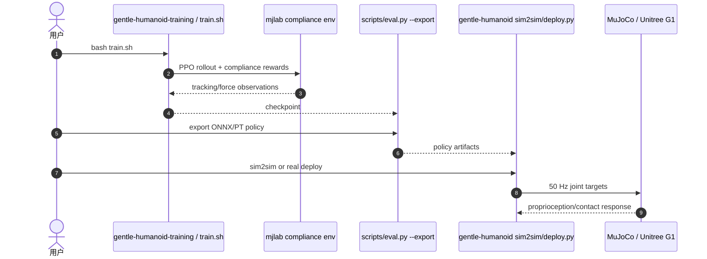

# GentleHumanoid

**GentleHumanoid**（*Learning Upper-body Compliance for Contact-rich Human and Object Interaction*）是接触后稳定路线中的柔顺跟踪代表：机器人仍跟踪全身参考动作，但上半身肩-肘-腕链条会根据虚拟阻抗参考动力学和安全力阈值产生可控柔顺。

## 一句话定义

GentleHumanoid 在全身 motion tracking 中加入上半身阻抗式参考动力学，使 Unitree G1 能在拥抱、搀扶、软物体操作等任务中既跟踪动作又限制接触力。

## 英文缩写速查

| 缩写 | 英文全称 | 简要说明 |
|------|----------|----------|
| PPO | Proximal Policy Optimization | teacher-student 训练使用的 RL 算法 |
| GMR | General Motion Retargeting | 视频/动捕动作到 G1 的重定向工具 |
| PD | Proportional-Derivative | 底层关节位置控制 |
| G1 | Unitree G1 Humanoid | 论文真机平台 |
| ONNX | Open Neural Network Exchange | 部署导出格式之一 |
| WBC | Whole-Body Control | 全身跟踪与柔顺交互的控制背景 |

## 为什么重要

- **柔顺作用在多连杆链条上**：拥抱/搀扶不是一个手端点受力，而是肩、肘、腕共同接触。
- **力阈值可部署调节**：训练随机化 `τ_safe ∈ [5, 15] N`，部署示例包含握手/气球 **5 N**、拥抱 **10 N**、坐站辅助 **15 N**。
- **统一 resistive/guiding contact**：用同一弹簧式交互力建模受阻和被引导两种接触。
- **工程材料较完整**：项目页、论文 source、训练/推理仓、motion_tracking compliance 分支均已归档。

## 流程总览

## 核心原理（详细）

每个上身关键点满足 `M x_ddot = f_drive + f_interact`。驱动力是目标轨迹弹簧-阻尼项，交互力是统一弹簧：resistive 时锚点是初次接触位置，guiding 时锚点从完整上身姿态分布采样，避免每个 link 独立随机受力造成运动学不一致。训练中 `K_spring ~ U(5,250)`，约 40% 无外力，其余激活不同手臂/link 组合。

Teacher 可看参考动力学状态、交互力、力矩等 privileged 信息；Student 只看部署可得观测。动作是 29 维关节位置目标，底层 PD 跟踪。

## 关键实验数字

| 项 | 数字/结论 |
|----|-----------|
| 力阈值 | `τ_safe ∈ [5, 15] N` |
| 参考动力学质量 | `M=0.1 kg` |
| 弹簧随机化 | `K_spring ~ U(5,250)` |
| 动作数据 | 约 **25 h @ 50 Hz**（AMASS/InterX/LAFAN 经 GMR） |
| 测力 | 40 路 calibrated capacitive taxels 压力垫 |
| 平台 | Unitree G1 |

## 源码运行时序图

## 工程实践（含开源状态）

| 项 | 结论 |
|----|------|
| 项目页 | <https://gentle-humanoid.axell.top/> |
| 训练代码 | <https://github.com/Axellwppr/gentle-humanoid-training> |
| 部署代码 | <https://github.com/Axellwppr/gentle-humanoid> |
| 相关 tracking 栈 | <https://github.com/Axellwppr/motion_tracking> `compliance` 分支 |
| 部署 | ONNX/PT 导出，sim2sim / real deploy |
| 许可/状态 | 以各仓库 README 为准；站内工程摘录见 `sources/repos/axellwppr_motion_tracking.md` |

## 局限与风险

- **不解决高层任务规划**：它让参考动作柔顺可交互，但不决定要做什么。
- **力阈值需按任务设置**：太软会失去任务力，太硬会产生冲击。
- **接触模型是仿真合成**：真实人/软物体接触分布可能超出训练随机化。
- **与精细触觉不同**：没有 WT-UMI 那样的全身 tactile observation。

## 关联页面

- [GentleHumanoid 方法页](../methods/gentlehumanoid-motion-tracking.md)
- [Loco-Manip 接触分类 04：接触后如何稳住](../overview/loco-manip-contact-category-04-post-contact-stability.md)
- [阻抗控制](../concepts/impedance-control.md)
- [CHIP](./paper-hrl-stack-36-chip.md)
- [Thor](./paper-hrl-stack-42-thor.md)
- [SONIC](../methods/sonic-motion-tracking.md)

## 参考来源

- [gentlehumanoid_upper_body_compliance.md](../../sources/papers/gentlehumanoid_upper_body_compliance.md)
- [gentle-humanoid-axell-top.md](../../sources/sites/gentle-humanoid-axell-top.md)
- [axellwppr_motion_tracking.md](../../sources/repos/axellwppr_motion_tracking.md)
- [loco-manip-contact-category-04-post-contact-stability](../overview/loco-manip-contact-category-04-post-contact-stability.md)
- [wechat_embodied_ai_lab_loco_manip_contact_survey.md](../../sources/blogs/wechat_embodied_ai_lab_loco_manip_contact_survey.md)
- *GentleHumanoid: Learning Upper-body Compliance for Contact-rich Human and Object Interaction*, arXiv:2511.04679. <https://arxiv.org/abs/2511.04679>

## 推荐继续阅读

- [GentleHumanoid 项目页](https://gentle-humanoid.axell.top/)
- [GentleHumanoid 方法页](../methods/gentlehumanoid-motion-tracking.md)
- [机器人论文阅读笔记：GentleHumanoid](https://imchong.github.io/Humanoid_Robot_Learning_Paper_Notebooks/papers/04_Loco-Manipulation_and_WBC/GentleHumanoid__Learning_Upper-body_Compliance_for_Contact-rich_Human_and_Object/GentleHumanoid__Learning_Upper-body_Compliance_for_Contact-rich_Human_and_Object.html)
