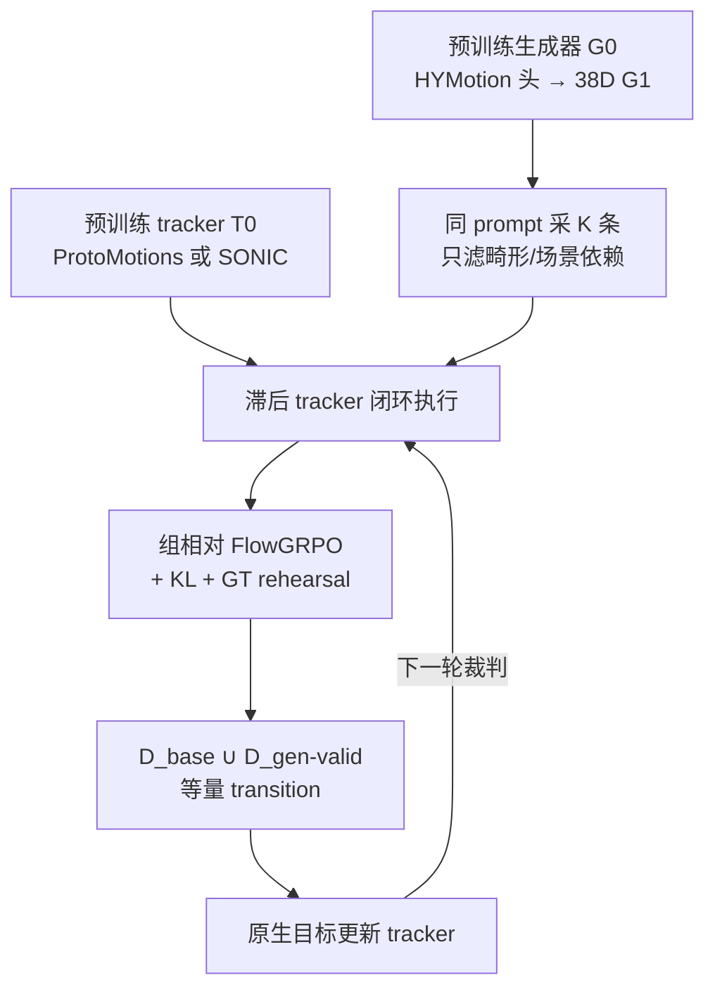

# GenTrack：机器人原生运动生成与零样本跟踪的物理对齐

**GenTrack**（*Physical Alignment for Robot-Native Motion Generation and Zero-Shot Humanoid Tracking*，[arXiv:2608.01410](https://arxiv.org/abs/2608.01410)，**AAAI 2027**）由 **浙江大学 / 北京大学 / 腾讯 / 之江实验室** 提出：不要再单向「生成一批参考再训 tracker」或「冻结 tracker 去滤生成器」。从已有 robot-native 生成器与全身 tracker 出发，用闭环执行把两边一起后训练，**不采集新数据**。

## 一句话定义

**滞后 tracker 的执行分数对齐文本→运动生成器，新生成参考再扩 tracker 的零样本覆盖；两边在线共进化，而不是离线筛一次。**

## 英文缩写速查

| 缩写 | 英文全称 | 简要说明 |
|------|----------|----------|
| GenTrack | Generator–Tracker co-training | 本文在线生成器–跟踪器互训框架 |
| FlowGRPO | Flow matching Group Relative Policy Optimization | 同 prompt 组内相对优势，对流匹配生成器做 RL |
| SONIC | Supersizing Motion Tracking for Natural Humanoid WBC | 规模化全身跟踪骨干之一 |
| TMR | Text-to-Motion Retrieval | 生成语义/分布用的检索评测（本文 TMR-G1） |
| AMASS | Archive of Motion Capture as Surface Shapes | tracker 公开参考池与 AMASS-test 划分 |
| LAFAN | Ubisoft LAFAN1 locomotion | 走跑转过渡基准；本文 LAFAN1-G1 |
| MPJPE | Mean Per-Joint Position Error | 骨盆对齐后的 14-body 位置误差 |
| SFT | Supervised Fine-Tuning | 单向对照：用冻结 tracker 过滤后再监督微调 |
| G1 | Unitree G1 Humanoid | 唯一评测形态；仿真 30 FPS |
| OOD | Out-of-Distribution | Wild-G1-clean 与私有 1,024 prompt 套件 |

## 为什么重要

- **两个瓶颈是耦合的。** 通才 tracker 要覆盖未见动作，靠的是具身参考规模；文本→运动能扩量，但人体/重定向分布只是可执行分布的代理。单向管线冻结一边，另一边很快过时。
- **后训练，不是从头训。** 接公开 [ProtoMotions](./protomotions.md) 与 [SONIC](../methods/sonic-motion-tracking.md) checkpoint，预算对齐「只续训参考 / 离线 replay / 单向更新」。问的是：互训有没有超出「再跑同等步数」。
- **生成器要对齐物理，但不能塌成好跟的慢动作。** KL 锚 + 原文对 rehearsal 把 TMR/FID 保住；单向 Filtered SFT 会把成功刷高、语义刷低。
- **读 HY-Motion 的机器人落点。** 附录把 \(G_0\) 标成 HYMotion：人体流匹配骨干换 38D G1 头，再被执行反馈对齐——对照 [Gen2Humanoid](./gen2humanoid.md) 的「生成 + 重定向胶水、不含 tracking」。

## 核心信息

| 字段 | 内容 |
|------|------|
| 作者 | Zeyu Ling、Xinyao Yu、Renye Yan、Jikang Cheng、Zhanke Wang、Qing Shuai、Changqing Zou（通讯） |
| 机构 | 浙江大学（ZJU）；北京大学（PKU）；腾讯（Tencent Hunyuan）；之江实验室（Zhejiang Lab） |
| 出处 | AAAI 2027；arXiv:2608.01410（2026-08） |
| 平台 | Unitree G1，29 驱动关节；仿真 30 FPS；无真机表 |
| 生成器 | 人体 T2M 骨干换 38D robot 头；357,472 条内部 GMD→G1 对只用于初始化/排练 |
| Tracker | 公开 ProtoMotions（AMP/PPO）与官方 SONIC；后训练参考池 13,337 AMASS/LAFAN |
| 开源（截至 2026-08-15） | **确认未开源**：无项目页、无仓库；Wild-G1 与 1,024 生成套件私有 |

## 方法与核心结构

### 问题

给定参考 \(\mathbf{q}\)，tracker \(\pi_\phi\) 产出闭环轨迹 \(\boldsymbol{\tau}=\mathcal{E}(\pi_\phi,\mathbf{q})\)。零样本要求同一策略跟训练未见参考，且不做 test-time 优化。生成器 \(G_\theta(\mathbf{c},z)\) 在 **机器人坐标** 里采样，但坐标对了不等于闭环跟得住：接触、关节连续、自碰、快切换会在执行里累积。

### Robot-native 表示

每帧 \(\mathbf{q}_t\in\mathbb{R}^{38}\)：3D root 通道、连续 6D 骨盆旋转、29 个驱动关节。片段级 canonicalize（首帧平面原点、朝 \(+x\)），平面用位移、高度保持绝对。**GMD 重定向只在离线建对时跑一次**；在线环内生成器已经说机器人语言。

### 一轮在线互训

每轮四步，奖励裁判是 **上一轮冻结的 tracker**，当前 trainee 对生成器奖励权重为 0：

1. 同一 prompt 采 \(K\) 条候选；只丢掉非有限、畸形、依赖场景几何的参考（**不按当前是否跟得住准入**）。
2. 滞后 tracker 打执行分，组内标准化后做 FlowGRPO（每组轨迹 replay 4 次 clip 更新）。
3. 结构合法的 on-policy 生成进入累积池；tracker 用自己的原生目标，**公开参考与生成参考各一半 transition**。
4. 更新后的 tracker 成为下一轮 trainee，本轮 trainee 延迟成质量裁判。

执行分（主协议）：

\[
S_{\mathrm{exec}}=(1-c)+[e_j]_2+[e_t/0.5]_2+0.5[e_d/0.5]_2+2\mathbb{I}_{\mathrm{fall}},\quad [x]_2=\min(x,2)
\]

\(c\) 完成率，\(e_j\) 最大关节误差，\(e_t\) 根轨迹误差，\(e_d\) 根位移误差。主协议不用速度/幅度/二值成功门。

漂移约束：FlowGRPO 上 \(\lambda_{\mathrm{KL}}=0.02\) 锚到冻结 \(G_0\)；每两步 GRPO 做一次权重 1.0 的原文对 flow-matching rehearsal。TMR/多样性 **不进奖励**。

### 流程总览

## 源码运行时序图

**不适用**（截至 2026-08-15）：无官方训练 / 评测入口。放出后应补：加载公开 ProtoMotions 或 SONIC → 38D 生成器采样 → IsaacLab/MuJoCo 闭环打分 → FlowGRPO → 等量混合后训练 → 冻结 LAFAN1 / AMASS-test / Wild-G1 与 TMR-G1。

勿把 [SDU-VelKoTek/GenTrack](https://github.com/SDU-VelKoTek/GenTrack) 当成本方法：那是视觉多目标跟踪（arXiv:2510.24399）。

## 工程实践

| 项 | 建议 / 论文设定 |
|----|----------------|
| **何时用这篇** | 已有 G1 通才 tracker 与 robot-native T2M，不想再采具身数据，怀疑静态生成池已经过时 |
| **何时不用** | 今天就要跑通 → 继续 [SONIC](../methods/sonic-motion-tracking.md) / [Humanoid-GPT](./paper-humanoid-gpt.md) 公开栈；只要文本→关节初稿 → [Gen2Humanoid](./gen2humanoid.md)；要真机高动态 T2M → 先看 [PhyGile](./paper-phygile.md)（有项目页视频） |
| **裁判必须滞后** | 当前 trainee 当唯一裁判，跨 split SR 掉到 74.8/79.6/46.4 |
| **不要用成功门过滤进 tracker** | 生成参考只做结构检查；用当前难度门控会让课程跟着 tracker 偏见走 |
| **一半公开、一半生成** | 池子变大也不改来源混合，减轻遗忘 |
| **KL + rehearsal 不要省** | 去掉后执行成功更高，但 TMR/FID/多样性明显塌 |
| **Filtered SFT 的成功不可信** | 96.97 Succ. 来自迎合冻结 \(T_0\) 的低难度，不是物理保真 |
| **评测协议** | 统一 30 FPS、fall-only（骨盆相对高度 >0.25 m 才失败）、误差含失败帧；不用各方法原生 success flag |

## 实验与评测

平台：仿真 Unitree G1。Tracker 对照含 Any2Track、BeyondMimic（**per-clip 专家，不是通才**）、Humanoid-GPT、两条公开骨干及其 matched 后训练。生成器一律用 **冻结官方 SONIC** 当执行器 + TMR-G1。

**Tracker（Table 1，fall-only SR / 全轨迹误差）：**

| 方法 | LAFAN1 | AMASS-test | Wild-G1 | MPJPE (mm) | \(E_g\) (mm) |
|------|--------|------------|---------|------------|--------------|
| ProtoMotions \(T_0\) | 75.0 | 81.2 | 45.9 | 142.2 | 789.8 |
| ProtoMotions GenTrack | 75.0 | 81.2 | 47.3 | 139.3 | 775.4 |
| SONIC | 85.0 | 79.0 | 47.2 | 126.2 | 814.2 |
| **SONIC GenTrack** | **90.0** | **79.7** | **48.0** | **124.1** | **807.2** |

SONIC 支相对冻结 \(G_0\) replay：三 split 全升，MPJPE −9.2 mm、\(E_g\) −40.4 mm；速度误差与原版 SONIC 持平。Final-\(G\) 离线 replay **复现不了**在线轨迹。ProtoMotions 支 Wild-G1 与 MPJPE 有收益，\(E_g\) 仍不如 \(G_0\) replay，属于 split 依赖折中。

**生成器（Table 2，1,024 固定套件）：** SONIC 支 Succ. 92.58→94.43，\(E_{\mathrm{key}}\) 0.410→0.325 m，R@1 0.774→0.783，FID 0.023→0.020。Filtered SFT 成功最高（96.97）但 FID 升到 0.028。

**诊断：** 9,332 对窗口 PCA 重叠大，但描述符空间分类器 AUC \(0.996\pm0.004\)——参考–执行差距是系统的，主要在 jerk、脚滑、根高度、脚间隙，不是「重定向错了所以丢掉」。

## 结论

**互训的价值不在多跑几步，而在让「可执行前沿」和「生成课程」一起动；SONIC 骨干上这是稳的，ProtoMotions 上是有折中的后训练，不是第二条 scaling 曲线。**

1. **真影响：在线，而不是最终生成池。** Final-\(G\) replay 全面低于在线 SONIC 行。
2. **真影响：滞后稠密执行分。** 成功门、当前 trainee 裁判、去掉执行奖励都复现不了全环。
3. **真影响：SONIC 支数字。** LAFAN1 85→90，Wild-G1 47.2→48.0，MPJPE 126.2→124.1，速度误差不涨。
4. **次要代价：Filtered SFT 的成功。** 迎合冻结 tracker 会牺牲难度与语义。
5. **次要代价：ProtoMotions 支。** Wild-G1 / MPJPE 有益，\(E_g\) 与 LAFAN1 SR 不是全面碾压。
6. **部署读法：** 评测只在仿真 G1；没有真机表。今天不能当复现栈。
7. **工程读法：** 先有可跑的 tracker 和 robot-native 生成器，再谈这一圈后训练。

## 与其他工作对比

| 对照 | 差异读法 |
|------|----------|
| [PARC](./paper-notebook-parc-physics-based-augmentation-with-reinforceme.md) | 角色动画：跟踪修正回灌生成器扩数据。本文测的是 **语言条件 robot-native 生成** 是否提升 **未见参考** 的 tracker 覆盖 |
| [RLPF](./paper-notebook-rl-from-physical-feedback-aligning-large-motion.md) | 冻结 tracker 给大运动模型物理反馈。本文 **两边都更新**，并拿单向 FlowGRPO 当对照 |
| [PhyGile](./paper-phygile.md) | 262D robot-native 扩散 + physics-prefix + GMT 闭环，冲真机高动态。本文是 **对已有 SONIC/ProtoMotions 做后训练**，无真机 |
| [Humanoid-GPT](./paper-humanoid-gpt.md) | 2B 帧 + Transformer 蒸馏把 tracker 做强。本文几乎不加具身数据，靠生成课程 |
| [Kimodo](./kimodo.md) | 运动学扩散直出 G1；Table 3 执行成功高但 TMR R@1 仅 0.500。本文 \(G_0\) 是 HYMotion 头 |
| [Gen2Humanoid](./gen2humanoid.md) | HY-Motion + GMR 胶水，**不含** tracking 训练。本文把 robot-native 头放进执行环 |
| [HY-Motion 1.0](../methods/hy-motion-1.md) | 人体 SMPL-H 流匹配 + DPO/Flow-GRPO。本文把同类生成器接到 G1 执行奖励 |
| BeyondMimic | Table 1 误差更好，但是 **逐条参考专家**，不是零样本通才 |

## 局限与风险

- **未开源：** 不能复现 90.0 SR 或 1,024 套件；内部 357k 对不公开。
- **仿真 G1 only：** 没有真机、没有第二形态。
- **私有测试：** Wild-G1-clean 与生成套件无法外复现。
- **BeyondMimic 行不可直接当 SOTA 通才。** 论文自己把它标成 specialist。
- **物理奖励偏保守：** 作者用 TMR/多样性盯着塌缩；去掉锚之后执行更好、语义更差。
- **混名：** 视觉 MOT GenTrack ≠ 本页。

## 关联页面

- [SONIC](../methods/sonic-motion-tracking.md) — 主骨干与冻结执行器
- [ProtoMotions](./protomotions.md) — 第二条 AMP/PPO 骨干
- [HY-Motion 1.0](../methods/hy-motion-1.md) — \(G_0\) 人体流匹配来源
- [PhyGile](./paper-phygile.md) — 另一条 robot-native 生成–跟踪闭环（真机敏捷）
- [Humanoid-GPT](./paper-humanoid-gpt.md) — 同协议下的规模化 tracker 对照
- [PARC](./paper-notebook-parc-physics-based-augmentation-with-reinforceme.md) — 生成器–跟踪器迭代的动画先例
- [RL from Physical Feedback](./paper-notebook-rl-from-physical-feedback-aligning-large-motion.md) — 单向物理对齐
- [Kimodo](./kimodo.md) — 附录 robot-native 源对照
- [Gen2Humanoid](./gen2humanoid.md) — 无物理环的 HY-Motion→G1 胶水
- [人形运动跟踪方法选型](../queries/humanoid-motion-tracking-method-selection.md) — 何时做生成器–跟踪器后训练
- [Jason Peng：灵活运动技能学习](../overview/jason-peng-flexible-motion-skill-learning.md) — PARC 路径的阅读坐标
- [HY-Motion vs GENMO vs Kimodo](../comparisons/hy-motion-vs-genmo-vs-kimodo.md) — 运动学生成骨干；本文是物理后训练
- [GMR](../methods/motion-retargeting-gmr.md) — 离线重定向族；本文在线环内不再跑
- [Unitree G1](./unitree-g1.md) — 评测平台

## 参考来源

- [gentrack_arxiv_2608_01410.md](../../sources/papers/gentrack_arxiv_2608_01410.md)
- Ling et al. — <https://arxiv.org/abs/2608.01410>
- HTML 全文 — <https://arxiv.org/html/2608.01410>

## 推荐继续阅读

- 论文 HTML — <https://arxiv.org/html/2608.01410>
- SONIC — <https://arxiv.org/abs/2511.07820>
- HY-Motion 1.0 — <https://arxiv.org/abs/2512.23464>
- Flow-GRPO — <https://arxiv.org/abs/2505.05470>
- PARC 项目页 — <https://michaelx.io/parc/index.html>
- PhyGile — <https://arxiv.org/abs/2603.19305>
