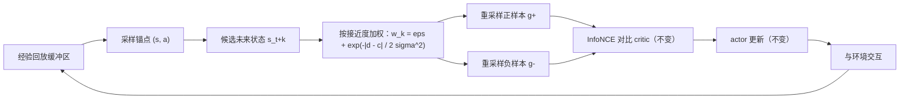

# IWR：接触的几何（从零学物体操作的对比强化学习）

**IWR**（Interaction-Weighted Resampling；论文 *Learning Object Manipulation from Scratch via Contrastive Interaction*，[arXiv:2606.11525](https://arxiv.org/abs/2606.11525)，v1 2026-06-10；[项目页](https://iwr-arxiv.github.io/) 标注 **CoRL 2026**）由 Tongle Shen、Caleb Chuck、Fan Feng、Biwei Huang（UCSD、UT Austin）提出。[Aether AI](./aether-ai.md) 官方博客在 **2026-07-16** 以 *The Geometry of Contact: Learning Object Manipulation from Scratch*（Field notes #06）发布解读。它研究的问题是：**不给示范、不给任务奖励，只给目标，机器人能否靠自己的交互经验学会操作？**

## 一句话定义

**对比强化学习（CRL）的可达性表示在接触处会「折一下」，而接触帧在均匀采样里几乎采不到；IWR 只改正样本未来状态的采样分布，在接近接触的未来上加权，让表示学好这道折痕。**

## 英文缩写速查

| 缩写 | 英文全称 | 简要说明 |
|------|----------|----------|
| IWR | Interaction-Weighted Resampling | 本文方法：按交互接近度重加权未来目标采样 |
| CRL | Contrastive Reinforcement Learning | 用对比学习估计目标可达性的目标条件 RL |
| CRTR | Contrastive Representations for Temporal Reasoning | 更强的对比 RL 基线（NeurIPS 2025） |
| GCRL | Goal-Conditioned Reinforcement Learning | 以目标状态为条件的 RL |
| InfoNCE | Info Noise-Contrastive Estimation | CRL 的训练目标 |
| FMDP | Factored Markov Decision Process | 状态分解为智能体与物体两部分的 MDP |
| HER | Hindsight Experience Replay | 事后目标重标注，基线之一 |
| HINT | Null Counterfactual Factor Interactions | 基于因子交互的 GCRL 基线（SAC+HINT） |
| SAC / PPO | Soft Actor-Critic / Proximal Policy Optimization | 无模型 RL 基线 |
| UR | Universal Robots | 真机 air hockey 使用的机械臂品牌 |

## 为什么重要

- **给出 CRL 在操作上失灵的机制解释。** CRL 在运动、到达类任务上随模型规模扩展得不错，但在接触丰富的操作上吃力。本文把原因定位到「接触改变动力学模式 → 可达性几何出现仿射折痕 → 接触处的误差被之后的被动动力学放大」。
- **修复非常小。** 不加网络、不加奖励整形、不加辅助损失，只改采样权重，而且只需要粗略的接近度信号（如夹爪-物体距离），不需要接触标签。
- **有真机证据。** 在需要快速推断和反应控制的真实 air hockey 上，仿真训练、零样本迁移，成功率从 CRL 的 25% 提到 60%（自报）。作者称这是第一个只靠目标设定和自身交互经验训练的真实 air hockey 机器人。
- **对「无监督 RL 规模化」路线的提醒。** 引用了 [BFM-Zero](./paper-bfm-zero.md)、千层网络等规模化工作，作者认为交互越稀疏复杂，单靠加规模可能不够，采样分布同样关键。

## 核心信息

| 项 | 内容 |
|----|------|
| **机构** | 加州大学圣地亚哥分校（UCSD）、德州大学奥斯汀分校（UT Austin）；解读发布在以太智能（Aether AI）博客 |
| **作者** | Tongle Shen、Caleb Chuck、Fan Feng、Biwei Huang（后两位 equal advising） |
| **会议** | CoRL 2026（项目页标注） |
| **底座算法** | CRL（Eysenbach et al. 2022）与 CRTR；IWR 是它们的采样层修改 |
| **监督** | 只有目标设定 + 自身交互；无示范、无任务奖励 |
| **评测** | Box2D 到达 / 推动（5 个变体）、Meta-World（4 个任务）、Air Hockey（仿真、sim-to-real 迁移、真机） |
| **基线** | PPO、SAC、SAC+HER、SAC+HINT、CRL、CRTR |
| **真机** | UR 机械臂持推板 + 顶置相机跟踪冰球，单应性把相机画面对齐到仿真坐标 |
| **开源** | 截至 2026-10-10 博客、项目页、arXiv 均未列代码 |

## 核心原理（方法）

### CRL 回顾：可达性地形

目标条件 RL 关心的是折扣未来占用密度：

\[\rho^\pi(g\mid s,a)=(1-\gamma)\sum_{k\ge1}\gamma^{k-1}p^\pi(s_{t+k}=g\mid s_t=s,a_t=a)\]

CRL 学状态-动作编码器 \(\phi(s,a)\) 和目标编码器 \(\psi(g)\)，用内积逼近对数可达性（减去只与目标有关的基线）：\(E^*(s,a,g)=\log\rho^\pi(g\mid s,a)-\log\bar\rho_B(g)=\phi(s,a)^\top\psi(g)\)。训练时同轨迹后续状态是正样本 \(g^+\)，其他状态是负样本，用 InfoNCE 拉近推远。策略沿能量爬向目标，相当于沿「可达性地形」走。

### 为什么接触会破坏地形

- **运动：一步映射是线性的。** 动作小变化 → 结果小变化，\(\psi_{t+1}\approx A_0\psi_t\)，rollout 是一条光滑弧线。
- **接触：一步映射变成仿射。** 夹爪碰到物体前，动作对物体无效；碰到后一步之内物体位姿和速度进入可控范围，\(\psi_{t+1}\approx A_1\psi_t+b_t\)。偏置 \(b_t\) 是模式切换的标志，一个统一的光滑表示无法同时拟合两侧。
- **误差向后传播。** 接触之后物体又进入被动运动，接触处的局部误差 \(e\) 被被动动力学带着走：

\[\sup|\hat E_k-E_k|\propto\|A_0^k\|\,\|e\|+\tfrac12\|A_0^k\|^2\|e\|^2\]

博客用 t-SNE 可视化了这一点：到达任务中 \(\phi(s,a)\) 平滑漂移，air hockey 中则是长时间漂移 + 击球瞬间跳变。

### IWR：把采样密度挪到接触附近

- \(d_{t+k}\)：粗略接近度信号（例如夹爪-物体距离）；\(c\)：接触阈值。权重在 \(d\) 接近 \(c\) 时达到峰值，覆盖接触前、中、后的窗口。
- \(\epsilon\)：保底权重，保证普通转移仍被采到，自由空间的光滑几何照样能学到。
- \(\sigma\)：带宽，决定采样聚集在接触附近有多紧。作者称 \(\epsilon\) 在「覆盖」与「误差传播步数 \(k\)」之间折中，两个旋钮一起降低接触误差并限制其传播距离。
- 只动采样层，critic、actor、网络结构、奖励都不变。

## 工程实践

| 项 | 要点 |
|----|------|
| 接近度信号 | 需要一个粗略的 \(d\)（如夹爪-物体或推板-冰球距离）；不需要接触检测器或人工标签 |
| 超参 | \(c\)（接触阈值）、\(\sigma\)（带宽）、\(\epsilon\)（保底权重）；博客未给具体取值 |
| 适用范围 | 博客称在近似光滑的任务（Box2D center、maze）上几乎没有变化，在接触主导的任务上收益最大 |
| 真机迁移 | 仿真训练 → 零样本；顶置相机 + 单应性对齐到仿真坐标系 |
| 源码运行时序图 | **不适用**（截至 2026-10-10 无公开代码，无法描述运行时模块） |
| 开源状态 | 博客、项目页、arXiv 均未列 GitHub；需按论文自行实现 |

## 实验与评测

成功率（越高越好；真机列为 20 次中进球数；均为自报）：

| 任务 | PPO | SAC | SAC+HER | SAC+HINT | CRL | CRTR | **IWR** | 相对最佳对比基线 |
|------|-----|-----|---------|----------|-----|------|---------|------------------|
| Air Hockey（仿真） | 0.617 | 0.145 | 0.398 | 0.422 | 0.695 | 0.727 | **0.742** | +2.1% |
| Air Hockey（real-transfer） | 0.160 | 0.215 | 0.129 | 0.125 | 0.477 | 0.465 | **0.500** | +4.8% |
| Air Hockey（真机） | 0/20 | 0/20 | 0/20 | 0/20 | 5/20 | 2/20 | **12/20** | +140% |
| Box2D（goal） | 0.089 | 0.046 | 0.086 | 0.064 | 0.450 | 0.558 | **0.709** | +27.1% |
| Box2D（hard） | 0.060 | 0.042 | 0.064 | 0.076 | 0.317 | 0.365 | **0.565** | +54.8% |
| Box2D（hard velocity） | 0.148 | 0.149 | 0.152 | 0.139 | 0.387 | 0.377 | **0.436** | +12.7% |
| Box2D（center / maze） | 0.086 / 0.033 | 0.058 / 0.012 | 0.088 / 0.031 | 0.088 / 0.035 | 0.278 / 0.217 | 0.274 / 0.206 | **0.288 / 0.223** | +3.6% / +2.8% |
| Meta-World（pick place） | 0 | 0 | 0.004 | 0 | 0.266 | 0.305 | **0.570** | +86.9% |
| Meta-World（push） | 0 | 0 | 0.004 | 0 | 0.699 | **0.750** | 0.730 | 低于 CRTR |
| Meta-World（peg insert / sweep into） | 0 / 0 | 0 / 0.004 | 0 / 0.020 | 0 / 0.004 | 0.430 / 0.805 | 0.367 / 0.910 | **0.438 / 0.926** | +1.9% / +1.8% |

- **平均：** 相对最佳对比基线 **+19.8%**。
- **无模型基线：** 在较难的操作任务上几乎为 0，作者说它们「没离开地面」。
- **定性：** Box2D（hard）CRTR 保持控制 34 ticks，IWR 90 ticks；Meta-World pick-place 示例中 CRTR 6/20、IWR 13/20——IWR 会真正抓起并搬运方块，而不是只推一下。
- **真机：** 四个无模型基线 0/20；CRL 5/20、CRTR 2/20；IWR 12/20。

## 结论

**IWR 说明：对比 RL 做操作时，难点集中在接触那一刻，而修复可以只在采样层完成。**

- **看接触密集的任务。** IWR 的收益在 Box2D hard / goal、Meta-World pick-place 和真机 air hockey 上最大；接近光滑的任务几乎无变化。评估时应按任务的接触程度分开看。
- **它是插件，不是新算法。** 只改正负样本的采样权重，可以叠加在 CRL、CRTR 等任何基于 InfoNCE 的目标条件 RL 上。
- **工程门槛在接近度信号。** 需要能大致估计「快接触了没有」；视觉-only 场景要先有物体与末端的位置估计。
- **真机证据有限。** 12/20 对 5/20 来自单一任务、20 次试验，没有置信区间；「+140%」是相对提升。
- **并非全面占优。** Meta-World push 上 IWR 低于 CRTR，几个任务的提升在 2% 左右。

## 与其他工作对比

| 对比轴 | IWR | [CRL](./paper-rcl-ref-4db46d89f6231c67051e-contrastive-learning-as-goal-conditioned-reinfor.md) / CRTR | SAC+[HER](../methods/her.md) | SAC+HINT |
|--------|-----|-----------|---------|----------|
| 奖励 | 无（目标条件） | 无（目标条件） | 稀疏目标奖励 + 重标注 | 稀疏目标奖励 |
| 未来目标采样 | 按交互接近度加权 | 沿轨迹均匀 | 事后重标注 | 事后重标注 + 反事实交互筛选（推测，依 HINT 论文题名） |
| 额外先验 | 粗略接近度信号 | 无 | 无 | 因子化状态（推测） |
| 接触任务表现（本文表） | 最好（除 push） | 次之 | 接近 0 | 接近 0 |

- 与 HINT 有作者重叠（Caleb Chuck、Fan Feng），两者都把「交互」作为目标条件 RL 的关键结构；IWR 只用软权重，不需要显式判断交互是否发生。
- 与 [BFM-Zero](./paper-bfm-zero.md) 等无监督 RL 行为基础模型相比，IWR 关注的是操作中的接触结构，而不是人形全身控制的规模化。
- 同在 Aether AI 博客的 [TC-WM](./paper-task-centric-world-models.md) 从表征角度讨论「什么状态对控制重要」，IWR 从采样角度讨论「哪些时刻对表征重要」。

## 局限与风险

- **代码未公开**（截至 2026-10-10），\(d\) 在各环境中的具体定义、超参取值无法核对。
- **真机规模小。** 单任务、20 次、无方差。
- **理论是局部分析。** 线性 / 仿射近似来自高斯插值下的局部分析，不是全局保证。
- **任务范围。** 评测集中在平面推动、Meta-World 与 air hockey；抓取后长程搬运、多物体、多接触的场景尚未覆盖。
- **需要接近度信号。** 对没有物体位置估计的纯视觉设置，需要额外感知模块。

## 关联页面

- [Aether AI（以太智能）](./aether-ai.md) — 发布本文解读博客的公司
- [Contrastive Learning as Goal-Conditioned RL（CRL 原论文）](./paper-rcl-ref-4db46d89f6231c67051e-contrastive-learning-as-goal-conditioned-reinfor.md)
- [BFM-Zero](./paper-bfm-zero.md) — 无监督 RL 行为基础模型，博客引用的规模化路线
- [Meta-World](./paper-as-1910-10897-meta-world-a-benchmark-and-evaluation-for-multi.md) — 评测基准之一
- [TC-WM](./paper-task-centric-world-models.md) — 同在 Aether AI 博客的控制表征工作
- [强化学习](../methods/reinforcement-learning.md)
- [HER](../methods/her.md) · [SAC](../methods/sac.md)
- [接触丰富操作](../concepts/contact-rich-manipulation.md)
- [接触动力学](../concepts/contact-dynamics.md)
- [Sim2Real](../concepts/sim2real.md)
- [BFM 分类 02：Goal-conditioned 学习](../overview/bfm-category-02-goal-conditioned-learning.md)
- [操作任务](../tasks/manipulation.md)

## 参考来源

- [Aether AI 博客：The Geometry of Contact（2026-07-16）](../../sources/blogs/aether_geometry_of_contact.md)
- [IWR 论文归档（arXiv:2606.11525）](../../sources/papers/iwr_contrastive_interaction_arxiv_2606_11525.md)

## 推荐继续阅读

- [Aether AI 博客原文](https://aetherlabs.ai/articles/the-geometry-of-contact.html)
- [IWR 项目页](https://iwr-arxiv.github.io/)
- [arXiv:2606.11525](https://arxiv.org/abs/2606.11525)
- [Robot Air Hockey 测试平台（arXiv:2405.03113）](https://arxiv.org/abs/2405.03113)
