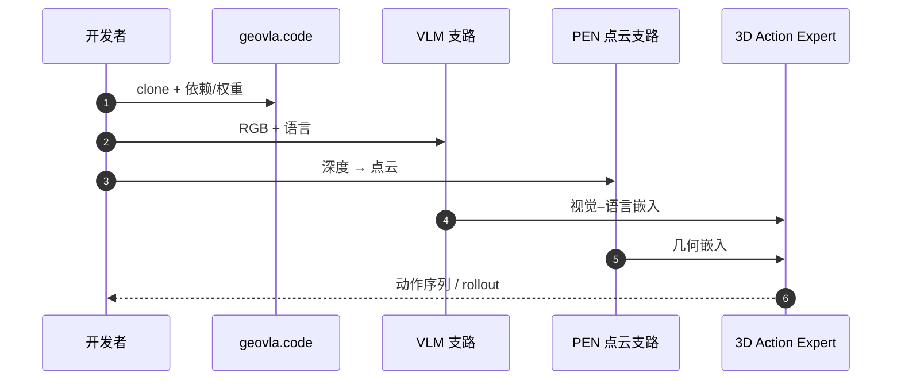

# GeoVLA：为 VLA 补全 3D 几何表示

**GeoVLA**（*Empowering 3D Representations in Vision-Language-Action Models*，[arXiv:2508.09071](https://arxiv.org/abs/2508.09071)，[项目页](https://linsun449.github.io/GeoVLA)，[代码](https://github.com/linsun449/geovla.code)）由 **天津大学、原力灵机、清华大学** 等提出（**IROS 2026**，Cognitive Robotics 最佳论文候选）：在 VLM 处理 RGB–语言的同时，用 **Point Embedding Network（PEN）** 编码深度点云，再经 **3D-enhanced Action Expert** 融合多模态生成动作序列。

## 一句话定义

**VLA 不应只读 2D 像素——GeoVLA 把深度几何当作与语言并列的硬约束输入，专门修复高度、尺度和视角变化下的抓取失败。**

## 英文缩写速查

| 缩写 | 英文全称 | 简要说明 |
|------|----------|----------|
| GeoVLA | Geometry-enhanced VLA | 本文 3D 增强 VLA 框架 |
| VLA | Vision-Language-Action | 视觉–语言–动作策略 |
| PEN | Point Embedding Network | 点云几何编码器 |
| VLM | Vision-Language Model | 视觉–语言骨干 |
| SR | Success Rate | 任务成功率 |

## 为什么重要

- 纳入 [IROS 2026 六趋势解读](../../sources/blogs/wechat_ai_tech_review_iros_2026_six_trends_2026-09-25.md)：**大模型进 VLA 后，传统三维几何被重新补回**（与 [AnyCamVLA](./paper-anycam-vla.md) 视角鲁棒路线互补）。
- 仿真 LIBERO、ManiSkill2 与真机 **高度/尺度/视角** 扰动实验，代表「3D 表征」支线。
- **已开源**（步骤 2.5，2026-09-25）— `linsun449/geovla.code`。

## 核心机制

| 模块 | 作用 |
|------|------|
| **VLM 支路** | 图像 + 语言 → 融合视觉–语言嵌入 |
| **PEN 支路** | 深度 → 点云 → 独立 3D 几何嵌入 |
| **3D-enhanced Action Expert** | 拼接嵌入 → 空间感知动作序列 |

## 实验与评测

- 文内/原文：LIBERO、ManiSkill2 **SOTA 级**仿真表现；真机强调 **height adaptability、scale awareness、viewpoint invariance**。
- **读法：** 与纯 2D VLA 或测试期视角合成（AnyCamVLA）对照时，先对齐 **是否使用深度传感器** 与 **训练协议**。

## 与其他工作对比

| 维度 | GeoVLA | [AnyCamVLA](./paper-anycam-vla.md) | [WNM-3D](./paper-wnm-3d-vln.md) |
|------|--------|-----------------------------------|--------------------------------|
| 几何来源 | **显式深度点云 + PEN** | 测试期合成训练视角 | 单目历史 → 3D 场景 token |
| 介入阶段 | 训练期联合 3D 专家 | 推理期图像变换 | 表征层 3D 条件 |
| 任务重心 | 操作/manipulation | 操作视角鲁棒 | VLN + 操作 |

## 结论

**GeoVLA 代表 IROS 2026 上「VLA 补短板」的几何一支：不是更大 VLM，而是把 3D 结构写进动作专家。**

1. **已开源** 代码可复现训练/部署链路；真机需自备深度与标定。
2. 与 AnyCamVLA **正交**：一个补 **3D 表征**，一个补 **相机外参变化**。
3. Cognitive Robotics 候选说明评测强调 **空间推理 + 执行** 而不只是语言跟随。
4. 部署成本：深度点云管线 + 双支路推理，需与蒸馏提速（如 [Shallow-π](./paper-shallow-pi.md)）分账评估。

## 源码运行时序图

## 关联页面

- [VLA](../methods/vla.md)
- [IROS 2026 六趋势地图](../overview/iros-2026-six-trends-technology-map.md)
- [AnyCamVLA](./paper-anycam-vla.md)

## 参考来源

- [geovla_arxiv_2508_09071.md](../../sources/papers/geovla_arxiv_2508_09071.md)
- [wechat_ai_tech_review_iros_2026_six_trends_2026-09-25.md](../../sources/blogs/wechat_ai_tech_review_iros_2026_six_trends_2026-09-25.md)

## 推荐继续阅读

- [arXiv PDF](https://arxiv.org/pdf/2508.09071)
- [GeoVLA 项目页](https://linsun449.github.io/GeoVLA)
