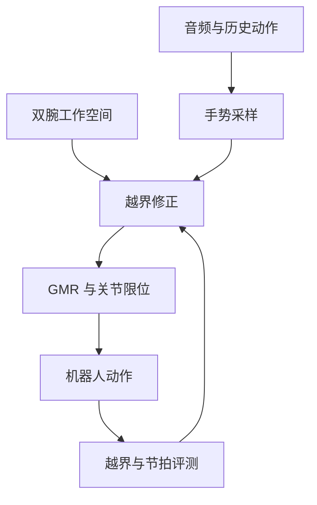

# GestAdapt：Workspace-Conditioned Co-Speech Gesture Generation for Humanoid Robots

## 一句话定义

**GestAdapt** 在语音驱动手势时加入机器人双腕工作空间条件，避免生成动作与桌面、墙面或机器人可达范围冲突。

## 英文缩写速查

| 缩写 | 英文全称 | 简要说明 |
|------|----------|----------|
| GMR | General Motion Retargeting | 生成后映射到具体机器人 |
| Co-Speech | Co-Speech Gesture Generation | 与语音节奏和语义配合的手势 |
| G1 | Unitree G1 | 论文测试的目标本体之一 |

## 为什么重要

看起来自然的手势可能在机器人旁有桌子、墙或身体形态变化时越界。生成模型需要同时满足表达和空间约束。

## 流程总览

以下按本页已归纳的机制与资料绘制，表示模块或阅读路径关系。

## 方法

音频、历史动作与双腕工作空间共同决定动作；采样中按腕部越界程度修正，之后再进行机器人关节限位与 GMR 映射。工作空间约束不等于完整的全身碰撞检测。

## 实验与评测

文章报告离线动作距离 **6.933→5.019**，最大腕部越界 **9.815→1.095 cm**，节拍指标略降；Reachy2 偏好比较中约 **69.7%** 的比较排名第一。G1、GR3、Reachy2 的重定向测试表明跨本体腕部轨迹可接近，但不等于全部真机交互安全。

## 与其他工作对比

[ECHO-G](./paper-echo-g-cospeech-humanoid.md) 聚焦全身语音动作与固定跟踪器；GestAdapt 重点是生成时的**空间可达性**。

## 结论

**语音手势生成不能只看节拍和自然度，还应测腕部越界、关节可达与现场障碍。**

1. 先建机器人与环境的可用空间。
2. 越界减少可能换来节拍指标下降。
3. 生成后仍需具体本体的限位和动态跟踪验证。

## 工程实践

同一句话在开放空间、桌旁与墙边分别测试腕部路径；记录越界距离、节拍和跟踪失败。文章只提供 arXiv 链接，本次未确认官方代码或权重。

## 局限与风险

腕部工作空间不足以表达手—物接触力、整身自碰与动作动力学。

## 源码运行时序图

**不适用**：未核实可运行官方实现。

## 关联页面

- [ECHO-G](./paper-echo-g-cospeech-humanoid.md)
- [运动重定向](../concepts/motion-retargeting.md)

## 参考来源

- [Day 1 文章逐篇索引](../../sources/blogs/humanoid_motion_intelligence_day1_data_retargeting_2026_10_02.md)
- [论文](https://arxiv.org/abs/2609.38400)

## 推荐继续阅读

- [GestAdapt arXiv](https://arxiv.org/abs/2609.38400)
