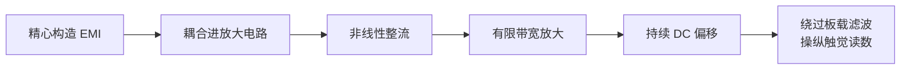
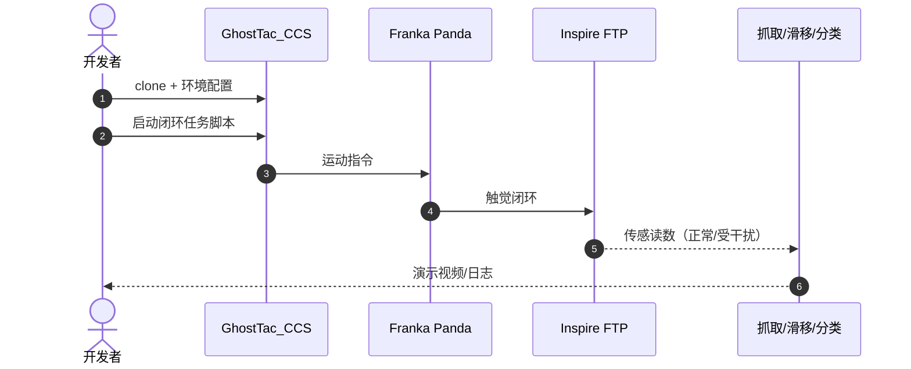

# GhostTac：非接触触觉传感操纵攻击

**GhostTac: Manipulating Tactile Sensors without Physical Contact**（[arXiv:2608.20817](https://arxiv.org/abs/2608.20817)，[项目页](https://ghosttac.github.io/GhostTacCCS.io/)，[代码](https://github.com/GhostTac/GhostTac_CCS)）由 **浙江大学（ZJU）** 与 **香港科技大学（HKUST）** 提出：首次展示针对机器人触觉的 **非接触电磁干扰（EMI）攻击**，可在 **无物理接触** 条件下产生稳定、可定向的测量偏移，影响抓取、滑移检测与材料分类等下游任务。发表于 **ACM CCS 2026**。

## 一句话定义

**具身系统的安全边界必须下沉到传感器物理层——GhostTac 证明触觉前端可被远程 EMI 精细操纵，而不只防软件入侵。**

## 英文缩写速查

| 缩写 | 英文全称 | 简要说明 |
|------|----------|----------|
| EMI | Electromagnetic Interference | 电磁干扰攻击载体 |
| DoS | Denial of Service | 干扰导致触觉失效/饱和 |
| ADC | Analog-to-Digital Converter | 传感阵列数字化链路 |
| MCU | Microcontroller Unit | 板载滤波与信号处理 |
| CCS | ACM Conference on Computer and Communications Security | 本文发表会议 |

## 为什么重要

- **触觉普及 vs 安全空白：** 触觉已是抓取与滑移闭环的关键，但物理层威胁研究极少。
- **攻击可隐蔽：** 攻击者可预置设备或路过发射，无需接触机器人。
- **后果严重：** 正向干扰致掉落（医疗瓶/花瓶），负向干扰致过握损坏。
- **跨器件一致性：** 10 模块、2 灵巧手、**15 种传感器类型** 均受影响。

## 核心信息

| 项 | 内容 |
|----|------|
| **机构** | 浙江大学（ZJU）；香港科技大学（HKUST） |
| **会议** | ACM CCS 2026 |
| **开源** | **已开源** — `GhostTac/GhostTac_CCS` 演示与闭环任务代码 |

### 攻击机理（简）

## 工程实践

| 项 | 建议 |
|----|------|
| **威胁建模** | 将 EMI 纳入触觉驱动抓取/力控的 FMEA |
| **硬件缓解** | 屏蔽、滤波与差分/front-end 设计需按论文机理复审 |
| **软件缓解** | 纯算法难以修复已被污染的模拟前端——需传感冗余或交叉模态校验 |
| **演示复现** | 官方仓支持 Franka + Inspire 手三类闭环任务 |

## 局限与风险

- 攻击参数与硬件布局相关，跨平台迁移需重新标定。
- 开源仓侧重 **受害任务演示**，完整攻击链实现需结合论文。
- 防御方案超出本文范围，部署需安全团队专项评估。

## 评测

| 维度 | 结果 |
|------|------|
| 传感器覆盖 | 10 模块 × 15 类型 — **一致有效** |
| 抓取案例 | 正向干扰掉落 / 负向干扰过握 |
| 滑移检测 | 假滑移生成或真实滑移抑制 |
| 材料分类 | 测量分布被重塑导致误分类 |
| 真实场景 | 预置 + 路过攻击均可演示 |

## 结论

**触觉闭环机器人必须把物理层传感攻击视为一等威胁，而非仅关注网络与模型安全。**

- EMI 经整流+放大可产生绕过滤波的 DC 偏移
- 空间分布与幅值可控，实现细粒度操纵
- 15 种触觉传感器跨厂商验证一致性
- 抓取/滑移/分类三类真机任务均受影响
- 官方演示代码已开源，便于红队与防御研究复现受害行为

## 源码运行时序图

## 与其他页面的关系

- [tactile-sensing](../concepts/tactile-sensing.md)
- [contact-rich-manipulation](../concepts/contact-rich-manipulation.md)
- [manipulation](../tasks/manipulation.md)
- [open-source-8-papers-technology-map](../overview/open-source-8-papers-technology-map.md)

## 参考来源

- [ghosttac_arxiv_2608_20817](../../sources/papers/ghosttac_arxiv_2608_20817.md)
- [ghosttac-github-io](../../sources/sites/ghosttac-github-io.md)
- [ghosttac-ccs](../../sources/repos/ghosttac-ccs.md)
- [wechat_embodied_station_8_papers_open_source_2026-08-25](../../sources/blogs/wechat_embodied_station_8_papers_open_source_2026-08-25.md)

## 推荐继续阅读

- [arXiv:2608.20817](https://arxiv.org/abs/2608.20817)
- [GhostTac 官方代码](https://github.com/GhostTac/GhostTac_CCS)
