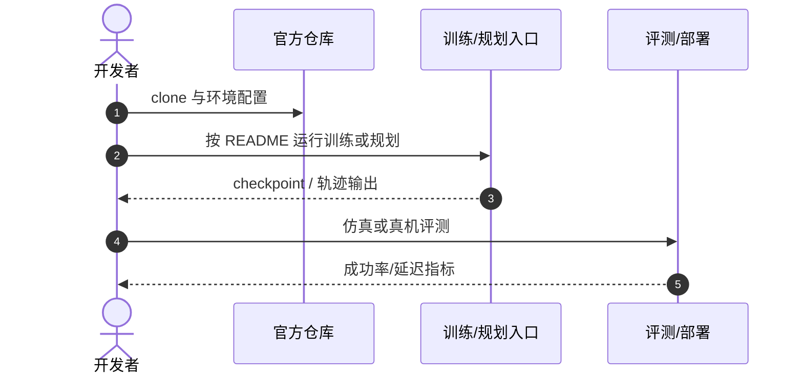

# GigaBrain-0.7

**GigaBrain-0.7: Scaling Embodied Foundation Models to Emergent Capabilities with a Three-System Architecture**（[arXiv:2608.15875](https://arxiv.org/abs/2608.15875)，[项目页](https://gigaai.cc/blog/gigabrain07)）——极佳视界（GigaAI）。

## 一句话定义

**具身基础模型的扩展正在从单策略走向「理解—预测—动作—强化」的系统工程。**

## 英文缩写速查

| 缩写 | 英文全称 | 简要说明 |
|------|----------|----------|
| VLA | Vision-Language-Action | 视觉-语言-动作大模型 |
| MoT | Mixture of Tokens | 跨本体动作专家共享架构 |
| WM | World Model | 世界模型（System-3 预演） |

## 为什么重要

- 纳入 [具身智能小站 2026-08-23 九篇盘点](../../sources/blogs/wechat_embodied_station_9_papers_open_source_2026-08-23.md) 的「长视野 VLA → 动作分布 → 真实交互」主线。
- 开源状态（入库日）：**部分开源**。

## 核心信息

| 项 | 内容 |
|----|------|
| **机构** | 极佳视界（GigaAI） |
| **出处** | arXiv:2608.15875（2026-08） |
| **开源** | **部分开源** |

### 流程总览

## 评测

| 项 | 内容 |
|----|------|
| **主结果** | 报告 zero-shot 基础能力、语言跟随与 post-training 成功率显著提升；家庭/工业长程真机一镜到底演示。 |

- 数据出处：[ingest 摘录](../../sources/papers/gigabrain_0_7_arxiv_2608_15875.md)。

## 结论

**数据金字塔 + 模型金字塔的双轮驱动，需要 System-3 把世界模型放进实时决策回路。**

- 37k+ 小时异构具身数据 one-stage alignment
- System-3 用 GigaWorld-1 预演未来价值与视觉进展
- MoT + Flow Matching 跨本体动作共享
- 离线/在线经验强化管线闭环
- 代码开源、预训练权重待发布

## 源码运行时序图

## 与其他页面的关系

- [vla](../methods/vla.md)
- [generative-world-models](../methods/generative-world-models.md)
- [paper-sa-2510-19430-gigabrain-0-a-world-model-powered-vision-languag](./paper-sa-2510-19430-gigabrain-0-a-world-model-powered-vision-languag.md)
- [vla-robustness-9-papers-technology-map](../overview/vla-robustness-9-papers-technology-map.md)

## 参考来源

- [gigabrain_0_7_arxiv_2608_15875](../../sources/papers/gigabrain_0_7_arxiv_2608_15875.md)
- [gigabrain-0-7](../../sources/sites/gigabrain-0-7.md)
- [giga-brain-0](../../sources/repos/giga-brain-0.md)
- [wechat_embodied_station_9_papers_open_source_2026-08-23](../../sources/blogs/wechat_embodied_station_9_papers_open_source_2026-08-23.md)

## 推荐继续阅读

- [arXiv:2608.15875](https://arxiv.org/abs/2608.15875)
- [官方代码](https://github.com/open-gigaai/giga-brain-0)
