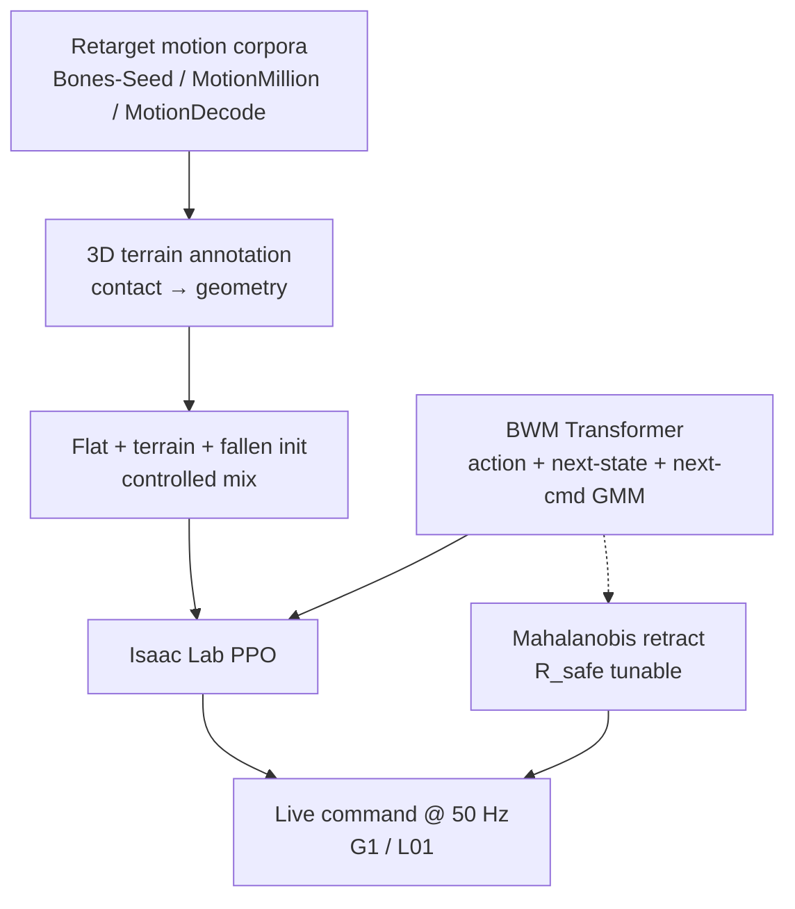

# GigaBrain-WBC-0.5：环境交互行为世界模型

**GigaBrain-WBC-0.5**（*A Behavior World Model for Robust Whole-Body Control with Environment Interaction*；[arXiv:2608.18234](https://arxiv.org/abs/2608.18234)，[项目页](https://shepherd1226.github.io/gigabrain-wbc-0.5/)）由 **清华大学 / GigaAI** 等提出：把 whole-body motion tracker 从「复现 reference action」升级为 **Behavior World Model（BWM）** — 每步联合预测 action、next proprioceptive state 与 next latent command 分布，使 policy 内化接触动力学与环境可 admissible 行为；再配合自动 **3D terrain 标注** 与 **在线 OOD filter**，在单一策略里同时覆盖 terrain/object 交互、不可行命令 best-effort、倒地恢复与 G1→Maker L01 迁移。

## 一句话定义

**用因果 Transformer 一边跟踪 reference、一边预测自己的下一状态与下一命令分布，把「环境改变了我能做什么」写进同一个 world model，并在部署时用该分布在线 retract 不可行命令。**

## 英文缩写速查

| 缩写 | 英文全称 | 简要说明 |
|------|----------|----------|
| BWM | Behavior World Model | 本文核心：policy 建模自身未来行为而非仅 reactive tracking |
| GMM | Gaussian Mixture Model | 对 next latent command 的混合分布，驱动 OOD 检测 |
| FSQ | Finite Scalar Quantization | 训练期 auxiliary 分支约束 latent 形状 |
| PPO | Proximal Policy Optimization | Isaac Lab 训练算法 |
| OOD | Out-of-Distribution | 物理上不可行或训练未见的 reference 命令 |
| MPKPE | Mean Per-Keypoint Position Error | 跟踪误差（mm） |

## 为什么重要

- **补齐 flat-ground tracker 盲区：** [SONIC](../methods/sonic-motion-tracking.md) / [TWIST2](./paper-twist2.md) / [Humanoid-GPT](./paper-humanoid-gpt.md) 多在空场景训练，不学椅子/台阶/负载如何改变动力学；[SceneBot](./paper-scenebot.md) 需 per-link contact label 与 7.5 h 专用数据，且 terrain 为 2.5D elevation map。
- **OOD 机制可部署：** 相对单纯扩大 reference corpus（或 [CMP](./paper-cmp.md) 式上下文先验），本文用 **自身预测的 next-command GMM** 做 stateless Mahalanobis test + radial retract，无需额外 classifier 或 fallback controller。
- **Fall 与 tracking 合一：** 相对 [BFM-Zero](./paper-bfm-zero.md) 的 latent recovery 或独立 get-up skill，fallen initialization 直接训进 tracker，倒地后仍可继续跟 live command。

## 核心信息

| 项 | 内容 |
|----|------|
| **机构** | 清华大学（Tsinghua）；GigaAI；北京交通大学；上海理工大学；中科院自动化所；中科院大学（通讯 Zheng Zhu、Jiwen Lu） |
| **平台** | Unitree G1（29 DoF，50 Hz）；跨具身 Maker L01（G1 checkpoint fine-tune） |
| **数据** | Bones-Seed / MotionMillion / MotionDecode 中识别 terrain-interaction 子集（合计 ~72.6 h）混合 flat-ground |
| **栈** | Isaac Lab + PPO；4096 envs（flat）→ 512 envs（terrain + fallen）；MuJoCo sim-to-sim 评测 |
| **开源** | **待发布**（截至 **2026-08-21** [项目页 Code → coming soon](https://shepherd1226.github.io/gigabrain-wbc-0.5/)，无 GitHub URL） |

## 核心原理

### Behavior World Model

Reference window \(c_t\)（10 帧 × 440-d）经 encoder 得 latent behavior command \(z_t\)。Causal Transformer 输入 \([s_t, a_{t-1}, z_t]\)，输出：

1. **Action** \(a_t\) — PD joint targets  
2. **Next state** \(s_{t+1}\) — 对齐 parallel simulator rollout  
3. **Next-command GMM** \(G_{t+1}\) — 对下一 latent command 的混合分布  

预测 next state 迫使 network 内化当前 contact dynamics；预测 next-command 分布建模环境 admissible behaviors。

### 在线 OOD filter（部署）

对 raw command \(z_t^{raw}\) 与上一步 emitted mixture 做 Mahalanobis test。若超出 safety ellipsoid（半径 \(R_{safe}\)），沿 \(z_t^{raw}\) 方向 **radial retract** 到边界（非替换为 component mean），保持 best-effort 任务连续性。\(R_{safe}\) 运行时可调，\(O(1)\) 且 <1 ms。

### 自动 terrain 标注

从 retarget 轨迹检测 contact evidence → penetration filtering → clustering → primitive fitting，恢复 **全 3D** 几何（chairs、tables、stairs、boxes），非 2.5D height field。

### 流程总览

## 源码运行时序图

**不适用** — 截至入库日（2026-08-21）[项目页](https://shepherd1226.github.io/gigabrain-wbc-0.5/) 标注 **Code coming soon**，无可克隆官方仓库。若后续开源，预期路径为：terrain 标注 → Isaac Lab 训练 BWM → MuJoCo 四 regime 评测 → G1 真机部署 + \(R_{safe}\) 在线 filter。

## 工程实践

| 项 | 建议 |
|----|------|
| 与 flat tracker 选型 | 需要 **坐椅/上台阶/搬负载/倒地恢复** 同一 low-level 接口时优先考虑 BWM 路线，而非再叠独立 get-up 或 contact-prompt |
| OOD 调参 | 部署从论文 \(R_{safe}=3\) 起步；任务越激进可适当增大 \(R_{safe}\) 换 fidelity→robustness |
| 数据 | terrain 子集来自现有 corpus 识别 + 3D 标注，不必另采 7.5 h 专用 interaction mocap（对照 SceneBot） |
| 命令通道 | 仅需 online reference window（VR / planner / replay），**不要** per-link contact label |
| 跨具身 | G1→L01 用同一 recipe fine-tune；from-scratch L01 收敛慢 — BWM 结构可迁移 |
| 复现等待 | 代码未发布前以 sim-to-sim Table 3 + 项目页真机并排视频为证据 |

## 实验与评测

**四 regime（MuJoCo sim-to-sim，Table 3，\(R_{safe}=3\)）：**

| Method | Standard SR↑ | Terrain SR↑ | OOD SR↑ | Fall SR↑† |
|--------|--------------|-------------|---------|-----------|
| SONIC | 94.1 | 15.3 | 50.0 | 5.9 |
| HoloMotion-1 | 89.0 | 18.7 | 67.7 | 0.7 |
| Humanoid-GPT | 91.9 | 14.0 | 70.6 | 2.9 |
| **GigaBrain-WBC-0.5** | **96.3** | **81.3** | **83.1** | **99.3** |

†Fall SR 为 recovery rate（允许起始倒地），与其他 SR 定义不同。

**相对 SONIC 倍数：** Terrain **4.3×**；Fall recovery **16.8×**（5.9%→99.3%）。

**真机（项目页）：** 同 live command 并排 — 搬箱、2 kg 灭火器跪起、上平台、坐椅/坐箱；缺失支撑/OOD/扰动 best-effort；高难动作（高踢、太极、跳）；G1 与 Maker L01 画廊。

## 结论

**Whole-body tracking 的下一跳不是再堆 reference 小时数，而是让 low-level policy 自己建模「环境条件下还能做什么」，并用该模型在线约束不可行命令。**

1. **BWM 结构** — 联合预测 action / next-state / next-command GMM，一次训练同时获得 interaction 与 OOD 所需表示。
2. **3D terrain 标注** — 从现有 retarget corpus 扩 terrain-paired 数据，避免 2.5D map 表达不了椅面/桌沿等几何。
3. **Terrain 指标** — **81.3%** SR 相对最强 baseline **15.3%**，是本文最大幅领先项。
4. **OOD + Fall** — **83.1%** OOD SR + **99.3%** fall recovery，且同一策略、无 specialist handoff。
5. **Flat tracking 不牺牲** — Standard SR **96.3%**、MPKPE **76.6** mm 仍优于 SONIC（82.3 mm）。
6. **部署** — Mahalanobis retract 闭式、可调 \(R_{safe}\)；真机 footage 项目页标注 forthcoming。
7. **开源** — 截至 2026-08-21 **coming soon**；复现前勿假设已有 checkpoint。

## 与其他工作对比

| 维度 | GigaBrain-WBC-0.5 | SONIC / HoloMotion | SceneBot | CMP | BFM-Zero |
|------|-------------------|--------------------|----------|-----|----------|
| 场景交互 | ✓ 3D terrain + object | ✗ flat | ✓ 2.5D + contact label | ✗ flat | ✗ flat |
| 命令接口 | Reference window | Reference / token | + per-link contact | Task context | Latent / multi-mode |
| OOD 机制 | Self-predicted GMM retract | Enlarge corpus | — | Context reweight | Latent recovery |
| Fall | In-tracker recovery | ✗ | ✗ | ✗ | ✓ latent |
| 代码（本库核查） | **coming soon** | 已开源 | 待核实 | 无 URL | 已开源 |

## 局限与风险

- **Sim-to-sim 为主：** 核心 Table 3 在 MuJoCo；真机定量与 latency 消融标注 future work。
- **Terrain 数据审计：** §4.3 强调 annotation 质量 audit；错误几何会污染 interaction 行为。
- **Filter 精度代价：** \(R_{safe}\) 增大提升 robustness 但可能牺牲 tracking fidelity（论文 §4.4 讨论 frontier）。
- **未开源：** terrain 标注管线、训练配置与 checkpoint 均待发布；选型应跟踪项目页 Code 状态。
- **与 VLA 上层接口：** 本文聚焦 low-level WBC；上层 VLA/teleop 如何生成 compatible reference 仍依赖现有栈。

## 关联页面

- [SONIC 全身跟踪](../methods/sonic-motion-tracking.md) — 最强 flat-ground baseline 与并排真机对照
- [SceneBot](./paper-scenebot.md) — 另一环境交互 tracking 路线（contact-prompt + 2.5D）
- [CMP](./paper-cmp.md) — 上下文条件 motion prior（flat-ground OOD 另一思路）
- [BFM-Zero](./paper-bfm-zero.md) — fall recovery 不切换 specialist 的 BFM 对照
- [Humanoid 运动跟踪选型](../queries/humanoid-motion-tracking-method-selection.md)
- [Unitree G1](./unitree-g1.md)

## 参考来源

- [GigaBrain-WBC-0.5 论文归档](../../sources/papers/gigabrain_wbc_0_5_arxiv_2608_18234.md)
- [gigabrain-wbc-0.5 项目页](../../sources/sites/gigabrain-wbc-0-5-github-io.md)
- [具身智能小站 8 篇综述](../../sources/blogs/wechat_embodied_station_8_papers_world_model_memory_2026-08-21.md)

## 推荐继续阅读

- [arXiv:2608.18234 全文 PDF](https://arxiv.org/pdf/2608.18234) — BWM 架构、filter 推导与 Table 3
- [GigaBrain-WBC-0.5 项目页](https://shepherd1226.github.io/gigabrain-wbc-0.5/) — SONIC 并排真机与能力矩阵
