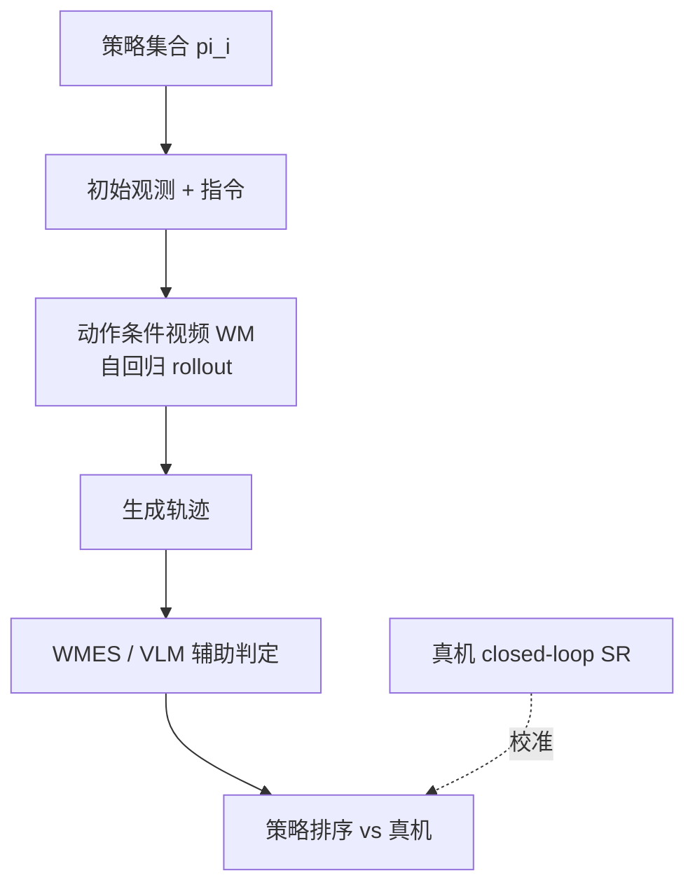

# GigaWorld-1（World Models for Robot Policy Evaluation · arXiv:2607.02642）

**GigaWorld-1**（*GigaWorld-1: A Roadmap to Build World Models for Robot Policy Evaluation*，[arXiv:2607.02642](https://arxiv.org/abs/2607.02642)，GigaAI + 清华大学等，[open-gigaai.github.io/giga-world-1/](https://open-gigaai.github.io/giga-world-1/)）系统研究 **世界模型能否当可靠策略评估器**：构建 **WMBench**（真机遥操作 + 策略 rollout **配对轨迹**），在 **7 类视频 WM × 4 种动作编码 × 324k+ 模拟 rollout** 上实证——**长时序动作忠实一致性** 比 **短时视觉逼真** 更决定 evaluator 质量；并发布 roadmap 实例 **GigaWorld-1**（核心 WMES **+14.9%** vs SOTA）。

## 一句话定义

**WM 作评估器：差几厘米的动作若 rollout 后都「看起来抓成功了」，评估就失效—— faithful 长程 rollout 才是硬指标。**

## 英文缩写速查

| 缩写 | 英文全称 | 简要说明 |
|------|----------|----------|
| WM | World Model | **策略轨迹 surrogate 模拟器** |
| WMBench | World Model Benchmark | 8 任务族 · 2989 paired traj · episode-disjoint split |
| WMES | World Model Evaluator Score | **Outcome + fidelity** 分层评分（0–3） |
| VLA | Vision-Language-Action | 被评估 **具身基础策略** |
| SLERP | Spherical Linear Interpolation | 长程 **prompt 平滑过渡**（GigaWorld-1） |
| OOD | Out-of-Distribution | 外观/类别/背景/ **成败** 泛化测试 |
| CVPR GC | GigaBrain Challenge 2026 | 社区 WM 提交纳入对照 |

## 为什么重要

- **真机评测瓶颈：** OpenVLA 报告 **2500 rollout ≈ 100 人时**；WM 若 **排序与真机一致** 可 **大幅降本**（策展文「策略版本评估」入口）。
- **反直觉核心结论：** **短时画面逼真 ≠ 好评估器**；challenge baseline 常 **过度预测成功**（视觉 plausible 但 **不惩罚差动作**）；须 **动作敏感 + 误差传到任务结果**。
- **324k rollout 量级 roadmap：** 数据配比（**PhysData + robot controllability**）、**显式低层 action 接口**、**分层 memory**、evaluator-oriented post-training → **GigaWorld-1** 可复现设计图。
- **与 [DreamSteer](./paper-dreamsteer-vla-deployment-steering.md) / [EmbodiedGen V2](./paper-embodiedgen-v2-sim-ready-world-engine.md) 互补：** 筛选 / **环境扩展** / **版本评估** 三条研发 expensive 链路。

## 核心结构与方法

| 组件 | 方法要点 |
|------|----------|
| **WMBench 构建** | **2989 paired traj**（teleop : policy rollout ≈ **1:1**）；**episode-disjoint** train/test；**成败平衡** |
| **WM 交互协议** | 策略输出 action → WM **自回归 rollout** → 推断 success / failure |
| **WMES 目标** | $S^{\mathrm{real}}(\pi)$ vs $S^{\mathrm{wm}}(\pi)$ **排序相关**；Score 3 = **同成败 + 高保真物理** |
| **控制变量研究** | **7 WM 家族**；**4 action 编码**；诊断 metric 取自 WorldArena 子集 |
| **数据 ~12980 h** | 互联网物理视频 + 开源 robot + egocentric + Giga 自采；**清洗 + success/action sync 标注** |
| **GigaWorld-1 实例** | Wan **1.3B/5B** 骨干；**显式 control + hierarchical memory + SLERP prompt**；**+14.9% WMES** |

### WM 策略评估闭环

### 三大核心洞察（论文摘要）

| 洞察 | 设计含义 |
|------|----------|
| **长时序 action-faithful rollout** | 评估器首要优化 **动作条件一致性**，非单帧 FVD |
| **预训练数据配比** | 平衡 **通用世界知识** 与 **机器人可控性**（PhysData 关键） |
| **架构** | **低层 action 表征 + spatial alignment + memory** 决定真机对齐 |

## 实验要点（索引级）

| 轴 | 报告口径（以论文为准） |
|----|------------------------|
| **Rollout 规模** | **324,000+** WM 模拟策略轨迹 |
| **WM 家族** | **7** 类视频 world models |
| **动作编码** | **4** 种表示范式对照 |
| **WMBench** | 8 task families；test **7200s**；train **82470s** |
| **训练视频** | **>12,000 h** 异构语料 |
| **GigaWorld-1** | 核心 evaluator-alignment **+14.9%** vs 强 baseline |
| **Closed-loop 校准** | Gen–Real SR **更接近对角线** vs challenge models（Fig.16–17） |
| **开源** | 代码、权重、数据集、工具链 |

## 与其他工作对比

| 工作 | 关系 |
|------|------|
| **[DreamSteer](./paper-dreamsteer-vla-deployment-steering.md)** | WM **在线选动作**；GigaWorld **离线评策略版本** |
| **[EmbodiedGen V2](./paper-embodiedgen-v2-sim-ready-world-engine.md)** | **3D sim 环境** 降数据成本；GigaWorld **2D WM rollout 评估** |
| **[Worldscape-MoE](./paper-worldscape-moe-heterogeneous-action.md)** | **异构控制生成 WM**；GigaWorld 偏 **evaluator-oriented 机器人 action** |
| **WorldArena EWM** | **生成质量 16 维**；WMBench 强调 **policy outcome alignment** |
| **经典 sim eval** | sim2real gap + **场景建模贵** |

## 常见误区或局限

- **误区：** FVD/美学高 = 好评估器；论文显示 **closed-loop 成败校准** 与 **帧质量 metric 解耦**。
- **误区：** WM 评估可 **完全替代真机**；仍须 **人类核验边界 case**；contact failure **乐观 bias** 待降。
- **局限：** WMBench **8 任务族** 未覆盖移动操作/ in-hand / 安全关键；聚焦 **video-centric WM**；VLM 自动标注 **需抽检**。

## 与其他页面的关系

- [wm-action-consequence-category-04-eval-posttrain](../overview/wm-action-consequence-category-04-eval-posttrain.md) — 评估与后训练 hub
- [动作后果技术地图](../overview/robot-world-models-action-consequence-technology-map.md) — 「策略版本评估」入口
- [World Action Models](../concepts/world-action-models.md) — 被评估 WAM/VLA 语境
- [DreamSteer](./paper-dreamsteer-vla-deployment-steering.md) — WM 预演选动作
- [EmbodiedGen V2](./paper-embodiedgen-v2-sim-ready-world-engine.md) — 环境扩展

## 推荐继续阅读

- [GigaWorld-1 论文（arXiv:2607.02642）](https://arxiv.org/abs/2607.02642)
- [GigaWorld-1 项目页与 WMBench](https://open-gigaai.github.io/giga-world-1/)
- [DreamSteer 论文实体](./paper-dreamsteer-vla-deployment-steering.md)
- [EmbodiedGen V2 论文实体](./paper-embodiedgen-v2-sim-ready-world-engine.md)

## 参考来源

- [具身智能研究室 · 世界模型动作后果专题导读（2026-07）](../../sources/blogs/wechat_embodied_ai_lab_robot_world_models_action_consequence_2026.md)
- [GigaWorld-1 论文（arXiv:2607.02642）](https://arxiv.org/abs/2607.02642)
