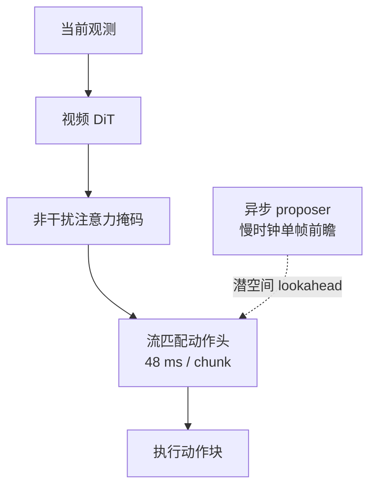
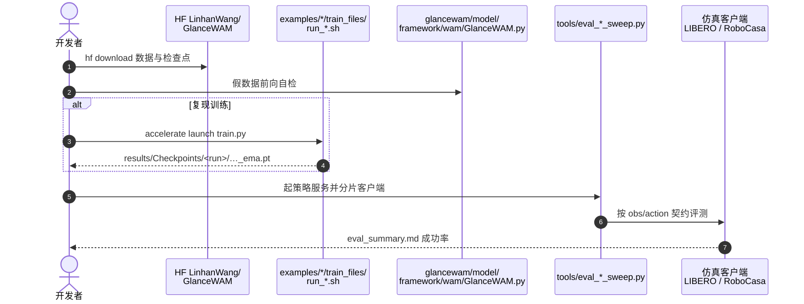

# GlanceWAM：把视觉想象移出控制关键路径

**GlanceWAM**（*Sparse Test-Time Imagination for World-Action Models*，[arXiv:2608.23927](https://arxiv.org/abs/2608.23927)，[代码](https://github.com/linhanwang/GlanceWAM)）由 **弗吉尼亚理工学院（Virginia Tech）**、**德雷塞尔大学（Drexel）**、**美国东北大学（Northeastern）** 与 **普渡大学（Purdue）** 提出：在单个视频 DiT 内解耦想象与控制——异步 proposer 以慢时钟在后台生成约 3 s 后的单帧前瞻，动作头直接在潜空间以 **48 ms** 解码动作块，不被视频生成阻塞。

## 一句话定义

**世界模型的部署瓶颈未必是生成本身，而是生成是否阻塞控制——GlanceWAM 用异步单帧前瞻 + 潜空间动作头同时保住实时性和任务成功率。**

## 英文缩写速查

| 缩写 | 英文全称 | 简要说明 |
|------|----------|----------|
| WAM | World-Action Model | 联合建模未来观测与动作的策略 |
| DiT | Diffusion Transformer | 本文视频骨干（SkyReels-V2 DF） |
| LIBERO | Lifelong Robot Learning | 四套件操作评测 |
| EMA | Exponential Moving Average | 评测用检查点后缀 `*_ema.pt` |
| HF | Hugging Face | 数据与权重托管 |

## 为什么重要

- **拆开速度–成功率两难：** 同步视频 WAM 在控制频率生成过慢；取消测试时想象又掉点。GlanceWAM 证明想象可以离关键路径。
- **工程可跑：** MIT 仓 + 21 GB HF 包（LeRobot v3 + 检查点）；LIBERO / RoboCasa sweep 脚本齐备。
- **对照坐标清晰：** 相对 [WAM 实时异步部署](./paper-wam-realtime-async.md) 的六策略实证，这里改的是 **生成是否阻塞动作头**，不是 chunk 播放策略。

## 核心信息

| 项 | 内容 |
|----|------|
| **机构** | 弗吉尼亚理工学院（Virginia Tech）；德雷塞尔大学（Drexel University）；美国东北大学（Northeastern University）；普渡大学（Purdue） |
| **骨干** | SkyReels-V2 DF 1.3B；动作头 GR00T 风格流匹配，0.8 s chunk |
| **训练** | 仅示范；参考硬件 4×H200，全局 batch 128 |
| **开源** | **已开源** MIT：[linhanwang/GlanceWAM](https://github.com/linhanwang/GlanceWAM)；HF [`LinhanWang/GlanceWAM`](https://huggingface.co/datasets/LinhanWang/GlanceWAM) |

## 核心原理（方法）

控制路径只读潜空间特征与陈旧前瞻帧，不调用视频采样。训练时前瞻是从 \(g\sim U(0,H_g]\) 抽的事后帧；推理时同一 DiT 在慢时钟生成它。

**非干扰三分类注意力掩码** 隔离视频表示，避免泄漏进动作读点。**Staleness-robust horizon** 训练让前瞻在两次刷新之间老化仍可用。一次前向同时给出动作头特征和视频速度目标。

### 流程总览

## 源码运行时序图

节点对齐 [`sources/repos/glancewam.md`](../../sources/repos/glancewam.md) 与 README 入口。

- **最短复现：** 拉 `glancewam_libero` 检查点 → `python tools/eval_libero_sweep.py --ckpt … --gpu 0`（约 35 min，期望 0.989）。
- **RoboCasa：** 必须 `--include-state`，且实际要多 GPU，单卡服务会 OOM。

## 工程实践

| 项 | 建议 |
|----|------|
| 缓冲与前瞻 | 推理用慢时钟刷新单帧，不要把视频采样塞进 48 ms 控制环 |
| 评测契约 | LIBERO 无状态；RoboCasa 必须带 state，契约错会静默掉点 |
| 检查点 | 用 EMA 权重评测；优化器状态故意不保存 |
| 对照 | 同步 Cosmos Policy、无想象共训、同步视频 WAM |

## 实验与评测

| 设定 | 数字（论文 / README） |
|------|----------------------|
| RoboCasa kitchen 24 任务 | **72.2% / 0.721** vs 同步 Cosmos Policy **67.1%**、无想象共训 **64.4%** |
| LIBERO 4-in-1 | **99.0% / 0.989** |
| A100 延迟 | 每 chunk **48 ms**，比同步基线 **24×** |
| 厨房 run-to-run | 约 ±0.02，环境成对、策略未设种子 |

## 结论

**GlanceWAM 说明：WAM 要实时，先把想象从控制关键路径拿出去；单帧潜空间前瞻就够用，不必按控制频率生成视频。**

1. **真影响指标是墙钟延迟 × 任务成功率** — 72.2% / 99.0% 且 48 ms，不是「生成了更长视频」。
2. **掩码是活性成分** — 视频特征泄漏进动作读点会同时伤速度与稳定性。
3. **前瞻允许陈旧** — 训练必须显式随机老化，否则异步刷新会掉点。
4. **从 StarVLA 框架抽出，不是从零预训练视频模型** — 复现走 HF 包 + sweep，不要重训 SkyReels。
5. **主表是仿真** — 选型先复现 LIBERO sweep，再谈真机。

## 与其他工作对比

| 对照 | 差异读法 |
|------|----------|
| 同步视频 WAM / Cosmos Policy | 控制频率生成视频；更慢且 RoboCasa 更低 |
| 无想象共训 | 取消测试时视觉想象，成功率掉到 64.4% |
| [WAM 实时异步](./paper-wam-realtime-async.md) | 改 chunk 播放/混合；GlanceWAM 改生成是否阻塞 |
| [FlashVLA](./paper-flashvla.md) | 流匹配 VLA 的流式解码，不生成视频前瞻 |
| [DreamMimic](./paper-dreammimic.md) | RSSM 作蒸馏监督，不在测试时想象规划 |

## 局限与风险

- **主数字在仿真** — RoboCasa / LIBERO；真机入口在 `deployment/`，论文主表不是硬件。
- **依赖视频骨干** — SkyReels-V2 许可与资源与策略仓分开记账。
- **契约静默失败** — obs/action 对不齐会掉点而不报错。

## 关联页面

- [World Action Models](../concepts/world-action-models.md) — Joint WAM 延迟对照
- [Action Chunking](../methods/action-chunking.md) — 异步 chunk 与控制环
- [VLA](../methods/vla.md) — 流匹配动作头
- [WAM 实时异步部署](./paper-wam-realtime-async.md) — 部署策略对照
- [FlashVLA](./paper-flashvla.md) — 另一条实时动作解码
- [48ms WAM / 编排 10 篇地图](../overview/glancewam-vla-crew-10-papers-technology-map.md)

## 参考来源

- [glancewam_arxiv_2608_23927](../../sources/papers/glancewam_arxiv_2608_23927.md)
- [glancewam 仓库](../../sources/repos/glancewam.md)
- [具身智能小站 10 篇盘点](../../sources/blogs/wechat_embodied_station_10_papers_glancewam_vla_crew_2026-08-30.md)

## 推荐继续阅读

- [arXiv:2608.23927](https://arxiv.org/abs/2608.23927)
- [GitHub](https://github.com/linhanwang/GlanceWAM)
- [HF 数据与检查点](https://huggingface.co/datasets/LinhanWang/GlanceWAM)
