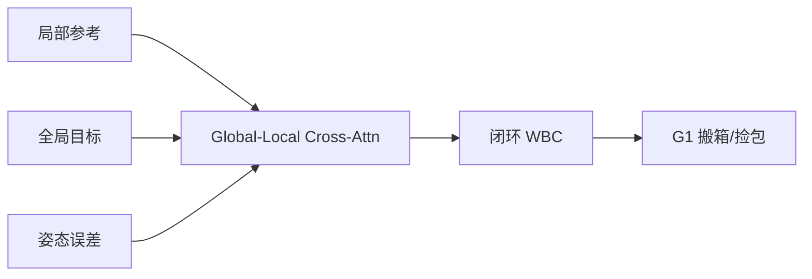

# GLoRI（arXiv:2609.05994）

**GLoRI**（*GLoRI: Closed-Loop Whole-Body Tracking with Global-Local Reference Interaction for Humanoid Loco-Manipulation*，[arXiv:2609.05994](https://arxiv.org/abs/2609.05994)）由 **上海交通大学（SJTU）** 提出（公众号周更 ingest 见 [策展索引](../../sources/blogs/wechat_shenlan_weekly_humanoid_quadruped_2026-09-14.md)）。

## 一句话定义

GLoRI：基于全局—局部参考交互的人形移动操作闭环全身跟踪 — local action structure + global goal + pose error。

## 英文缩写速查

| 缩写 | 英文全称 | 简要说明 |
|------|----------|----------|
| WBC | Whole-Body Control | 全身控制 |
| VIVE | HTC VIVE | 外定位根位姿 |
| G1 | Unitree G1 | 宇树 G1 人形 |

## 为什么重要

移动操作需同时跟踪局部操作轨迹与全局导航目标；开环重定向易漂移。

## 核心信息

| 项 | 内容 |
|----|------|
| **机构** | 上海交通大学（SJTU） |
| **开源** | **未见/待发布**（步骤 2.5 核查：截至 2026-09-14 无可运行官方仓库） |

## 核心原理

局部参考描述肢体动作结构，全局参考给出目标位姿；pose error 反馈经 cross-attention 修正策略输出，形成闭环全身跟踪。

### 流程总览

## 源码运行时序图

**不适用** — 截至 **2026-09-14** arXiv 与常见项目页 **未见** 官方可运行代码仓库。

## 工程实践

| 项 | 说明 |
|----|------|
| 开源状态 | 未见官方仓库；以 arXiv 为准 |
| 复现入口 | 论文方法与超参；代码发布后再补 `sources/repos/` |
| 部署注意 | VIVE 提供全局根；仿真预训练 + 真机微调；箱/包质量与摩擦影响跟踪裕度。 |

## 实验与评测

G1 搬箱与捡包；闭环 vs 开环跟踪误差。

## 结论

GLoRI 用全局-局部参考交互闭环提升人形 loco-manipulation 跟踪精度。

1. 局部结构保留操作细节。
2. 全局目标防止长程漂移。
3. cross-attention 融合多尺度参考。
4. VIVE 根定位支撑真机闭环。
5. G1 搬箱/捡包验证实用性。

## 与其他工作对比

| 对照 | 差异读法 |
|------|----------|
| 开环重定向 | 无误差反馈易累积 |
| 纯 locomotion tracker | 不含操作物体约束 |

## 局限与风险

依赖外定位 VIVE；复杂双手协作未覆盖。

## 关联页面

- [loco-manipulation](../tasks/loco-manipulation.md)
- [./unitree-g1.md](././unitree-g1.md)
- [./paper-halomi-humanoid-loco-manipulation.md](./paper-halomi-humanoid-loco-manipulation.md)

## 参考来源

- [glori_humanoid_loco_manip_arxiv_2609_05994.md](../../sources/papers/glori_humanoid_loco_manip_arxiv_2609_05994.md)
- [公众号周更策展](../../sources/blogs/wechat_shenlan_weekly_humanoid_quadruped_2026-09-14.md)

## 推荐继续阅读

- [https://arxiv.org/abs/2609.05994](https://arxiv.org/abs/2609.05994)
