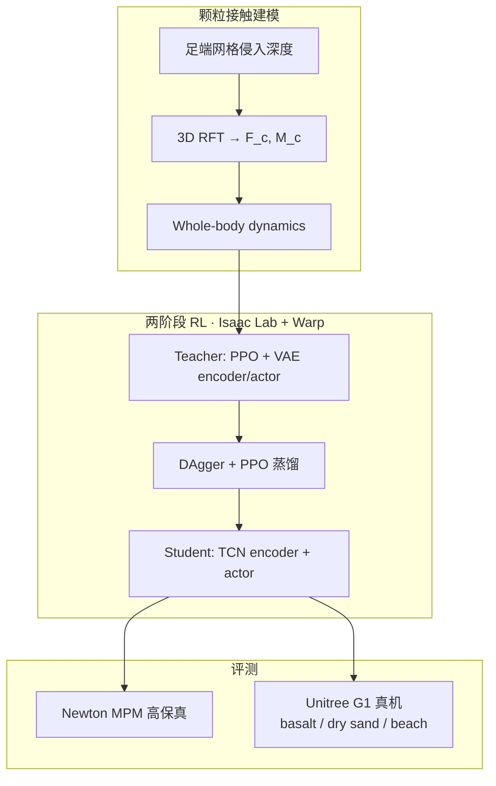

# GM-Loco：颗粒介质上的地形自适应人形 locomotion

**GM-Loco**（*Terrain-Adaptive Humanoid Locomotion on Granular Media*，arXiv:[2609.10286](https://arxiv.org/abs/2609.10286)，v2 标题；v1 曾名 *Learning Terrain-Adaptive Humanoid Locomotion on Granular Terrain*）由 **佐治亚理工学院（Georgia Institute of Technology）** 与 **美国东北大学（Northeastern University）** 提出。项目页：[humanoid-gm-locomotion.github.io/HUMANOID-GM](https://humanoid-gm-locomotion.github.io/HUMANOID-GM/)。

## 一句话定义

**在 Isaac Lab 里用 3D 阻力理论把脚–颗粒接触算准，再用 VAE Teacher-Student 从本体历史推断地形刚度，让 Unitree G1 在真实玄武岩与沙地上走、跑、跳。**

## 英文缩写速查

| 缩写 | 英文全称 | 简要说明 |
|------|----------|----------|
| GM-Loco | Granular Media Locomotion（项目名） | 本文颗粒介质人形 locomotion 框架 |
| 3D RFT | Three-Dimensional Resistive Force Theory | 三维阻力理论颗粒接触模型 |
| RFT | Resistive Force Theory | 颗粒侵入阻力经典框架 |
| MPM | Material Point Method | 连续介质颗粒高保真仿真（Newton 评测） |
| VAE | Variational Autoencoder | 变分自编码器，压缩地形刚度潜变量 |
| TS | Teacher-Student | 特权教师 → 可部署学生的蒸馏框架 |
| PPO | Proximal Policy Optimization | 策略梯度训练算法 |
| TCN | Temporal Convolutional Network | Student 地形 encoder 的时序卷积结构 |
| SR | Success Rate | 完成轨道的 episode 比例 |

## 核心信息

| 字段 | 内容 |
|------|------|
| 机构 | 佐治亚理工学院 IRIM / School of Physics；美国东北大学 |
| 作者 | Junnosuke Kamohara、Feiyang Wu、Andy Ningan Zong、Daniel I. Goldman、Yashwanth Nakka、Seth Hutchinson、Ye Zhao |
| 平台 | Unitree G1（29 维关节位置残差 → 底层 PD） |
| 训练仿真 | [Isaac Lab](./isaac-lab.md) + NVIDIA Warp 软颗粒接触；4096 并行 env / RTX 4090 |
| 高保真评测 | [Newton](./newton-physics.md) MPM + MuJoCo Warp 刚体 |
| Teacher 训练 | PPO + VAE，20k iter；Student：DAgger + PPO，20k iter |
| 真机地形 | 玄武岩、排球场沙（beach volleyball）、海滩沙 |
| 开源状态 | **待发布**（截至 2026-09-21：项目页「Code (Coming Soon)」，无 GitHub） |

## 为什么重要

- **问题难点：** 颗粒介质兼具固体/流体行为，足端大沉陷与非线性阻力使刚体接触模型在训练与部署均失效；纯域随机化无法替代显式 terradynamics。
- **方法贡献：** 将实验标定的 **3D RFT** 嵌入主流 RL 仿真栈（Isaac Lab），在保持百万级 FPS 训练吞吐的同时，用 Newton MPM 验证接触模型与策略泛化。
- **系统结果：** 据作者表述，**首个**在真实户外颗粒地形上实现敏捷人形 locomotion（含 **2.5 m/s 跑步** 与模拟 **跳跃**）；Rigid baseline 在软沙 ≥1.5 m/s 即失败。
- **部署读法：** 地形刚度不可直接观测 → Student 从 **N 步本体历史** 推断 latent，在线调节摆腿 clearance（软地 9→16 cm）与踝关节合规，契合 [Terrain Adaptation](../concepts/terrain-adaptation.md) 与 [Privileged Training](../concepts/privileged-training.md) 主线。

## 核心原理

### 3D RFT 颗粒接触

足端 collider 网格点 \(p_i\) 在 \(z_i<0\) 时激活；单位面积深度阻力 \(\alpha\) 由侵入深度、速度角 \((\beta,\gamma,\psi)\) 与介质参数 \((\rho_c,\tilde\mu,\mu)\) 决定，再汇总为接触力 \(F_c\) 与力矩 \(M_c\) 写入 whole-body dynamics。相对 Heuristic-RFT（法向 RFT + Coulomb 切向）与 Cone-RFT，**切向力由 3D  formulation 自然产生**，在 MPM 参考下水平位移/沉陷/GRF 误差最小。

### Teacher-Student 地形自适应

| 模块 | 输入 | 输出 / 作用 |
|------|------|-------------|
| Teacher encoder (MLP VAE) | 特权 \(s_t\) + 本体历史 \(o_{t-N:t}\) | latent \(z_t\)；decoder 重建 \(\eta=\xi/\xi_{\max}\) |
| Teacher actor | \(o_t, z_t\) | 动作 \(a_t\)（非对称 critic 见特权） |
| Student encoder (TCN) | 仅 \(o_{t-N:t}\) | \(\hat z_t\) |
| Student actor | \(o_t, \hat z_t\) | 部署动作 \(\hat a_t\) |
| 蒸馏损失 | — | \(\|a_t-\hat a_t\|^2 + \|z_t-\hat z_t\|^2 + (\psi(z_t)-\psi(\hat z_t))^2\) |

VAE 重建 **仅** 归一化介质缩放系数 \(\eta\)，使 latent 对准 **颗粒刚度** 而非泛化特权状态；Student 复用冻结 Teacher decoder 做 representation matching。

### 流程总览

## 源码运行时序图

**不适用** — 截至 **2026-09-21** 项目页标注 **Code (Coming Soon)**，无可运行官方仓库；代码发布后应按 README 入口补 `sources/repos/` 与本节 sequenceDiagram。

## 工程实践

| 项 | 说明 |
|----|------|
| 观测（部署） | \(\omega_z, q_j, \dot q_j\), 速度命令, 投影重力 \(g_b\), \(a_{t-1}\)；Student 另加 TCN 历史 |
| 动作 | \(a_t \in \mathbb{R}^{29}\)：相对 nominal pose 的关节位置偏移 |
| 训练规模 | 4096 agents；Teacher/Student 各 20k iter；RL 50 Hz / 仿真 200 Hz |
| 课程 | 前 15k iter 线性提高命令速度与 tracking 权重；成功穿越后逐步降低硬地平面（引入软颗粒） |
| 域随机化 | 基座质量 ±5 kg、CoM ±3 cm、执行器增益 0.9–1.1、外推扰动；颗粒 \(\tilde\mu\)、\(\mu\)、\(\rho_c\)、packing ratio 随机 |
| 复现前置 | Isaac Lab 颗粒/Warp 接触实现 + 3D RFT 参数 \((c_1,c_2,c_3)\) 多项式拟合；MPM 评测需 Newton |
| 开源跟进 | 关注 [项目页 Code 按钮](https://humanoid-gm-locomotion.github.io/HUMANOID-GM/) → 发布后更新 `sources/repos/` |

## 实验与评测

### 接触模型消融（MPM 参考）

35 kg 箱体 1 m/s 侵入：3D-RFT 水平位移/沉陷分布最接近 MPM；Heuristic-RFT 与 Cone-RFT-Multi 过度滑移。PPO 策略在 poppy seed **深沙 30 cm** 任务：3D-RFT SR **85%**，Heuristic-RFT **3%**，Cone-RFT-Multi **8%**。

### 地形自适应策略（MPM，Table II 摘要）

| 地形 | Ours SR | PPO-Rigid SR | Ours \(e_v\) (m/s) |
|------|---------|--------------|---------------------|
| basalt | 100% | 98% | 0.29 ± 0.15 |
| sand | 100% | 0% | 0.33 ± 0.14 |
| poppy seed | 100% | 0% | 0.35 ± 0.14 |

### 真机（Unitree G1）

- **Dry sand：** Rigid 在 ≥1.5 m/s 失败；3D-RFT 与 Ours 可至 2.5 m/s，**Ours 速度跟踪最优**。
- **Basalt（更粗糙）：** Rigid 全速失稳；3D-RFT/Ours 全速域可行，Ours 跟踪更准。
- **地形过渡：** 软沙堆上 Ours 维持正 foot clearance；PPO 无地形估计 baseline 拖脚、力矩尖峰与失稳。
- **动态：** 3D-RFT 策略在模拟颗粒面完成跳跃；Rigid 起飞前滑移失败。

## 结论

GM-Loco 表明：**训练期显式 3D 颗粒力学 + 推理期本体历史估计地形刚度**，是人形在真实松散地面 agile locomotion 的可行路径。

1. **3D RFT 是 sim 可信度底座** — 启发式法向+摩擦或刚体 contact 在深沙/横向侵入场景 SR 接近 0。
2. **VAE 重建 η 比纯 policy gradient 更聚焦 stiffness** — 支撑零样本 terrain identification 与 clearance 调制。
3. **Teacher-Student 使部署仅依赖本体+历史** — 无需 onboard 颗粒传感。
4. **真机 2.5 m/s 与跳跃** 验证 sim2real；Ours 踝力矩更低 → 更少破坏性「跺脚」。
5. **代码待发布** — 工程复现需等官方 Isaac Lab 颗粒接触实现；发布前以论文+项目页超参为准。
6. **局限：** 未覆盖坡面/波浪地形与能耗最优 gait；海滩高湿沙与仿真 gap 待量化。

## 与其他工作对比

| 对照 | 差异读法 |
|------|----------|
| 刚体 contact + DR（如 Radosavovic et al. 类） | 软颗粒高速度下 perturbation 超界，dry sand ≥1.5 m/s 失败 |
| Heuristic-RFT / Cone-RFT quadruped 线 | 切向力启发式或单点接触，双足大足面 lateral 稳定不足 |
| Mild / 软床垫 biped | 法向颗粒模型 + 启发式切向；未展示真实户外沙地跑跳 |
| [HumoSlope](./paper-humoslope-physics-guided-slope-locomotion.md) | 坡面 ZMP/BSGA vs 本文颗粒 RFT + stiffness latent；互补 terrain 难题 |
| Miki et al. 四足 perceptive | 外感知高度/摩擦 vs 本文纯本体 history 估计 η |

## 局限与风险

- 训练颗粒参数域随机未必覆盖所有户外沙型（湿 beach sand、砾石级配变化）。
- Isaac Lab 3D RFT 为 reduced-order，与 MPM/真机仍有 gap — 部署前应在目标颗粒面做低速诊断。
- **开源：** 项目页仅「Coming Soon」；勿假设仓库已可用。

## 关联页面

- [humanoid-locomotion](../tasks/humanoid-locomotion.md)
- [locomotion](../tasks/locomotion.md)
- [terrain-adaptation](../concepts/terrain-adaptation.md)
- [privileged-training](../concepts/privileged-training.md)
- [unitree-g1](./unitree-g1.md)
- [isaac-lab](./isaac-lab.md)
- [newton-physics](./newton-physics.md)

## 参考来源

- [gm_loco_arxiv_2609_10286.md](../../sources/papers/gm_loco_arxiv_2609_10286.md)
- [humanoid-gm-loco.md](../../sources/sites/humanoid-gm-loco.md)
- [公众号周更策展（浅层首 ingest）](../../sources/blogs/wechat_shenlan_weekly_humanoid_quadruped_2026-09-14.md)

## 推荐继续阅读

- [arXiv:2609.10286](https://arxiv.org/abs/2609.10286)
- [GM-Loco 项目页（视频与超参表）](https://humanoid-gm-locomotion.github.io/HUMANOID-GM/)
- [Simulating Robotic Locomotion in Sand: RFT-SiM（arXiv:2606.19504）](https://arxiv.org/abs/2606.19504) — MuJoCo 3D RFT 开源实现，颗粒接触建模相关线
