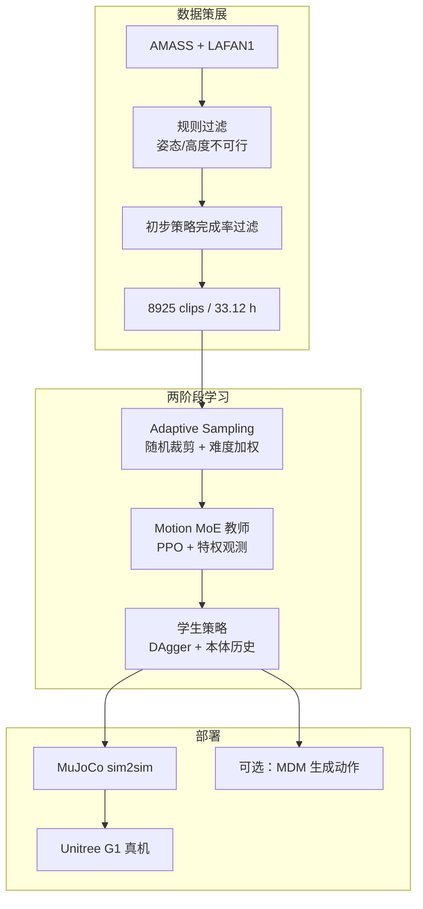
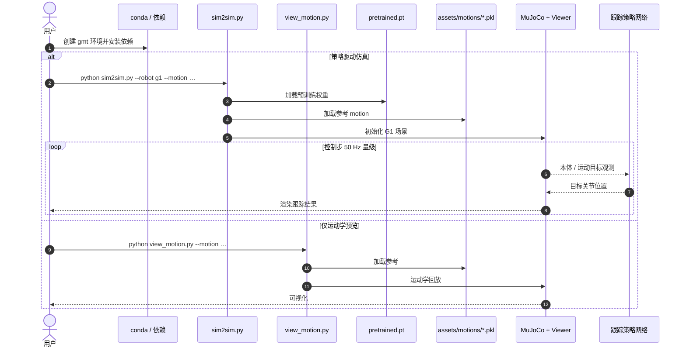

# GMT（General Motion Tracking for Humanoid Whole-Body Control）

**GMT**（*GMT: General Motion Tracking for Humanoid Whole-Body Control*，UC San Diego × Simon Fraser University，arXiv:[2506.14770](https://arxiv.org/abs/2506.14770)，[项目页](https://gmt-humanoid.github.io/)）提出面向真机人形的 **通用、可扩展全身运动跟踪框架**：在 filtered **AMASS + LAFAN1**（**8925 clips / 33.12 h**）上训练 **一个统一策略**，核心是 **Adaptive Sampling**（缓解 MoCap 类别不平衡与长序列难片段欠采样）与 **Motion Mixture-of-Experts（MoE）**（提升流形不同区域的表达力）。经 **特权教师 PPO → 学生 DAgger** 后部署到 **Unitree G1**，覆盖风格化行走、高踢、功夫、舞蹈、射门等广谱技能。

## 一句话定义

**用自适应难易采样 + 运动 MoE，把大规模 MoCap 压成单一可真机部署的全身跟踪策略。**

## 英文缩写速查

| 缩写 | 英文全称 | 简要说明 |
|------|----------|----------|
| GMT | General Motion Tracking | 本文统一全身运动跟踪框架 / 策略 |
| MoE | Mixture-of-Experts | 门控加权多专家，增强运动流形表达力 |
| MoCap | Motion Capture | AMASS / LAFAN1 等人形参考来源 |
| PPO | Proximal Policy Optimization | 特权教师策略优化算法 |
| DAgger | Dataset Aggregation | 学生模仿教师输出的部署策略训练 |
| DR | Domain Randomization | 仿真域随机化以支撑 Sim2Real |
| G1 | Unitree G1 | 论文真机平台（文中 23 DoF） |
| AMASS | Archive of Motion Capture as Surface Shapes | 大规模人体动捕元数据集 |

## 为什么重要

- **「单策略 + 全身 + 多样 + 大规模」同时满足：** Table 1 把 HumanPlus / OmniH2O（下肢表达弱）、ExBody2（小数据 + 分类微调）、ASAP（每动作单独策略）与 GMT 对齐，给出清晰选型坐标。
- **把数据不平衡与模型容量当一等公民：** Adaptive Sampling 与 Motion MoE 直接针对 AMASS 长尾与 MLP 不够用，而不是只堆 clips。
- **下游底座语义：** [ResMimic](./paper-resmimic.md) 的 GMT→残差 loco-manip、[PhyGile](./paper-phygile.md) 的生成–跟踪闭环、[EGM](../methods/egm-efficient-general-mimic.md) 的高效通用 mimic，都把「通用 tracker」当作可复用层；本页是该命名族的 **原始方法锚点**。
- **可跑入口存在：** 官方仓提供 MuJoCo **sim2sim + pretrained**（完整训练栈仍部分未开源）。

## 流程总览

## 核心机制（归纳）

### Adaptive Sampling

- **Random Clipping：** 长于 10 s 的动作切成 ≤10 s 子片段，随机偏移 ≤2 s，训练中周期性重裁，避免总采「容易段」。
- **表现驱动采样：** 记录完成度 $c_i$（初值 10，完成则 ×0.99，下限 1），误差超阈值 $E_i$ 则终止；由 $c_i$ 导出采样级别并归一化为采样概率，**从训练初期就抬高难样本权重**。

### Motion MoE

- 软 MoE：专家与门控同吃 **本体状态 + 运动目标**；最终动作 ${\bm{a}}=\sum_i p_i {\bm{a}}_i$。
- 复合技能上门控权重随阶段切换，表明专家在流形不同区域特化；消融显示对 **高分位难动作** 收益更大。

### 运动目标与输入窗

- 目标帧 ${\bm{g}}_t$ 含关节位、基座速度、roll/pitch、root 高度、**相对朝向的局部 key body**（相对全局 key body 的 ExBody2 系 refinement）。
- **GMT-L2-M：** 即时帧 + 约 2 s 未来帧堆叠 → CNN → ${\bm{z}}_t\in\mathbb{R}^{128}$，再与 ${\bm{g}}_t$ 一并输入；去掉即时帧（GMT-L2）会显著变差。

### 教师–学生与 Sim2Real

- 教师：本体 + **特权**（线速度、高度、接触、质量/电机随机参数等）+ 运动目标；PPO。
- 学生：本体历史窗 + 运动目标；DAgger $\ell_2$ 模仿教师动作。
- DR、action delay、减速器 **armature $=k^{2}I$** 反射惯量建模。

## 实验要点

| 设定 | 内容 |
|------|------|
| 训练 | ~6.8B samples；IsaacGym；4096 envs |
| 评测指标 | $E_{\mathrm{mpkpe}}$ (mm)、$E_{\mathrm{mpjpe}}$ (rad)、$E_{\mathrm{vel}}$、$E_{\mathrm{yaw\,vel}}$ |
| 对比 | 同 filtered 数据上重训 ExBody2；GMT 在 AMASS-Test / LAFAN1 全面更优 |
| 消融 | w/o MoE、w/o Adaptive Sampling、两者皆无 → 跟踪误差上升 |
| 真机 | 项目页：长序列、敏捷踢击、舞蹈、风格化 locomotion |
| 下游试探 | MuJoCo 跟踪 MDM 文本生成动作 |

## 源码运行时序图

官方仓 [zixuan417/humanoid-general-motion-tracking](https://github.com/zixuan417/humanoid-general-motion-tracking) **已开源推理侧**：`sim2sim.py`（策略 + 物理）与 `view_motion.py`（纯运动学）。**IsaacGym 训练与数据处理代码截至 2026-07-21 未在公开仓发布**（README：retargeter / data processing soon）。

- **复现路径：** 克隆仓 → 装依赖 → `sim2sim.py --robot g1 --motion <pkl>`。
- **完整训练复现：** 需等官方发布数据处理 / 训练代码；当前以论文附录 + 项目页为准。

## 工程实践

| 项 | 实践要点 |
|----|----------|
| 开源状态 | **部分开源**：sim2sim + checkpoint + 示例动作；训练/重定向待发布 |
| 硬件 | 论文 G1 **23 DoF**；仓内另有多 DoF 资产变体，部署需对齐机型 |
| 数据 | 两阶段策展去掉爬行/跌倒/过激动作；不可行动作当噪声 |
| 调试 | 看难片段跟踪误差与关节力矩；Adaptive Sampling 关闭时易在复合长动作上失衡 |
| 真机风险 | README 免责：不同机台表现可能失败 |

## 局限与风险

- **非扩散/流匹配生成器：** 161 篇公众号策展曾误写「扩散策略/流匹配」——GMT 是 **RL 跟踪策略（PPO/DAgger + MoE）**，动作生成另见 MDM 等下游试验。
- **接触丰富技能缺失：** 起身、翻滚等未覆盖（仿真接触成本 + 硬件约束）。
- **无地形条件：** 斜坡/楼梯等需后续扩展观测与数据。
- **部分开源：** 不可假设「clone 即可复现 Table 2 训练」；公开产物是 **推理/可视化**。

## 与其他工作对比

| 路线 | 策略形态 | 数据/微调 | 典型局限 |
|------|----------|-----------|----------|
| HumanPlus / OmniH2O | 单策略全身 | 大规模 | 下肢自然度有限 |
| ExBody2 | 多 specialist / 小策展集 | 分类微调 | 扩展成本高 |
| ASAP | 每动作策略 | 敏捷 Sim2Real | 非统一策略 |
| **GMT** | **单策略 + MoE** | **8925 filtered + Adaptive Sampling** | 接触/地形弱；训练栈部分未开源 |
| [EGM](../methods/egm-efficient-general-mimic.md) | CDMoE + Bin 课程 | 强调小高质量集 | 同族「高效通用 mimic」对照 |
| [SONIC](../methods/sonic-motion-tracking.md) | 规模化 token/接口 | 更大语料叙事 | 工程栈更重 |
| [ResMimic](./paper-resmimic.md) | GMT 先验 + 残差 | 物体条件 | 下游 loco-manip，非替代 GMT |

## 关联页面

- [Whole-Body Tracking Pipeline](../concepts/whole-body-tracking-pipeline.md)
- [人形运动跟踪方法选型](../queries/humanoid-motion-tracking-method-selection.md)
- [EGM（Efficient General Mimic）](../methods/egm-efficient-general-mimic.md)
- [SONIC](../methods/sonic-motion-tracking.md)
- [ResMimic](./paper-resmimic.md)
- [PhyGile](./paper-phygile.md)
- [ExBody2（161 索引）](./paper-loco-manip-161-007-exbody2.md)
- [ASAP](./paper-hrl-stack-25-asap.md)
- [Unitree G1](./unitree-g1.md)
- [161 篇策展索引 GMT](./paper-loco-manip-161-009-gmt.md)

## 推荐继续阅读

- 项目页：<https://gmt-humanoid.github.io/>
- 代码：<https://github.com/zixuan417/humanoid-general-motion-tracking>
- 论文：<https://arxiv.org/abs/2506.14770>
- ResMimic（GMT→残差）：<https://resmimic.github.io/>

## 参考来源

- [GMT 论文摘录](../../sources/papers/gmt_arxiv_2506_14770.md)
- [GMT 项目页归档](../../sources/sites/gmt-humanoid-github-io.md)
- [GMT 代码仓库归档](../../sources/repos/humanoid-general-motion-tracking.md)
- Chen et al., *GMT: General Motion Tracking for Humanoid Whole-Body Control*, arXiv:2506.14770, 2025. <https://arxiv.org/abs/2506.14770>
