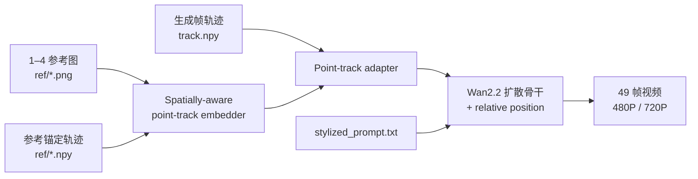
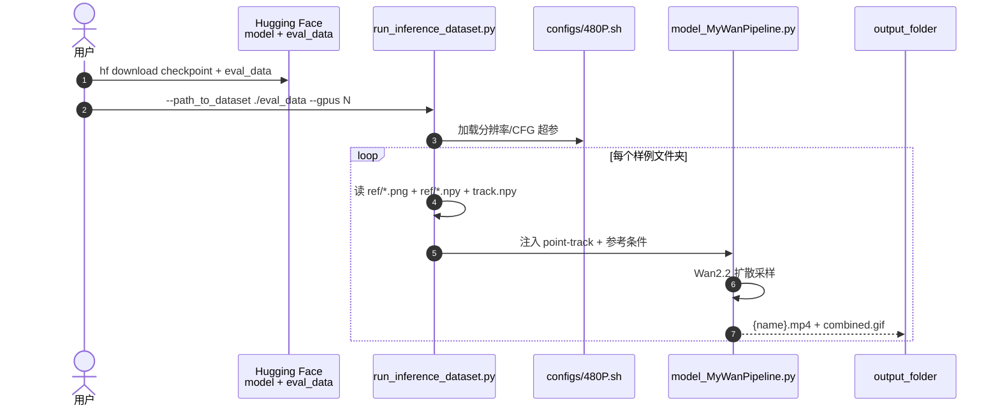

# Go-with-the-Track

**Go-with-the-Track**（*Video Compositing and Motion Control with Point Tracking*，[arXiv:2606.20891](https://arxiv.org/abs/2606.20891)，SIGGRAPH 2026，Koichi Namekata / Yash Kant / Zhizheng Liu 等 · **Eyeline Labs** / **Netflix** / **牛津大学（Oxford）** / UCLA / Stony Brook / **哥伦比亚大学（Columbia）**；[项目页](https://eyeline-labs.github.io/Go-with-the-Track/)，[代码](https://github.com/Eyeline-Labs/Go-with-the-Track)，[HF 模型](https://huggingface.co/Eyeline-Labs/Go-with-the-Track)）在 **Wan2.2** 视频扩散骨干上，用 **reference-anchored point-tracks** 把 **运动控制** 与 **多参考图视频合成** 统一到单一生成模型：点轨迹不仅描述生成序列内的 2D 流，还 **锚定在参考帧** 上，显式建立生成像素与参考内容的对应。

## 一句话定义

**用「参考图锚定的点轨迹 + 1–4 张任意关键帧参考」同时约束视频里「谁出现、长什么样、怎么动」，把合成与运动控制从两条产品线合并成一条扩散条件接口。**

## 英文缩写速查

| 缩写 | 英文全称 | 简要说明 |
|------|----------|----------|
| I2V | Image-to-Video | 图像条件视频生成 |
| T2V | Text-to-Video | 文本条件视频生成 |
| CFG | Classifier-Free Guidance | 无分类器引导采样 |
| HF | Hugging Face | 模型与数据集托管平台 |
| PCA | Principal Component Analysis | 点轨迹嵌入空间可视化 |
| GT | Ground Truth | 合成/静态场景中的精确轨迹标注 |

## 为什么重要

- **统一两条常见需求：** 轨迹条件 I2V 擅长「怎么动」但常限首帧内容；多参考合成擅长「插入外观」但缺时空精细控制——本文用 **reference-anchored tracks** 同时约束 **运动 + 合成**。
- **任意关键帧条件：** 不限首帧；**四帧均匀采样** 参考在重建任务上优于单首帧（项目页消融）——对长镜头编辑与中间帧插入更实用。
- **生产向应用栈：** 网格顶点轨迹风格化、多物体独立渲染再合成、动态场景 **相机重定向**、逆渲染时序去闪烁等，贴近影视/VFX 管线而非仅学术 T2V。
- **可复现资源齐全：** Apache-2.0 代码 + HF **模型 + 评测数据集** + 480P/720P 推理脚本，便于作为 **可控视频世界模型** 上游对照 [Wan](./paper-wan-video.md) 生态。

## 核心信息

| 项 | 内容 |
|----|------|
| 机构 | Eyeline Labs、Netflix、牛津、UCLA、Stony Brook、哥伦比亚 |
| 会场 | SIGGRAPH 2026 |
| 骨干 | **Wan2.2** T2V（1.3B 路线 + 微调 adapter） |
| 代码 | [Eyeline-Labs/Go-with-the-Track](https://github.com/Eyeline-Labs/Go-with-the-Track) · **Apache-2.0** |
| 模型/数据 | [HF Model](https://huggingface.co/Eyeline-Labs/Go-with-the-Track) · [HF Dataset](https://huggingface.co/datasets/Eyeline-Labs/Go-with-the-Track) |
| 开源核查 | **已开源**（2026-09-15） |

## 流程总览

## 源码运行时序图

节点对齐 [`sources/repos/go-with-the-track.md`](../../sources/repos/go-with-the-track.md)。

- **最短路径：** conda `gwtt` 环境 → `pip install -e .` → 下载 HF checkpoint → `python run_inference_dataset.py --config_path ./configs/480P.sh --gpus 1`。

## 核心原理

### 1）Reference-anchored point-tracks

- 常规 point-track 条件只描述 **生成视频内** 点的 2D 轨迹。
- 本文把轨迹 **锚定到参考图**，建立 **生成帧 ↔ 参考内容** 的点对应，使模型在 **任意时间** 插入参考外观并沿轨迹运动。

### 2）关键模块（消融验证）

| 组件 | 作用 | 去掉后 |
|------|------|--------|
| Spatially-aware embedder | 空间相关点 ID 嵌入 | 参考内容插错位置 |
| Point-track adapter | 避免 naive 下采样丢细节 | 运动可控性下降 |
| Relative position injection | 池化前保留块内空间线索 | 运动可控性下降 |

### 3）训练数据混合

- **真实视频** + 离线 tracker（含噪轨迹）+ **合成/静态场景 GT 轨迹** 混合；全量数据显著优于仅真实视频（项目页 Dataset 消融）。
- **迭代 resampling** 比均匀随机 query 得到更密、更均匀的轨迹覆盖。

### 4）工程实践

| 项 | 说明 |
|----|------|
| 输入 | 每样例文件夹：`ref/{id}.png`+`{id}.npy`、`track.npy`、`stylized_prompt.txt`；可选 49 帧源 `video.mp4` |
| 输出 | MP4/GIF + `Visualize/` 合成条件可视化 |
| 算力 | 480P 默认 1 GPU；720P 建议 4 GPU（自 480P ckpt 再训 4000 iter） |
| 局限 | 依赖 Wan2.2 基础权重体积大；轨迹质量受离线 tracker 影响；影视管线外推到机器人闭环需另建评测 |

## 实验与评测（项目页级）

- **应用 demo：** 多参考风格迁移、网格顶点驱动风格化/合成、SAM3D Body / Pixel3DMM 关键点合成、Pi3 点云相机轨道、DELTA+Pi3 动态场景相机重定向、逆渲染时序稳定等。
- **消融：** 模块设计、数据集混合、关键帧数量（1/中/末/四帧）、非关键帧参考、resampling 策略。
- **首帧重建/风格化：** 相对基线更贴近源视频空间结构与身份（项目页对比图）。

## 结论

**Go-with-the-Track 用 reference-anchored point-tracks 把「合成谁」与「怎么动」绑进同一扩散条件，是 Wan 生态里面向 VFX/可控生成的一条实用分支，而非机器人闭环 WM 的直接替代品。**

- 真影响指标的是 **参考锚定轨迹 + 空间感知嵌入 + adapter**，不是单纯堆更多参考图。
- 四帧均匀参考 > 单首帧——编辑与重建任务应默认多关键帧条件。
- 对本库机器人主线：可作为 **可控视频先验 / 合成数据** 对照 [generative-world-models](../methods/generative-world-models.md) 与 [video-as-simulation](../concepts/video-as-simulation.md)，但 **未提供机器人动作或物理可行性评测**。
- 复现优先走官方 HF **模型 + eval_data + 480P 脚本**；720P 需多卡与更大 checkpoint 树。

## 与其他页面的关系

- 方法：[generative-world-models.md](../methods/generative-world-models.md)
- 概念：[video-as-simulation.md](../concepts/video-as-simulation.md)
- 上游骨干：[paper-wan-video.md](./paper-wan-video.md)、[paper-wan-move.md](./paper-wan-move.md)
- 点跟踪相关：[paper-d4rt.md](./paper-d4rt.md)、[paper-uma.md](./paper-uma.md)

## 参考来源

- [go_with_the_track_arxiv_2606_20891.md](../../sources/papers/go_with_the_track_arxiv_2606_20891.md)
- [eyeline-go-with-the-track.md](../../sources/sites/eyeline-go-with-the-track.md)
- [go-with-the-track.md](../../sources/repos/go-with-the-track.md)

## 推荐继续阅读

- [项目页 demo](https://eyeline-labs.github.io/Go-with-the-Track/)
- [Wan 实体页](./paper-wan-video.md)
- [HF 评测数据集](https://huggingface.co/datasets/Eyeline-Labs/Go-with-the-Track)
