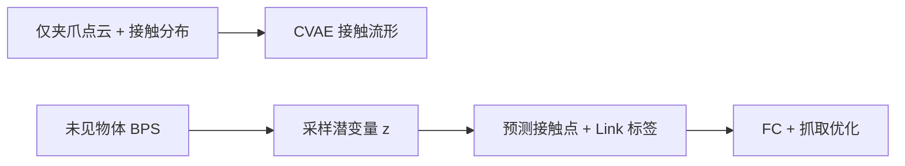

# GOAG

**GOAG: Generative and Object-Agnostic Grasp Planner for Dexterous Robotic Manipulation**（[arXiv:2608.19759](https://arxiv.org/abs/2608.19759)，[项目页](../../sources/sites/goag-cea-list.md)）——巴黎-萨克雷大学 CEA-List；里昂中央理工 LIRIS。

## 一句话定义

**夹爪与物体在接触点共享表面几何——先学夹爪流形，推理再检索可接触区域。**

## 英文缩写速查

| 缩写 | 英文全称 | 简要说明 |
|------|----------|----------|
| GOAG | Generative Object-Agnostic Grasp | 本文生成式物体无关抓取规划器 |
| BPS | Basis Point Set | 夹爪工作空间点集编码 |
| MultiDex | Multi-Dexterous Grasp Dataset | 多灵巧手抓取评测集 |

## 为什么重要

- 纳入 [具身智能小站 2026-08-22 十篇盘点](../../sources/blogs/wechat_embodied_station_video_contact_control_10_papers_2026-08-22.md) 的「视频→接触→控制→VLA 持续学习」主线。
- 开源状态（入库日）：**未开源**。

## 核心信息

| 项 | 内容 |
|----|------|
| **机构** | 巴黎-萨克雷大学 CEA-List；里昂中央理工 LIRIS |
| **出处** | arXiv:2608.19759（2026-08） |
| **开源** | **未开源** |

### 流程总览

## 结论

**不绑定物体训练数据，抓取模型才有机会在未见物体上真正泛化。**

- 训练阶段完全不依赖 object-specific 数据
- 推理时物体特征检索与夹爪能力兼容的接触区
- MultiDex 86.93% 且生成大量抓取更快
- 与 CoToGrasp 同 CEA-List 灵巧抓取线对照

## 源码运行时序图

**不适用**（截至 **2026-08-22**）：项目页未列可运行代码仓库。

## 与其他页面的关系

- [dexterous-grasping](../concepts/dexterous-kinematics.md)
- [paper-cotograsp](./paper-cotograsp.md)
- [manipulation](../tasks/manipulation.md)
- [视频–接触–控制 10 篇技术地图](../overview/video-contact-control-10-papers-technology-map.md)

## 参考来源

- [goag_arxiv_2608_19759](../../sources/papers/goag_arxiv_2608_19759.md)
- [goag-cea-list](../../sources/sites/goag-cea-list.md)
- [wechat_embodied_station_video_contact_control_10_papers_2026-08-22](../../sources/blogs/wechat_embodied_station_video_contact_control_10_papers_2026-08-22.md)

## 推荐继续阅读

- [arXiv:2608.19759](https://arxiv.org/abs/2608.19759)
