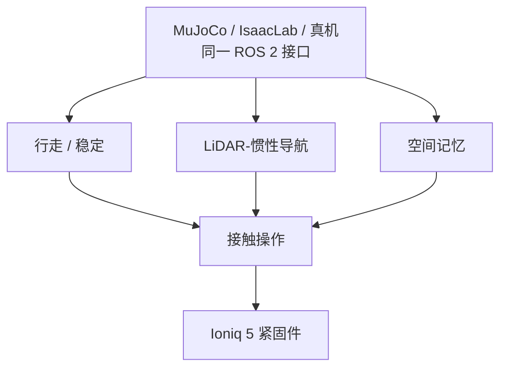

# GOLEM：把人形工业拆解拆成可替换模块

**GOLEM**（*Generalized Open Library of Embodied Modules*；*Modular Humanoid Autonomy Towards Electric Vehicle Battery Disassembly*，[arXiv:2608.21550](https://arxiv.org/abs/2608.21550)，[项目页](https://golem-humanoid.github.io)）由 **科罗拉多大学博尔德分校（University of Colorado Boulder）** 与 **圣母大学（University of Notre Dame）** 提出：在 Unitree H1-2 上把行走、操作、动态稳定、导航和空间记忆做成抽象接口，用 Docker 化 ROS 2 对齐 MuJoCo / IsaacLab 数字孪生与真机，演示退役电动车电池拆解。

## 一句话定义

**人形机器人进入工业现场，需要先建立可替换、可比较的系统模块——GOLEM 用能力阶梯逐项加档，而不是一次报一个整机成功率。**

## 英文缩写速查

| 缩写 | 英文全称 | 简要说明 |
|------|----------|----------|
| GOLEM | Generalized Open Library of Embodied Modules | 本文模块化架构 |
| EV | Electric Vehicle | 退役动力电池拆解场景 |
| ROS 2 | Robot Operating System 2 | Docker 化通信抽象 |
| DDS | Data Distribution Service | 仿真/真机切换等于选域 |
| MPC | Model Predictive Control | 下肢采样式对照 |

## 为什么重要

- **拆解危险且重复：** 目前几乎全靠人工。
- **整系统数字不可比：** 能力阶梯一次只加一个模块，便于换方法。
- **位姿误差会吃掉操作：** 导航 13 cm 误差把抓取从 87% 打到 37%。

## 核心信息

| 项 | 内容 |
|----|------|
| **机构** | 科罗拉多大学博尔德分校（University of Colorado Boulder）；圣母大学（University of Notre Dame） |
| **平台** | Unitree H1-2；Hyundai Ioniq 5 电池包 |
| **开源** | **待核实** — 项目页列 [golem-humanoid](https://github.com/golem-humanoid)，入库日 GitHub API 404 |

## 核心原理（方法）

四层：物理引擎（真机 / MuJoCo / IsaacLab PhysX）；硬件接口；核心能力（学习/规划身体控制、导航、语义定位）；接触丰富操作与带空间记忆的取回。孪生暴露与真机一致的 ROS 2/DDS 接口。

评测按能力阶梯：先表征导航终点误差，再比站立抗扰，最后在系留 / 自由站立 / 导航扰动三档看抓取。

### 流程总览

## 工程实践

| 项 | 建议 |
|----|------|
| **源码运行时序图** | **不适用**（截至 2026-08-30 官方 org API 404，无可辨识训练/部署入口） |
| 读数字 | 按阶梯单独引用，不要合成一个「拆解成功率」 |
| 操作预算 | 先量底座终点误差，再决定抓取容差 |
| 稳定对照 | 采样 MPC 抗扰失败不能外推成「MPC 不能走」 |

## 实验与评测

| 设定 | 结果 |
|------|------|
| 6 m 走目标 | 终点误差 **13.0 cm** |
| 站立抗扰 | 学习控制器恢复；采样下肢 MPC 需急停（项目页对抗恢复约 93%） |
| 系留抓取松开紧固件 | **97%** |
| 自由站立 | **87%** |
| 加导航位姿扰动 | **37%** |

## 结论

**工业人形的第一张成绩单应该是模块阶梯，而不是一条端到端成功率。**

1. **导航误差是操作预算** — 13 cm 就把抓取从 87% 打到 37%。
2. **稳定与行走分开测** — 学习站立补的是 MPC 恢复，不是步态本身。
3. **系留数字会骗人** — 先看自由站立，再看带导航的现场。
4. **接口一致才能换方法** — Docker + 同 DDS 是比较的前提。
5. **仓未核到** — 论文写源码在项目页，入库日按待核实，不要写成可 clone。

## 与其他工作对比

| 对照 | 差异读法 |
|------|----------|
| [DreamMimic](./paper-dreammimic.md) | 仿真视觉全身蒸馏；GOLEM 是工业系统集成 |
| [TONAV](./paper-tonav.md) | 四足铰接家务；GOLEM 是人形电池包 |
| 单体 RL 策略论文 | 本页强调可替换模块与公平比较 |

## 局限与风险

- 官方代码链接在入库日无法经 GitHub API 核验。
- 抓取对象是已松开紧固件，不是完整拆解工艺。
- 与龙门架单元协同，不是纯人形独自完成产线。

## 关联页面

- [Loco-Manipulation](../tasks/loco-manipulation.md)
- [Whole-Body Control](../concepts/whole-body-control.md)
- [mjlab](./mjlab.md)
- [DreamMimic](./paper-dreammimic.md)
- [48ms WAM / 编排 10 篇地图](../overview/glancewam-vla-crew-10-papers-technology-map.md)

## 参考来源

- [golem_humanoid_arxiv_2608_21550](../../sources/papers/golem_humanoid_arxiv_2608_21550.md)
- [项目页归档](../../sources/sites/golem-humanoid.md)
- [具身智能小站 10 篇盘点](../../sources/blogs/wechat_embodied_station_10_papers_glancewam_vla_crew_2026-08-30.md)

## 推荐继续阅读

- [arXiv:2608.21550](https://arxiv.org/abs/2608.21550)
- [项目页](https://golem-humanoid.github.io)
