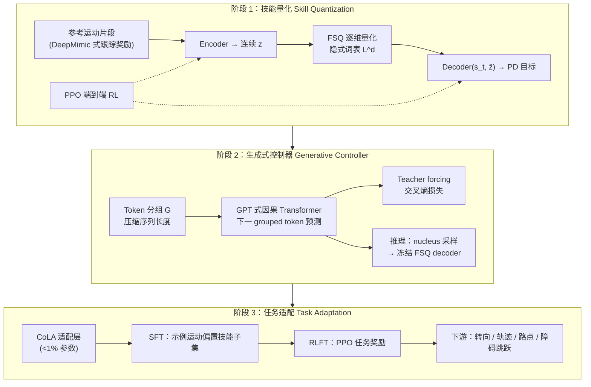

# GPC（Generative Pretrained Controllers）

**GPC**（*GPC: Large-Scale Generative Pretraining for Transferable Motor Control*，Yi Shi / Yifeng Jiang / Chen Tessler / Xue Bin Peng，SFU · NVIDIA，**SIGGRAPH 2026**；[arXiv:2606.29148](https://arxiv.org/abs/2606.29148)）把 **大语言模型预训练范式** 搬到 **物理仿真角色控制**：先将多样运动技能 **离散 token 化**，再用 **Transformer 下一 token 预测** 学通用生成式控制器，最后像 GPT 一样 **微调** 到新任务——在 **超过 600 小时** 动作数据上训练后，可在物理仿真中 **实时** 生成自然且物理合理的交互行为。

## 一句话定义

**用 FSQ 端到端 RL 学「运动词汇表」，用 GPT 式 Transformer 学 token 序列分布，再用 CoLA 轻量微调把同一预训练控制器迁移到新控制任务**——把「预训练 + 微调」从 NLP 搬到大规模物理角色运动控制。

## 英文缩写速查

| 缩写 | 英文全称 | 简要说明 |
|------|----------|----------|
| GPC | Generative Pretrained Controllers | 本文方法：离散技能 token + 自回归生成式物理控制器 |
| FSQ | Finite Scalar Quantization | 无显式 codebook 的有限标量量化，构建运动技能词汇表 |
| PEFT | Parameter-Efficient Fine-Tuning | 冻结主干、只训少量适配层的微调范式 |
| CoLA | Conditional Low-rank Adaptation | 本文 PEFT：DoRA + FiLM 任务条件低秩调制（<1% 新参） |
| RLFT | Reinforcement Learning Fine-Tuning | 用 PPO 在下游任务奖励上微调适配层 |
| PPO | Proximal Policy Optimization | FSQ 跟踪与下游 RLFT 的主干 on-policy 算法 |

## 为什么重要

- **把 GPT 范式落到物理控制：** 不是只在运动学空间做 text-to-motion，而是 **端到端 RL** 保证每个离散 token 都对应 **可物理执行** 的技能；预训练控制器通过 **下一 token 预测** 统一建模长时行为分布。
- **离散化路线的新规模点：** 相对 VQ-VAE token 化多在 **~20 h** 级数据验证，GPC 在 **BONES（~680 h）+ 总计 >600 h** 上训练，FSQ 跟踪成功率 **99.98%**，且 **无需 VQ 常见 codebook 启发式**。
- **实时交互式控制：** 消费级 **RTX 4090** 可实时运行（$G{=}4$ 分组时约 **115 FPS**），支持摇杆转向、轨迹跟踪等 **闭环交互**，不是离线 clip 生成。
- **涌现恢复与多样性：** 无条件采样与扰动响应中出现 **侧手翻、前滚起身** 等恢复行为（无专门恢复奖励）；下游任务中相对 CVAE 控制器保留 **同任务多次 rollout 的行为多样性**。
- **与机器人 WBC 栈的对照坐标：** 同属 Peng / NVIDIA **物理角色控制** 谱系（DeepMimic → ASE → ProtoMotions），但 GPC 明确面向 **SIGGRAPH 角色动画**；与 [SONIC](../methods/sonic-motion-tracking.md)、[BFM](./paper-behavior-foundation-model-humanoid.md) 的 **人形真机 universal tracking** 形成 **「仿真动画生成式先验 vs 机器人部署执行器」** 互补阅读。

## 流程总览

## 核心机制（归纳）

### 1）FSQ 端到端技能量化

- **跟踪骨架：** 遵循 [DeepMimic](../methods/deepmimic.md) 式参考运动密集奖励；策略条件于本体状态 $\mathbf{s}_t$ 与未来 $h$ 帧目标 $\hat{\mathbf{s}}_{t:t+h}$。
- **FSQ 词表：** 每维独立量化到 $L$ 个标量等级，隐式 codebook 大小 $L^d$（主实验 $L{=}9, d{=}40$）；**straight-through estimator** 使 encoder/decoder 与 PPO 联合优化。
- **相对 VQ-VAE：** Table 1 在 Bones / AMASS 上 **成功率与 MPJPE 均优于 VQ-VAE**；且省去 dead-code 重初始化等训练技巧。
- **端到端 vs 运动学预训 encoder：** 「先运动学监督训 FSQ encoder 再冻结」的 FSQ-K 成功率跌至 **99.03%**、MPJPE **78.26 mm**，说明 **RL 端到端** 对物理可执行表示至关重要。

### 2）GPT 式生成式控制器

- **Grouped tokens：** 每步 $d$ 个 $L$-ary token 按因子 $G$ 打包，词表 $L^G$、序列长 $d/G$，在 **多样性（APD）与算力/FPS** 间折中（$G{=}4$ → **115 FPS**）。
- **训练：** 因果 Transformer decoder；条件于角色状态 $\mathbf{s}_t$ 与已生成 token 前缀；**交叉熵下一 token 预测**（teacher forcing）。
- **推理：** 每步 **nucleus (top-$p$) 采样** grouped token，送 **冻结 FSQ decoder** 出 PD 目标动作。
- **涌现：** 无条件采样覆盖翻滚、跳跃、舞蹈、杂技；外力扰动下自动切入 **跌倒恢复、平衡调整** 等，无需额外奖励塑形。

### 3）CoLA 参数高效任务适配

- **CoLA：** 在预训练 Transformer 权重上叠加 **DoRA 式幅度–方向分解 + FiLM 任务调制** 的低秩分支；总新增参数 **<1%**。
- **SFT：** 用目标风格示例运动（如 20 s 蹲行）做交叉熵，**收窄** 技能 token 分布、降低策略熵，便于风格化任务。
- **RLFT：** PPO 优化任务奖励；动作空间为长度 $d'$ 的离散 skill token 序列；探索由 **无条件生成先验 + nucleus 采样** 正则，避免微调后行为僵化。
- **下游验证：** 摇杆 **转向**、**轨迹跟踪**、**目标到达**、**障碍/平台跳跃与爬行**；适配后仍保留预训练模型的 **扰动鲁棒性与行为随机性**。

## 主要量化结果（精选）

| 指标 | Bones (~680 h) | 说明 |
|------|----------------|------|
| FSQ 跟踪成功率 | **99.98%** | 相对 VQ-VAE 99.94%、MLP 99.98%（MPJPE 更优） |
| FSQ MPJPE | **34.90 mm** | 端到端 RL 显著优于 FSQ-K（78.26 mm） |
| 实时推理 FPS | **~115**（$G{=}4$） | RTX 4090 级消费硬件 |
| CoLA 新增参数 | **<1%** | PEFT 适配多下游任务 |

## 与其他工作的关系

- **相对 [ASE](../methods/ase.md) / CVAE 连续潜空间：** ASE 用 **对抗 + 连续超球面嵌入** 学可复用技能；GPC 用 **离散 FSQ + 自回归 Transformer**，在 **600 h+** 规模上规避连续流形 **mode collapse / 离流形漂移**，且下游保留 **随机多样性**（论文 Fig. 8–9 对比 CVAE 任务控制器）。
- **相对 VQ-VAE token 跟踪（PLT、TokenHSI 等）：** 共享「离散运动 token」思路，但 GPC 强调 **FSQ 简化训练** 与 **端到端 RL 词表学习**，并把重点放在 **GPT 式预训练 + PEFT 迁移**。
- **相对 [MotionBricks](../methods/motionbricks.md) / [SONIC](../methods/sonic-motion-tracking.md)：** 均涉及 **FSQ/离散运动表示** 与 NVIDIA 栈；MotionBricks/SONIC 面向 **机器人实时 WBC 与 GR00T 集成**，GPC 面向 **物理角色动画大规模生成式先验**——读论文前先确认 **部署目标（真机 vs 仿真角色）**。
- **相对 [BFM](./paper-behavior-foundation-model-humanoid.md) / [ReactiveBFM](./paper-reactivebfm.md)：** BFM 系解决 **人形多接口跟踪 + 真机闭环规划**；GPC 解决 **仿真角色技能库上的生成式预训练与 token 微调**——二者可组合想象为「GPC 式离散技能先验 + BFM 式执行器」，但 **本文未做人形机器人实验**。
- **工程底座：** 训练与评估基于 **Isaac Gym + [ProtoMotions](./protomotions.md)**；主数据 **BONES-SEED**，对照 **AMASS** 子集。

## 常见误区或局限

- **不是人形机器人真机论文：** 角色为 **物理仿真人体**；与 Unitree G1 等 **真机 WBC** 结果不可直接类比。
- **不是 text-to-motion：** 预训练 **无条件/状态条件** 自回归；**无语言接口**（Limitations 列为未来工作）。
- **未覆盖人–物交互：** 下游以 **locomotion 与场景几何** 为主（转向、轨迹、障碍、平台），不含抓取/操作。
- **≠ NLP 里的 GPT 权重迁移：** 是 **方法论类比**（离散 token + 下一 token 预测 + 微调），不是复用语言模型 checkpoint。

## 关联页面

- [Behavior Foundation Model](../concepts/behavior-foundation-model.md)
- [ASE（对抗性技能嵌入）](../methods/ase.md)
- [DeepMimic](../methods/deepmimic.md)
- [MotionBricks](../methods/motionbricks.md)
- [SONIC（规模化运动跟踪）](../methods/sonic-motion-tracking.md)
- [ProtoMotions](./protomotions.md)
- [AMASS](./amass.md)
- [Imitation Learning](../methods/imitation-learning.md)

## 参考来源

- [sources/papers/gpc_arxiv_2606_29148.md](../../sources/papers/gpc_arxiv_2606_29148.md)
- Shi, Jiang, Tessler, Peng. *GPC: Large-Scale Generative Pretraining for Transferable Motor Control*. SIGGRAPH Conference Papers 2026; arXiv:2606.29148. <https://arxiv.org/abs/2606.29148>

## 推荐继续阅读

- [BONES-SEED 数据集](https://bones.studio/datasets) — 论文主训练语料（~680 h）
- [ProtoMotions（GitHub）](https://github.com/NVlabs/ProtoMotions) — 大规模并行 tracking + RL 框架
- [ASE 方法页](../methods/ase.md) — 连续潜空间生成式技能先验对照
- [A Survey of Behavior Foundation Model（arXiv:2506.20487）](https://arxiv.org/abs/2506.20487) — 生成式运动先验与人形 WBC 综述
