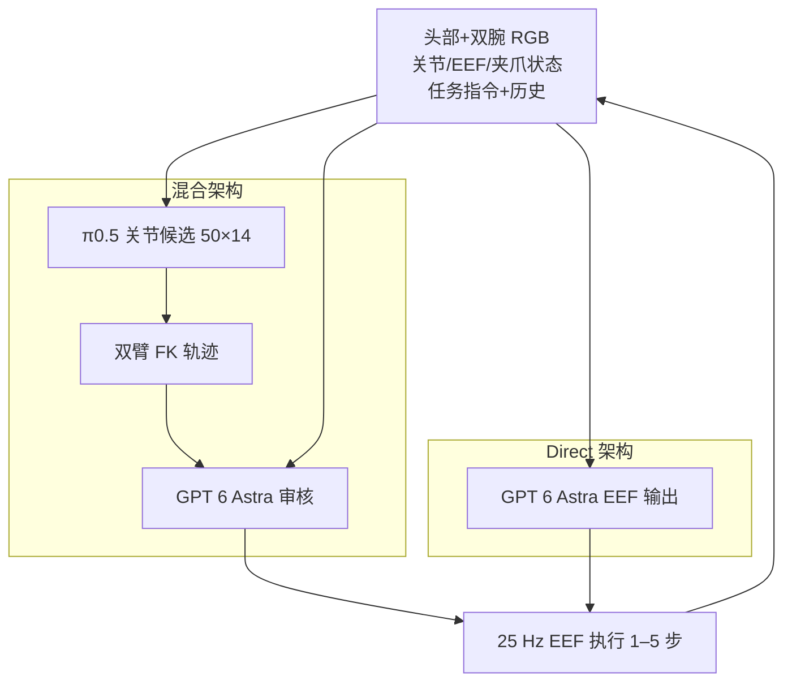
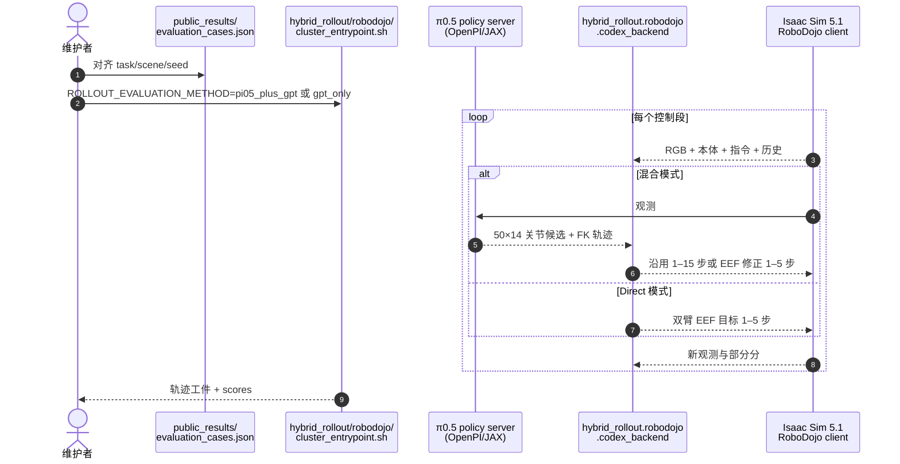

# GPT 6 Astra as an Embodied Policy

**GPT 6 Astra as an Embodied Policy**（Yu-Mool Shu、Lipxin Zheng，2026 技术报告，[报告站](https://anonymous-report-421.github.io/public-website/?view=1)，[代码](https://github.com/anonymous-report-421/eval-of-gpt-6-astra-as-policy)）系统评测 OpenAI **GPT 6 Astra**（`xhigh`）作为双臂操纵闭环策略的能力，并与 [π0.5](./paper-pi05-open-world-vla.md) 形成 **混合架构**（学生生成候选、通用模型审核/修正）对照。

## 一句话定义

在 [RoboDojo](./robodojo.md) 十任务双臂仿真上，**π0.5 + GPT 6 Astra** 混合闭环以仅 **14.4%** 的 GPT 修正步将成功率从 π0.5 公开参照 **15.67%** 提升到 **48%**；纯 **GPT 6 Astra Direct** 为 **26%**，但在 RoboLab 语义抓放子集可接近 **98%**——说明通用模型的语义推理与 VLA 动作先验可在同一闭环中分工而非互斥。

## 英文缩写速查

| 缩写 | 英文全称 | 简要说明 |
|------|----------|----------|
| VLA | Vision-Language-Action | 视觉–语言–动作策略；本文 π0.5 充当学生先验 |
| EEF | End-Effector | 末端执行器；GPT 6 Astra 直接输出双臂 EEF 目标 |
| SR | Success Rate | 任务成功率；本文 RoboDojo 主表 50 对齐实例 |
| BC | Behavior Cloning | 示范/轨迹监督；π0.5 使用 RoboDojo 任务微调权重 |
| FK | Forward Kinematics | 正运动学；混合架构将 π0.5 关节候选转为双臂轨迹供 GPT 审核 |
| MIT | Massachusetts Institute of Technology License | 评测与报告代码采用 MIT 许可 |

## 为什么重要

- **填补「通用模型当策略」的定量空白：** 社区已有 Astra 真机演示与单次案例（Robocurve、GPT-Policy-Eval 等），本文在统一协议下给出 **50 对齐实例** 的成功率、Score 与 token 成本对照。
- **明确混合分工价值：** 混合在 RoboDojo 难任务子集上 **+22 pp** 于 Direct，且 token 少约 **45%**；说明让 VLA 承担连续操作、让通用模型处理目标偏离与异常恢复，是可行工程路径。
- **揭示任务–先验匹配条件：** RoboLab 同子集上 Direct **98%**、混合 **92%**、π0.5 **36%**——当语义抓放与学生零样本迁移对齐时，Direct 可饱和；当任务更难、需非常规修正时，混合在 RoboDojo 上更优。
- **可复现开源：** MIT 发布 `hybrid_rollout` 集成、双语报告构建与 `public_results/` 种子；100 条评测视频 + 43 条画廊片段支持定性核查。

## 核心信息

| 字段 | 内容 |
|------|------|
| 作者 | Yu-Mool Shu、Lipxin Zheng |
| 年份 | 2026 |
| 模型 | GPT 6 Astra（`xhigh`）；π0.5 为 RoboDojo 任务微调 checkpoint |
| 基准 | [RoboDojo](./robodojo.md) 十任务（主）；RoboLab 十任务子集（补充） |
| 实例规模 | 每任务 5 次；混合与 Direct 逐实例对齐 seed |
| 开源状态 | **已开源** 评测与报告代码；**未分发** 模型权重与仿真资产 |

## 核心原理

### 两种闭环架构

| 架构 | 动作生成 | 执行 |
|------|----------|------|
| **混合（π0.5 + GPT 6 Astra）** | π0.5 据三路 640×480 RGB + 14 维本体 + 指令生成 **50×14** 关节候选；GPT 接收相同观测、历史与候选 **FK 双臂轨迹** | 沿用 π0.5 前 **1–15** 步，或 GPT 输出 **1–5** 步双臂 EEF 修正；25 Hz，5 cm / 0.35 rad 保护 |
| **Direct（GPT 6 Astra）** | 不运行 π0.5；直接据图像、本体、指令与历史生成双臂 EEF + 夹爪 | 每次 **1–5** 步；相同成功判定与 EEF 接口 |

共同约束：无物体真值、无未来轨迹、无环境回滚；仅仿真器确认终止视为终局；多数任务要求机械臂归位。

### 任务选择（RoboDojo 十任务）

按 π0.5 官方成功率 **0–72%** 四等分，从低到高取 **6+2+1+1** 个任务，覆盖语义分类、顺序记忆、装箱、搭建、柔性操作等；示例任务 ID：`organize_table`、`classify_objects_by_language`、`imitate_sorting_sequence`、`pack_objects_into_box`、`build_tower`、`fold_clothes`、`put_bottles_into_dustbin` 等。

### 流程总览

## 源码运行时序图

节点对齐 [`sources/repos/eval-of-gpt-6-astra-as-policy.md`](../../sources/repos/eval-of-gpt-6-astra-as-policy.md) 与 README 入口。

复现需自备 GPT 6 Astra 授权网关、Isaac Sim 与 RoboDojo π0.5 checkpoint；公开快照不含凭证与原始会话。

## 评测

### RoboDojo 十任务（50 对齐实例）

| 方法 | 成功 | 成功率 | 平均 Score | 备注 |
|------|------|--------|------------|------|
| π0.5（公开参照） | — | **15.67%** | **24.43** | 同子集官网榜重加权，非同 seed 重跑 |
| **π0.5 + GPT 6 Astra** | 24/50 | **48%** | **62.60** | GPT 修正 **14.4%** 控制步；~624.8M token |
| **GPT 6 Astra Direct** | 13/50 | **26%** | **37.81** | ~1.13B token（多约 44.8%） |

### RoboLab 十任务子集（各 50 episode）

| 方法 | 成功 | 成功率 |
|------|------|--------|
| π0.5 | 18/50 | 36% |
| **π0.5 + GPT 6 Astra** | 46/50 | **92%** |
| **GPT 6 Astra Direct** | 49/50 | **98%** |
| Cosmos3-Nano-Policy | 18/50 | 36% |
| DreamZero | 17/50 | 34% |

RoboLab 结果为历史运行对照（`robolab120_*_specific_10ep_20260603`），任务侧重语义抓放与学生零样本迁移；**不宜与 RoboDojo 主表百分比直接横比**。

## 结论

**总判：** GPT 6 Astra 已具备可用的双臂操纵策略能力，其价值不仅在生成动作，更在目标偏离时重新判断「现在该做什么」；与 π0.5 的混合分工在难任务子集上显著优于二者单独使用，但表现强烈依赖任务与学生先验的匹配度。

- **RoboDojo 读法：** 混合 **48%** vs Direct **26%**，且 token 更少——优先在「需要语义修正但仍有熟练接触先验」的任务上部署混合架构。
- **RoboLab 读法：** Direct **98%** 说明当任务与学生零样本迁移对齐时，通用模型可接近饱和；此时混合略低（**92%**）提示多余审核可能引入开销。
- **修正步占比：** 仅 **14.4%** 步由 GPT 接管即可大幅提升成功率，说明大部分低层操作应留给 VLA。
- **Zero-shot 行为：** Direct 会扫瓶入桶、单手搭塔等新颖方案，但抓取/支撑稳定性弱于混合。
- **失败仍常见：** 反复抓取失败、容器边缘碰撞、动作段内反馈延迟——理解目标不等于稳定接触。
- **适用范围：** 十任务按 π0.5 成功率分层选取，偏向低成功率任务；精选视频展示机制，不估计失败类型比例。
- **成本：** 混合 token 约为 Direct 的 **55%**；不能把 Direct 更短物理时长等同于更高效率（提前失败会缩短轨迹）。

## 工程实践

| 项 | 内容 |
|----|------|
| 代码入口 | `hybrid_rollout/robodojo/cluster_entrypoint.sh`；`ROLLOUT_EVALUATION_METHOD=pi05_plus_gpt` / `gpt_only` |
| 报告预览 | `python3 -m hybrid_rollout.report_site.preview --directory report_web --port 8768` |
| 离线测试 | `unittest` + `pytest`（`hybrid_rollout/robodojo/test_*.py`）；不含付费模型/GPU 重跑 |
| 安全边界 | 网关 `.invalid` 占位；注解工具仅可信本地网；Pages 仅静态报告 |
| 局限 | 未分发权重与仿真资产；对照同时改变先验、接口与段长，因素分解待后续工作 |

## 局限与风险

- **子集偏差：** 十任务偏向 π0.5 低成功率区间，不能代表 RoboDojo 全榜或真机 RealEval。
- **参照不可同 seed：** π0.5 公开参照为官网榜重加权，非本文重跑。
- **模型访问：** 依赖闭源 GPT 6 Astra 授权，成本与可复现性受供应商约束。
- **RoboLab 历史对照：** Cosmos/DreamZero 分数来自历史 run，环境与本文 RoboDojo 主实验不完全一致。
- **定性视频：** 画廊片段用于说明行为机制，不能替代失败率统计。

## 与其他页面的关系

- [RoboDojo](./robodojo.md) — 主评测基准与 π0.5 任务权重来源。
- [RoboLab](./robolab.md) — 补充评测子集所用基准框架与官方 π0.5 榜单语境。
- [π0.5](./paper-pi05-open-world-vla.md) — 混合架构中的「小脑」动作先验。
- [VLA](../methods/vla.md) — 专用策略与通用模型协作的谱系位置。
- [具身评测选型闭环](../queries/embodied-eval-benchmark-selection-loop.md) — 子集选型与榜单读法。
- [VLA SOTA Leaderboard](./vla-sota-leaderboard.md) — 社区摘录榜；本文为非官方独立重跑。

## 推荐继续阅读

- [Awesome Astra Embodied AI](https://github.com/zjwzcx/Awesome-Astra-Embodied-AI) — 社区 Astra 具身实践索引
- [Robocurve GPT-6 Astra 实测](https://openai.robocurve.org/gpt-6-astra/) — 独立 YAM 机械臂报告
- [GPT-Policy-Eval](https://github.com/cheng-haha/GPT-Policy-Eval) — 单次视频示范→真机执行案例

## 参考来源

- [GPT 6 Astra as an Embodied Policy（技术报告摘录）](../../sources/papers/gpt_6_astra_embodied_policy_2026.md)
- [报告站归档](../../sources/sites/gpt-6-astra-embodied-policy-eval.md)
- [eval-of-gpt-6-astra-as-policy 仓库](../../sources/repos/eval-of-gpt-6-astra-as-policy.md)
