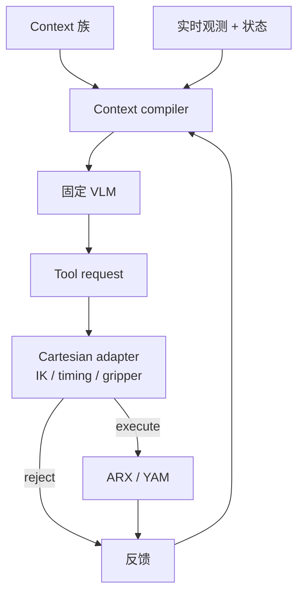
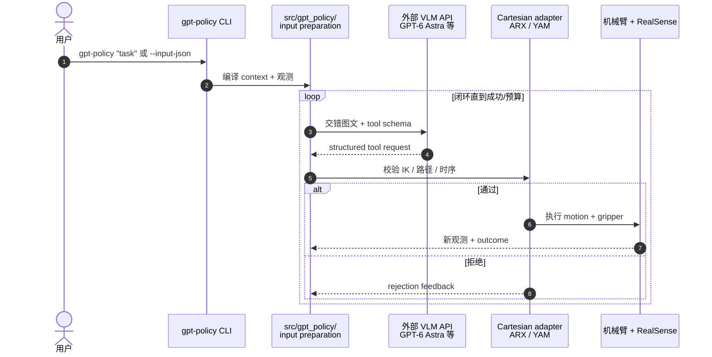

# GPT-Policy：VLM 代理的上下文机器人学习

**GPT-Policy**（*In-Context Robot Learning with VLM Agents*，[arXiv:2609.19138](https://arxiv.org/abs/2609.19138)，[项目页](https://cheng-haha.github.io/GPT-Policy/)，[代码](https://github.com/cheng-haha/GPT-Policy)）由 **Morphi Robot**、**上海创智学院**、**华中科技大学**、**复旦大学** 等联合提出：**固定**通用 **VLM**（主实验 **GPT-6 Astra**）+ **context compiler** + **约束控制器** 闭环；部署时用人/机示范、目标图、自交互历史与人机交互等 **in-context** 信息，**无梯度更新、无 task-specific 参数持久化**。

## 一句话定义

**通用 VLM 当机器人代理：context 编译进 multimodal 输入，tool 请求经 IK/时序校验后执行，反馈再写回下一决策——测的是 ICL 而非微调 VLA。**

## 英文缩写速查

| 缩写 | 英文全称 | 简要说明 |
|------|----------|----------|
| ICL | In-Context Learning | 部署时从示范/反馈学习，不改权重 |
| VLM | Vision-Language Model | GPT-6 Astra 等固定通用模型 |
| IK | Inverse Kinematics | Cartesian adapter 残差校验 |
| HRI | Human-Robot Interaction | 指点、回合、在线修正 context |
| EEF | End-Effector | 工具输出 Cartesian 目标 |
| SR | Success Rate | 项目页三 trials/condition |

## 为什么重要

- **ICL 边界实证：** Human video **无 robot action** 仍提升 towel/notebook；contact-rich 任务 **video + aligned action** 进一步增益。
- **与专用 VLA 分工：** 项目页明确：VLA/WAM 擅 fast low-level；VLM agent 擅 reasoning / adaptation / replanning。
- **链 [GPT 6 Astra 评测](./paper-gpt-6-astra-embodied-policy.md)：** 后者 RoboDojo 定量 benchmark；GPT-Policy 补 **in-context 真机十任务** 与 **五类 context ablation**。
- **已开源 harness：** `gpt-policy` CLI + ARX X5 / I2RT YAM adapter，可换 VLM provider。

## 核心信息

| 项 | 内容 |
|----|------|
| **机构** | Morphi Robot；上海创智学院；华中科技、复旦、上交、港中文等 |
| **主 VLM** | GPT-6 Astra（项目页实验）；可换其他 commercial VLM |
| **硬件** | ARX X5、I2RT/YAM（仓库）；论文 demo 覆盖双臂/移动等 |
| **开源** | **已开源** — [cheng-haha/GPT-Policy](https://github.com/cheng-haha/GPT-Policy) |

## 核心原理（方法）

**五类 context：** Human video；Robot video（± action）；Target image；Self-interaction history；Human–robot interaction。

**闭环：** Context compiler 保留 task-relevant visual transitions → 交错图文 + tool schema → VLM 选一个 structured tool request → Cartesian adapter（pose 采样、IK 残差、joint timing、gripper）→ 执行或 reject → 观测/反馈 append 到下一轮。

### 流程总览

## 源码运行时序图

节点对齐 [`sources/repos/gpt-policy.md`](../../sources/repos/gpt-policy.md)。

- **最短路径：** `pip install -e .` → 编辑 `configs/default.json` → `gpt-policy --check` → `gpt-policy "pick up the red block"`。
- **Context ablation：** 用 `--input-json` 切换五类 reference 组合。

## 工程实践

| 项 | 建议 |
|----|------|
| API 成本 | 每 decision 慢且耗 token — 与 VLA 50 Hz 不可比 |
| Contact 任务 | 优先 **robot video + action**；仅 human video 不够 |
| 安全 | 论文报告 inter-arm collision — 需独立于 VLM 的 hard safety |
| 对照 | [GPT 6 Astra RoboDojo](./paper-gpt-6-astra-embodied-policy.md)；[KINO](./paper-kino.md) keyframe VLM |

## 实验与评测（项目页，GPT-6 Astra，3 trials/condition）

| 任务族 | 要点 |
|--------|------|
| Human video | Pick towel **0→2/3** SR；Notebook **0→2/3** |
| Robot demo | Unscrew cap **video+action 3/3**；Plug **0→2/3**（+action） |
| Target image | T-shape / Fruit **3/3** |
| Self history | Lemon / Exploration **3/3** |
| HRI | Tic-tac-toe / Pointed fruit **3/3** |

## 与其他工作对比

> 下表做**定位对照**：项目页 3 trials/condition 是探索性规模，与下列各页的 benchmark 数字不可横比。

| 对照 | 差异读法 |
|------|----------|
| [GPT 6 Astra 具身策略评测](./paper-gpt-6-astra-embodied-policy.md) | 同一模型的两种问法：那页在 RoboDojo 上做定量 benchmark，GPT-Policy 补真机十任务 + 五类 context 消融。一个测「能力有多少」，一个测「上下文怎么喂才用得上」 |
| [KINO](./paper-kino.md) | 同为 VLM 当高层，**接口粒度不同**：KINO 让 VLM 在预定义 whole-body keyframe 库里选，GPT-Policy 让 VLM 发 structured tool request 再过 IK/时序校验。前者上限被库覆盖卡住，后者被校验器与 latency 卡住 |
| **微调 VLA**（本文要划清界限的对照） | 项目页的分工说法：VLA/WAM 擅 fast low-level，VLM agent 擅 reasoning / adaptation / replanning。GPT-Policy 测的是 **ICL 而非微调**——无梯度更新，也无 task-specific 参数持久化。代价是每决策的 token 与延迟，与 VLA 的 50 Hz 不在同一控制类 |
| [LLM 机器人控制接口](../concepts/llm-robotics-control-interfaces.md) | 该页归纳「语言模型到底输出什么」；GPT-Policy 落在「tool request + 约束适配器」一支，与直接出关节/EEF 的取舍是**可校验性 vs 频率** |
| [Foundation Policy](../concepts/foundation-policy.md) | 该页讨论通用策略的构成；GPT-Policy 提供一个反向读法——通用性可以来自**不训练**，但这把成本从训练期挪到了每一次推理 |

## 结论

**GPT-Policy 表明：固定通用 VLM 已具备可观 in-context 操纵能力，但「计划对」≠「执行稳」——context 质量、IK 校验与 latency 仍是部署瓶颈。**

1. **Human video 可跨 embodiment 迁移部分技能** — 但 contact-rich 仍需 robot action 对齐。
2. **Context compiler 是产品组件** — 不是把视频丢进 prompt 就够。
3. **三 trials/condition 是探索性规模** — 勿 overclaim 模型排名。
4. **开源 harness 降低复现门槛** — VLM 权重/API 仍外部依赖。
5. **与 VLA 混合是合理下一步** — 项目页 Future 指向 fast controller + deliberate agent。

## 局限与风险

- **Decision latency & token 成本** — 不适合 sole low-level 50 Hz 控制。
- **小样本真机** — 10 任务 × 3 trials；无大规模 sim benchmark。
- **安全** — VLM safeguards 不足；需独立 collision / force 监控。
- **模型绑定** — 主表 GPT-6 Astra；换模型需重跑 ablation。

## 关联页面

- [GPT 6 Astra 具身策略评测](./paper-gpt-6-astra-embodied-policy.md)
- [LLM 机器人控制接口](../concepts/llm-robotics-control-interfaces.md)
- [VLA](../methods/vla.md)
- [KINO](./paper-kino.md) — keyframe 式 VLM 规划对照

## 参考来源

- [gpt-policy_arxiv_2609_19138](../../sources/papers/gpt-policy_arxiv_2609_19138.md)
- [GPT-Policy 项目页](../../sources/sites/gpt-policy-cheng-haha-github-io.md)
- [gpt-policy 仓库](../../sources/repos/gpt-policy.md)

## 推荐继续阅读

- [arXiv:2609.19138](https://arxiv.org/abs/2609.19138)
- [项目页实验画廊](https://cheng-haha.github.io/GPT-Policy/#results)
- [GitHub cheng-haha/GPT-Policy](https://github.com/cheng-haha/GPT-Policy)
