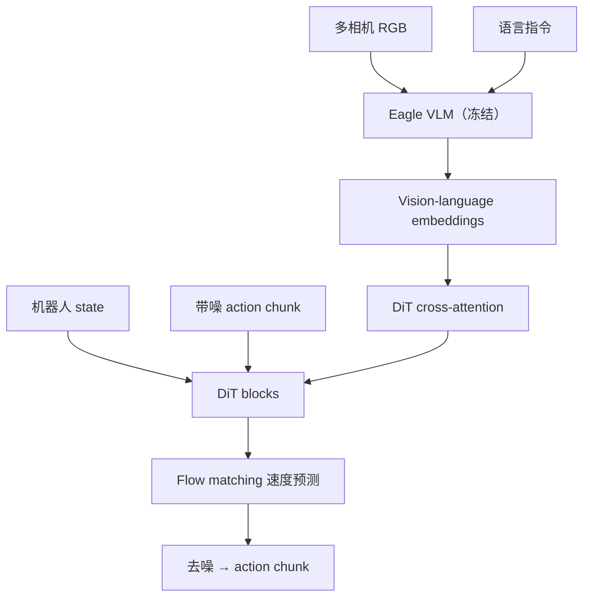
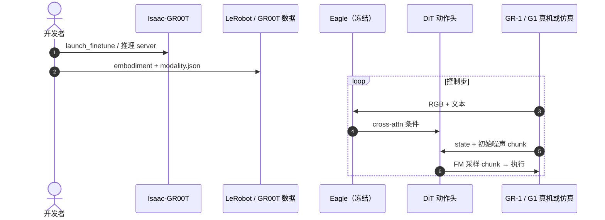

# GR00T N1.5：通用人形 VLA 的改进版

**GR00T N1.5**（*An Improved Open Foundation Model for Generalist Humanoid Robots*，[NVIDIA GEAR 项目页](https://research.nvidia.com/labs/gear/gr00t-n1_5/)，[Isaac-GR00T](https://github.com/NVIDIA/Isaac-GR00T)，[HF GR00T-N1.5-3B](https://huggingface.co/nvidia/GR00T-N1.5-3B)）是 [GR00T N1](./paper-hrl-stack-34-gr00t_n1.md) 的升级版。**截至 2026-09-28 无独立 arXiv 编号**；机制与评测以 GEAR 网页与 Isaac-GR00T 仓库为准。

## 一句话定义

**在 N1 的「VLM + DiT flow-matching action chunk」上，冻结更强 grounding 的 Eagle VLM、简化 adapter，并加 FLARE 未来表征对齐，使人形策略更跟语言、更吃人类视频。**

## 英文缩写速查

| 缩写 | 英文全称 | 简要说明 |
|------|----------|----------|
| VLA | Vision-Language-Action | 视觉–语言–动作策略 |
| VLM | Vision-Language Model | Eagle 系列多模态骨干（N1.5 预训练/微调均冻结） |
| DiT | Diffusion Transformer | 处理 state + 带噪 action 的 Transformer 动作头 |
| FM | Flow Matching | 连续流匹配速度场训练（相对 DDPM 少步采样） |
| FLARE | Future LAtent Representation Alignment | 对齐未来 latent 而非生成像素；助人类视频学习 |
| OXE | Open X-Embodiment | N1.5 预训练混合数据之一 |

## 为什么重要

- **阅读链终点之一：** [扩散 → DiT → Flow → GR00T 纵深路线](../../roadmap/depth-robotics-diffusion-dit-flow.md) 在 [π₀](./paper-pi0.md) 与 [GR00T N1](./paper-hrl-stack-34-gr00t_n1.md) 之后，N1.5 展示 **工业级人形 VLA 迭代**：cross-attention DiT + FM + 数据/损失扩展。
- **工程主线：** 平台实现与微调见 [Isaac GR00T](./isaac-gr00t.md)（仓库后续 GA 以 N1.7 为主，N1.5 权重仍作对照基线）。

## 核心信息

| 项 | 内容 |
|----|------|
| **机构** | NVIDIA GEAR |
| **发布** | 2025-06（GEAR 网页） |
| **架构** | **Eagle VLM**（冻结）→ vision-language embedding → **DiT cross-attention** → **state + noisy actions** → **flow matching 速度预测** → **action chunk** |
| **相对 N1** | VLM **全程冻结**；vision→LLM adapter **简化 + LayerNorm**；预训练加 **FLARE**（系数 0.2） |
| **训练** | 250K steps · 1K H100 · global batch 16384；混合 GR-1、OpenXE、DexMG、DreamGen、AgiBot-Beta 等 |
| **开源** | **已开源** — Isaac-GR00T + HF **GR00T-N1.5-3B** |

## 核心原理

1. **System 2 / System 1 分工**（延续 N1）：VLM 产出语义–视觉 embedding；**System 1 DiT** 在高频控制率下生成 chunk（N1 白皮书为 120Hz 叙事，部署以 Isaac 栈为准）。
2. **Cross-attention 条件：** DiT token 对 VLM embedding 做 cross-attention，再对 **本体 state** 与 **带噪动作序列** 做 flow matching 去噪/速度回归。
3. **FLARE：** 不生成未来帧，而是让模型表征与未来 **target latent** 对齐，使 **人类 ego 视频** 可进入 post-train（项目页：新物体 0-shot 15% → FLARE 后 55%）。
4. **DreamGen：** 神经轨迹扩 verb 覆盖；N1.5 在 12 个新 verb 上 **38.3%** vs N1 **13.1%**（仍非完全 zero-shot verb）。

### 流程总览

## 源码运行时序图

## 与其他工作对比

| 维度 | GR00T N1.5 | [GR00T N1](./paper-hrl-stack-34-gr00t_n1.md) | [π₀](./paper-pi0.md) |
|------|------------|---------------------------------------------|----------------------|
| 动作头 | DiT + **flow matching** | 同族 DiT + FM | **Action Expert** + FM |
| VLM | Eagle **冻结** + FLARE | Eagle 联合训练叙事 | PaliGemma 类 VLM |
| 人形数据 | DreamGen + 人类视频 | 数据金字塔 | 多本体机器人数据 |
| 开源 | Isaac-GR00T + HF 3B | N1-2B + 同仓 | openpi |

## 评测要点（GEAR 网页，相对 N1）

| 基准 / 设置 | GR00T N1 | GR00T N1.5 |
|-------------|----------|------------|
| Language Table（scratch） | 52.8% | 93.2% |
| Sim GR-1 Language（scratch） | 36.4% | 54.4% |
| RoboCasa 30 demos/task | 17.4 | 47.5 |
| 真机 GR-1 语言跟随率 | 46.6% | 93.3% |
| 真机 GR-1 总成功率 | 43.3% | 83.0% |
| G1 1K demos 水果任务 | 44.0% | 98.8% |

## 结论

**GR00T N1.5 把「VLM + Flow-Matching DiT + chunk」推到可感知的人形语言跟随与少样本 post-train，关键是冻结 grounding 更好的 Eagle、FLARE 与 DreamGen 数据。**

- 学完 [π₀](./paper-pi0.md) 的 **Action Expert + FM** 后，用 N1 → N1.5 看 **人形开源栈** 如何把同一范式产品化。
- 与 [Dita](./paper-dita-scaling-diffusion-transformer-vla.md) 对照：Dita 是 **学术通才 VLA + DDPM chunk**；GR00T 是 **人形 foundation + FM DiT 头**。
- 微调与部署勿只读论文页，应跟 [Isaac GR00T](./isaac-gr00t.md) 的 LeRobot 管线与 embodiment tag。
- N1.5 权重适合作为 **语言跟随 / 少样本** 基线；后续 GA 功能以仓库 **N1.7** 分支为准。

## 局限与风险

- **无独立 arXiv**，引用需链 GEAR 页 + 仓库 commit/标签。
- FLARE / DreamGen 依赖 **NVIDIA 内部或 gated 数据混合**，完全复现预训练不现实；工程侧以 **post-train** 为主。
- Flow matching 仍要 **action chunk 异步执行** 才控延迟（与 VLA 部署通用问题相同）。

## 关联页面

- [paper-hrl-stack-34-gr00t_n1](./paper-hrl-stack-34-gr00t_n1.md)
- [isaac-gr00t](./isaac-gr00t.md)
- [depth-robotics-diffusion-dit-flow](../../roadmap/depth-robotics-diffusion-dit-flow.md)

## 参考来源

- [gr00t-n1-5-gear.md](../../sources/sites/gr00t-n1-5-gear.md)
- [gr00t_n1_arxiv_2503_14734.md](../../sources/papers/gr00t_n1_arxiv_2503_14734.md)
- [isaac_gr00t.md](../../sources/repos/isaac_gr00t.md)

## 推荐继续阅读

- [GR00T N1.5 项目页](https://research.nvidia.com/labs/gear/gr00t-n1_5/)
- [HF nvidia/GR00T-N1.5-3B](https://huggingface.co/nvidia/GR00T-N1.5-3B)
