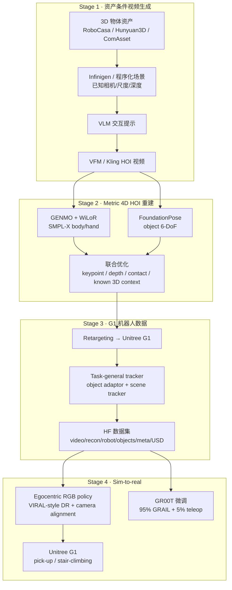
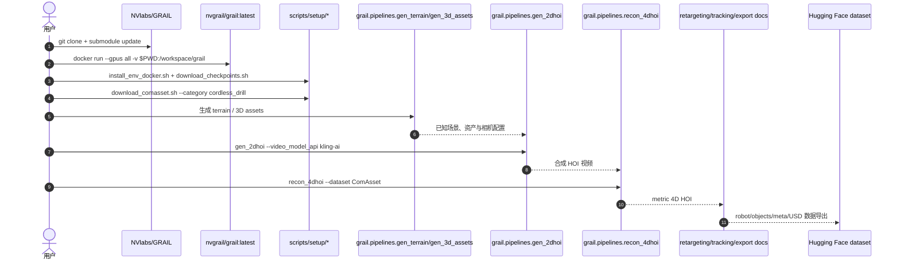

# GRAIL

**GRAIL**（*Generating Humanoid Loco-Manipulation from 3D Assets and Video Priors*，[arXiv:2606.05160](https://arxiv.org/abs/2606.05160)，[项目页](https://research.nvidia.com/labs/dair/grail/)，[NVlabs/GRAIL](https://github.com/NVlabs/GRAIL)）是 NVIDIA 与 UCLA 提出的 **全数字人形 loco-manipulation 数据生成管线**：在虚拟世界中先固定 3D 资产、场景、相机、尺度与机器人比例角色，再调用视频基础模型生成 HOI 视频、重建 metric 4D 轨迹、重定向到 Unitree G1，最终训练 tracker 和 egocentric RGB 策略并部署到真机。

## 一句话定义

GRAIL 用已知 3D 场景约束视频生成，把「生成视频」变成可重建、可重定向、可训练的人形 G1 loco-manipulation 数据工厂。

## 英文缩写速查

| 缩写 | 英文全称 | 简要说明 |
|------|----------|----------|
| GRAIL | Generating Humanoid Loco-Manipulation from 3D Assets and Video Priors | 本文提出的数字数据生成框架 |
| HOI | Human-Object Interaction | 人-物交互；GRAIL 重建 metric 4D HOI |
| VFM | Video Foundation Model | 视频基础模型，用作交互行为先验 |
| VLM | Vision-Language Model | 生成交互提示或语义描述的上游模型 |
| SMPL-X | Skinned Multi-Person Linear Model eXpressive | 4D HOI 重建中的人体参数模型 |
| SONIC | Scalable Online Neural whole-body Integrated Control | G1 task-general tracker 的低层/潜空间基础 |
| USD | Universal Scene Description | 数据集中发布的 OpenUSD 物体资产格式 |
| GR00T | Generalist Robot 00 Technology | GRAIL 数据可作为 GR00T 微调混合数据 |

## 为什么重要

- **避开野外视频重建的根本歧义。** GRAIL 不从未知真实视频里反推相机、尺度、物体与接触，而是在生成前就知道 3D 资产、场景、相机和机器人比例，使 VFM 只提供交互先验。
- **把生成式补数落到机器人可执行轨迹。** 生成视频经过 GENMO / WiLoR / FoundationPose 和特权 3D 优化后，继续重定向、tracker 后处理与 egocentric policy 训练，不停在视觉 demo。
- **规模可观。** 项目页报告 **20,000+** 序列，覆盖 pick-up、whole-body manipulation、sitting、stair / slope / curb 等 object-centric 与 scene-centric 能力。
- **真机闭环验证。** 仅用 GRAIL 生成数据训练的视觉策略部署到 Unitree G1，项目页展示 real-world pick-up 与 stair-climbing；论文/source 摘录记录 pick-up **84%**、stair-climbing **90%**。
- **开放数据和代码。** [NVlabs/GRAIL](https://github.com/NVlabs/GRAIL) 提供 Docker、pipeline entrypoints、checkpoint 下载脚本和文档；[Hugging Face 数据集](https://huggingface.co/datasets/nvidia/PhysicalAI-Robotics-Locomanipulation-GRAIL) 发布约 250 GB 数据。
- **多地图交叉。** 它同时属于 [Loco-Manip 161 #061](../overview/loco-manip-161-category-03-visuomotor.md)、[运动小脑 H 真实任务](../overview/motion-cerebellum-category-08-real-tasks.md) 与 [接触分类 03：生成式补数](../overview/loco-manip-contact-category-03-generative-data.md)。

## 流程总览

## 核心机制（详细）

### 1. 资产条件 4D HOI 生成

GRAIL 的核心选择是 **在生成前固定物理上下文**。给定物体、场景、相机和机器人比例角色后，Blender 渲染首帧，VLM 生成交互提示，VFM 生成静态相机 HOI 视频。这样一来，视频中的尺度、相机内外参、环境深度和物体几何都有 ground truth 约束，后续重建不需要完全从像素猜测物理世界。

这与 VideoMimic / HumanX 一类真实视频路线互补：真实视频更贴近世界分布，但 4D 重建歧义大；GRAIL 牺牲真实采集，换取可控、可扩展、可监督的数据生产。

### 2. 交互感知 4D 重建

生成视频进入多模型重建：

- **GENMO**：估计人体 SMPL-X body；
- **WiLoR**：细化双手姿态；
- **FoundationPose**：跟踪物体 6-DoF；
- **联合优化**：结合 2D keypoint、投影、深度、接触和已知 3D 配置恢复 metric 4D HOI。

因为场景/物体/相机已知，优化目标能惩罚不合理深度和接触，而不是只做视觉拟合。这是生成视频能转成机器人数据的关键。

### 3. Retargeting 与 task-general tracking

重建得到的人体/物体轨迹还不是 G1 可执行轨迹。GRAIL 将其重定向到 Unitree G1，并在预训练 [SONIC](../methods/sonic-motion-tracking.md) 全身控制器之上训练两类 tracker：

| Tracker | 任务侧重 | 输入/调制 |
|---------|----------|-----------|
| Object-aware latent adaptor | pick-up / manipulation | 物体状态调制 latent token 与手部动作 |
| Scene-aware tracker | sitting / stair / slope / curb | 地形 height-map / 场景条件微调控制器 |

发布数据中的 `robot/` 与 `objects/` 是 post-RL 后的物理可行 G1/物体轨迹，而不只是 kinematic retarget 结果。

### 4. Egocentric visual sim-to-real

GRAIL 还渲染头部第一视角 RGB，把生成轨迹转成视觉策略训练数据。论文叙事与 [VIRAL](./paper-viral-humanoid-visual-sim2real.md) 共享视觉 sim-to-real 思路：域随机化、相机对齐、egocentric 观测训练，然后部署到真实 G1。

项目页还展示了作为 [GR00T](./paper-hrl-stack-34-gr00t_n1.md) 微调数据的混合方案：**95% GRAIL + 5% teleoperation**，比纯遥操作减少「卡在目标附近」等失败。

### 5. 公开数据集结构

[GRAIL Loco-Manipulation Dataset](./grail-locomanipulation-dataset.md) 每条运动包含：

| 路径 | 内容 |
|------|------|
| `video/` | 源合成 HOI 视频 |
| `recon/` | SMPL-X + object 6-DoF 的 4D HOI 重建 |
| `robot/` | G1 post-RL 轨迹 |
| `objects/` | post-RL 物体 6-DoF |
| `meta/` | 长度、接触标志、源 ID |
| `object_usd/` | OpenUSD 物体资产 |

当前 HF 页面记录的发布类别含 `pickup_table`、`pickup_ground`、`sitting`、`slope`、`curb`、`stair`；README TODO 仍标注 manipulation dataset 待完整释放。

## 评测与结果

GRAIL 的评测重点在「生成数据能否规模化、能否落到真机可执行策略」，而非单一算法指标：

- **数据规模与覆盖：** 项目页 / 论文报告 **20,000+** 序列（HF 发布约 **22k** 条 G1 post-SONIC 轨迹，约 250 GB），覆盖 pick-up（table / ground）、whole-body manipulation、sitting、slope、curb、stair 等 object-centric 与 scene-centric 能力。
- **真机闭环成功率：** 仅用 GRAIL 生成数据训练 egocentric RGB 策略并部署到 Unitree G1，论文 / source 记录 **pick-up 84%**、**stair-climbing 90%**。
- **作为微调混合数据：** 以 **95% GRAIL + 5% 遥操作** 混合微调 [GR00T](./paper-hrl-stack-34-gr00t_n1.md)，抓取成功率优于纯遥操作，并减少「卡在目标附近」类失败。
- **重建质量兜底：** metric 4D HOI 依赖 GENMO / WiLoR / FoundationPose 与已知 3D 上下文的联合优化，接触/深度不合理项被惩罚；`robot/` 与 `objects/` 为 post-RL 物理可行轨迹，而非纯 kinematic retarget。

> 以上为论文 / 项目页 / HF 数据集口径的索引级指标；完整设定与消融以 [arXiv:2606.05160](https://arxiv.org/abs/2606.05160) 为准。

## 源码运行时序图

官方仓库 [NVlabs/GRAIL](https://github.com/NVlabs/GRAIL) 可运行，README 提供 Docker 镜像、环境安装、checkpoint / asset 下载与 `python -m grail.pipelines.*` 入口。

## 工程实践（含开源状态）

| 项 | 结论 |
|----|------|
| 项目页 | <https://research.nvidia.com/labs/dair/grail/> |
| 官方代码 | <https://github.com/NVlabs/GRAIL>，公开仓库；GitHub API 显示默认分支 `main`，2026-07-22 有更新 |
| 文档 | <https://nvlabs.github.io/GRAIL/> |
| 数据集 | <https://huggingface.co/datasets/nvidia/PhysicalAI-Robotics-Locomanipulation-GRAIL> |
| 快速开始 | Docker `docker.io/nvgrail/grail:latest`；`scripts/setup/install_env_docker.sh`、`download_checkpoints.sh`、`download_comasset.sh` |
| Pipeline 入口 | `python -m grail.pipelines.gen_terrain`、`gen_3d_assets`、`gen_2dhoi`、`recon_4dhoi` |
| 外部凭据 | README 提到 `.env` 可含 `OPENAI_API_KEY`、`KLING_*`、`HF_TOKEN` |
| 许可证 | NVIDIA License；README 明确非商业使用限制，第三方组件另遵许可 |
| 待发布边界 | README TODO：quick-start demo script、GRAIL manipulation dataset 尚未全部完成 |

## 与其他工作对比

| 维度 | GRAIL | 真实视频重建（VideoMimic / HumanX 类） | 遥操作 / 动捕采集 | 纯视觉 demo 生成 |
|------|-------|------------------------------------------|--------------------|-------------------|
| 数据来源 | **资产条件的生成视频**（已知 3D / 相机 / 尺度） | 野外真实视频 | 真人遥操作或穿戴动捕 | VFM 直接生成视频 |
| 3D / 尺度 / 接触歧义 | 生成前固定物理上下文，歧义小 | 反推歧义大 | 无歧义但采集贵 | 未解决，停在视觉层 |
| 规模化 | 可控、可扩展、可监督 | 受真实素材与重建难度限制 | 难规模化 | 可规模化但不可执行 |
| 真实分布贴合 | 牺牲真实采集换可重建性 | **最贴近真实分布** | 贴近真实但样本少 | 视觉合理≠物理一致 |
| 机器人可执行性 | retarget + SONIC tracker 后处理为 G1 可执行轨迹 | 需额外落地处理 | 直接可执行 | 无机器人轨迹 |

## 局限与风险

- **生成模型 API 依赖强。** 2D HOI 生成依赖 Kling / VFM 等外部服务，复现受 API、额度、版本漂移影响。
- **非商业许可证限制。** 官方代码是 NVIDIA License，不能简单按 Apache/MIT 复用。
- **manipulation 数据仍有待发布边界。** HF 已有多类 G1 轨迹，但 README TODO 仍标注 manipulation dataset 未完全释放。
- **不是万能真实视频学习。** GRAIL 用可控虚拟世界换可重建性；对真实开放场景、未知物体和人类行为分布仍需 domain gap 处理。
- **低层能力依赖 SONIC / tracker。** 数据生成质量最终受全身 tracker 可执行性限制，不是所有生成 HOI 都能保真落到 G1。
- **接触物理仍由重建与仿真筛选兜底。** VFM 可能生成视觉合理但物理不一致的交互，必须经 4D 优化、retargeting 和 tracker 过滤。

## 关联页面

- [Loco-Manip 161 篇技术地图](../overview/humanoid-loco-manip-161-papers-technology-map.md) 与 [03 视觉感知驱动](../overview/loco-manip-161-category-03-visuomotor.md) — GRAIL 是 #061/161。
- [运动小脑技术地图](../overview/humanoid-motion-cerebellum-technology-map.md) 与 [H 真实任务](../overview/motion-cerebellum-category-08-real-tasks.md) — GRAIL 是 #57/64。
- [Loco-Manip 接触分类 03：生成式补数](../overview/loco-manip-contact-category-03-generative-data.md) — GRAIL 所属接触横切面。
- [Loco-Manipulation](../tasks/loco-manipulation.md) — 任务背景。
- [SONIC](../methods/sonic-motion-tracking.md) — G1 task-general tracker 基础。
- [Unitree G1](./unitree-g1.md) — 论文硬件平台。
- [VIRAL](./paper-viral-humanoid-visual-sim2real.md) — egocentric visual sim-to-real 对照。
- [GR00T N1](./paper-hrl-stack-34-gr00t_n1.md) — GRAIL 数据微调对象。
- [VideoMimic](./videomimic.md) — 真实视频路线对照。
- [GRAIL Loco-Manipulation Dataset](./grail-locomanipulation-dataset.md) — 公开数据集实体页。

## 参考来源

- [grail_arxiv_2606_05160.md](../../sources/papers/grail_arxiv_2606_05160.md)
- [grail-project.md](../../sources/sites/grail-project.md)
- [grail_nvlabs.md](../../sources/repos/grail_nvlabs.md)
- [grail-locomanipulation-huggingface.md](../../sources/sites/grail-locomanipulation-huggingface.md)
- [loco_manip_161_survey_061_grail.md](../../sources/papers/loco_manip_161_survey_061_grail.md)
- [motion_cerebellum_survey_57_grail.md](../../sources/papers/motion_cerebellum_survey_57_grail.md)
- [wechat_embodied_ai_lab_loco_manip_contact_survey.md](../../sources/blogs/wechat_embodied_ai_lab_loco_manip_contact_survey.md)
- Xie et al., *GRAIL: Generating Humanoid Loco-Manipulation from 3D Assets and Video Priors*, arXiv:2606.05160, 2026. <https://arxiv.org/abs/2606.05160>

## 推荐继续阅读

- [GRAIL 项目页](https://research.nvidia.com/labs/dair/grail/)
- [NVlabs/GRAIL](https://github.com/NVlabs/GRAIL)
- [GRAIL Docs](https://nvlabs.github.io/GRAIL/)
- [GRAIL 数据集](https://huggingface.co/datasets/nvidia/PhysicalAI-Robotics-Locomanipulation-GRAIL)
- [Loco-Manip 接触技术地图](../overview/loco-manip-contact-technology-map.md)
