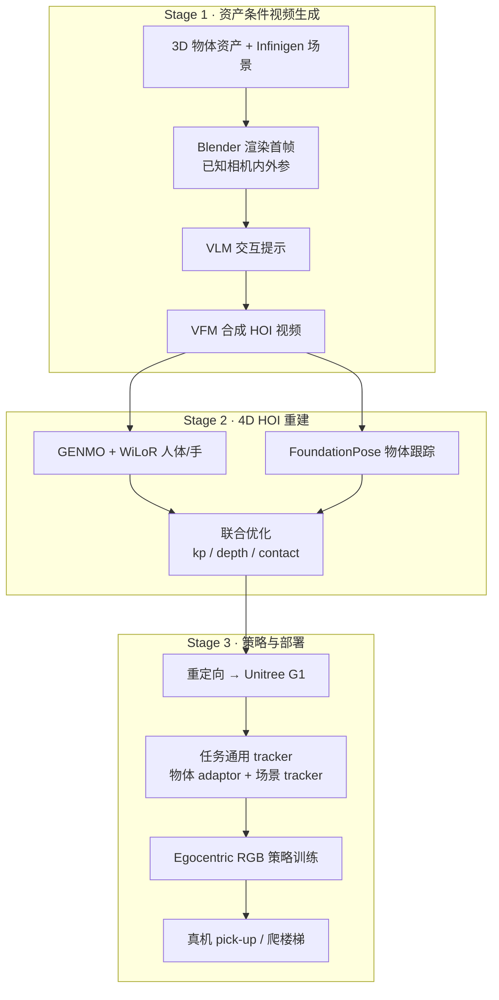

# GRAIL

**GRAIL**（*Generating Humanoid Loco-Manipulation from 3D Assets and Video Priors*，[arXiv:2606.05160](https://arxiv.org/abs/2606.05160)，[项目页](https://research.nvidia.com/labs/dair/grail/)，[NVlabs/GRAIL](https://github.com/NVlabs/GRAIL)）是 **NVIDIA** 与 **UCLA** 提出的 **全数字人形 loco-manipulation 数据生成管线**：在部署前保持完全虚拟——组合 3D 资产、仿真就绪场景与 **视频基础模型（VFM）** 先验合成交互，无需反复搭建物理场景或遥操作机器人；重建的 4D HOI 轨迹重定向到 **Unitree G1** 后训练互补 **任务通用 tracker**，并仅用生成数据完成 **egocentric 视觉策略 sim-to-real** 验证。

## 英文缩写速查

| 缩写 | 英文全称 | 简要说明 |
|------|----------|----------|
| GRAIL | Generating Humanoid Loco-Manipulation from 3D Assets and Video Priors | 本文提出的全数字 loco-manip 数据生成框架 |
| HOI | Human-Object Interaction | 人-物交互；本文重建 metric 4D HOI 轨迹 |
| VFM | Video Foundation Model | 视频基础模型，用作交互行为先验 |
| Loco-Manip | Loco-Manipulation | 行走与操作动力学耦合的全身任务 |
| WBC | Whole-Body Control | 协调全身关节满足多任务/约束的控制层 |

## 为什么重要

- **数据瓶颈切口清晰：** 遥操作/动捕质量高但难规模化；野外视频重建 4D 又面临相机、尺度、形态与接触歧义。GRAIL 在 **生成视频之前** 就固定物体几何、相机参数、metric 尺度、环境深度与 **机器人比例角色**，把 VFM 当 **交互先验** 而非「事后猜场景」。
- **规模与覆盖：** 生成 **20,000+** 序列，横跨 pick-up（桌面/地面）、全身操作、sitting、楼梯/坡道/路缘等 **物体中心 + 场景中心** 两类能力块。
- **闭环真机验证：** 仅用 GRAIL 数据训练 egocentric RGB 策略，在 **Unitree G1** 上达到 pick-up **84%**、stair-climbing **90%** 真机成功率；并展示 **95% GRAIL + 5% 遥操作** 混合微调 GR00T 优于纯遥操作。
- **公开数据集：** [GRAIL Loco-Manipulation Dataset](./grail-locomanipulation-dataset.md) 在 Hugging Face 发布 **~22k** 条 G1 物理可行轨迹（video + 4D recon + robot/objects pkl + USD），与论文 sim-to-real 实验同源。
- **双地图坐标：** 同时出现在 [Loco-Manip 161 篇 #061/161](../overview/loco-manip-161-category-03-visuomotor.md) 与 [运动小脑 64 篇 #57/64](../overview/motion-cerebellum-category-08-real-tasks.md)；本页为合并后的 **单一 canonical 实体**。

## 核心信息（索引级）

| 字段 | 内容 |
|------|------|
| Loco-Manip 161 | #061/161 · 03 视觉感知驱动的人形移动操作 |
| 运动小脑 64 | #57/64 · H 真实任务 |
| 机构 | NVIDIA、UCLA |
| arXiv | [2606.05160](https://arxiv.org/abs/2606.05160) |
| 项目页 | [research.nvidia.com/labs/dair/grail/](https://research.nvidia.com/labs/dair/grail/) |
| 代码 | [github.com/NVlabs/GRAIL](https://github.com/NVlabs/GRAIL) |
| 公开数据集 | [PhysicalAI-Robotics-Locomanipulation-GRAIL](https://huggingface.co/datasets/nvidia/PhysicalAI-Robotics-Locomanipulation-GRAIL)（~22k 运动 / 250 GB） |

## 核心机制（提炼）

1. **资产条件 4D HOI 生成：** Infinigen 构建场景 → 机器人比例角色与物体刚性仿真落稳 → Blender 渲染首帧（已知内外参）→ VLM 生成交互提示 → VFM 合成静态相机 HOI 视频。
2. **交互感知重建：** GENMO 估计身体、WiLoR  refine 双手、FoundationPose 跟踪物体；在特权 3D 配置下联合优化关键点、投影、深度与接触损失，输出 metric 4D HOI。
3. **任务通用 tracker：** 重定向到 G1 后，在预训练 [SONIC](../methods/sonic-motion-tracking.md) 全身控制器上训练两类互补策略——**物体感知 latent adaptor**（操作，调制 latent token + 手部动作）与 **场景感知 tracker**（地形/坐姿，微调控制器 + height-map encoder）。
4. **Sim-to-real 视觉策略：** 渲染 egocentric RGB 训练视觉策略（[VIRAL](../entities/paper-viral-humanoid-visual-sim2real.md) 管线 + 域随机化与相机对齐），闭环部署 G1 pick-up 与爬楼梯；亦可作为 [GR00T](../entities/paper-loco-manip-161-148-gr00t-n1.md) 微调数据。

## 流程总览

## 实验与评测（摘要）

| 维度 | 主要结论 |
|------|----------|
| **数据规模** | 20,000+ 序列；pick-up、全身操作、sitting、地形遍历 |
| **真机 pick-up** | 仅用 GRAIL 数据训练的 egocentric RGB 策略：**84%** 成功率 |
| **真机爬楼梯** | 同上：**90%** 成功率 |
| **GR00T 混合微调** | 95% GRAIL + 5% 遥操作优于纯遥操作；减少「卡住不到达目标」 |

## 常见误区或局限

- **不是野外视频直接重建：** 与 DAViD、ZeroHSI 等「先生成再猜场景」路线不同，GRAIL 强依赖 **生成前已知的 3D 配置**；换未知真实场景仍需额外对齐。
- **策展误分类提醒：** 早期 Loco-Manip 161 策展条目曾将其归入「扩散/流匹配策略」叙事，与原文 **数据生成 + tracker + sim-to-real** 主线不符；以 arXiv/项目页为准。
- **底层 tracker 依赖 SONIC：** 操作与地形能力建立在预训练全身控制器之上，不是从零学 WBC。
- **与 VideoMimic / HumanX 的分工：** 后者侧重从第三人称/单目/egocentric **真实视频** 学策略；GRAIL 解决 **上游机器人可执行参考数据** 的规模化供给。

## 与其他页面的关系

- Loco-Manip 地图：[humanoid-loco-manip-161-papers-technology-map](../overview/humanoid-loco-manip-161-papers-technology-map.md)、[03 视觉感知驱动](../overview/loco-manip-161-category-03-visuomotor.md)
- 运动小脑地图：[humanoid-motion-cerebellum-technology-map](../overview/humanoid-motion-cerebellum-technology-map.md)、[H 真实任务](../overview/motion-cerebellum-category-08-real-tasks.md)
- 低层控制：[SONIC](../methods/sonic-motion-tracking.md)、[Unitree G1](./unitree-g1.md)
- 视觉 sim-to-real 姊妹篇：[VIRAL](./paper-viral-humanoid-visual-sim2real.md)、[VideoMimic](./videomimic.md)
- 公开轨迹集：[GRAIL Loco-Manipulation Dataset](./grail-locomanipulation-dataset.md)

## 推荐继续阅读

- [GRAIL 项目页](https://research.nvidia.com/labs/dair/grail/)
- [arXiv:2606.05160](https://arxiv.org/abs/2606.05160)
- [NVlabs/GRAIL](https://github.com/NVlabs/GRAIL)
- [GRAIL 数据集（Hugging Face）](https://huggingface.co/datasets/nvidia/PhysicalAI-Robotics-Locomanipulation-GRAIL)
- [Loco-Manipulation 任务页](../tasks/loco-manipulation.md)

## 参考来源

- [grail_arxiv_2606_05160.md](../../sources/papers/grail_arxiv_2606_05160.md) — arXiv / 项目页深读策展
- [grail_nvlabs.md](../../sources/repos/grail_nvlabs.md) — 官方代码仓
- [grail-locomanipulation-huggingface.md](../../sources/sites/grail-locomanipulation-huggingface.md) — Hugging Face 公开数据集
- [loco_manip_161_survey_061_grail.md](../../sources/papers/loco_manip_161_survey_061_grail.md) — Loco-Manip 161 策展摘录
- [motion_cerebellum_survey_57_grail.md](../../sources/papers/motion_cerebellum_survey_57_grail.md) — 运动小脑 64 策展摘录
