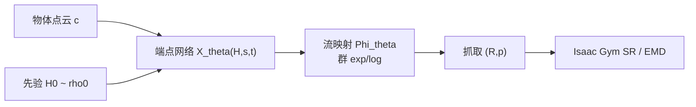

# GraspMF：积群 MeanFlow 快速生成抓取

**GraspMF**（*Fast Generative Grasping via Lie Group-Constrained MeanFlow*；[arXiv:2608.26076](https://arxiv.org/abs/2608.26076)，普渡大学 Purdue CS）把平行夹爪抓取合成建成 **物体条件的多模态分布**，在乘积李群 $\mathcal{G}=\mathrm{SO}(3)\times\mathbb{R}^3$ 上训练 **Lie Group-constrained MeanFlow**：**半群（flow-map）一致性** 负责少步采样稳定，**黎曼 Conditional Flow Matching** 在对角 $t=s$ 锚定数据速度场。ACRONYM 仿真与 **Franka Research 3** 真机均报告 **毫秒级、≤5 次网络评估（NFE）** 即可对齐 SE3Dif / EquiGraspFlow 等扩散–流基线的成功率与分布覆盖。

## 一句话定义

**在 SO(3)×R³ 积群上用端点 MeanFlow + 半群一致性学抓取分布，把生成式抓取的 NFE 从百步量级压到 1–5 步，同时保持 ACRONYM 上的 SR/EMD 与真机可部署延迟。**

## 英文缩写速查

| 缩写 | 英文全称 | 简要说明 |
|------|----------|----------|
| GraspMF | Grasp MeanFlow | 本文在 $\mathcal{G}=\mathrm{SO}(3)\times\mathbb{R}^3$ 上的实现短名 |
| MeanFlow | Mean Flow / average velocity field | 预测区间平均速度，支持少步传输 |
| CFM | Conditional Flow Matching | 对角锚定，把平均速度对齐边际速度场 |
| NFE | Network Function Evaluations | 采样一步的网络前向次数 |
| SR | Success Rate | Isaac Gym 执行 open→close→lift→shake 成功率 |
| EMD | Earth Mover's Distance | 生成分布相对 GT 抓取姿态的覆盖距离 |
| SDF | Signed Distance Field | 辅助几何回归（SE3Dif 系骨干） |
| ID / OOD | In-domain / Out-of-domain | ACRONYM 形状类别内/外划分 |

## 为什么重要

- **生成抓取的质量–延迟矛盾：** 扩散与 flow 在 SE(3)/积群上能覆盖多模态，但 SE3Dif、VSIGD 等需 **~140 NFE**、百毫秒到秒级延迟，难支撑闭环重规划。
- **流形约束 + 少步 MeanFlow 首次在抓取上系统验证：** 相对欧氏 MeanFlow 蒸馏，本文在 **积群** 上联合 **代数半群约束** 与 **黎曼 CFM**，避免高方差微分项；T=5 即 **ID SR 87.40% / OOD 71.73%**，延迟 **15.5 ms**（RTX 5080，每物体 batch 100）。
- **真机零微调：** 腕部 RGB-D 噪声下，Franka 上三 household 物体 **9/10、9/10、10/10**（T=5），无需额外域适应。
- **与导航 MeanFlow 对照：** [RoamFlow](./paper-roamflow.md) 把 MeanFlow 用于 image-goal **轨迹**；GraspMF 用于 **6-DoF 抓取位姿**，共享「平均速度少步 + 任务几何约束」叙事，但流形与训练目标不同。

## 核心信息

| 项 | 内容 |
|----|------|
| **机构** | 普渡大学（Purdue University）计算机科学系 |
| **抓取表示** | $(R,p)\in \mathrm{SO}(3)\times\mathbb{R}^3$（旋转 + 接触/接近点） |
| **训练数据** | **ACRONYM** 网格与专家抓取；10 类形状 ID/OOD 协议 |
| **仿真评测** | **Isaac Gym**；SR + EMD |
| **真机** | Franka Research 3 + Franka Hand + Orbbec Femto Mega RGB-D |
| **开源** | **确认未开源**（截至 2026-09-13：无项目页、无 GitHub/HF） |

## 流程总览

### 训练目标（双项）

1. **Flow-matching 锚定：** $t=s$ 时 $\bar u_\theta(H,s,s)$ 对齐黎曼 CFM 边际速度，保证分布锚定。
2. **半群一致性：** $\Phi_\theta(H_s,s,t)=\Phi_\theta(\Phi_\theta(H_s,s,r),r,t)$ 的代数恒等式，纯前向 exp/log，稳定少步。

辅助 **SDF 回归** 与 **半群权重退火**、旋转 **SVD 投影** 为 ablation 验证的关键工程项。

## 工程实践

| 项 | 建议 |
|----|------|
| 源码运行时序图 | **不适用**（无官方可运行代码） |
| 何时读本文 | 需要 **多模态抓取采样** 且 **延迟预算 <20 ms** 的生成式管线设计 |
| 流形选择 | 旋转必须在 **SO(3)**（或积群因子）上 MeanFlow，勿在欧拉角/无约束 9D 矩阵上直接少步 |
| 骨干 | 网络设计继承 **SE3Dif** 轻量骨干；延迟优势来自 MeanFlow 公式而非更大模型 |
| 部署 | 论文真机 **无微调** 直接 ACRONYM 训练权重；仍需手眼标定与碰撞/IK 过滤 |
| 复现边界 | 未开源；工程对照可跑 ACRONYM 上已开源 **SE3Dif / EGF** 栈，GraspMF 作 SR–latency Pareto 参考 |

## 实验与评测

### 仿真（ACRONYM · T=5）

| 方法 | ID SR | OOD SR | OOD EMD | NFE | 延迟量级 |
|------|-------|--------|---------|-----|----------|
| SE3Dif | — | — | — | 140 | ~高 |
| VSIGD | — | — | — | 140 | ~1124 ms |
| EGF | — | — | — | 80 | ~188 ms |
| **GraspMF** | **87.40%** | **71.73%** | **0.4191** | **5** | **15.5 ms** |
| GraspMF T=1 | 81.11% | 66.34% | 0.4218 | 1 | 6.3 ms |

（表中「—」处基线 SR/EMD 见论文 Table I；GraspMF 在 ID/OOD SR 均为最高。）

### 真机 Table V（每物体 10 次 · T=5）

| 物体 | Black Mug | Red Mug | Gray Bowl |
|------|-----------|---------|-----------|
| **GraspMF** | **9/10** | **9/10** | **10/10** |
| SE3Dif (T=70) | 3/10 | 6/10 | 2/10 |
| BRIDGE (T=40) | 10/10 | 8/10 | 7/10 |
| EGF (T=20) | 10/10 | 8/10 | 10/10 |
| VSIGD (T=70) | 6/10 | 9/10 | 9/10 |

## 结论

**GraspMF 说明：抓取生成的实时性不必靠蒸馏压缩多步扩散，而应在正确的积群流形上用 MeanFlow 原生少步 + 半群代数约束把质量拉回来。**

1. **NFE 是部署主指标** — 5 NFE 对 140 NFE 约 **39×** 加速，SR 仍领先或持平最强扩散/流基线。
2. **流形不是装饰** — SO(3)×R³ 积群 + 群 exp/log 是半群约束可纯代数化的前提。
3. **T=1 仍可用** — 6.3 ms 下单步 ID SR 81% 级，适合高频 replanning。
4. **覆盖不塌缩** — EMD 与可视化均显示多抓取模态保留。
5. **真机可迁移** — 零微调上 Franka；部分观测 raycast 实验仍稳健。
6. **复现等官方 release** — 入库日无代码；勿与 [AnyGrasp](../entities/anygrasp.md) 等 SDK 混淆（判别/稠密检测 vs 生成式分布）。

## 局限与风险

- **确认未开源**，无法核对 SDF 权重、半群退火与 Isaac Gym 协议细节。
- 评测以 **ACRONYM 单物体平行夹爪** 为主，与 clutter 场景 [GraspNet](../methods/grasp-pose-estimation.md) / [AnyGrasp](../entities/anygrasp.md) 栈任务设定不同。
- 积群 $\mathrm{SO}(3)\times\mathbb{R}^3$ 未显式建模 **夹爪开度**（7-DoF）；与完整 SE(3)+width 参数化有差距。
- 真机仅 3 个 household 物体、各 10 次，统计有限。

## 与其他工作对比

| 对照对象 | 采样机制与 NFE | 与 GraspMF 的差异 |
|----------|---------------|------------------|
| **SE3Dif** | SE(3) 扩散，**140 NFE** | 同骨干谱系；GraspMF 用 MeanFlow 原生少步把 NFE 压到 **5**（约 39×），真机 T=5 反超 SE3Dif T=70（9/10 vs 3/10 等） |
| **EquiGraspFlow（EGF）** | SE(3) 等变 flow matching，**80 NFE / ~188 ms** | EGF 的杠杆是**等变性**，GraspMF 的杠杆是**半群一致性 + 积群约束**；真机两者相当（EGF 10/8/10），差距主要在延迟（15.5 ms vs ~188 ms） |
| **VSIGD** | **140 NFE / ~1124 ms** | 延迟高两个数量级；GraspMF 在 ID/OOD SR 上均最高，是本页 SR–latency Pareto 的主要论据 |
| **[RoamFlow](./paper-roamflow.md)** | MeanFlow 用于 image-goal **轨迹** | 共享「平均速度少步 + 任务几何约束」叙事，但流形与训练目标不同：GraspMF 在 $\mathrm{SO}(3)\times\mathbb{R}^3$ 上出 **6-DoF 位姿** |
| **[AnyGrasp](../entities/anygrasp.md) / [GraspNet](../methods/grasp-pose-estimation.md) 栈** | 判别式稠密检测，clutter 场景 SDK | 任务设定不同：本文是**单物体生成式分布**（多模态覆盖 + EMD），不出 clutter 场景排序；且**确认未开源**，工程复现仍走 SE3Dif / EGF |
| **[MANGO-Grasp](./paper-mango-grasp.md)** | 灵巧手跨手型抓取 | 表示维度不同（多指 vs 平行夹爪）；GraspMF 的积群未显式建模夹爪开度，扩到多指需重设参数化 |

## 关联页面

- [抓取位姿估计](../methods/grasp-pose-estimation.md) — 判别/稠密检测谱系；本文属 **生成式分布** 支路
- [李群与刚体旋转](../formalizations/lie-group-rigid-body-motions.md) — SO(3)/SE(3) 与 exp/log 优化链路
- [黎曼流形与切空间](../formalizations/riemannian-manifold-tangent-space.md) — CFM 与切空间训练的一般框架
- [RoamFlow](./paper-roamflow.md) — MeanFlow 在 image-goal 导航上的对照
- [MANGO-Grasp](./paper-mango-grasp.md) — 灵巧手跨手型抓取（不同任务与表示）
- [Manipulation](../tasks/manipulation.md) — 操作任务总览

## 参考来源

- [GraspMF 论文摘录](../../sources/papers/graspmf_arxiv_2608_26076.md)
- [arXiv:2608.26076](https://arxiv.org/abs/2608.26076)

## 推荐继续阅读

- SE(3)-DiffusionFields（SE3Dif）— 本文主要扩散对照
- EquiGraspFlow（EGF）— SE(3) 等变 flow matching 对照
- Woo et al. — 黎曼 MeanFlow / 半群一致性（蛋白质骨架；本文抓取实例）
