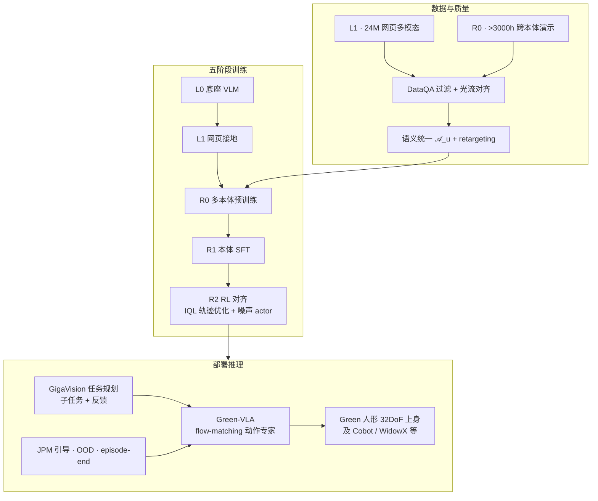

---

type: entity
tags: [paper, vla, humanoid, multi-embodiment, flow-matching, behavior-cloning, reinforcement-learning, manipulation, bimanual, data-curation, sber-robotics, google]
status: complete
updated: 2026-07-08
arxiv: "2602.00919"
related:
  - ../methods/vla.md
  - ../methods/behavior-cloning.md
  - ../methods/diffusion-policy.md
  - ../methods/action-chunking.md
  - ../tasks/manipulation.md
  - ../tasks/teleoperation.md
  - ../concepts/foundation-policy.md
  - ../formalizations/foundation-policy-alignment.md
  - ./xiaomi-robotics-0.md
  - ./qwen-vla.md
  - ./paper-rove-humanoid-vla-intervention.md
  - ./paper-legs-embodied-gaussian-splatting-vla.md
sources:
  - ../../sources/papers/greenvla_arxiv_2602_00919.md
  - ../../sources/repos/greenvla.md
  - ../../sources/sites/greenvla-github-io.md
summary: "Green-VLA（arXiv:2602.00919，Sber Robotics Center）五阶段 VLA：L0 底座 VLM→L1 网页接地→R0 多本体预训练→R1 本体 SFT→R2 保守 RL；DataQA+64 维语义统一动作+flow-matching 专家；Green 人形 32 DoF 上身零样本跨本体部署，R0 即超 π₀ 等基线，R2 在 WidowX 上较 R1 +24% 绝对成功率。"
---

# Green-VLA：分阶段通才 VLA 与人形部署

**Green-VLA** 是 Sber Robotics Center 提出的 **分阶段 Vision–Language–Action 框架**（arXiv:[2602.00919](https://arxiv.org/abs/2602.00919)，[项目页](https://greenvla.github.io/)，[代码](https://github.com/greenvla/GreenVLA)）：在 **约 3000 小时** 跨本体机器人演示（少于 π₀ 的 >10k h）与 **24M** 网页多模态样本上，用 **DataQA 质量过滤**、**语义统一动作空间**、**五阶段课程** 与 **保守 R2 RL 对齐**，把单一 flow-matching 策略部署到 **Green 人形上身 32 DoF**、双臂 Cobot、WidowX 与 Google Robot，并在 Simpler / CALVIN / 电商货架等基准上报告 **R0 即超多项 foundation policy、R2 进一步拉开长程差距**。

## 一句话定义

**先让网页多模态教会 VLM「世界长什么样」，再用质量对齐的统一动作把异构机器人焊成一套 flow 策略，最后用不直接穿 flow 梯度的 RL 把 BC 饱和的长程灵巧任务推过最后一英里。**

## 英文缩写速查

| 缩写 | 英文全称 | 简要说明 |
|------|----------|----------|
| VLA | Vision-Language-Action | 视觉–语言–动作统一的多模态策略模型 |
| VLM | Vision-Language Model | 预训练视觉–语言底座；Green-VLA 用 Qwen3-VL-4B 等 |
| BC | Behavior Cloning | 监督模仿；R0–R1 主训练范式，长程易饱和 |
| RL | Reinforcement Learning | R2 阶段用 IQL 轨迹优化与源噪声分布对齐 |
| JPM | Joint Prediction Module | 语言条件 2D 指向 → 3D/IK 目标，再 ΠGDM 引导 flow |
| OOD | Out-of-Distribution | GMM 状态密度检测并沿密度梯度修正动作 |
| ACL | Average Chain Length | 长程任务中 primitive 动作链平均长度 |
| SR | Success Rate | 任务成功率 |
| DoF | Degrees of Freedom | Green 人形上身 32 维关节控制 |
| IQL | Implicit Q-Learning | R2 轨迹优化所用的离线 Q 学习 |

## 为什么重要

- **「堆数据」之外的配方：** 论文明确论证 **分阶段**（L1 语义 → R0 affordance → R1 本体 → R2 奖励）比单阶段 BC 更能兼顾 **泛化、效率与真机可靠**；与 π₀.₅、EO-1、WALL-OSS 等「网页+机器人」叙事对齐但给出 **可操作的五段标签**。
- **统一动作不是 padding：** $\mathcal{A}_u \subset \mathbb{R}^{64}$ **固定语义槽** + **embodiment prompt** + **掩码损失**，避免跨数据集 **虚假坐标惩罚**；并含 **retargeting** 把人形外数据当「类人意图」吃进 Green 人形。
- **质量与节奏同等重要：** DataQA（抖动/清晰度/多样性/方差）+ **光流速度对齐** + **$\alpha_t$ 采样课程**，在 **<π₀ 数据量** 下 R0 清理桌 **First-item SR 69.5%**（π₀ 35.6%）。
- **flow-VLA 的 RL 落地：** R2 不直接对 flow 做 PPO/GRPO，而用 **Q 梯度轨迹修正回灌** 与 **初始噪声 actor**——对 [VLA](../methods/vla.md) 后训练选型是具体参照。
- **人形上身真机闭环：** 同一 checkpoint 覆盖单臂到 **32 DoF 双手灵巧**；配合冻结 **GigaVision** 任务规划器，展示 **慢规划 + 快 VLA** 的可部署分层。

## 方法

| 模块 | 作用 |
|------|------|
| **L0–L1** | 底座 VLM + **24M** 网页 VQA/指向/空间/多视角数据补物理与 affordance 先验 |
| **R0** | **>3000 h** 跨本体掩码 BC；**184M** 机器人域样本；64×H100 **>10⁵** 步 |
| **R1** | 目标本体高质量 SFT；SDPA、减 denoising 步等 **实时部署** 调优 |
| **R2** | **IQL** 轨迹优化 + **源噪声分布 RL**；不改 base flow 权重梯度 |
| **$\mathcal{A}_u$** | 64 维语义槽；$c_e$ 控制臂数/手型/关节或笛卡尔/移动底座等 |
| **DataQA** | 过滤低质段；DINOv3 视觉多样性；轨迹平滑与光流重采样 |
| **推理辅助** | Episode progress、GMM **OOD**、**JPM + ΠGDM** 精确抓取点 |
| **任务规划** | 冻结 **GigaVision** 分解子任务、episode-end 与 VLM 反馈重规划 |

### 流程总览

## 实验要点（归纳）

| 设置 | 要点 |
|------|------|
| 规模 | 约 **5B**（Qwen3-VL-4B + action expert）；早期 PaliGemma 3B 约 **4B** |
| ALOHA 清理桌 R0 | First-item SR **69.5%**；均时 **1m35s**（π₀ 35.6% / 2m59s） |
| Simpler WidowX | R0→R1→R2 递进；R2 avg success **79.1%**（+24% vs R1） |
| Simpler Google Robot | Qwen3-VL R1 平均 **71.8%** |
| CALVIN ABC→D | R2 显著提升 **ACL** 与组合泛化 |
| 电商货架 | JPM 在 **SKU 级** 与 **OOD 包装** 上大幅提升 |
| Green 人形 | pick/place/handover/水果分拣/清理；**OOD 布局** 仍任务跟随 |

## 常见误区或局限

- **误区：「Green-VLA = 又一个 π₀ 换皮」。** 差异在 **显式五阶段**、**DataQA+统一动作课程**、**不直接 RL 穿 flow** 与 **Green 人形 32 DoF 部署**；数据量 **刻意少于 π₀** 仍 R0 领先部分基线。
- **误区：「统一动作 = 零填充向量」。** 论文用形式化说明 padding 的 **虚假梯度项**；Green-VLA 用 **掩码 + 语义槽 + control prompt** 解决。
- **误区：「R2 = 在线 PPO 微调 VLA」。** R2 主要是 **离线轨迹修正回灌** 与 **噪声分布 actor**，保持 BC 流形附近探索。
- **局限：** 性能仍依赖 **retargeting 保真度** 与数据 **灵巧技能覆盖**；高层 GigaVision **推理时冻结**，多语言与在线安全 RL 列为未来工作；CALVIN 评测 **未用统一动作空间**（论文注明）。

## 与其他工作对比

| 维度 | Green-VLA | π₀ / π₀.₅ | GR00T N1 | EO-1 | ROVE |
|------|-----------|-----------|----------|------|------|
| 阶段标签 | **L0–L1–R0–R1–R2** | 网页+机器人预训练+微调 | 人形 foundation + 微调 | 交错 VTA 预训练 | 部署后 **干预 RL** |
| 动作头 | **Flow matching** | Flow | Flow / diffusion 族 | 自回归+动作 | 预训练 VLA + OVE |
| 跨本体 | **$\mathcal{A}_u$ + prompt** | 统一但叙事不同 | 人形为主 | 通用 | 人形 IRON |
| RL 后训练 | **IQL 轨迹 + 噪声 actor** | RECAP / π\* 等 | — | — | **MoCap 干预** |
| 人形重点 | **Green 32 DoF 上身** | 多平台 | NVIDIA 人形栈 | 通用 | XPENG 人形 |

## 关联页面

- [VLA](../methods/vla.md) — foundation policy 总览与后训练路线
- [Manipulation](../tasks/manipulation.md) — 操作任务与 VLA 分层
- [Behavior Cloning](../methods/behavior-cloning.md) — R0–R1 主范式与饱和问题
- [Foundation Policy Alignment](../formalizations/foundation-policy-alignment.md) — 跨本体动作对齐形式化
- [Xiaomi-Robotics-0](./xiaomi-robotics-0.md) — 同 **Qwen3-VL + DiT flow** 族的工程对照
- [Qwen-VLA](./qwen-vla.md) — Qwen3-VL 系通才 VLA
- [ROVE](./paper-rove-humanoid-vla-intervention.md) — 人形 VLA **部署经验** 后训练另一路径
- [LEGS](./paper-legs-embodied-gaussian-splatting-vla.md) — 人形操作 **合成数据 + VLA 微调** 对照

## 参考来源

- [Green-VLA 论文摘录（arXiv:2602.00919）](../../sources/papers/greenvla_arxiv_2602_00919.md)
- [GreenVLA 代码归档](../../sources/repos/greenvla.md)
- [Green-VLA 项目页归档](../../sources/sites/greenvla-github-io.md)

## 推荐继续阅读

- 论文 HTML：<https://arxiv.org/html/2602.00919>
- 论文 PDF：<https://arxiv.org/pdf/2602.00919>
- 项目页：<https://greenvla.github.io/>
- 代码：<https://github.com/greenvla/GreenVLA>
- Black et al., *π₀: A Vision-Language-Action Flow Model for General Robot Control*
- Bjorck et al., *GR00T N1: An Open Foundation Model for Generalist Humanoid Robots*
- Qu et al., *EO-1: Interleaved Vision-Text-Action Pretraining for General Robot Control*
