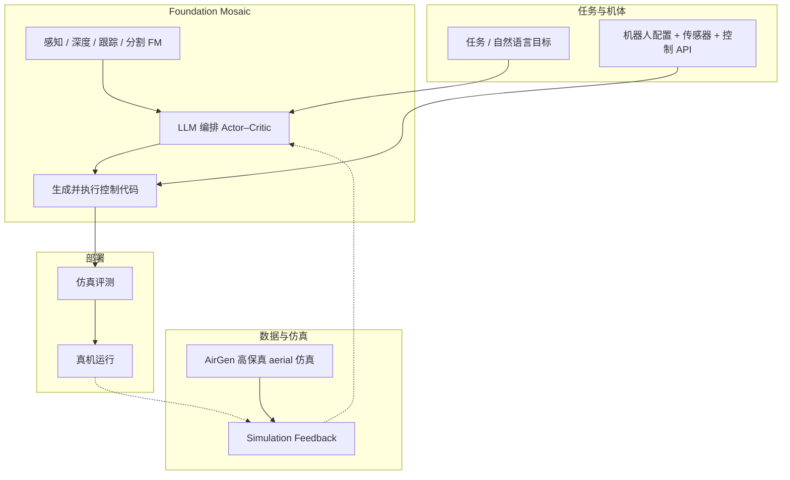
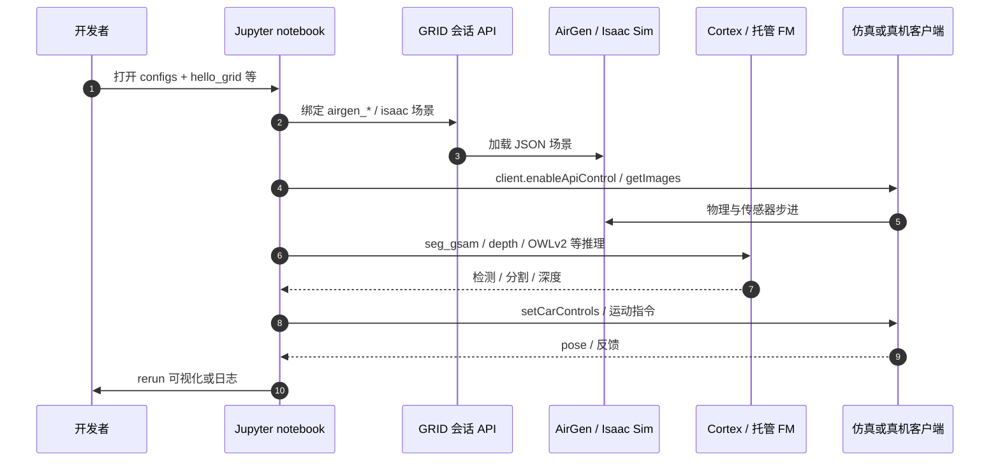
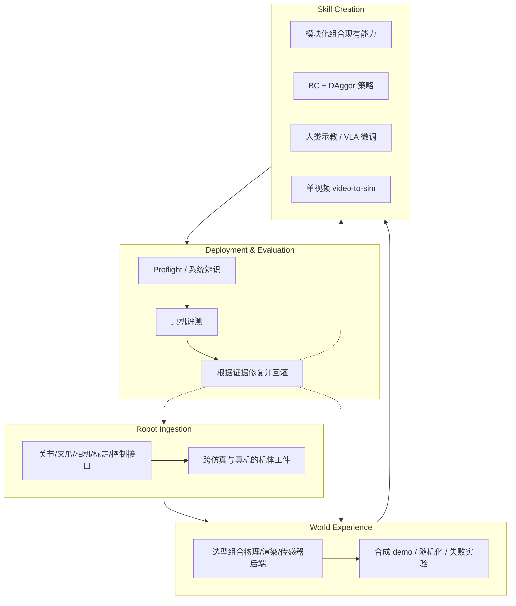

# GRID（General Robot Intelligence Development）

**GRID**（*GRID: A Platform for General Robot Intelligence Development*，Vemprala / Chen / Shukla / Narayanan / Kapoor，**arXiv:2310.00887**，Scaled Foundations）提出 **General Robot Intelligence**：机器人应能 **学习、组合并适配** 技能以匹配本体、环境与目标。平台以 **Foundation Mosaic**（视觉/语言/深度等 **现成 Foundation Model** + **控制原语**）为核心，用 **LLM** 做模块选择、融合与 **可部署代码生成**，并以 **AirGen**（AirSim 系）等高保真仿真补充 **多模态数据稀缺** 问题。

## 一句话定义

**用 LLM 编排的多模型 Mosaic + 仿真/真机双环，把「选感知模型、写控制代码、采数据、评测修复」收成统一 GRID 平台，降低机器人 ML 工程门槛。**

## 英文缩写速查

| 缩写 | 英文全称 | 简要说明 |
|------|----------|----------|
| GRID | General Robot Intelligence Development | 平台名；现产品含 Open GRID 与 Enterprise |
| FM | Foundation Model | 大规模预训练模型，作为机器人栈构建块 |
| LLM | Large Language Model | 编排、代码生成与 Actor–Critic 规划 |
| RGB-D | RGB + Depth | 彩色与深度；巡检与抓取常用输入 |
| TTC | Time to Collision | 碰撞时间；论文 H4 从 RGB 推断安全集 |
| VLA | Vision-Language-Action | 现 GRID Cortex 托管的一类策略/模型 |
| Sim2Real | Simulation to Real | 仿真反馈与真机部署闭环 |
| API | Application Programming Interface | GRID 与机器人/仿真/模型的统一接口层 |

| Cortex | GRID Cortex | 托管检测/深度/分割/VLM/VLA 的 Ray Serve API 层 |
| BC | Behavior Cloning | 行为克隆；Skill Creation 中合成 demo + DAgger 路线 |
| DAgger | Dataset Aggregation | 迭代式纠正性模仿；与 BC 联用训练反应式策略 |
| DFSPH | Divergence-free Smoothed Particle Hydrodynamics | 无散光滑粒子流体；文中与 MuJoCo 刚体耦合 |

## 为什么重要

- **早于当前 Physical AI 产品叙事的技术报告：** 2023 即系统论述 **Foundation Mosaic + 仿真数据工厂**，与 2026 产品页 **auto-engineering / agentic GRID** 一脉相承。
- **编排范式可对照开源 agent：** 与 VisProg、HuggingGPT、RT-2 等「组合 FM」路线同族，但强调 **机器人 API、控制原语与 AirGen 轨迹数据** 而非单任务策略网络。
- **工程入口已部分开放：** [Open GRID](https://grid.generalrobotics.dev) + [GRID-playground](https://github.com/GenRobo/GRID-playground) + [v2.1 文档](https://docs.generalrobotics.dev/v2.1/introduction.md) 可审计；与 [真机 autoresearch harness](../queries/real-robot-policy-autoresearch-harness.md) 的「可验证反馈」读法可直接对照。
- **勿与 Duke GRL 混淆：** [General Robotics Lab](https://generalroboticslab.com/)（Argus、TSIL）为学术 lab，与 **generalrobotics.company** 商业 GRID **无从属关系**。

## 流程总览

## 核心机制（归纳）

### Foundation Mosaic

- **组合而非单网：** 对象检测、分割、单目深度、点跟踪等 **独立 FM** 输出经 LLM **融合为语言接地状态**，再驱动 **已有控制律/规划器**。
- **样本复杂度：** 论文主张相对「端到端重训」更低，尤其在 **零样本组合** 任务（如恶劣气象下的视觉着陆）。

### LLM 编排与多智能体验证

- **Actor–Critic 双 LLM：** 计划生成与批判修正循环；执行错误与环境反馈 **回灌 Actor** 改代码（对齐 multi-agent debate 文献）。
- **人机接口：** 自然语言任务描述 + **可解释** 中间状态（监管与调试友好）。

### 数据：AirGen 与多模态对齐

- **AirGen：** 地理真实场景、域随机、**长轨迹** 合成；服务 aerial **训练与评测**。
- **现产品扩展（文档 v2.1）：** 云 **NVIDIA Isaac Sim** 会话 + **AirGen** 并列，覆盖 manip / locomotion notebook（见 Playground `configs/isaac/`）。

## 实验读法（论文 §3）

| 假设 | 场景 | 要点 |
|------|------|------|
| H3 | 视觉自主着陆 | GroundingDINO 检 helipad → TapNet 跟踪 → MiDaS 估速；雪/雾/低光仍工作 |
| H4 | 仅 RGB 安全导航 | 光学扩张 + TTC；GPT-4 写障碍规避示例 |
| H5 | 基础设施巡检 | 分割 → 点云/法线 → 最优路径 → 沿轨迹采图 |

## 工程实践

| 主题 | 建议 |
|------|------|
| 首次上手 | [Open GRID](https://grid.generalrobotics.dev) 或 CLI 安装（[installation](https://docs.generalrobotics.dev/v2.1/get-started/installation.md)）→ **无真机** 先开 Isaac 仿真会话 |
| Playground | Clone [GenRobo/GRID-playground](https://github.com/GenRobo/GRID-playground)，在 GRID 工作区打开 `hello_grid.ipynb` / `grid-isaac/*` |
| 托管模型 | 会话内 `grid_cortex_client.CortexClient` 调 OWLv2、深度、VLA 等（密钥由平台注入） |
| 与 Enterprise 边界 | 大规模私有集群、auto-engineering harness 复利 → 见 [GRID 产品实体](#项目资源与工程补充) |
| 选型对照 | 要 **全栈开源审计** → [Isaac Lab](./nvidia-getting-started-isaac-lab.md)、[Cyclo Intelligence](./cyclo-intelligence.md) |

## 局限与风险

- **Playground ≠ 平台源码：** 开源仓为 **notebook/config 示例**；Cortex 权重、Enterprise monorepo **不可独立复现** 论文全部能力。
- **论文偏重 aerial demo：**  manip / 人形能力主要来自 **后续产品与 Open GRID 文档**，读论文勿过度外推。
- **LLM 生成控制代码：** 安全关键系统需 **仿真 preflight + 人工闸门**；自动改控制/感知链有回归风险。
- **机构品牌变更：** 论文 **Scaled Foundations** 与现 **General Robotics / GenRobo** 为同一产品线的演进，引用时注意链接更新（GitHub org）。

## 源码运行时序图

Playground 典型路径（**需有效 GRID 会话**；模型名以 notebook 为准）：

## 与其他工作对比

- **[Isaac Lab 入门](./nvidia-getting-started-isaac-lab.md)** — Isaac Lab 是开源的 MDP / 并行 RL 训练与 sim-to-real 工作流；GRID 以 LLM 编排现成 FM + 控制原语为主，且 Cortex 与 Enterprise 部分闭源，需要全栈审计时优先 Isaac Lab。
- **[Cyclo Intelligence](./cyclo-intelligence.md)** — 同为 Physical AI 全栈平台，但 Cyclo 以行为树编排 VLA 后端生命周期 + 宏动作、单仓开源；GRID 以 LLM Actor–Critic 生成控制代码、托管模型为主。
- **[真机策略 autoresearch 闭环](../queries/real-robot-policy-autoresearch-harness.md)** — 都走「LLM/agent 写代码 + 可验证反馈」闭环；该 query 以 ENPIRE 为骨架、强调真机自动 reset/verify，GRID 论文反馈主要来自 AirGen 仿真与 aerial demo。

## 结论

**GRID 把「机器人 Foundation Model  scarcity」转译为「仿真 + Mosaic 编排 + LLM 工程闭环」，2023 报告已验证 aerial 组合任务；现 Open GRID / Playground 提供可审计入口，Enterprise 承载 auto-engineering 复利。**

- **读论文抓 Mosaic + AirGen：** 零样本着陆/巡检是 **FM 组合** 证据，不是单策略 SOTA 表。
- **上手优先 Open GRID 或 CLI 仿真会话：** 真机路径需要组织 cluster；Playground notebook 依赖平台侧 `airgen` / Isaac 绑定。
- **开源边界写清：** GenRobo 仓 = 教程与配置；**勿误以为** 可离线复现完整 Cortex 与 Enterprise harness。
- **与 autoresearch 对照：** LLM 写代码 + 仿真反馈 ≈ [真机 autoresearch harness](../queries/real-robot-policy-autoresearch-harness.md) 的 robotics 版，但 GRID 托管模型与闭源部分需 PoC 验证。
- **品牌勿混：** 商业 GRID ≠ Duke **generalroboticslab** 学术仓库。

## 项目资源与工程补充

### 核心信息

| 字段 | 内容 |
|------|------|
| 机构 | General Robotics（商业 Physical AI；论文 affiliation 曾为 Scaled Foundations） |
| 产品形态 | **Open GRID** · **GRID Enterprise** · [GRID-playground](https://github.com/GenRobo/GRID-playground) |
| 开源状态 | **部分开源** — Playground notebook/config；**Enterprise monorepo 未公开**（见 [步骤 2.5 归档](../../sources/sites/generalrobotics-grid-product.md)） |
| 官方入口 | [grid 产品](https://www.generalrobotics.company/grid) · [Open GRID](https://grid.generalrobotics.dev) · [文档](https://docs.generalrobotics.dev/) · [arXiv:2310.00887](https://arxiv.org/abs/2310.00887) |

### 四类 Robotics Harness

| Harness | 输入 / 输出 | 官方实验室示例 |
|---------|-------------|----------------|
| **Robot Ingestion** | 机体形态与运行上下文 → 仿真/真机共用描述与 preflight | 双 Flexiv 取试管→倒烧杯；技能迁移到 **UR5e** |
| **World Experience** | 任务需求 → **按需组装**仿真世界（可多后端） | **Warp DFSPH 流体 + MuJoCo 刚体** 耦合倒液；亦可仓库+PLC、Gaussian splat 导航、可变形体 |
| **Skill Creation** | 任务复杂度 → 选 **组合 / 策略 / 示教 / 视频** 路径 | 静态倒液用分割+抓取+规划；移动烧杯用仿真 BC+DAgger；搅棒用 GELLO 示教；旋液仅用手机视频 |
| **Deployment & Evaluation** | 技能候选 → 真机证据与下一步改动 | 运动学误差迭代；分割 prompt 调优；实时跟踪插入；**500 Hz→30 Hz** 指令 pacing；深度模型选型减 tabletop 误差 |

### 流程总览（实验室倒液任务链）

官方用 **试管拾取 → 双臂传递 → 倒入烧杯** 递增加复杂度：

1. **模块化技能：** 分割定位试管/烧杯 + 抓取 + 避障规划；对象级而非固定关节轨迹 → 物体在工作区内移动仍可用；仿真可达性/碰撞检查后上真机。
2. **反应式倒液：** 烧杯移动时需跟踪对齐；仿真专家 demo → **BC + DAgger** 状态策略（末端动作，便于跨 UR5e/Flexiv）。
3. **接触丰富搅拌：** 运动原语不足 → **GELLO 遥操作**采集 → visuomotor 策略；可按失败模式定向补采。
4. **视频到仿真：** 旋液任务禁示教，仅单段手机视频 → 手姿/物体分割 → 3D 轨迹 → 仿真变体与物理检查 → BC 策略。

### 工程实践（读法与边界）

| 主题 | GRID 叙事中的做法 | 站内对照 |
|------|-------------------|----------|
| 跨本体迁移 | 机体工件 + 对象/末端级技能 | [跨本体迁移策略](../queries/cross-embodiment-transfer-strategy.md) |
| 混合仿真 | 按任务拼装流体+刚体等多后端 | [仿真评测基础设施](../concepts/simulation-evaluation-infrastructure.md) |
| 部署反馈 | 系统辨识、感知链、控制 pacing、几何修复 | [Sim2Real](../concepts/sim2real.md)、[系统辨识](../concepts/system-identification.md) |
| 知识复利 | 机体/技能/模型/失败修复四类沉淀 | [Data Flywheel](../concepts/data-flywheel.md)（侧重数据；GRID 强调 **工程资产** 复利） |

**时间预算（官方单实验室叙事，非普遍 SLA）：** 首技能 ~4 h（摄取 ~20 min + 初始仿真 ~10 min + 其余迭代）；同 Flexiv setup 后续 10–15 min。

### 局限与风险

- **Enterprise 不可完全审计：** Playground 不含 Cortex/Enterprise 全栈；auto-engineering 性能数字需 PoC；数据/IP 条款见官网 **Sovereign** 叙事。
- **叙事绑定特定硬件栈：** 案例含 Flexiv、UR5e、GELLO；迁移到其他 OEM 是否同等顺畅需实测。
- **与学术 General Robotics Lab 易混淆：** Duke **[General Robotics Lab](https://generalroboticslab.com/)**（如 Argus、TSIL）为独立学术实体，与 **generalrobotics.company** 商业 GRID **无从属关系**。
- **Agent 闭环风险：** 自动修改控制频率、深度模型与运动学参数能修 gap，也可能引入安全与回归问题；需保留人工闸门与变更追溯（博客强调 traceability，但实现未开源）。

### 源码运行时序图

**Playground 时序见** [论文实体页](#项目资源与工程补充) — Enterprise monorepo 仍 **不适用**；上文 harness Mermaid 为 **产品架构读图**。

## 关联页面

- [真机策略 autoresearch 闭环](../queries/real-robot-policy-autoresearch-harness.md)
- [Sim2Real](../concepts/sim2real.md)
- [仿真评测基础设施](../concepts/simulation-evaluation-infrastructure.md)

- [Data Flywheel](../concepts/data-flywheel.md) — 部署复利与数据闭环
- [Cyclo Intelligence](./cyclo-intelligence.md) — 开源 Physical AI 全栈对照
- [NVIDIA Isaac Lab 入门](./nvidia-getting-started-isaac-lab.md) — 开源仿真训练部署对照

- [vla](../methods/vla.md)
- [manipulation](../tasks/manipulation.md)
- [teleoperation](../tasks/teleoperation.md)
- [behavior-cloning](../methods/behavior-cloning.md)
- [imitation-learning](../methods/imitation-learning.md)
- [nvidia-warp](./nvidia-warp.md)

## 参考来源

- [grid_arxiv_2310_00887.md](../../sources/papers/grid_arxiv_2310_00887.md)
- [generalrobotics-grid-product.md](../../sources/sites/generalrobotics-grid-product.md)
- [grid-open-platform.md](../../sources/sites/grid-open-platform.md)
- [grid-playground.md](../../sources/repos/grid-playground.md)

- [Introducing Auto Engineering for Robotics（博客归档）](../../sources/blogs/generalrobotics_auto_engineering_2026-09-09.md)
- [General Robotics 官网归档](../../sources/sites/generalrobotics-company.md)

## 推荐继续阅读

- [arXiv 摘要与 PDF](https://arxiv.org/abs/2310.00887)
- [GRID 产品页](https://www.generalrobotics.company/grid)
- [Open GRID](https://grid.generalrobotics.dev)
- [GRID Docs v2.1 入门](https://docs.generalrobotics.dev/v2.1/introduction.md)
- [GRID-playground README](https://github.com/GenRobo/GRID-playground)

- Open GRID：<https://grid.generalrobotics.dev>
- GRID Docs：<https://docs.generalrobotics.dev/v2.1/introduction.md>
- 官方博客：<https://www.generalrobotics.company/post/introducing-auto-engineering-for-robotics>
- NVIDIA ENPIRE / autoresearch 对照：[ENPIRE](../methods/enpire.md)、[真机 autoresearch harness](../queries/real-robot-policy-autoresearch-harness.md)
