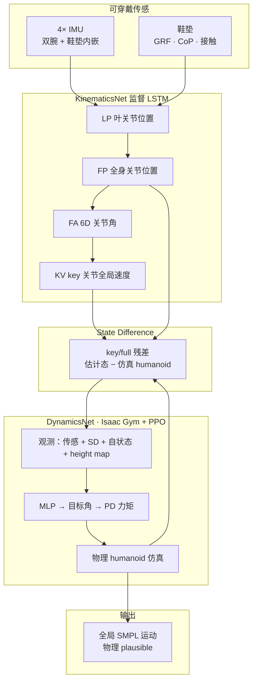
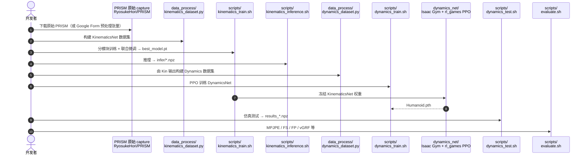

# GRIP：稀疏 IMU + 鞋垫压力的物理仿真人体 MoCap

**GRIP**（*Ground Reaction Inertial Poser*；[arXiv:2603.16233](https://arxiv.org/abs/2603.16233)，CVPR 2026；[项目页](https://ryosukehori.github.io/grip-project/)，[代码](https://github.com/RyosukeHori/GRIP)，[PRISM 数据集](https://github.com/RyosukeHori/PRISM)）用 **4 个可穿戴 IMU（双腕 + 双鞋垫内嵌）** 与 **鞋垫压力（GRF / CoP / 接触）** 重建 **全局轨迹 + 全身 SMPL 姿态**。方法采用 **KinematicsNet → State Difference → DynamicsNet** 两阶段：**监督 LSTM** 先估运动学，再用 **Isaac Gym 扭矩 humanoid + PPO** 在物理约束下跟踪，抑制纯 IMU 方案的漂移、脚滑与穿地。

## 一句话定义

**把「稀疏可穿戴传感」与「仿真 humanoid 闭环控制」接在一起：用鞋垫动态补 IMU 缺的全局与接触信息，用 State Difference 把 kinematic 估计变成 physics controller 的观测，而不是事后优化。**

## 英文缩写速查

| 缩写 | 英文全称 | 简要说明 |
|------|----------|----------|
| GRIP | Ground Reaction Inertial Poser | 本文方法：IMU + 鞋垫 + 物理 humanoid 跟踪 |
| PRISM | Pressure and Inertial Sensing for Human Motion and Interaction | 配套多模态数据集（MoCap + IMU + 压力 + 环境） |
| IMU | Inertial Measurement Unit | 惯性测量单元；本文 4 点（腕 + 鞋） |
| GRF | Ground Reaction Force | 地面反力；鞋垫 vertical 分量进入观测 |
| CoP | Center of Pressure | 压力中心；每脚 2D 坐标 |
| SMPL | Skinned Multi-Person Linear Model | 24 关节参数化人体；KinematicsNet 输出空间 |
| PHC | Perpetual Humanoid Control | DynamicsNet 奖励框架参考（AMP + imitation + energy） |
| PPO | Proximal Policy Optimization | DynamicsNet 策略优化算法 |

## 为什么重要

- **日常可穿：** 相对 Xsens 等 17 IMU 紧身衣，**4 IMU + 智能鞋垫/手表** 更接近长期佩戴场景（VR/AR、居家康复、机器人 teleop 上游）。
- **物理一致性不是后处理：** 相对 PIP / GlobalPose / MobilePoser 等 **后验物理优化**，GRIP 在 **仿真闭环** 里满足重力、摩擦与接触，全局 MPJPE 与 **脚穿地（FP）** 指标在三数据集上领先。
- **压力补 IMU 盲区：** 鞋垫 GRF/CoP 提供 **体重转移与可靠接触**，缓解纯 IMU 对 fine-grained 地面交互估计不足；ablation 显示 **+压力** 在 4 IMU 配置下成功率 **88.58% → 94.49%**（PRISM）。
- **数据与代码齐备：** **PRISM** 填补「IMU + 压力 + MoCap + 物体环境」联合标注空白；[RyosukeHori/GRIP](https://github.com/RyosukeHori/GRIP) 提供两阶段训练、评测与可视化脚本（DynamicsNet 需 Isaac Gym）。

## 核心信息

| 项 | 内容 |
|----|------|
| **机构** | 卡内基梅隆大学（CMU）；庆应义塾大学（Keio University）/ Keio AI Research Center |
| **传感器** | 4 IMU + 简化鞋垫（每脚 GRF、CoP、前/后掌接触） |
| **输出** | SMPL 24 关节位置/角度 + 全局 key 关节速度/轨迹 |
| **仿真** | 扭矩 humanoid；**无 floating base、无 residual force** |
| **PRISM** | 6 被试；1,275×10 s；~3.5 h；100 Hz |
| **开源** | **已开源**：代码 + PRISM 原始数据 + 预处理/权重下载（见步骤 2.5 归档） |

## 流程总览

## 核心原理

### KinematicsNet（§3.2）

- 四阶段 **unidirectional LSTM**，逐帧输出：**叶关节位置** → **24 关节位置** → **6D 旋转角** → **6 key 关节全局线速度**。
- 直接在 **全局朝向 IMU** 上操作（根 IMU 缺失 → 输出为 root-centered 但保留 body 全局旋转）。
- **History buffer** 存最近 $N$ 帧估计，供 DynamicsNet 推理时 **fall recovery** 重置。

### State Difference（§3.3）

- **不用积分速度得全局位置**（避免漂移直传控制器）。
- **Key 分量：** 四叶关节（腕/脚）旋转/角速度/朝向差 + 六 key 线速度差。
- **Full 分量：** root-relative 24 关节位置差。
- Ablation：加入 **速度差 + root-relative 位置差** 同时改善 MPJPE 与 **Success Rate**（Table 4）。

### DynamicsNet（§3.4）

- **MDP + PPO**；动作 = 目标关节角 → **PD 力矩**。
- 观测：原始传感 + State Difference + humanoid 状态 + **1.5 m 局部 height map**（25×25）。
- 奖励：**PHC 式** AMP 判别 + imitation + energy penalty（见 [PHC](./phc.md)）。
- **Fall recovery：** 根高度 + AMP 概率触发 → 用 buffer 内 KinematicsNet 输出重置仿真根位姿与关节角。

## 源码运行时序图

官方仓库 [RyosukeHori/GRIP](https://github.com/RyosukeHori/GRIP)（归档 [sources/repos/grip.md](../../sources/repos/grip.md)）：

- **最短路径：** 下载预处理 `data/preprocessed/` + 预训练 `output.zip` → 直接 `dynamics_test.sh` / `evaluate.sh`。
- **仅 KinematicsNet：** 可跳过 Isaac Gym 安装，跑 `kinematics_*` 与 `visualization/vis_kinematics_*`。
- **原始数据路径：** PRISM → `kinematics_dataset.py` → `dynamics_dataset.py` 全链路。

## 工程实践

| 步骤 | 要点 |
|------|------|
| 环境 | `conda env create -f environment.yml --solver=libmamba`；`bash scripts/setup_grip.sh`（PyTorch 2.1.1 CUDA 12.1 wheel） |
| SMPL | 注册下载后放入 `data/smpl/` |
| Isaac Gym | Preview 4 手动安装；DynamicsNet 必需 |
| 数据 | 预处理 ~4.5 GB（Form）或 PRISM 原始 + `data_process/` |
| 训练顺序 | KinematicsNet 独立/联合 → 冻结 → DynamicsNet PPO |
| 可视化 | `visualization/vis_*`（aitviewer） |
| 评测 | `scripts/evaluate.sh` → `output/evaluation/` |

### 与 baseline 选型（Table 2 归纳）

| 方法 | IMU | 压力 | 物理 | 全局轨迹 |
|------|-----|------|------|----------|
| PIP / GlobalPose / MobilePoser | 3–6 | 否 | 后验优化 | 是 |
| FoRM / SolePoser | 0–2（脚） | 是 | 否/部分 | FoRM 是 |
| **GRIP** | **4** | **是** | **仿真闭环** | **是** |

## 局限与风险

- **PA/PEL 精度：** IMU 数少于 GlobalPose（6 IMU + 骨盆重力校正）时，去全局平移/旋转后的姿态误差未必最优。
- **vGRF：** 无 floating base / residual force 的 humanoid 在高动量失衡时 GRF 模式可与真人不同；慢速 Tai Chi（PSU-TMM100）反而更准。
- **工程栈较旧：** Python 3.8 + Isaac Gym Preview 4；numpy/BLAS 版本敏感（README 警告 motion_lib overflow）。
- **物体交互边界：** 踩空/绊倒时估计脚位可能短暂低于物体表面；fall recovery 会替换一段输出保连续。
- **机器人 GMR 接口：** 输出 SMPL 轨迹，上机器人仍需 [motion retargeting](../concepts/motion-retargeting-pipeline.md) 管线，非直接关节命令。

## 评测要点

| 数据集 | GRIP 读点 |
|--------|-----------|
| **PRISM** | 多样动作 + 物体；**MPJPE 182.44 mm** 最优；**FP 5.77 mm** 最低 |
| **UnderPressure** | 大位移 locomotion；全局 MPJPE **218.09**；FP **0.00** |
| **PSU-TMM100** | 慢速重心转移；MPJPE **118.60**；vGRF 优于优化基线 |

## 对比

相对 **PIP / GlobalPose / MobilePoser**（3–6 IMU + **后验物理优化**）与 **FoRM / SolePoser**（脚载 IMU+压力、**无仿真闭环**），GRIP 在 **全局 MPJPE** 与 **脚穿地 FP** 上三数据集一致领先；去全局平移的 **PA-MPJPE** 上 GlobalPose（6 IMU）仍常占优。相对后验优化，GRIP 更少「错误接触检测导致锁脚」的轨迹 artifact（UnderPressure 定性对比）；相对纯 kinematic FoRM，物体交互场景（PRISM）与动态 locomotion 的 **物理一致性** 差距更大。完整数值见论文 Table 1–2 与 [项目页对比表](https://ryosukehori.github.io/grip-project/)。

## 结论

**GRIP 把「稀疏可穿戴 MoCap」从纯 kinematic 回归推进到「仿真 humanoid 闭环跟踪」，鞋垫压力 + State Difference 是同时改善全局轨迹与物理 plausible 的关键设计。**

- **4 IMU + 压力** 是日常可穿与精度的实用折中；压力对 **成功率与 FP** 的贡献独立于加 IMU 数量。
- **State Difference + root-relative 位置** 比积分全局位置更适合 IMU 缺根节点的控制器接口。
- **仿真闭环** 相对后验优化更少「锁脚」轨迹 artifact，但 vGRF 在极限动态下仍弱于带 residual force 的优化法。
- **PRISM** 可作为 IMU–压力–MoCap–环境联合研究的基准；与 [OpenCap Monocular](./paper-opencap-monocular.md)（单手机生物力学）形成 **实验室 / 视觉 / 可穿戴** 互补选型。
- 共同作者 **Zhengyi Luo** 连接 [PHC](./phc.md) 奖励与 humanoid 物理控制生态；DynamicsNet 训练可直接借鉴 PHC/SimXR 经验。
- 复现优先用官方 **预处理 + 预训练**；全 raw pipeline 需 SMPL + Isaac Gym + 磁盘与算力预算。

## 关联页面

- [PHC（Perpetual Humanoid Control）](./phc.md) — DynamicsNet 奖励与 humanoid 模仿控制参考
- [OpenCap Monocular](./paper-opencap-monocular.md) — 互补：单手机视觉 + OpenSim 生物力学 MoCap
- [GVHMR](./gvhmr.md) — 互补：单目视频 SMPL 世界轨迹上游
- [Motion retargeting 管线](../concepts/motion-retargeting-pipeline.md) — GRIP 输出到机器人/仿真角色的常见下一步
- [AssistMimic](./paper-assistmimic.md) — 同 CMU/Keio 生态的 physics humanoid 跟踪（双人 assistive 场景）

## 参考来源

- [GRIP 论文归档](../../sources/papers/grip_arxiv_2603_16233.md)
- [GRIP 项目页归档](../../sources/sites/grip-project-github-io.md)
- [GRIP 代码仓库归档](../../sources/repos/grip.md)
- [PRISM 数据集归档](../../sources/repos/prism-dataset.md)

## 推荐继续阅读

- 论文 PDF：<https://arxiv.org/pdf/2603.16233>
- 官方项目页（视频与对比表）：<https://ryosukehori.github.io/grip-project/>
- GlobalPose 基线（6 IMU + 物理优化）：<https://github.com/Xinyu-Yi/GlobalPose>
