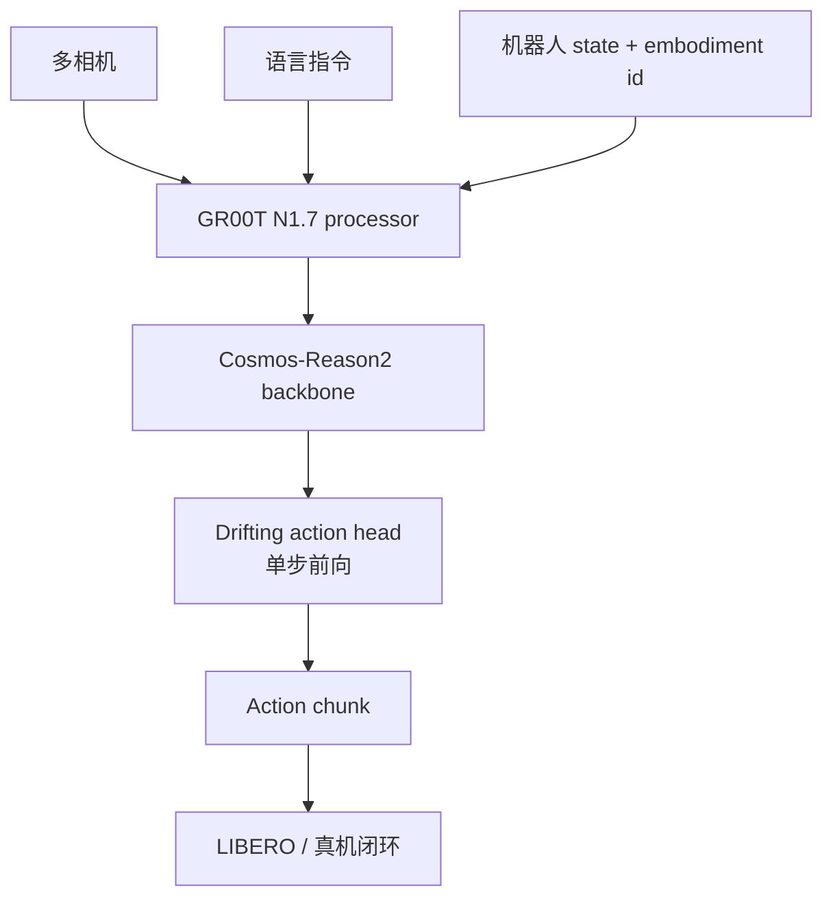
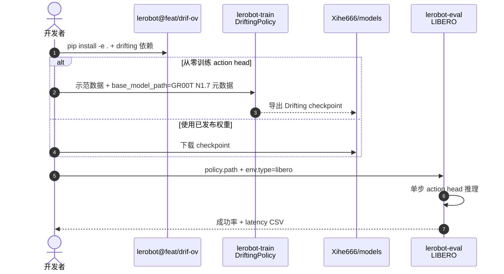

# GR00T Drifting Action Head：单步 VLA 速度–成功率审计

**One-Step Drifting Action Heads for GR00T N1.7**（[arXiv:2609.18108](https://arxiv.org/abs/2609.18108)，Xihe Shao）在 **GR00T N1.7** 上保留 **Cosmos-Reason2/Qwen3-VL** backbone 与 LeRobot 预处理，将迭代 **flow-matching DiT action head** 换为 **单步 Drifting conditional transformer**，并系统测量 **推理延迟 vs LIBERO 闭环成功率** — 明确报告为 **speed–success trade-off**，非整体升级。

## 一句话定义

**把 GR00T 动作头从多步 flow matching 压成一步 Drifting 预测，能砍掉 action head 延迟一个数量级，但 LIBERO 成功率会系统性掉档——部署前必须做这种审计，不能只看 ms 表。**

## 英文缩写速查

| 缩写 | 英文全称 | 简要说明 |
|------|----------|----------|
| VLA | Vision-Language-Action | GR00T N1.7 视觉—语言—动作策略 |
| DiT | Diffusion Transformer | GR00T 原版 flow-matching 动作生成器 |
| LIBERO | LIBERO Benchmark | Spatial / Goal / Long 三套件评测 |
| RTC | Real-Time Chunking | GR00T 原生 overlap 引导；Drifting **不支持** |
| HF | Hugging Face | `Xihe666/models` checkpoint |

## 为什么重要

- **延迟账要拆表：** action head **45.3→5.0 ms**，但 backbone+head **70→30.6 ms** — 瓶颈不只在 head。
- **成功率会付价：** 三 seed 方差低，说明退化 **非纯运气**；Spatial **64±4%**、Long **26±2.6%** 需与基线 GR00T 对照读。
- **诚实的 technical report：** 不包装成 SOTA；列出 one-step mode averaging、geometry batch 依赖、长 open-loop chunk 等因素。
- **工程可复现：** [LeRobot fork `feat/drif-ov`](https://github.com/RealManShao/lerobot/tree/feat/drif-ov) + [HF 权重](https://huggingface.co/Xihe666/models) **已开源**。

## 核心信息

| 项 | 内容 |
|----|------|
| **作者** | Xihe Shao |
| **训练** | 2× NVIDIA A800 |
| **代码** | [RealManShao/lerobot@feat/drif-ov](https://github.com/RealManShao/lerobot/tree/feat/drif-ov) — **已开源** |
| **权重** | [huggingface.co/Xihe666/models](https://huggingface.co/Xihe666/models) |
| **注意** | **不**加载 GR00T flow-matching action-head 预训练权重；head 需单独训练 |

## 核心原理

**部署（单步）：** 零 action seed \(t=0\) → **一次** conditional transformer 前向 → 完整 action chunk；无迭代去噪。

**训练（双预测）：**

- **Proposal：** 与部署相同的零 seed。
- **Proximal：** 在 demonstrated action 附近加噪（`proximal_time`）。
- **Loss：** masked、geometry-weighted squared potential；geometry excess 来自 detached observation embedding 与 action 局部变化，**不回传梯度**。

**与 GR00T N1.7 对照：**

| 组件 | GR00T N1.7 | Drifting |
|------|------------|----------|
| VLM backbone | Cosmos-Reason2/Qwen3-VL | 相同 |
| Action generator | Flow-matching DiT（多步） | One-step Drifting transformer |
| 推理 action-head 次数 | 可配置，通常多次 | **恰好 1 次** |
| 预训练 action-head | 从 GR00T checkpoint 加载 | **必须单独训练** |
| RTC overlap | 支持 | **不支持** |

### 流程总览

## 源码运行时序图

节点对齐 [`sources/repos/lerobot-groot-drifting.md`](../../sources/repos/lerobot-groot-drifting.md) 与 `docs/source/drifting.mdx`。

- **最短审计路径：** HF 权重 → `lerobot-eval` LIBERO 三套件 → 对照 `Experiment-result/LIBERO_latency_stats/` 延迟 CSV。
- **勿误用：** `base_model_path` 仅提供 processor/元数据，**不是** Drifting 训练好的 action head。

## 工程实践

| 项 | 建议 |
|----|------|
| 选型 | 若任务 **Long horizon** 敏感，**26±2.6%** 级成功率可能不可接受 — 勿仅因 5 ms head 上线 |
| 异步 | overlap-conditioned 扩展存在，但 **LIBERO 同步评测未测** async path；真机 RTC 需单独验证 |
| 与 GlanceWAM 并读 | [GlanceWAM](./paper-glancewam.md) 也追 WAM/VLA 延迟；本文是 **VLA action head 微观审计** |
| 训练成本 | 报告环境 2×A800；Drifting head **无** GR00T head 权重可 warm-start |

## 局限与风险

- **成功率下降是系统性的：** 三 seed 低方差 — 不是调 seed 能救。
- **无 GR00T RTC：** 部署若依赖 overlap 引导，需留 GR00T 基线或另寻 async 方案。
- **LIBERO 同步设定：** 未覆盖 stale-observation / 真机延迟 — 与 [Real-Time EXPO-FT](./paper-real-time-expo-ft.md) 问题正交。
- **Technical report：** 非 peer-review 完整论文；数字以作者报告为准。

## 关联页面

- [LeRobot 实体](./lerobot.md)
- [VLA 方法](../methods/vla.md)
- [VLA 部署指南](../queries/vla-deployment-guide.md)
- [Real-Time EXPO-FT](./paper-real-time-expo-ft.md) — 延迟下 RL 修正对照

## 结论

**GR00T Drifting 是有价值的负向/权衡证据：单步 action head 能显著降延迟，但 LIBERO 成功率会付可重复代价——适合作为 VLA 部署前的 speed–success 基准线。**

- **延迟增益真实：** action head **~9×** 加速，端到端 backbone+head **~2.3×**。
- **成功率代价明确：** Long 套件 **~26%** 量级 — 长程 open-loop chunk 风险高。
- **开源可审计：** LeRobot fork + HF 权重支持独立复现 latency 与 success 表。
- **不是 drop-in 替换：** head 权重不可继承 GR00T flow head；RTC 不支持。
- **读法：** 当作 **technical audit**，而非新 SOTA VLA。

## 参考来源

- [GR00T Drifting 论文归档](../../sources/papers/groot_drifting_action_head_arxiv_2609_18108.md)
- [LeRobot GR00T Drifting 仓库归档](../../sources/repos/lerobot-groot-drifting.md)

## 推荐继续阅读

- [arXiv:2609.18108 PDF](https://arxiv.org/pdf/2609.18108)
- [Drifting 文档（feat/drif-ov）](https://github.com/RealManShao/lerobot/blob/feat/drif-ov/docs/source/drifting.mdx)
