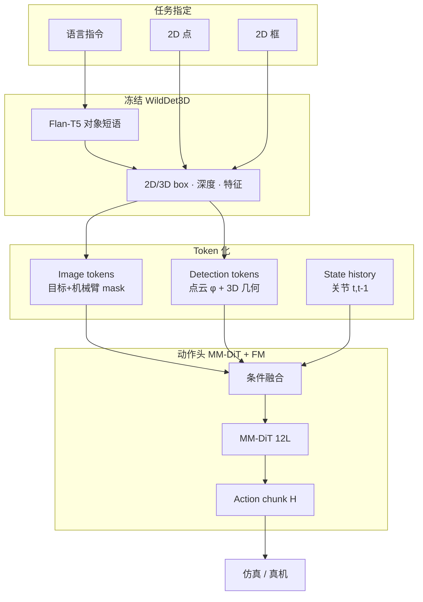

# Grounded Action Model（GAM）：3D Grounding 作为机器人基础

**Grounded Action Model（GAM）**（*Grounded Action Model: 3D Grounding as a Foundation for Robotics*，[arXiv:2609.23863](https://arxiv.org/abs/2609.23863)，[项目页](https://grounded-action-model.github.io/)）由 **西北大学（Northwestern University）**、**华盛顿大学（University of Washington）** 与 **新加坡国立大学（National University of Singapore）** 提出：把 **可提示的 3D grounding** 设为机器人 foundation model 的显式接口，而非让 VLA/WAM 预训练骨干从演示里 **隐式** 学「目标在哪」。

> **缩写消歧：** 本页 **GAM = Grounded Action Model**。RCL Awesome 中的 **Geometric Action Model（GAM）** 见 [paper-rcl-2606-17046-geometric-action-model-for-robot-policy-learning](./paper-rcl-2606-17046-geometric-action-model-for-robot-policy-learning.md) — 问题设定与骨干均不同。

## 一句话定义

**用语言、2D 点或 2D 框选定任务对象，经冻结 3D grounding 骨干得到对象中心视觉特征与度量几何，再与机器人状态历史一起驱动 flow-matching 动作块预测。**

## 英文缩写速查

| 缩写 | 英文全称 | 简要说明 |
|------|----------|----------|
| GAM | Grounded Action Model | 本文：3D grounding 为基的操纵 foundation model |
| VLA | Vision-Language-Action | 视觉–语言–动作策略；本文对照 π₀.₅ 等 |
| WAM | World Action Model | 世界–动作联合建模；预训练常缺显式度量 grounding |
| MM-DiT | Multi-Modal Diffusion Transformer | 四流联合注意力的动作头骨干 |
| FM | Flow Matching | 连续动作块的去噪/速度场训练目标 |
| OOD | Out-of-Distribution | 视觉或任务扰动下的分布外评测 |

## 为什么重要

- **显式 metric grounding：** 操纵必须知道 **哪些物体相关、在空间何处**；纯 2D VLA 或生成式 WAM 骨干 **不强制** 学这一层，GAM 把其 **写进架构**（WildDet3D + detection/image tokens）。
- **统一提示接口：** 语言、点、框 **同一对象表示** — 便于人机交互、GUI 点选，以及与 **高层 VLM 规划器**（文内 Molmo2）组合做长时程任务。
- **扰动与随机化：** 在 **LIBERO-PRO**（目标 relocated / 新指定）与 **RoboTwin 2.0** 场景随机化上相对 π₀.₅、Spatial Forcing、Abot-M0 报告 **更大余量**，且动作策略可在 **仅 clean-scene 示范** 上训练。
- **开源边界：** 官方 GitHub 已挂链但 **代码与权重待发布**（见 [工程实践](#工程实践)）— 选型时按「论文 + 项目页证据」阅读，勿假设可即刻复现。

## 核心信息

| 项 | 内容 |
|----|------|
| **机构** | 西北大学（Northwestern University）；华盛顿大学（University of Washington）；新加坡国立大学（National University of Singapore） |
| **arXiv** | [2609.23863](https://arxiv.org/abs/2609.23863)（v2，2026-09-25） |
| **Grounding 骨干** | **WildDet3D**（冻结）；语言侧 Flan-T5 span tagging 抽对象短语 |
| **动作表示** | 长度 **H** 的 **绝对关节位置 + 夹爪** chunk |
| **开源** | **待发布** — [GehaoZhang6/Grounded-Action-Model](https://github.com/GehaoZhang6/Grounded-Action-Model) README「Code coming soon」（2026-10-01） |

## 核心原理

**对象中心条件：** 每个任务对象经 WildDet3D 得 2D 检测框、度量 3D 框、单目深度与 dense 视觉特征；再构造 **image tokens**（16×16 网格，保留与目标框或 URDF 投影机械臂重叠区域）与 **detection tokens**（深度采点云 + 点云 encoder **φ** + 3D 位姿/尺度）。

**条件融合：** image、detection 与 **state history**（当前/上一帧关节）加 modality embedding，经共享 self-attention 得序列 **C**，供动作头使用。

**动作头：** **12 块 MM-DiT** 在四流（image / detection / state / 带噪 action chunk）上做 joint attention；语言句嵌入注入 flow 时间步 adaptive LN；**flow matching** 训练速度场，推理生成 action chunk。训练 **只更新动作头与适配器**，**不微调 G**。

### 流程总览

**系统层：** GAM 可 **单独闭环**；也可作为 **低层控制器**，接收 Molmo2 等规划器的语言/点/框子指令，承担 **记忆依赖与多步** 操纵中的重复 grounding+控制。

## 源码运行时序图

**不适用**（**待发布** — 截至 2026-10-01 官方仓无训练/推理脚本与权重，仅有 README 与演示素材）。代码发布后应对齐 [sources/repos/grounded-action-model.md](../../sources/repos/grounded-action-model.md) 更新本图。

## 实验与评测

| 基准 | 作者报告要点 | 对照（摘要） |
|------|----------------|--------------|
| **RoboTwin 2.0** | 50 任务平均 **55.3%** | Spatial Forcing **52.0%** |
| **RoboTwin 随机化** | **47.6%** | Abot-M0 **30.4%** |
| **LIBERO-PRO** | 16 扰动平均 **61%** | π₀.₅ **53%** |
| **YAM 双臂 · 视觉偏移** | **17/20** 成功 | π₀.₅ **4/20** |
| **Franka + Molmo2 · 长时程** | step **64.7%** ID / **49.8%** OOD | — |

- **训练数据口径：** RoboTwin 动作策略 **仅用 clean-scene 示范**；随机化评测考察 **grounding 泛化** 而非更多脏数据堆叠。
- **消融读法：** 去掉 image 或 detection 流会 **大幅掉点**（文内约 **16–20%** vs 完整 **~47%** 级）— **度量几何与目标外观互补**，不是单流可替代。
- **数字使用：** 上表为摘要级；任务定义、扰动类型与统计口径以 [PDF](https://arxiv.org/pdf/2609.23863) 为准。

## 工程实践

| 检查项 | 建议 |
|--------|------|
| **开源** | **待发布** — Watch [官方仓](https://github.com/GehaoZhang6/Grounded-Action-Model)；复现前勿假设 WildDet3D 权重与 MM-DiT 检查点可用 |
| **Grounding 依赖** | 推理链依赖 **WildDet3D + 相机标定**（机械臂 URDF 投影用于 image token mask）；部署需预留 **深度/3D box 失败** 时的降级策略 |
| **与 VLA 栈关系** | 可视为 **显式 3D grounding 层 + flow 动作专家**；对照 [SpatialVLA](./paper-spatialvla.md)（3D 对齐 VLA）与 [π0.5](./paper-pi05-open-world-vla.md)（开放世界离散–连续两阶段） |
| **分层系统** | 长时程场景按论文 **GAM 低层 + VLM 规划** 读；规划器错误会累积，需单独评 **step completion** 与 **grounding 刷新** 频率 |
| **缩写冲突** | 文档与选型表中写全 **Grounded Action Model**，避免与 Geometric Action Model 混称 GAM |

## 局限与风险

- **代码未释出：** 无法验证训练细节、WildDet3D 版本与真机 latency；**待发布** 状态可能随 v3 论文或仓库更新变化。
- **Grounding 错误传播：** 冻结 detector/depth 若 **错框/错深度**，下游 MM-DiT **无** 端到端纠正梯度（G 冻结）— 需工程上监控 grounding 置信度或人机纠正。
- **模态覆盖：** 文内重点 **单目 RGB + 关节**；力觉、触觉与高_dof 人形 **未** 作为主轴论证。
- **与 WAM 路线关系：** GAM **不** 联合预测未来视频；若任务依赖 **长时物理想象**，仍需与 [World Action Models](../concepts/world-action-models.md) 族对照选型。

## 与其他工作对比

| 对照 | 差异读法 |
|------|----------|
| [π0.5](./paper-pi05-open-world-vla.md) | 开放世界 VLA + FAST/flow 两阶段；**无** 统一 3D grounding token 接口；LIBERO-PRO / YAM 视觉偏移上 GAM 报告更高余量 |
| [Spatial Forcing（RCL）](./paper-rcl-ref-0f2536c81a1992e3c3b8-spatial-forcing-implicit-spatial-representation.md) | **隐式** 空间表示对齐；GAM 用 **显式** WildDet3D 对象几何 |
| [SpatialVLA](./paper-spatialvla.md) | 3D 对齐 **VLA** + 自适应动作网格；GAM 强调 **promptable grounding**（点/框/语言）与 **MM-DiT flow chunk** |
| [RynnBrain 1.1](./paper-rynnbrain-1-1.md) | 具身基础模型内建 **native 3D grounding**；GAM 以 **冻结** 3D FM 专责 grounding、轻训动作头 |
| [RoboFoundry](./paper-robofoundry.md) | 系统演化 + 冻结 FM；LIBERO-PRO 同榜但改进面在 **agent/context**，非 metric grounding 骨干 |

## 结论

**GAM 的可迁移论点是：把「对象是谁、在哪」从演示隐式学习里抽出来，做成可提示的 3D grounding 接口，再只训练轻量 flow 动作头，就能在强扰动仿真与视觉偏移真机上显著优于 π₀.₅ 等 VLA 基线。**

1. **真影响：显式 grounding** — 语言/点/框 **同一** 对象 token 化，直接服务 relocated / 新指定目标场景（LIBERO-PRO 增益集中在此）。
2. **真影响：数据效率** — RoboTwin **clean-scene-only** 训练仍能在 **场景随机化** 上领先 Abot-M0 类基线。
3. **真影响：分层部署** — 同一策略既可闭环，又可作 **Molmo2 低层**，长时 step completion 有独立数字（ID/OOD）。
4. **次要代价：栈复杂** — WildDet3D + URDF mask + 多流 MM-DiT 使 **推理链路与标定** 重于单 backbone VLA。
5. **开源读法：** 官方仓 **≠** 可复现；截至入库日仅 **待发布** 预告。
6. **消融提醒：** 几何 token 与 image token **缺一不可** — 选型勿砍掉 detection 分支指望纯 2D 特征够用。

## 关联页面

- 方法：[VLA](../methods/vla.md)、[Foundation Policy](../concepts/foundation-policy.md)
- 任务：[Manipulation](../tasks/manipulation.md)
- 概念：[World Action Models](../concepts/world-action-models.md)

## 参考来源

- [`sources/papers/grounded_action_model_arxiv_2609_23863.md`](../../sources/papers/grounded_action_model_arxiv_2609_23863.md) — 论文策展摘录
- [`sources/sites/grounded-action-model.md`](../../sources/sites/grounded-action-model.md) — 项目页与开源核查
- [`sources/repos/grounded-action-model.md`](../../sources/repos/grounded-action-model.md) — 官方 GitHub 归档
- 论文：<https://arxiv.org/abs/2609.23863>

## 推荐继续阅读

- [Grounded Action Model 项目页](https://grounded-action-model.github.io/)
- [WildDet3D（GAM grounding 骨干引用）](https://arxiv.org/abs/2609.23863) — 详见原文参考文献
- [Physical Intelligence π0.5](https://arxiv.org/abs/2504.16054) — 主要 VLA 对照基线之一
