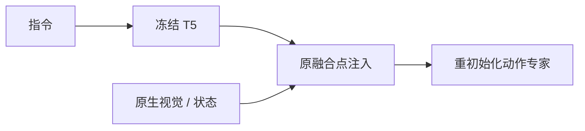
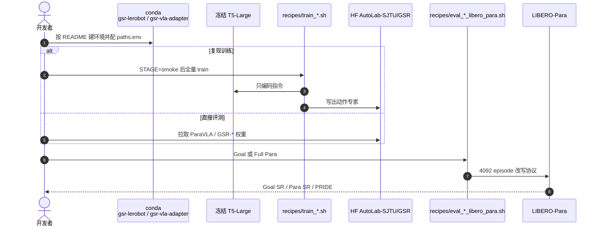

# GSR / ParaVLA：把任务语义从脆弱的联合路由里拆出来

**Grounded Semantic Re-binding（GSR）**（[arXiv:2608.02497](https://arxiv.org/abs/2608.02497)，[代码](https://github.com/AutoLab-SAI-SJTU/GSR-ParaVLA)）由 **上海交通大学 AutoLab**（实习于 Anyverse Dynamics）提出：VLA 在改写指令上崩，往往不是「语义没了」，而是 **动态图像和文本 jointly encode 后，动作头吃不消那点特征偏移**。

## 一句话定义

**用冻结 T5 单独抽出与当前画面无关的任务语义，再绑回模型自己的视觉/状态通路，并从零训练动作专家——只靠 canonical 演示，就能把改写指令成功率拉回来。**

## 英文缩写速查

| 缩写 | 英文全称 | 简要说明 |
|------|----------|----------|
| GSR | Grounded Semantic Re-binding | 本文的结构干预 |
| VLA | Vision-Language-Action | 视–语–动作策略 |
| PRIDE | Paraphrase Robustness 综合分 | 文内报告的改写鲁棒指标 |
| T5 | Text-to-Text Transfer Transformer | 冻结语义源，不看图 |
| ParaVLA | Paraphrase-robust VLA | 0.33B 原生解耦模型 |

## 为什么重要

- 基准指令模板一改写，VLA-Adapter / SmolVLA / \(\pi_{0.5}\) 可掉数十个点；业界默认答案是「再堆改写数据」。
- 探测显示任务身份还在：换回 canonical 语言特征，成功率 **60%→96%**。
- 结构解耦让轻量模型逼近重预训练基线，并给 \(\pi_{0.5}\) 再抬 PRIDE 到 **70.4**（高于报告的 Xiaomi-Robotics-0 的 69.2）。

## 核心信息

| 项 | 内容 |
|----|------|
| **机构** | 上海交通大学人工智能学院 AutoLab（SJTU）；Anyverse Dynamics |
| **评测** | LIBERO-Goal 训练，LIBERO-Para 4092 episode |
| **开源** | **已开源**（MIT + HF checkpoints） |

## 核心原理

### 方法栈

冻结 T5-large 只编码指令。若原生语言通路脆弱（VLA-Adapter / SmolVLA），把原句改成固定 “perform the task”；若已可靠（\(\pi_{0.5}\)），保留原句、T5 作补充。T5 特征投到该架构真正做视–语–状态融合的位置。动作专家 **从头初始化**——只加 T5 而不改路由几乎无效（46.82→47.31）。

### 流程总览

## 源码运行时序图

官方实现 [AutoLab-SAI-SJTU/GSR-ParaVLA](https://github.com/AutoLab-SAI-SJTU/GSR-ParaVLA)（归档见 [sources/repos/gsr-paravla.md](../../sources/repos/gsr-paravla.md)）：

- **最短复现：** `conda activate gsr-lerobot` → 拉 HF 权重 → `bash recipes/eval_lerobot_libero_para.sh`。
- **对拍：** `VARIANT=gsr` vs `native_control`；SmolVLA 可用 `PRESERVE_NATIVE_LANGUAGE=true`。

## 工程实践

| 项 | 建议 |
|----|------|
| 先做探测 | 同一观测下比较 paraphrase / canonical / 错任务动作距离 |
| 注入点 | 跟该 VLA 的融合层走，不要一律接到动作头 |
| 大动作头 | \(\pi_{0.5}\) 重初始化后 Goal SR 可能先掉，加倍步数可拉回 |
| 数据 | **不要**先上改写增强；GSR 只吃 canonical |

## 实验与评测

| 模型 | Goal SR | Full Para SR | 读法 |
|------|--------:|-------------:|------|
| SmolVLA → GSR | 72.0→78.0 | 4.47→**49.12** | +44.6 pp，文内最大跃迁 |
| VLA-Adapter → GSR | 98.2→98.0 | 46.82→**70.94** | 轻量模型贴近重预训练 |
| \(\pi_{0.5}\) → GSR | 93.0→91.0 | 73.60→**75.59** | PRIDE **70.4** |
| Xiaomi-Robotics-0（报告） | 98.8 | 76.0 | Para 略高，PRIDE 69.2 |

辅支换固定假图即可把 VLA-Adapter Full Para 抬到 61.58，进一步坐实 joint routing 是病因。

## 与其他工作对比

相对「堆改写语料」：GSR 正交，给已经大规模共训的 \(\pi_{0.5}\) 仍能再涨。相对 [Xiaomi-Robotics-0](./xiaomi-robotics-0.md)：报告 Para SR 76.0 略高，但 GSR+\(\pi_{0.5}\) 的 PRIDE 更高。相对 [Why Action Chunking Improves BC](./paper-why-action-chunking-improves-bc.md)：后者拆动作时间结构，本文拆语言路由。

## 结论

**VLA 的改写鲁棒性，优先修「语义怎么送到动作头」，而不是先扩指令数据。**

1. **先确认语义还在** — Retrieval@1 / 特征替换实验能一票否决「模型没看懂」。
2. **指令编码不要和当前帧绑死** — T5 不看图。
3. **注入点跟架构走** — SmolVLA 必须早融合；接到动作头会崩。
4. **动作专家要重训** — 旧映射拟合的是那套偏移特征。
5. **轻量结构能打重预训练** — VLA-Adapter+GSR 的 Para 接近 \(\pi_{0.5}\) 量级。
6. **大专家给足步数** — 重初始化不是免费的。

## 局限与风险

- 主结果在 LIBERO-Goal/Para，真机改写未作为主表。
- T5 与视觉骨干均冻结，域外语言/视觉仍可能一起偏。
- \(\pi_{0.5}\) 短日程会伤 canonical SR，部署前要看 Goal 与 Para 的联合。

## 关联页面

- [VLA](../methods/vla.md)
- [LIBERO](./libero-benchmark.md)
- [Xiaomi-Robotics-0](./xiaomi-robotics-0.md)
- [π₀.₅ / π₀.₇](../methods/pi07-policy.md)
- [Why Action Chunking Improves BC](./paper-why-action-chunking-improves-bc.md)
- [ReflexVLA](./paper-reflexvla.md) — 同校；延迟感知动态任务，不是指令路由
- [Ego2Robot](./paper-ego2robot.md) — 数据侧补语言/物体扰动

## 参考来源

- [GSR 论文摘录](../../sources/papers/gsr_paravla_arxiv_2608_02497.md)
- [GSR-ParaVLA 仓库归档](../../sources/repos/gsr-paravla.md)
- [具身智能小站 9 篇盘点](../../sources/blogs/wechat_embodied_station_ego2robot_mango_grasp_2026-08-11.md)
- [arXiv:2608.02497](https://arxiv.org/abs/2608.02497)

## 推荐继续阅读

- [GSR 仓库与配方](https://github.com/AutoLab-SAI-SJTU/GSR-ParaVLA)
- [Hugging Face 权重](https://huggingface.co/AutoLab-SJTU/GSR)
