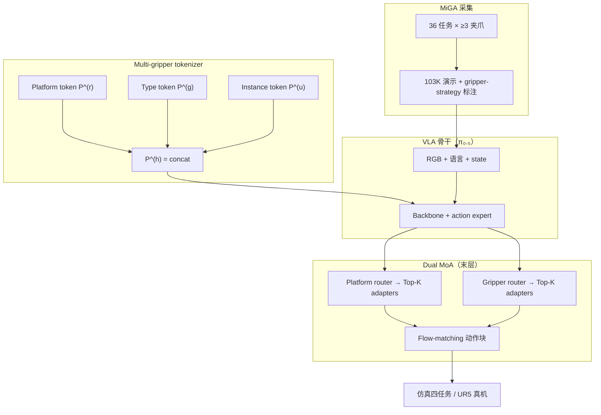

# GVLA：夹爪感知的视觉–语言–动作模型

**GVLA**（*Gripper-aware Vision Language Action Models*，[arXiv:2608.24603](https://arxiv.org/abs/2608.24603)，[项目页](https://airvlab.github.io/G-VLA/)，[MiGA 数据](https://huggingface.co/datasets/GVLA/MiGA-Dataset)）由 **利物浦大学 AIRV Lab** 牵头，联合 MBZUAI、IISC、东京大学、ZHAW、阿肯色大学、Physical Intelligence、华中科技大学等提出：**MiGA** 首个大规模 **multi-gripper-aware** 数据集（**103K** 演示、**5** 类夹爪、**36** 任务）；**GVLA** 用三级 soft prompt + **Dual Mixture-of-Adapters** 把夹爪形态注入 VLA。**ECCV 2026** 录用。

## 一句话定义

**在同任务目标下显式建模「平行夹爪侧推 vs 吸盘顶吸」等策略分歧，用 MiGA 数据 + gripper soft prompt 与 dual MoA 让 VLA 学会夹爪条件化操作，而不是假设 gripper invariance。**

## 英文缩写速查

| 缩写 | 英文全称 | 简要说明 |
|------|----------|----------|
| GVLA | Gripper-aware Vision-Language-Action | 本文夹爪条件 VLA 框架 |
| MiGA | Multi-Gripper-Aware Dataset | 103K 跨五类夹爪演示数据集 |
| VLA | Vision-Language-Action | 视觉–语言–动作统一策略 |
| MoA | Mixture-of-Adapters | 按夹爪/平台路由的 adapter 专家池 |
| CAPD | Counterfactual Action Prediction Divergence | 仅改夹爪 ID 时动作预测差异；衡量策略专化 |

## 为什么重要

- **数据缺口：** OXE / DROID / Bridge 等 **parallel-jaw 主导**；MiGA 每任务 **≥3** 种夹爪、**132** gripper–strategy 对，带失败轨迹与子步骤。
- **方法轴：** 相对 MLP/VQ-VAE/语言 prompt 的 gripper token，三级 soft prompt 在 embedding 空间 **按 type 聚类**（论文 Fig. 2）；dual MoA 在 **action expert 末层** 做计算级调制。
- **评测：** 仿真四任务平均 **66.0%**（\(\pi_{0.5}\)+GVLA），超 OpenVLA-OFT / \(\pi_{0.5}\) 等；真机 UR5+Robotiq **10 demo + 20k FT** 跨域优于 \(\pi_{0.5}\)。
- **开源边界：** **MiGA 已 HF 发布**（Apache-2.0，LeRobot）；**GVLA 训练代码与权重截至入库日未发布**（见 [工程实践](#工程实践)）。

## 核心信息

| 项 | 内容 |
|----|------|
| **机构** | 利物浦大学；MBZUAI；印度科学学院；东京大学；ZHAW；阿肯色大学；Physical Intelligence；华中科技大学 |
| **数据集 MiGA** | 103K traj；5 gripper × 5 robot；sim（Isaac Lab）+ real；RGB-D + `gripper_id` |
| **方法 GVLA** | Platform / type / instance 三级 soft prompt + platform & gripper dual MoA |
| **骨干** | 默认 **\(\pi_{0.5}\)**；亦报告 \(\pi_0\) 版 |
| **开源** | **部分开源** — 数据 [`GVLA/*`](https://huggingface.co/GVLA)；[`airvlab/G-VLA`](https://github.com/airvlab/G-VLA) 仅项目页 |

### 流程总览

## 实验与评测

| 基准 / 设定 | GVLA (\(\pi_{0.5}\)) 要点 | 强基线 |
|-------------|---------------------------|--------|
| **仿真四任务 Avg** | **66.0%**（Flat 53 / Stacked 76 / Constrained 62.5 / Semantic 72.5） | \(\pi_{0.5}\) **58.38%**；OpenVLA-OFT **41.88%** |
| **Tokenizer 消融** | PE **0.032**，CAPD **1.34**，GCS **0.249** | MLP / VQ-VAE / LP 均更低专化 |
| **Cross-object 零样本** | 未见物体任务保持较高 SR（Fig. 8） | gripper-agnostic 基线降幅更大 |
| **Few-shot 适应** | 新任务 / 新夹爪 / 混合夹爪数据均更快收敛（Fig. 9） | 无 MoA 时 Adapt 约 **0.52** |
| **真机 UR5+Robotiq 2F-85** | 10 demo + 20k FT 跨域新任务 **> \(\pi_{0.5}\)** | 详见论文 Fig. 10 |

## 结论

**GVLA 证明 VLA 的瓶颈不只在「更多 parallel-jaw 数据」，而在显式编码夹爪级策略差异：MiGA 提供 supervision，三级 prompt + dual MoA 把 embodiment 写进表示与计算路由。**

- 相对 \(\pi_{0.5}\) 基线，仿真平均 **+7.62%** — 增益来自 **gripper conditioning**，不是换更大预训练。
- **Type token \(P^{(g)}\)** 与 **platform token \(P^{(p)}\)** 对跨夹爪适应最关键；去掉 dual MoA 会把 Adapt 打回 **~0.52** — 仅 prompt 不够，需 action 层路由。
- **CAPD / LPA** 显示策略确实 **专化到夹爪**；失败多来自 intra-type 几何对齐、物理极限与运动学不可达 — 部署仍需低层规划/恢复。
- **MiGA 已可下载** 做 gripper-aware 预训练或 benchmark；**GVLA 官方训练栈未发** — 复现需自研或等 checkpoint。
- 与 [MA-VLA](./paper-ma-vla.md)（多臂协作）/[OpenVLA](./paper-openvla.md)（单夹爪 OXE 主线）形成 **cross-embodiment 不同切面**：本文聚焦 **end-effector morphology** 而非 arm 数量或平台 ID alone。

## 工程实践

| 项 | 内容 |
|----|------|
| **数据** | HF [`GVLA/MiGA-Dataset`](https://huggingface.co/datasets/GVLA/MiGA-Dataset) 索引 + 子集；LeRobot Parquet；`gripper_id` 字段 |
| **加载** | `LeRobotDataset("GVLA/Franka_panda_parallel_hand_real")` 等；跨子集 concat 后按 `gripper_id` stratify |
| **训练代码** | **待发布** — [`airvlab/G-VLA`](https://github.com/airvlab/G-VLA) 截至入库日 **仅 GitHub Pages 项目页** |
| **权重** | HF org [`GVLA`](https://huggingface.co/GVLA) **0 public models** |
| **选型读法** | 多夹爪工位 / 吸盘+平行夹爪混线 → 优先 MiGA + GVLA 路线；仅 single parallel-jaw → OpenVLA / \(\pi_{0.5}\) 仍可能是更短路径 |

### 开源状态（步骤 2.5 结论）

- **已发布：** MiGA 多子集（Apache-2.0）；项目页 + 论文 PDF。
- **待发布：** GVLA 训练/推理代码与 checkpoint；GitHub 仓 **无** `train.py` / eval 入口。
- **勿误判：** [`airvlab/G-VLA`](https://github.com/airvlab/G-VLA) **≠** 可运行实现 — 仅为 [项目页源](../../sources/repos/g-vla.md)。

## 源码运行时序图

**不适用**（截至入库日官方未发布 GVLA 可运行训练/推理代码；[`airvlab/G-VLA`](https://github.com/airvlab/G-VLA) 仅托管静态项目页。数据侧可按 MiGA README 用 LeRobot 加载子集。）

## 局限与风险

- **仿真域：** MiGA sim 基于 Isaac Lab — 软体/高 DoF 夹爪物理仍简化（论文 §6）。
- **几何/contact：** gripper token 指导 **策略级** 差异，无显式接触/运动学模型 — intra-type 对齐仍易失败。
- **视觉–形态纠缠：** domain shift 下策略可能过度依赖图像，弱化 morphology reasoning。
- **误区：** 把 MiGA 当「更大版 OXE」— 价值在 **同任务多策略**，不是单一路径堆量。

## 与其他工作对比

| 路线 | 条件对象 | 数据 | 与 GVLA |
|------|----------|------|---------|
| **GVLA** | Platform + gripper type + instance | MiGA 103K / 5 grippers | 本页 |
| [OpenVLA](./paper-openvla.md) |  Mostly 单 parallel-jaw OXE | OXE ~970k | 无 gripper-strategy 标注 |
| [MA-VLA](./paper-ma-vla.md) | 多臂原子动作分配 | MACG 协作 | 多臂 vs 多夹爪 |
| X-VLA（arXiv:2510.10274） | Per-embodiment soft prompt | 跨平台 | 偏 robot-level，非 end-effector morphology |
| VacuumVLA 等 | 单类吸盘扩展 | 专用数据 | 单 gripper 线 vs MiGA 五类对照 |

## 关联页面

- [VLA](../methods/vla.md) — foundation policy 主线与 cross-embodiment 分支
- [Manipulation](../tasks/manipulation.md) — 抓取策略与夹爪硬件语境
- [LeRobot](./lerobot.md) — MiGA 数据布局与加载
- [OpenVLA](./paper-openvla.md) — parallel-jaw 主导预训练对照
- [\(\pi_{0.5}\)](./paper-pi05-open-world-vla.md) — GVLA 默认骨干

## 参考来源

- [GVLA 论文摘录（arXiv:2608.24603）](../../sources/papers/gvla_arxiv_2608_24603.md)
- [GVLA 项目页归档](../../sources/sites/g-vla-github-io.md)
- [G-VLA GitHub（项目页源）](../../sources/repos/g-vla.md)
- [MiGA 数据集归档](../../sources/datasets/miga-dataset.md)

## 推荐继续阅读

- [GVLA 项目页](https://airvlab.github.io/G-VLA/) — MiGA 统计、方法动画与真机结果
- [MiGA-Dataset on Hugging Face](https://huggingface.co/datasets/GVLA/MiGA-Dataset) — 子集索引与 LeRobot 用法
- [arXiv:2608.24603](https://arxiv.org/abs/2608.24603) — 完整实验与消融
