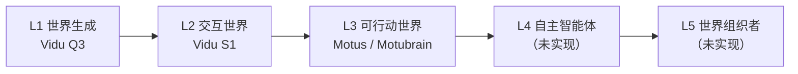
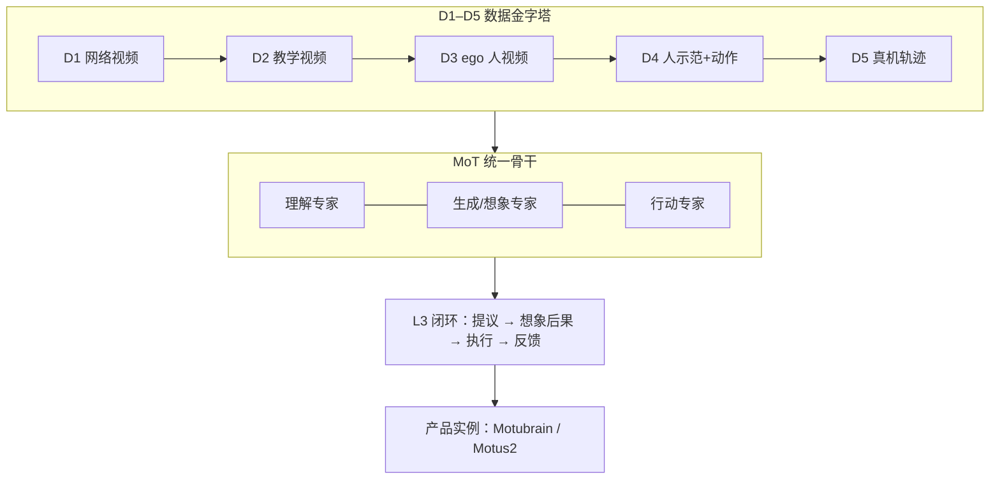

# General World Models from First-Principles（生数 / 清华）

**General World Models from First-Principles**（Jun Zhu 等，生数科技 × 清华大学，2026 手稿，[WRC 2026 主题演讲](https://www.prnewswire.com/news-releases/shengshu-technology-proposes-a-five-level-roadmap-for-general-world-models-302858162.html)）从 **第一性原理** 定义 **General World Model（GWM）**：不是生成器、模拟器或策略的拼接，而是 **理解 → 想象 → 行动 → 反馈** 的闭环；并给出 **L1–L5 能力路线图** 与 **D1–D5 数据金字塔**，与 [Fei-Fei 功能分类](../concepts/functional-taxonomy-world-models.md)（按 POMDP **输出** 分 Renderer / Simulator / Planner）形成 **正交对照**。

## 一句话定义

> **GWM = 在闭环里同时学会「世界现在怎样、动作后会怎样、并据此行动」——分级路线图把 Vidu 生成、交互视频与 Motubrain WAM 串成 L1→L3 的连续演进。**

## 英文缩写速查

| 缩写 | 英文全称 | 简要说明 |
|------|----------|----------|
| GWM | General World Model | 理解–想象–行动闭环的通用世界模型 |
| WAM | World Action Model | L3 可行动世界的策略接口 |
| MoT | Mixture-of-Transformers | 理解/生成/行动专家共享注意力 |
| L1–L5 | Levels 1–5 | 从世界生成到世界组织的自主性分级 |
| D1–D5 | Data tiers 1–5 | 从互联网视频到真机轨迹的数据金字塔 |
| RTC | Real-Time Chunking | L3 部署侧异步 chunk 衔接（见 [2608.01880](./paper-wam-realtime-async.md)） |

## 为什么重要

- **给「世界模型」过载词提供第二套坐标：** 功能分类问 **输出什么**；本报告问 **闭环缺哪一环** 与 **自主性到哪一级**。
- **把生数产品线写进可检验路线图：** L1 [Vidu Q3]、L2 [Vidu S1]、L3 [Motus / Motubrain](./paper-motubrain.md)——便于对照 [Motus2](./paper-motus2.md) 的「三接口 GWM + 自进化」是否仍算 L3 口径。
- **数据 recipe 可执行：** D 金字塔 + **50–100 条** 目标机轨迹适配（Motubrain 披露）与 [PKU Data Pyramid](./paper-data-pyramid-embodied-manipulation.md) 并行存在，选型时勿混层号。

## 核心信息

| 项 | 内容 |
|----|------|
| **作者** | Jun Zhu, Hengkai Tan, Jintao Zhang, Min Zhao, Fan Bao, Bo Zhang 等 |
| **机构** | 生数科技（Shengshu）；清华大学 |
| **出处** | 2026 手稿；WRC 2026 发布；**无 arXiv** |
| **架构** | MoT 统一理解 / 生成 / 行动专家 |
| **L4–L5** | 报告 **明确承认尚无系统实现** |
| **开源** | **手稿/演讲部分公开**；**无可运行官方训练栈**（L3 代码见 Motus 开源仓与 Motubrain 占位仓） |

## 方法与核心结构

### 理解–想象–行动闭环

| 环节 | 作用 |
|------|------|
| **Understanding** |  grounded 表征当前世界 |
| **Imagination** | 预测动作条件下的不确定未来 |
| **Action** | 干预世界；真机反馈持续更新模型 |

预测 **不是** 孤立生成任务，而是连接感知、规划与控制的 **桥**。

### L1–L5 路线图

| 级别 | 读者该记住的判据 |
|------|------------------|
| **L1** | 一次性生成合理世界（旁观） |
| **L2** | 输入改变后续生成（交互） |
| **L3** | 动作进入环、反馈修正控制（[WAM](../concepts/world-action-models.md)） |
| **L4** | 仅高层目标，自主分解与探索 |
| **L5** | 多体协同与资源编排 |

### D1–D5 数据金字塔（报告口径）

| 层 | 数据 | 教会模型什么 |
|----|------|--------------|
| D1 | 互联网视频 | 世界通常如何变化 |
| D2 | 教学视频 | 任务如何展开 |
| D3 | 第一视角人视频 | 行动者视角 |
| D4 | 带动作记录的人示范 | 动作 ↔ 世界变化 |
| D5 | 真机轨迹 | 本体可达与力控校准 |

**逆动力学 / 潜空间预测** 可从未标注视频抽取动态；**有限 D5** 负责对齐到具体本体（Motubrain：**50–100 条** 轨迹适配口径）。

### 闭环 scaling 三条件（公众号归纳）

1. **知识：** D 金字塔扩大覆盖，而非二选一「只要视频或只要机数据」。
2. **共享状态：** MoT 避免感知/规划/控制各持过期快照。
3. **实时：** 推理须跟上物理世界；部署层见 [WAM 实时异步](./paper-wam-realtime-async.md) 的 RTC 等策略。

## 流程总览

## 实验与评测

本稿为 **定义 + 路线图 + 架构主张**，**不是** 单一 benchmark 论文；可检验主张分散在实例工作中：

| 实例 | 与路线图关系 | 详情 |
|------|-------------|------|
| Motubrain | L3 WAM；RoboTwin 2.0 **95.8/96.1** | [paper-motubrain](./paper-motubrain.md) |
| Motus2 | L3→L4 口径的自进化 GWM；五任务 MBRL **65%→75%** | [paper-motus2](./paper-motus2.md) |
| RTC 实证 | L3 部署：六策略异步对照 | [paper-wam-realtime-async](./paper-wam-realtime-async.md) |

## 与其他工作对比

| 框架 | 问的问题 | 与本报告关系 |
|------|----------|--------------|
| [Fei-Fei 功能分类](../concepts/functional-taxonomy-world-models.md) | 系统 **输出** 观测/状态/动作哪一段 | **正交**：可嵌在同一 GWM 闭环的不同模块 |
| [上智定义文](./paper-sa-2607-06401-a-definition-and-roadmap-for-world-models.md) | WM **是什么** + 表征轴 + 倒金字塔 | 数据流与 D 金字塔 **同构但分层不同** |
| [PKU Data Pyramid](./paper-data-pyramid-embodied-manipulation.md) | 具身数据 **五层生态** 综述 | **勿混层号**；本报告 D1–D5 为生数训练 recipe |
| [WAM 综述概念](../concepts/world-action-models.md) | \(p(o',a\mid o,l)\) 联合建模 | L3 **Actionable World** 的学术对照 |

## 结论

**生数 GWM 报告的价值是把产品线升格成可讨论的自主性分级与数据配方，而不是又一篇像素 WM 宣传。**

1. **真影响：第二套坐标** — 与 Fei-Fei **输出三分** 正交；读 WM 文献应同时带 **功能格 + 闭环级** 两把尺子。
2. **L3 已有实例、L4–L5 诚实留白** — Motubrain/Motus2 是 L3 证据；勿把 Motus2 自进化直接等同于 L4 自主体。
3. **D 金字塔 ≠ PKU 金字塔** — 层号相似、语义不同；写 data recipe 必须注明引用哪一套。
4. **MoT 解决「同一现在」** — 长程任务模块快照过期是闭环工程主矛盾之一。
5. **实时是第三根支柱** — 没有 [RTC 类部署](./paper-wam-realtime-async.md)，L3 真机仍会卡在对齐与 chunk 跳变。
6. **今日不可复现手稿数字** — 无 arXiv/官方 PDF 固定链接；定量以 Motus/Motubrain/Motus2 子论文为准。

## 局限与风险

- **无 arXiv / 战略页重定向** — 手稿难以版本锁定；引用应以 WRC 稿与实例论文为准。
- **L4–L5 仅为路线图** — 不应提前当作已交付能力。
- **Vidu Q3/S1 未建独立 paper 节点** — 属产品映射，非本次 arXiv 盘点对象。
- **与 Data Pyramid 综述易混淆** — 写作与 ingest 必须显式区分 D1–D5 定义。

## 源码运行时序图

**不适用** — 截至 2026-09-10 **无** 可运行官方实现；L3 运行时序见 [Motus2](./paper-motus2.md)（未开源）与 [Motubrain](./paper-motubrain.md)（仓占位）。

## 关联页面

- [功能分类](../concepts/functional-taxonomy-world-models.md)
- [World Action Models](../concepts/world-action-models.md)
- [Motubrain](./paper-motubrain.md)
- [Motus2](./paper-motus2.md)
- [WAM 实时异步部署](./paper-wam-realtime-async.md)
- [GWM 闭环 5 篇技术地图](../overview/gwm-closed-loop-5-papers-technology-map.md)

## 参考来源

- [gwm_first_principles_shengshu_2026.md](../../sources/papers/gwm_first_principles_shengshu_2026.md)
- [shengshu-general-world-model.md](../../sources/sites/shengshu-general-world-model.md)
- [wechat_embodied_station_gwm_closed_loop_2026-09-10.md](../../sources/blogs/wechat_embodied_station_gwm_closed_loop_2026-09-10.md)

## 推荐继续阅读

- [Shengshu WRC 2026 新闻稿](https://www.prnewswire.com/news-releases/shengshu-technology-proposes-a-five-level-roadmap-for-general-world-models-302858162.html)
- [Motus2 项目页](https://motus-robotics.github.io/motus2/)
- [Fei-Fei 功能分类博客](https://www.worldlabs.ai/blog/taxonomy-of-world-models)
