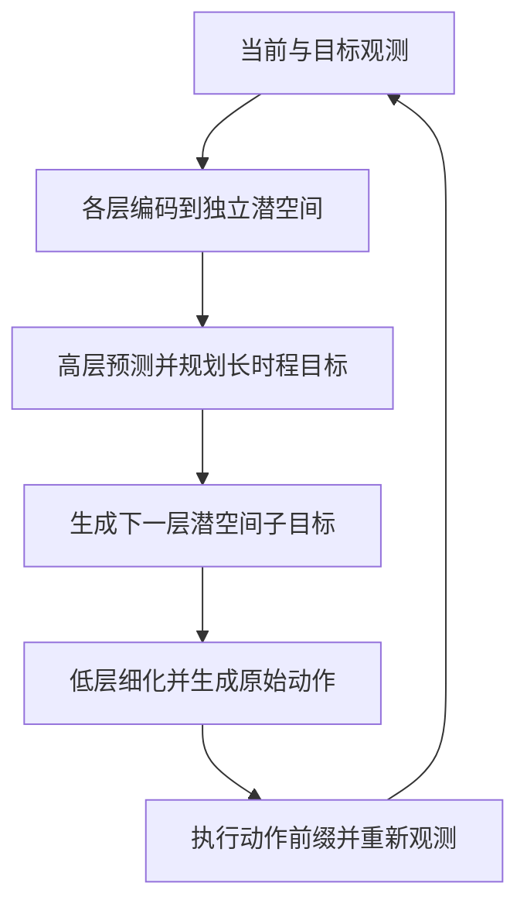

# H-JEPA: End-to-End Learning of Hierarchical World Models for Visual Planning

## 一句话定义

**H-JEPA** 是一种端到端分层潜空间世界模型：每层在自己的潜表示和时间尺度上预测动作条件下的未来，再从高层目标逐级规划到低层原始动作。

## 英文缩写速查

| 缩写 | 英文全称 | 简要说明 |
|---|---|---|
| JEPA | Joint-Embedding Predictive Architecture | 在潜表示空间预测未来，而非重建像素 |
| H-JEPA | Hierarchical JEPA | 每层使用不同时间尺度和独立学习的潜空间进行预测与规划 |
| SIGReg | Sketched Isotropic Gaussian Regularization | 约束潜表示分布，帮助防止表征坍缩 |
| IDM | Inverse-Dynamics Modeling | 根据相邻潜状态预测连接它们的动作，帮助保留机器人相关信息 |
| LeWM | LeWorldModel | H-JEPA 使用的单层 JEPA 基线 |
| HWM | Hierarchical World Model | 与 H-JEPA 对比的分层规划方法；不同层共享潜空间 |
| DROID | DROID dataset | 多场景、多物体的真实机器人遥操作轨迹数据集 |

## 为什么要做层级世界模型

单层世界模型要在一个表示空间里同时完成细粒度控制和长时程目标规划。长预测会累积模型误差，动作搜索也更昂贵；而对“到达目标位置”而言，逐关节姿态或背景细节可能不是有用的距离度量。

H-JEPA 的思路是让低层保留快速变化、与即时动作相关的信息，让高层学习更慢、更抽象的状态表示。高层目标代价可以忽略对任务无关的快速细节，同时时间分解把长计划拆成多个较短的子目标。

## 方法结构

每个层级都包含观测编码器、动作编码器和潜状态预测器。低层处理高频观测与原始动作；高层对低层的状态/动作表示做时间聚合，在更长的时间跨度上预测。各层使用预测损失与 SIGReg 联合训练，不依赖像素重建或任务奖励；在多场景 DROID 实验中额外加入 IDM，避免只编码稳定背景而忽略运动中的机器人。

规划按高到低进行：最高层优化朝目标的粗计划；其预测状态成为下一层子目标；逐级细化后，第一级输出可执行的 primitive action。闭环时，规划器执行一段动作、取得新观测，再重复规划。

## 评测与结果

| 评测 | 任务 / 数据 | 论文报告与正确解读 |
|---|---|---|
| 模拟导航 | Visual AntMaze、FourRoom Distractors | 三层 H-JEPA 在 Visual AntMaze 的指定规划设置达到 **73.3% ± 3.5%** 成功率；单层 LeWM 为 **18.0% ± 3.5%**。分层带来更好的成功率–规划计算量折中。 |
| 模拟操作 | Push-T、OGBench Cube | 最多三层并非所有任务都单调受益；Push-T 的深层模型因短 episode 可用于训练的长片段较少而表现退化。 |
| 真实机器人视频 | DROID 遥操作数据集 | 加入 IDM 后，在多场景视频上评估离线规划；报告指标是末端执行器三维路径的 Fréchet fidelity，不是实体机器人的闭环成功率。 |

## 与相近方法的区别

- **HWM（arXiv:2604.03208）：** 同样从高层到低层规划子目标，但各时间尺度共享一个潜空间；H-JEPA 让每层学习自己的抽象表示，从而在不同层用不同粒度衡量目标进展。对照详情见 [HWM](./paper-hwm-latent-world-model-planning.md)。
- **LeWM：** 单层潜世界模型，是论文的主要平坦基线；H-JEPA 在其上堆叠联合训练的表示与预测层。
- **Hamiltonian JEPA（arXiv:2609.33497）：** 另一个标题缩写同为 H-JEPA 的独立工作，研究继承控制状态的 action-conditioned 动力学；不是本论文的层级视觉规划方法。
- **与 WAM 的关系：** H-JEPA 是 action-conditioned world model 加潜空间规划器；动作由规划优化得到，并非同时学习“未来观测与动作联合生成”的典型 joint WAM。因此本页链接 WAM 分类页作为边界对照，而不将其当作同类动作生成策略。

## 适用范围与限制

- 适合研究从视觉潜空间预测长时程目标、以层级子目标减少规划难度和计算的 model-based planning。
- AntMaze 的 73.3% 与 18.0% 是论文协议下、跨三组训练/规划随机种子的结果，不是通用成功率承诺。
- 高层抽象依赖数据中不同因素存在时间尺度差异；论文指出操作数据集未必表现出同样强的选择性抽象。
- DROID 评测属于离线路径保真度，论文没有据此证明物理机器人上的闭环部署性能。
- 本页所指 H-JEPA 唯一标识为 arXiv:2610.06805，避免与 2609.33497 混淆。

## 关联页面

- [Model-Based RL](../methods/model-based-rl.md)
- [Hierarchical Planning with Latent World Models（HWM）](./paper-hwm-latent-world-model-planning.md)
- [LeWorldModel（LeWM）](./paper-lewm.md)
- [World Action Models（WAM）](../concepts/world-action-models.md)

## 参考来源

- [H-JEPA 论文来源归档](../../sources/papers/hjepa_arxiv_2610_06805.md)
- [官方 GitHub 仓库](../../sources/repos/h-jepa.md)
- [官方项目主页](../../sources/sites/h-jepa.md)
- [arXiv:2610.06805](https://arxiv.org/abs/2610.06805)
- [论文 HTML 全文](https://arxiv.org/html/2610.06805)
- [项目主页](https://h-jepa.com/)
- [代码仓库](https://github.com/kevinghst/H-JEPA)
