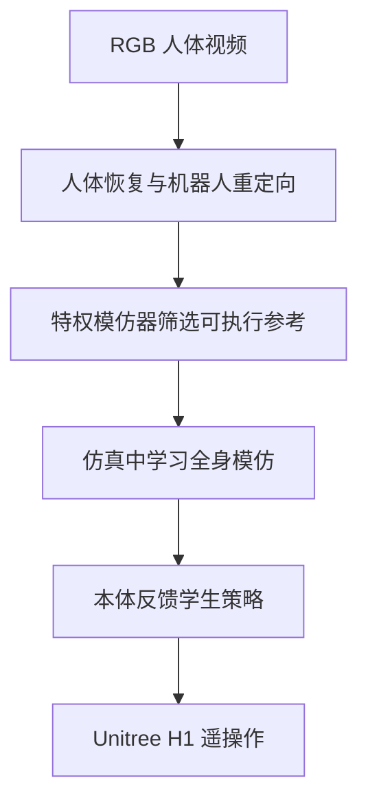

# H2O：学习式人形全身实时遥操作

## 一句话定义

H2O 将人体动作重定向与物理可执行性筛选结合，再训练从机器人状态纠偏的全身模仿策略。

## 英文缩写速查

| 缩写 | 英文全称 | 说明 |
|---|---|---|
| RGB | Red-Green-Blue | 普通彩色视频输入 |
| RL | Reinforcement Learning | 学习动作模仿策略 |
| MoCap | Motion Capture | 动作参考和根部速度来源 |

## 流程总览

## 方法与部署边界

论文提出可扩展的 sim-to-data 流程，以特权模仿器筛选可执行人体动作，再训练实时全身策略。论文报告 H1 上行走、后跳、踢腿、转身、挥手、推和拳击等动作的零样本部署。实际遥操作仍依赖外部动捕提供根部线速度；因此，低层动作跟踪闭环并不等同于纯机载定位。

## 结论

- 参考筛选将动作数据与机器人动力学限制连接起来。
- 教师—学生训练缩小部署策略的观测范围。
- 真机根部速度的外部来源是部署边界。
- H1 结果不自动外推到其他本体。

## 参考来源

- [H2O 论文档案](../../sources/papers/pai_awesome_2403_04436_h2o-human-to-humanoid-real-time-whol.md)
- [arXiv:2403.04436](https://arxiv.org/abs/2403.04436)
- [项目页](https://human2humanoid.com/)
