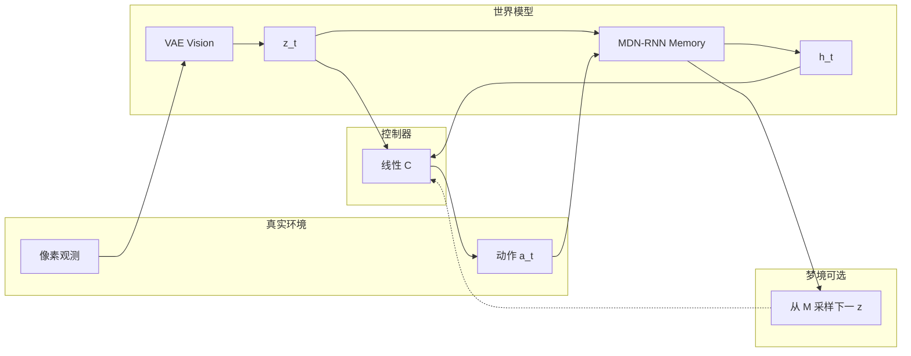
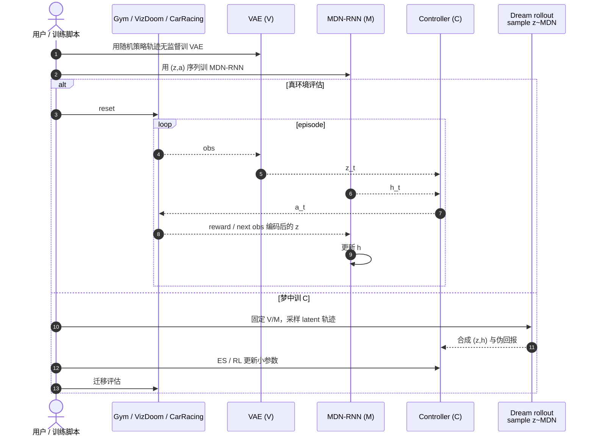

# World Models（Ha & Schmidhuber）

**World Models**（[arXiv:1803.10122](https://arxiv.org/abs/1803.10122)，2018，David Ha · **谷歌（Google Brain）** / Jürgen Schmidhuber · IDSIA；[交互式论文](https://worldmodels.github.io/)，[实验仓](https://github.com/hardmaru/WorldModelsExperiments)）把智能体拆成大容量 **世界模型** 与极小 **控制器**：先无监督学视觉压缩与时序预测，再在模型生成的「梦境」里优化策略并迁回真实环境。

## 一句话定义

**用 VAE + MDN-RNN 学压缩时空动力学，把信用分配压到小控制器上，并可完全在潜空间生成环境中训练策略。**

## 英文缩写速查

| 缩写 | 英文全称 | 简要说明 |
|------|----------|----------|
| WM | World Models | 本文标题方法；亦泛指学环境模型的智能体组件 |
| VAE | Variational Autoencoder | Vision（V）：把像素帧压成 latent \(z_t\) |
| MDN-RNN | Mixture Density Network RNN | Memory（M）：预测下一 \(z\) 的混合密度 |
| RNN | Recurrent Neural Network | 承载时序隐状态 \(h_t\) |
| ES | Evolution Strategies | 原文常用以优化小控制器参数 |
| RL | Reinforcement Learning | 控制器也可接常规策略梯度；本文强调与大模型解耦 |

## 为什么重要

- **范式原型：** 「大世界模型 + 小策略」直接回应稀疏回报下难训大网络的信用分配瓶颈。
- **梦中训练：** 明确展示 *train inside the dream, transfer to reality*，成为后续 latent imagination / 虚拟沙盒叙事的早期锚点。
- **物理保真度读法：** 在 [输出轴策展](../overview/world-model-physics-fidelity-outputs.md) 中属 **低维潜在状态** 族——快、可滚动，但压缩可能丢掉接触与动量细节。
- **谱系起点：** 后续 [PlaNet](./paper-planet-latent-dynamics.md)、[DreamerV3](./paper-shenlan-wm-13-dreamerv3.md)、[TD-MPC2](./paper-td-mpc2.md) 在「潜动态 + 规划/想象」上深化；[UniSim](./paper-unisim.md) 则转向视频级可检查模拟。

## 核心信息

| 字段 | 内容 |
|------|------|
| 论文 | World Models |
| arXiv | [1803.10122](https://arxiv.org/abs/1803.10122) |
| 作者 | David Ha、Jürgen Schmidhuber |
| 机构 | 谷歌（Google Brain）；IDSIA / NNAISENSE |
| 结构 | V (VAE) + M (MDN-RNN) + C（线性控制器） |
| 交互入口 | [worldmodels.github.io](https://worldmodels.github.io/) |
| 开源 | **已开源**（交互站 + [WorldModelsExperiments](https://github.com/hardmaru/WorldModelsExperiments)） |
| 输出族 | 低维 latent \(z_t\) / \(h_t\)（非像素视频主输出） |

## 流程总览

## 核心原理 / 机制

### Vision（V）

每帧高维观测经 **VAE** 压成低维 \(z_t\)，学习可重建的空间压缩码；后续策略与记忆只消费 \(z\)，不直接吃像素。

### Memory（M）

**MDN-RNN** 建模 \(P(z_{t+1}\mid a_t,z_t,h_t)\)：输出混合高斯参数，采样得到下一 latent。温度 \(\tau\) 调节采样随机性——偏高可抑制控制器钻模型漏洞，但过噪会伤性能。

### Controller（C）

刻意保持极简（常为线性）：\(a_t = W_c[z_t;h_t]+b_c\)。复杂时空结构由 V/M 承担，进化策略或 RL 只在小参数空间做信用分配。

### 在梦中训练

可用 M 生成的 latent 轨迹完全替代真实 env 来优化 C，再把策略迁回 Gym 等真实环境。迁移成败取决于模型保真与 \(\tau\) 选择——这正是后来「画面/潜变量像不像物理」讨论的前身。

## 工程实践

| 项 | 实践要点 |
|----|----------|
| 开源状态 | **已开源**：以 [交互式论文](https://worldmodels.github.io/) 为官方阅读/演示入口；实验代码见 [`sources/repos/world-models-experiments.md`](../../sources/repos/world-models-experiments.md)。另有大量第三方复现，选型时核对年代与依赖。 |
| 复现预期 | 历史 TensorFlow / Gym 栈；非 2020s 默认脚手架。读交互站 + 对照实验仓即可对齐概念。 |
| 温度 \(\tau\) | 梦中训练必调；过低易利用模型伪动力学，过高策略过于保守。 |
| 选型 | 需要理解「潜状态 WM」源头时读本页；要生产级 latent MPC / 想象 RL 见 [TD-MPC2](./paper-td-mpc2.md) / [DreamerV3](./paper-shenlan-wm-13-dreamerv3.md)。 |
| 源码运行时序图 | 见下节（对齐实验仓叙事；非单一现代 CLI）。 |

## 源码运行时序图

节点对齐 [`sources/repos/world-models-experiments.md`](../../sources/repos/world-models-experiments.md) 与交互站 Agent 伪代码。

- **最短概念复现：** 打开 [worldmodels.github.io](https://worldmodels.github.io/) 交互 demo → 对照实验仓目录跑历史脚本。
- **注意：** 仓库偏历史维护；新工作更宜借鉴结构，而非直接依赖其环境锁定。

## 实验与评测

| 轴 | 报告口径（以论文 / 交互站为准） |
|----|--------------------------------|
| CarRacing-v0 | 从像素学世界模型后，小控制器可达当时强基线；强调特征来自 V/M |
| VizDoom Take Cover | 可在梦中训策略并迁移；\(\tau\) 影响是否「作弊」模型 |
| 控制器规模 | 参数量远小于端到端像素策略网络 |
| 消融直觉 | 无 M / 差 \(\tau\) 时迁移与稳定性显著变差 |

量化数字以 PDF 与交互站图表为准；本页作机制与谱系坐标。

## 结论

**World Models 把「先学压缩世界、再在脑内练小策略」写成可复现的现代模板；潜变量快但不自动等于物理保真。**

1. **V–M–C 分工** — 容量进世界模型，信用分配进小 C。
2. **MDN 随机性 + \(\tau\)** — 梦境不确定性是防钻洞的一等公民超参。
3. **可完全无真实交互训 C** — 迁移质量受模型误差边界约束。
4. **输出是 latent 而非视频** — 读物理保真度时归入低维潜状态族。
5. **工程入口** — 交互站为主、实验仓为辅；生产向请前出到 Dreamer / TD-MPC2。
6. **谱系价值** — 理解 PlaNet「潜空间规划」与 Dreamer「想象中学策略」的共同祖先。

## 局限与风险

- **模型漏洞：** 策略可利用不真实的梦境捷径；\(\tau\) 与随机性不能完全消除。
- **保真度：** latent 重建好看 ≠ 接触/动量正确（见 [物理保真度输出轴](../overview/world-model-physics-fidelity-outputs.md)）。
- **历史栈：** 官方交互站强，训练依赖生态陈旧。
- **任务域：** 以游戏/简易控制为主，不直接覆盖真机操纵评测协议。

## 与其他工作对比

| 对比轴 | World Models | [PlaNet](./paper-planet-latent-dynamics.md) | [DreamerV3](./paper-shenlan-wm-13-dreamerv3.md) | [UniSim](./paper-unisim.md) |
|--------|--------------|-----------------------------------------------|--------------------------------------------------|------------------------------|
| 核心用法 | 梦中训小 C | 潜空间 CEM 规划 | 想象轨迹上 actor-critic | 视频交互模拟器 |
| 表示 | VAE \(z\) + RNN \(h\) | RSSM | RSSM + 稳健技巧 | 像素/视频轨迹 |
| 开源 | 交互站 + 实验仓 | google-research/planet | danijar/dreamerv3 | 仅项目页演示 |
| 时代角色 | 范式原型 | 像素规划突破 | 通配超参巅峰之一 | 生成式真机仿真叙事 |

## 关联页面

- [世界模型物理保真度 × 输出轴](../overview/world-model-physics-fidelity-outputs.md)
- [Model-Based RL](../methods/model-based-rl.md)
- [Latent Imagination](../concepts/latent-imagination.md)
- [Generative World Models](../methods/generative-world-models.md)
- [PlaNet](./paper-planet-latent-dynamics.md) · [DreamerV3](./paper-shenlan-wm-13-dreamerv3.md) · [TD-MPC2](./paper-td-mpc2.md) · [UniSim](./paper-unisim.md)

## 参考来源

- [World Models 论文归档（arXiv:1803.10122）](../../sources/papers/ha_schmidhuber_world_models_arxiv_1803_10122.md)
- [交互式论文站点归档](../../sources/sites/worldmodels-github-io.md)
- [WorldModelsExperiments 代码索引](../../sources/repos/world-models-experiments.md)
- [微信：世界模型物理保真度策展](../../sources/blogs/wechat_embodied_ai_lab_world_model_physics_fidelity.md)

## 推荐继续阅读

- [交互式论文](https://worldmodels.github.io/)
- [arXiv:1803.10122](https://arxiv.org/abs/1803.10122)
- [hardmaru/WorldModelsExperiments](https://github.com/hardmaru/WorldModelsExperiments)
- [PlaNet](./paper-planet-latent-dynamics.md) — 潜空间在线规划下一步
