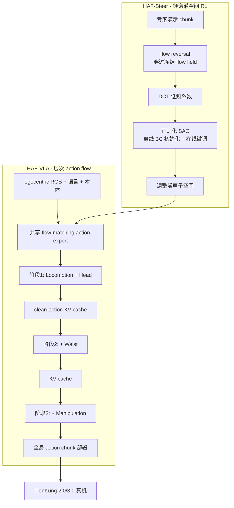

# HAF（Humanoid Adaptation Framework）

**HAF**（*Adapting Generalist VLAs to Humanoid Whole-Body Loco-manipulation via Hierarchical Action Flow and Spectral Latent RL*，arXiv:2608.16837，[项目页](https://grange007.github.io/HAF/)）由北京大学多媒体信息处理全国重点实验室、北京人形机器人创新中心、南开大学与西安交通大学等团队提出：在 **预训练 flow-matching VLA** 上，用 **HAF-VLA** 按运动学依赖分三阶段生成全身动作，再用 **HAF-Steer** 在冻结生成器的 **DCT 压缩噪声子空间** 做离线–在线 **SAC** 微调，把通才 VLA 低成本迁移到 **TienKung 2.0/3.0** 长程家庭 loco-manipulation。

## 一句话定义

**不改 VLA 骨干权重，先用三阶段 action flow 解决全身协调，再在 flow 可逆的频谱潜空间里做轻量 RL，把人形 loco-manipulation 从「能模仿」推到「能部署」。**

## 英文缩写速查

| 缩写 | 英文全称 | 简要说明 |
|------|----------|----------|
| HAF | Humanoid Adaptation Framework | 本文整体框架：HAF-VLA + HAF-Steer |
| VLA | Vision-Language-Action | 视觉–语言–动作统一策略模型 |
| RL | Reinforcement Learning | HAF-Steer 的离线–在线 SAC 后训练 |
| SAC | Soft Actor-Critic | HAF-Steer 使用的正则化 off-policy 算法 |
| DCT | Discrete Cosine Transform | 将时序噪声压到低频系数，构造紧凑潜空间 |
| BC | Behavior Cloning | 离线演示模仿；HAF-VLA 主训练范式 |
| KV | Key-Value cache | 跨阶段 clean-action 条件化机制 |
| OOD | Out-of-Distribution | 未见视觉/位姿扰动下的泛化评测 |

## 核心信息

| 项 | 内容 |
|----|------|
| 机构 | 北京大学计算机学院多媒体信息处理全国重点实验室；北京人形机器人创新中心；南开大学；西安交通大学 |
| 平台 | TienKung 2.0 / TienKung 3.0；头部 egocentric RGB |
| 采集 | 同构遥操作：主臂双手 + 摇杆 locomotion/waist + IMU 头部；每任务 **120** 轨迹 |
| 基线 | ACT、π₀.₅、GR00T N1.7、Cosmos Policy（官方实现与推荐超参） |
| 开源 | **截至 2026-08-20 项目页与 arXiv 均无官方代码/权重链接** |

## 为什么重要

- **通才 VLA 的人形适配瓶颈被拆开：** 单阶段 flow 一次性生成全身动作易破坏 locomotion–waist–manipulation 依赖；HAF-VLA 用 **三阶段去噪 + 跨阶段 KV** 显式建模层次结构，避免为人形重训大规模 foundation model。
- **部署后训练不碰大模型：** 直接 RL 微调 VLA 成本高且真机探索危险；HAF-Steer 利用 **flow reversal + DCT** 把优化限制在紧凑噪声子空间，**冻结** flow generator。
- **同场真机强证据：** 七项长程家庭任务（导航 + 弯腰/蹲下 + 双臂交互）平均归一化任务分 **70.5%**，领先 π₀.₅ **53.3%** 与 GR00T N1.7 **38.1%**。
- **OOD 与后训练增益可量化：** 椅子干扰、起始位姿偏移下仍优于 π₀.₅；HAF-Steer 在 Toy Storage / Basket Transfer 上对两种骨干均有离线–在线提升。

## 流程总览

## 核心原理（详细）

### HAF-VLA

在预训练 **flow-matching VLA** 的 action expert 上，按 **累积 action mask** 分三阶段扩展活跃动作空间：

1. **Locomotion + Head** — 基座移动与头部朝向；
2. **+ Waist** — 躯干姿态调节；
3. **+ Manipulation** — 双臂精细操作。

前一阶段 denoised 的 **clean action** 编码为 **KV cache**，作为后一阶段的条件，配合 **stage embedding** 保留「先稳基座、再调躯干、后做操作」的运动学链。这与单阶段同时去噪全身关节的做法相对，旨在减少不稳定基座运动诱发上肢补偿、进而破坏平衡与操作精度的问题。

### HAF-Steer

离线 BC 策略在分布偏移下常次优。HAF-Steer 不更新 VLA 骨干，而是：

1. 将专家 action chunk **反向**穿过冻结 flow field（利用 flow-matching **可逆性**）；
2. 对得到的时序噪声做 **DCT**，保留 **低频模式** 作为紧凑潜变量；
3. 在该子空间训练 **正则化 SAC**，混合离线演示与在线交互数据。

这样既避免全维时序噪声 RL 的低效，也避免「整个 horizon 重复同一噪声向量」对时序表达力的牺牲。论文报告在 Toy Storage 与 Basket Transfer 上，对 **π₀.₅** 与 **HAF-VLA** 骨干均有增益；不安全探索设置下 **DSRL** 训练被终止（论文自注）。

## 评测与结果

| 任务 | HAF-VLA | π₀.₅ | GR00T N1.7 | Cosmos | ACT |
|------|---------|------|------------|--------|-----|
| Laundry Loading | 66.7 | 53.3 | 40.0 | 0.0 | 10.0 |
| Clothes Retrieval | 53.3 | 53.3 | 33.3 | 26.7 | 23.3 |
| Table Tidy | 80.0 | 70.0 | 40.0 | 16.7 | 23.3 |
| Basket Transfer | 63.3 | 50.0 | 43.3 | 33.3 | 16.7 |
| Toy Storage | 80.0 | 53.3 | 30.0 | 40.0 | 23.3 |
| Ball Tossing | 56.7 | 33.3 | 36.7 | 3.3 | 30.0 |
| Box Transfer | 93.3 | 60.0 | 43.3 | 73.3 | 50.0 |
| **Average** | **70.5** | **53.3** | **38.1** | **27.6** | **25.2** |

> 数值为项目页/论文报告的 **归一化任务分（%）**（里程碑子目标加权），非单纯 pass/fail 成功率。

**OOD 摘录：**

- Laundry Loading 路径旁未知椅子：HAF-VLA **40.0%** vs π₀.₅ **26.7%**；
- Clothes Retrieval 起始后移 20 cm：**43.3%** vs **36.7%**。

## 源码运行时序图

**不适用**：截至入库日（2026-08-20）项目页与 arXiv **均未列出官方 GitHub / 权重 / 数据集链接**，无可运行训练或部署入口。

## 工程实践（含开源状态）

| 项 | 结论 |
|----|------|
| 项目页 | <https://grange007.github.io/HAF/> |
| 论文 | arXiv:2608.16837 |
| 代码/权重 | **确认未开源**（项目页无 Code 区；arXiv 无仓库链接） |
| 机器人 | TienKung 2.0 / 3.0（[X-Humanoid](./x-humanoid.md) 天工系列） |
| 感知 | 头部 egocentric RGB |
| 采集 | 同构遥操作；每任务 120 轨迹 |
| 部署读法 | 先 HAF-VLA BC → 可选 HAF-Steer 真机离线–在线微调；VLA 骨干全程冻结 |

## 结论

**HAF 把「人形全身 VLA」拆成两个正交杠杆：HAF-VLA 用三阶段 action flow 解决运动学协调，HAF-Steer 用频谱潜空间 RL 补 BC 部署差距——二者都不动大模型骨干。**

- 起作用的结构是 **三阶段去噪 + 跨阶段 clean-action KV cache**：把 locomotion/head → waist → manipulation 的依赖写进生成过程，七任务平均 **70.5%** 归一化分，较单阶段 π₀.₅（53.3%）与 GR00T N1.7（38.1%）拉开明显差距。
- **HAF-Steer** 的关键是 **flow reversal + DCT 低频噪声子空间 + 正则化 SAC**：在冻结 flow generator 的前提下做离线–在线微调，避免直接 RL 穿 VLA 的计算与安全成本。
- 证据口径须按 **归一化里程碑任务分** 读，不是二元成功率；长程任务（Box Transfer 93.3%、Table Tidy 80.0%）与弱基线任务（Cosmos 在 Laundry Loading 为 0.0%）并存，不宜跨任务简单平均外推。
- 落地风险：**每任务仅 120 条演示**、双平台天工、**无开源**——复现依赖未来代码发布与同构遥操作栈对齐。
- 与 [ROVE](./paper-rove-humanoid-vla-intervention.md)（人机干预 + OVE 价值提取）和 [Green-VLA](./paper-greenvla-staged-vla-humanoid.md)（五阶段课程 + IQL 轨迹修正）对照时，HAF 占 **「层次 flow 生成 + 频谱噪声 RL」** 这一格，且评测聚焦 **家庭 loco-manipulation** 而非桌面短程操作。

## 局限与风险

- **未开源**：截至入库日无法复现训练、flow reversal 实现与 SAC 超参细节。
- **数据规模有限**：每任务 120 轨迹，对七项异构长程任务的覆盖偏紧。
- **平台绑定**：实验集中在天工 2.0/3.0 与同构遥操作接口，换平台需重做阶段 mask 与采集协议。
- **RL 安全边界**：论文注明不安全探索下 DSRL 被终止；HAF-Steer 真机迭代仍需人工监督与安全策略。
- **指标解读**：归一化任务分利于长程部分进度，但与社区常用的二元 SR 不可直接对比。

## 与其他工作对比

| 维度 | HAF | π₀.₅ | GR00T N1.7 | WholeBodyVLA | ROVE |
|------|-----|------|------------|--------------|------|
| 全身生成 | **三阶段 action flow + KV** | 单阶段 flow | 人形 foundation flow | latent VLA + LMO 低层 RL | 预训练 VLA + 干预数据 |
| 后训练 | **DCT 潜空间 SAC（冻骨干）** | RECAP 等 | — | LMO 50 Hz RL | OVE + advantage conditioning |
| 数据需求 | 每任务 120 演示 + 通才 VLA 底座 | 大规模异构预训练 | 人形大规模预训练 | action-free 视频 + 演示 | 部署干预轨迹 |
| 真机证据 | 七任务家庭 loco-manip **70.5%** 均分 | 同场 **53.3%** | 同场 **38.1%** | Agibot 重载演示为主 | 接触丰富操作迭代提升 |
| 开源 | **未开源** | openpi 等 | Isaac-GR00T | 仓存在但无开源时间表 | 项目页为主 |

## 关联页面

- [VLA](../methods/vla.md) — 通才 VLA 与人形后训练路线总览
- [Loco-Manipulation](../tasks/loco-manipulation.md) — 移动操作任务与全身协调
- [Behavior Cloning](../methods/behavior-cloning.md) — HAF-VLA 离线模仿主线
- [π₀.₅](./paper-pi05-open-world-vla.md) — 主要 flow-matching 基线之一
- [GR00T N1](./paper-hrl-stack-34-gr00t_n1.md) — 人形 foundation VLA 基线
- [WholeBodyVLA](./paper-hrl-stack-30-wholebodyvla.md) — 另一套全身 VLA + 低层执行器分层
- [ROVE](./paper-rove-humanoid-vla-intervention.md) — 人形 VLA 部署后训练另一路径
- [X-Humanoid](./x-humanoid.md) — 天工硬件与开源生态

## 参考来源

- [HAF 论文摘录（arXiv:2608.16837）](../../sources/papers/haf_arxiv_2608_16837.md)
- [HAF 项目页归档](../../sources/sites/haf-github-io.md)

## 推荐继续阅读

- 论文 HTML：<https://arxiv.org/html/2608.16837>
- 论文 PDF：<https://arxiv.org/pdf/2608.16837>
- 项目页：<https://grange007.github.io/HAF/>
- Black et al., *π₀.₅: A Vision-Language-Action Model with Open-World Generalization*
- Bjorck et al., *GR00T N1: An Open Foundation Model for Generalist Humanoid Robots*
