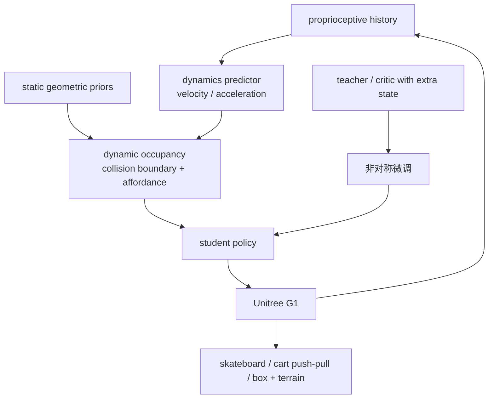
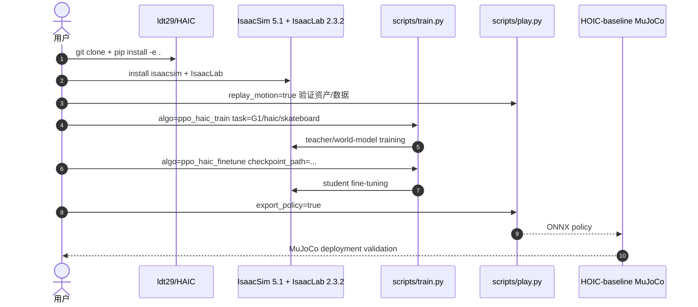

# HAIC

**HAIC**（*Humanoid Agile Object Interaction Control via Dynamics-Aware World Model*）解决的是 **underactuated objects**：滑板、手推车、载物车这类对象有独立动力学和非完整约束，状态还常被人体/物体遮挡。HAIC 用动力学感知世界模型从本体历史推断对象高阶状态，并把预测投影到几何先验上，帮助策略在视觉盲区中做接触决策。

## 一句话定义

HAIC 用 dynamics-aware world model 将本体历史转成对象速度/加速度和动态占据表示，使人形机器人能稳定操控滑板、推车、拉车和复合地形载物任务。

## 英文缩写速查

| 缩写 | 英文全称 | 简要说明 |
|------|----------|----------|
| HAIC | Humanoid Agile Object Interaction Control | 本文框架名 |
| WM | World Model | 从本体历史预测对象高阶动力学状态 |
| HOI | Humanoid-Object Interaction | 欠驱动物体交互任务 |
| G1 | Unitree G1 Humanoid | 论文真机平台 |
| Sim2Sim | Simulation to Simulation | Isaac Sim 策略到 MuJoCo 验证/部署 |
| RSS | Robotics: Science and Systems | HAIC 发表会议 |

## 为什么重要

- **对象不是刚性末端附属物**：推/拉车、滑板等非完整系统会滞后、惯性扰动、遮挡视觉，不适合只用末端位姿跟踪。
- **世界模型预测物理后果**：HAIC 不预测图像，而预测对象 velocity/acceleration 等高阶状态，再投影成 dynamic occupancy。
- **只靠本体历史也能补视觉盲区**：当箱子遮挡地面或车体遮挡状态时，策略仍可利用 proprioception 推断接触后果。
- **代码开放度高**：官方 `ldt29/HAIC` 已发布 asset、环境/任务配置、world model、训练、评估/play 脚本和 Sim2Sim 部署入口。

## 流程总览

## 核心原理（详细）

HAIC 的 world model 从可部署的本体历史推断对象高阶状态，而不是依赖外部状态估计。预测出的 velocity/acceleration 被投影到静态几何先验，形成空间接地的 dynamic occupancy：哪里会碰撞、哪里可接触、对象会怎样反作用于机器人。训练采用非对称微调：世界模型持续适配 student policy 的探索分布，使 teacher 侧监督和 student 侧 rollout 分布保持一致。

项目页展示三类核心能力：欠驱动物体（skateboard、cart pushing、cart pulling）、顺序交互（先装箱再推/拉车运输）、复合地形（斜坡、楼梯、平台）。

## 关键实验数字

| 项 | 数字/结论 |
|----|-----------|
| 箱子尺寸泛化 | 0.5-1.3 kg，长度 30-40 cm |
| 地形旋转泛化 | 0°、30°、45° |
| 拉车负载 | 0-20 kg |
| 推车负载 | 0-70 kg |
| 公开代码 | 2026-06-08 发布训练/评估；2026-06-10 发布 MuJoCo Sim2Sim（HOIC-baseline） |

## 源码运行时序图

官方代码 [ldt29/HAIC](https://github.com/ldt29/HAIC) 已包含 `scripts/train.py`、`scripts/play.py`、`active_adaptation/assets`、world model 与 task config；Sim2Sim 由 [Cybercal/HOIC-baseline](https://github.com/Cybercal/HOIC-baseline) 承接。

## 工程实践（含开源状态）

| 项 | 结论 |
|----|------|
| 项目页 | <https://haic-humanoid.github.io/> |
| 官方代码 | <https://github.com/ldt29/HAIC>，已发布训练/评估/play/asset/world model |
| Sim2Sim | <https://github.com/Cybercal/HOIC-baseline> |
| 依赖 | Python 3.11、IsaacSim 5.1.0、IsaacLab 2.3.2 |
| 任务入口 | `python scripts/train.py algo=ppo_haic_train task=G1/haic/skateboard` |
| 导出 | `python scripts/play.py ... export_policy=true` |

## 与其他工作对比

| 维度 | HAIC | 末端位姿跟踪（刚性物体假设） | 图像预测世界模型（Dreamer 类） | 外部 / 视觉状态估计 |
|------|------|-------------------------------|----------------------------------|----------------------|
| 对象建模 | **欠驱动 / 非完整对象**（滑板、推拉车） | 刚性末端附属物 | 不显式区分对象动力学 | 依赖可观测对象状态 |
| 世界模型预测目标 | 对象 velocity / acceleration 等**高阶状态** | 无 | 预测未来**图像** | 无预测，直接估计 |
| 视觉盲区鲁棒 | **仅本体历史即可补盲区** | 遮挡时退化 | 依赖视觉输入 | 遮挡 / 失真时失效 |
| 空间接地 | 高阶预测投影到静态几何先验成 dynamic occupancy | 末端位姿 | latent / 像素空间 | 观测坐标系 |
| 训练范式 | 非对称微调，world model 持续适配 student 分布 | 常规 RL / 跟踪 | model-based RL | 感知 + 控制解耦 |

## 局限与风险

- **文档仍不完整**：官方 README 已发布训练、评估与 Sim2Sim 入口，但 setup / usage 文档仍标为待补充。
- **对象动力学类别有限**：滑板/推车/拉车覆盖非完整和欠驱动，但离柔性/流体/多人协作仍远。
- **world model 依赖训练分布**：负载与地形泛化很强，但极端接触或新几何仍可能失效。
- **高层语义不在核心**：HAIC 是身体层/世界模型控制，不是完整 VLA 任务规划器。

## 关联页面

- [HAIC 方法页](../methods/haic.md)
- [Loco-Manip 接触分类 05：VLA 与世界模型调用](../overview/loco-manip-contact-category-05-vla-world-models.md)
- [人形 RL 身体系统栈](../overview/humanoid-rl-motion-control-body-system-stack.md)
- [Model-Based RL](../methods/model-based-rl.md)
- [Privileged Training](../concepts/privileged-training.md)
- [OpenHLM](./paper-loco-manip-161-154-openhlm.md)

## 参考来源

- [humanoid_rl_stack_38_haic_humanoid_agile_object_interaction_control_v.md](../../sources/papers/humanoid_rl_stack_38_haic_humanoid_agile_object_interaction_control_v.md)
- [humanoid_rl_stack_42_catalog.md](../../sources/papers/humanoid_rl_stack_42_catalog.md)
- [wechat_embodied_ai_lab_humanoid_rl_motion_survey.md](../../sources/blogs/wechat_embodied_ai_lab_humanoid_rl_motion_survey.md)
- [loco-manip-contact-category-05-vla-world-models](../overview/loco-manip-contact-category-05-vla-world-models.md)
- [wechat_embodied_ai_lab_loco_manip_contact_survey.md](../../sources/blogs/wechat_embodied_ai_lab_loco_manip_contact_survey.md)
- Li et al., *HAIC: Humanoid Agile Object Interaction Control via Dynamics-Aware World Model*, RSS 2026 / arXiv:2602.11758. <https://arxiv.org/abs/2602.11758>
- 官方代码：<https://github.com/ldt29/HAIC>

## 推荐继续阅读

- [HAIC 项目页](https://haic-humanoid.github.io/)
- [HAIC GitHub](https://github.com/ldt29/HAIC)
- [HOIC-baseline Sim2Sim](https://github.com/Cybercal/HOIC-baseline)
