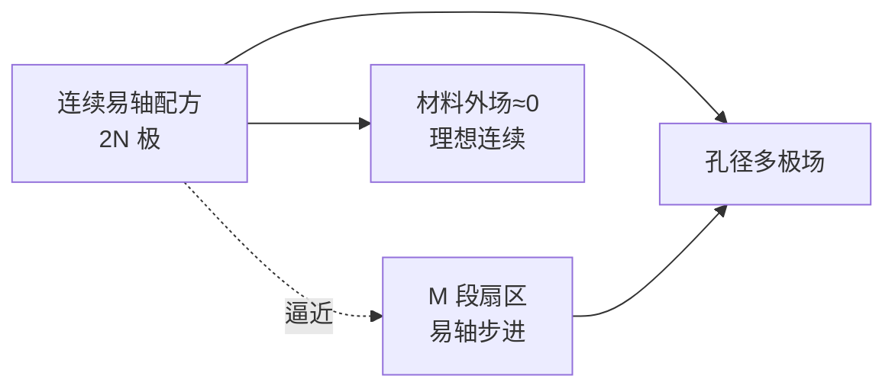

# Design of permanent multipole magnets with oriented REC（Halbach 1980）

## 一句话定义

**K. Halbach（Lawrence Berkeley Laboratory，[Nucl. Instrum. Methods 1980](https://doi.org/10.1016/0029-554X(80)90094-4)）** 系统给出 **定向稀土钴（REC）永磁多极** 的解析设计：易轴旋转定理、理想连续 \(2N\) 极易轴配方（材料外场理想为零），以及可制造的 **分段逼近**——「Halbach 阵列」圆柱/多极几何的奠基一手文。

## 英文缩写速查

| 缩写 | 英文全称 | 简要说明 |
|------|----------|----------|
| REC | Rare Earth Cobalt | 稀土钴永磁材料 |
| LBL / LBNL | Lawrence Berkeley Laboratory / National Laboratory | 作者单位（稿本 LBL-9604） |
| NIM | Nuclear Instruments and Methods | 发表期刊 |
| PM | Permanent Magnet | 永磁体 |
| OA | Open Access | 本文有 eScholarship 绿色 OA PDF |

## 为什么重要

- 把「旋转易轴 → 单侧/孔径聚磁」写成 **可计算配方**，而不只是定性图示。
- **分段磁钢** 的谐波结构（\(n=N+kM\)）直接解释为何 DIY 90° 步进仍近似可用、却有纹波。
- 对开源关节：理解 [Ironless](./ironless-qdd-actuator.md)「无铁芯 + Halbach」在磁路上对标的是 **外场削弱 / 气隙增强**，不是加速器四极的 1.4 T 指标本身。

## 核心信息

| 项 | 内容 |
|----|------|
| **机构** | 劳伦斯伯克利国家实验室（Lawrence Berkeley National Laboratory） / UC Berkeley |
| **材料** | 定向 REC；\(B(H)\) 易轴近线性、\(\mu_r\sim 1\) |
| **关键结果** | 理想多极孔径场；材料外场可为零；分段可造 |
| **四极叙事** | 孔径场约 **1.2–1.4 T**（当时材料） |
| **全文** | **绿色 OA**：eScholarship / LBL-9604 PDF |
| **开源代码** | **不适用** |

## 方法

### 1）REC 本构与易轴旋转定理

- 易轴：\(B_\parallel/\mu_0 \approx H_\parallel + H_c\)；垂向近真空磁导。
- **Easy Axis Rotation Theorem：** 无软磁二维系统中，全体易轴 \(+\phi\) → 材料外磁场方向 \(-\phi\)、幅度不变。

### 2）连续易轴 \(2N\) 极

- 在 \(r_1\le r\le r_2\) 圆环内按角度配方取向（文中 equ. 20 族），使孔径展开只保留目标多极；**径向外部场理想为零**。

### 3）分段多极

- \(M\) 块相同扇区；相邻块易轴在固定系前进 \((N+1)2\pi/M\)。
- 合成谐波仅当 \(n=N+kM\)；逼近连续极限。

## 实验与评测

- 以解析与设计公式为主；强调相对常导电磁铁：小孔径无电流密度冷却瓶颈，场强可与常规磁体比肩或更强。
- 预告线性 undulator、螺线管型、三维螺旋结构——后续 Halbach 家族扩展。

## 与其他工作对比

| 工作 | 关系 |
|------|------|
| [Mallinson 1973](./paper-mallinson-one-sided-fluxes.md) | 平面单侧；本文推到圆柱/多极与可计算分段 |
| [Zhu & Howe 2001](./paper-zhu-howe-halbach-pm-machines-review.md) | 电机转子实现与应用综述 |
| Blewett 1965（文中引用） | 曾给 \(N=1,2\) 场式但未给各向异性易轴配方 |

## 结论

**总判：** 这是圆柱/多极 Halbach 几何的一手奠基；学关节电机 Halbach 必须读到「连续配方 vs 分段谐波」这一层。

- 外场为零是 **理想连续** 极限性质，不是任意粘磁钢的保证。
- 分段设计用 \(M\) 与 \(N\) 控制主要谐波族。
- 易轴旋转定理是快速心算工具：转磁化 ≈ 反转外场方向。
- 加速器四极特斯拉数 **不可** 直接当机器人关节气隙指标。
- 全文可从 eScholarship 合法下载，优先精读 §3–§4。

## 源码运行时序图

**不适用**（设计/理论论文，无软件仓）。工程复现入口见 [Ironless FEMM](./ironless-qdd-actuator.md)。

## 工程实践

| 项 | 说明 |
|----|------|
| 获取 | <https://escholarship.org/content/qt20b829tr/qt20b829tr.pdf> |
| 对照样机 | Ironless：Halbach×铁背四象限静态转矩 |
| 设计流程位 | 接 [电机设计流程](../overview/motor-design-workflow.md) 拓扑阶段的磁钢取向决策 |

## 局限与风险

- 材料语境是 **REC**；现代 NdFeB 需重标 \(B_r,H_c\) 与退磁曲线。
- OCR/扫描稿公式符号易糊，引用时以期刊版/DOI 为准。

## 关联页面

- [Halbach Array 概念](../concepts/halbach-array.md)
- [Mallinson 1973](./paper-mallinson-one-sided-fluxes.md) · [Zhu & Howe 2001](./paper-zhu-howe-halbach-pm-machines-review.md)
- [Ironless QDD](./ironless-qdd-actuator.md)

## 参考来源

- [sources/papers/halbach_permanent_multipole_magnets_1980.md](../../sources/papers/halbach_permanent_multipole_magnets_1980.md)

## 推荐继续阅读

- OA PDF：<https://escholarship.org/content/qt20b829tr/qt20b829tr.pdf>
- DOI：<https://doi.org/10.1016/0029-554X(80)90094-4>
