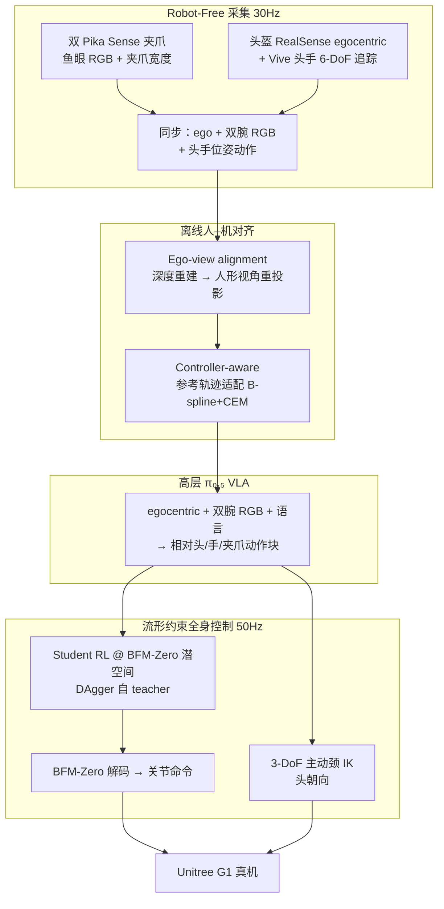

# HALOMI（Learning Humanoid Loco-Manipulation with Active Perception from Human Demonstrations）

**HALOMI**（*Humanoid Active-Perception Loco-Manipulation Interface*，arXiv:2606.18772，[项目页](https://halomi-humanoid.github.io)）提出从 **人类无机器人示范** 学习 **人形全身 loco-manipulation + 主动感知** 的可扩展框架：在 **Universal Manipulation Interface（UMI）** 双夹爪采集之上叠加 **可穿戴 egocentric 头手追踪**，用 **BFM-Zero 行为流形上的 RL 全身控制器** 执行稀疏世界系头手目标，并以 **ego-view 对齐** 与 **控制器感知参考轨迹适配** 缓解观测与执行两侧的人–机鸿沟；高层 **π₀.₅ VLA** 在 **Unitree G1 + 3-DoF 主动颈** 上验证五项真机任务。

## 英文缩写速查

| 缩写 | 英文全称 | 简要说明 |
|------|----------|----------|
| HALOMI | Humanoid Active-Perception Loco-Manipulation Interface | 本文提出的无机器人 egocentric 示范→人形 loco-manipulation 全栈 |
| UMI | Universal Manipulation Interface | 手持夹爪+腕部相机的便携无机器人示教接口 |
| VLA | Vision-Language-Action | 视觉-语言-动作多模态策略，本文高层骨干为 π₀.₅ |
| WBC | Whole-Body Control | 协调全身关节满足平衡与跟踪的低层执行 |
| RL | Reinforcement Learning | 在 BFM-Zero 潜空间上训练头手跟踪策略 |
| DAgger | Dataset Aggregation | 将 teacher 蒸馏为可部署 student 的迭代模仿方法 |
| G1 | Unitree G1 Humanoid | 宇树教育科研人形，论文加装 Pika 夹爪与主动颈 |
| OOD | Out-of-Distribution | 分布外目标或场景，考验控制器与策略鲁棒性 |
| CEM | Cross-Entropy Method | 用于参考轨迹 B-spline 控制点优化的采样优化 |
| RGB | Red-Green-Blue | 本文三路同步视觉：egocentric + 双 gripper-centric |

## 为什么重要

- **主动感知写入数据闭环**：人类示范中的 **凝视切换**（搜索柜子、对准篮子等）与动作共生成；论文 ablation 表明关主动颈可使 Towel 任务 **80%→10%**，说明仅「能看清」不够，需 **复现手眼耦合**。
- **稀疏头手接口降低采集负担**：相对 [HuMI](./paper-notebook-humanoid-manipulation-interface.md)、[BifrostUMI](./paper-bifrost-umi.md) 的骨盆/脚参考，演示者 **只操作头与双手**，下身由控制器推断——更贴近 UMI 便携性，但把难题转移到 **世界系跟踪控制器**。
- **流形约束解决 OOD 跟踪脆性**：直接在关节空间追世界系关键点易多模态、激进失稳；在 **[BFM-Zero](./paper-bfm-zero.md) 潜空间** 规划再解码，是「稀疏任务空间 + 行为先验 WBC」的清晰实例。
- **离线「控制器感知」适配**：不只几何重定向，还在仿真中 **按 WBC 闭环误差** 修正头手参考（B-spline + CEM），把执行误差从 ingest 阶段消化，对长时域闭环部署很实用。
- **真机证据扎实**：三项定量任务（各 20 rollouts）成功率 **90% / 85% / 80%**；ego-view 对齐消融显示 Bag Transfer **90%→10%**，量化 embodiment gap 的主因。

## 流程总览

## 核心机制（归纳）

### 1）UMI 增强的 egocentric 采集

| 模态 | 硬件 | 用途 |
|------|------|------|
| 双手轨迹 + 夹爪 | Agilex Pika Sense ×2 | 与机载 Pika 几何/相机对齐，减小腕部观测 gap |
| 头部位姿 + ego RGB | 头盔 RealSense D435i + Vive Tracker | 主动感知示范与策略输入 |
| 追踪 | Lighthouse 基站 | 头与双手毫米级 6-DoF，30 Hz |

动作空间统一为 **左右手 SE(3) + 头位置/朝向 + 夹爪**；**不记录** 骨盆/脚，下身留给控制器补全。

### 2）流形约束头手全身控制器

- **颈–体解耦**：G1 原机无独立颈；自研 **3-DoF 伺服颈** 承担头朝向，避免小幅转头牵动大幅躯干/步态。
- **Teacher**：特权观测含未来参考与全身关键点误差，在 **BFM-Zero 128-D 潜命令** 上 PPO 训练，再投影到球形潜空间由冻结 BFM 解码关节。
- **Student**：仅头手世界系跟踪误差 + 本体历史，DAgger 模仿 teacher；部署时 **50 Hz** 跟踪 VLA 流式目标。
- **对比**：raw action-space 世界系跟踪在 OOD 大跳变下失稳（项目页与 Fig.6）；流形约束保持 **可行、非激进** 全身行为。

### 3）离线 embodiment 处理

- **Ego-view alignment**（沿用 EgoHumanoid）：单目深度 → 3D 场景 → 重投影至人形相机 → inpainting。
- **Controller-aware reference adaptation**：仿真 rollout 原始参考，拟合 B-spline 残差，**全局 + 分窗局部 CEM** 并行优化；仅当改进跟踪得分才接受新参考。三任务平均跟踪误差降约 **6.7%**，Pick Bread 成功率 **75%→85%**。

### 4）高层 VLA 与部署

- 在处理后人数据上微调 **π₀.₅**；动作块为 FastUMI 式 **相对** 左/右手/头位姿 + 夹爪。
- 异步 **30 Hz** 图像缓冲取最新同步帧；相对块锚定当前绝对位姿后转 **世界系笛卡尔目标** 送低层控制器。

### 5）实验摘要（论文报告）

| 任务 | 示范数 | 成功率 | 备注 |
|------|--------|--------|------|
| Bag Transfer | 102 | 90% | 长距导航 + 主动视觉搜索 |
| Pick Bread and Place | 95 | 85% | 桌面 pick-place |
| Transfer Towel to Basket | 96 | 80% | 双手 + 全身协调 |
| Squat-and-Grasp | — | 定性 | 深蹲抓取 |
| Tossing | — | 定性 | 动态抛掷 |

**主动感知 ablation**：关颈后 Bag Transfer **30%**、Towel **10%**；Pick Bread 即使静态视角够用，关颈仍 **85%→20%**（手眼耦合被破坏）。

## 常见误区或局限

- **不是「端到端关节模仿」**：成功依赖 **BFM 先验 WBC + 颈机构 + 离线适配** 三件套；缺任一环节，稀疏头手接口易崩溃。
- **相对布局泛化有限**：改变面包–盘子 **相对几何** 时成功率 **0/10**——头手轨迹空间未覆盖新放置相位。
- **硬件对齐成本**：Vive 基站、头盔、Pika 双端一致性、主动颈改装仍高于纯桌面 UMI，但低于整机遥操作机房。
- **与骨盆/脚接口路线取舍**：HuMI/BifrostUMI 显式下身参考利于 VLA 预测步态，HALOMI 把下身 **隐式交给 WBC**——长时域漂移需靠相对头手表示与控制器鲁棒性补偿。

## 关联页面

- [Loco-Manipulation](../tasks/loco-manipulation.md) — 任务语境与相邻数据入口
- [Teleoperation](../tasks/teleoperation.md) — Robot-Free 示范采集谱系
- [BFM-Zero](./paper-bfm-zero.md) — 全身行为先验与潜空间跟踪
- [BifrostUMI](./paper-bifrost-umi.md) — 五关键点 + 下身参考的无机器人对照
- [HuMI（计划实体）](./paper-notebook-humanoid-manipulation-interface.md) — Vive+UMI 全身示范对照
- [EgoMI（计划实体）](./paper-notebook-egomi-learning-active-vision-and-whole-body-mani.md) — 主动视觉 + 记忆策略的并行路线
- [Behavior Foundation Model](./paper-behavior-foundation-model-humanoid.md) — BFM 谱系总览
- [Whole-Body Control](../concepts/whole-body-control.md)
- [Imitation Learning](../methods/imitation-learning.md)
- [VLA](../methods/vla.md)
- [Unitree G1](./unitree-g1.md)

## 参考来源

- [sources/papers/halomi_arxiv_2606_18772.md](../../sources/papers/halomi_arxiv_2606_18772.md)
- [sources/sites/halomi-humanoid-project.md](../../sources/sites/halomi-humanoid-project.md)
- Zhao et al., *HALOMI: Learning Humanoid Loco-Manipulation with Active Perception from Human Demonstrations*, arXiv:2606.18772, 2026. <https://arxiv.org/abs/2606.18772>

## 推荐继续阅读

- [HALOMI 项目主页](https://halomi-humanoid.github.io/)
- [arXiv:2606.18772 全文](https://arxiv.org/html/2606.18772v1)
- [HoMMI（arXiv:2603.03243）](https://arxiv.org/abs/2603.03243) — 同 UMI+egocentric 移动操作、显式手眼策略设计对照
- [EgoHumanoid（arXiv:2602.10106）](https://arxiv.org/abs/2602.10106) — ego-view 对齐来源工作
