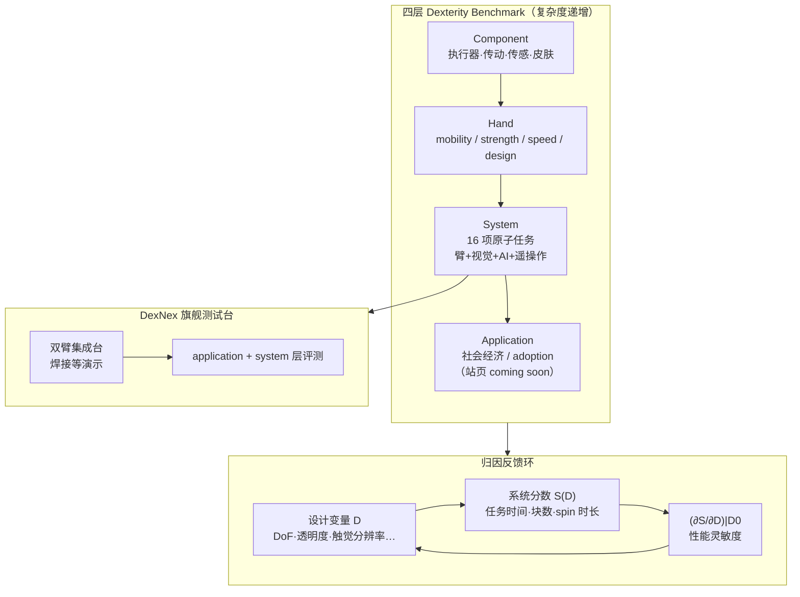

# HAND ERC 多指灵巧手 Dexterity 评测综述

**Benchmarking Dexterity of Multifingered Robot Hands: A Review and Perspective**（arXiv:[2609.05585](https://arxiv.org/abs/2609.05585)，[项目页](https://hand-erc.github.io/benchmarking/)，NSF HAND ERC，拟刊 *Annual Review of Control, Robotics, and Autonomous Systems* Vol. 10, 2027）是 HAND ERC 对**多指机器人手 dexterity 评测**的综述与路线图：把 dexterity 操作化为「通过接触高效、可靠地改变或感知物理世界」，并给出 **application → system → hand → component** 四层 benchmark 以连接**手型/组件设计**与**系统级任务表现**；为旗舰 **DexNex（Dexterity Nexus）** 双臂测试台定义 **16 项短程原子任务**，强调 **in-hand manipulation** 与精细接触力控，而非仅固定抓取搬运。

## 英文缩写速查

| 缩写 | 英文全称 | 简要说明 |
|------|----------|----------|
| HAND ERC | Human AugmentatioN via Dexterity Engineering Research Center | NSF 资助的多机构灵巧研究中心（EEC 2330040） |
| DexNex | Dexterity Nexus | HAND ERC 旗舰集成测试台：手–臂–视觉–AI–遥操作 |
| DoF | Degrees of Freedom | 手/腕关节自由度；低 DoF 手指内操作需接触相对运动 |
| OSC | Object State Complexity | DexBench 等工业规格用的物体状态复杂度六轴（本文不同轴，勿混读） |
| YCB | Yale-CMU-Berkeley Object Set | Box and Blocks 等任务的标准物体集 |
| IL | Imitation Learning | 与本文「硬件归因」轴正交的仿真策略评测范式（见 DexVerse） |

## 核心信息

| 字段 | 内容 |
|------|------|
| 机构 | 西北大学（Northwestern，通讯）、德州农工大学（Texas A&M）、卡内基梅隆大学（CMU）、佛罗里达农工大学（FAMU）等 HAND ERC 联盟 |
| 通讯作者 | Anthony Shilati、Kevin M. Lynch（Northwestern） |
| 项目页 | <https://hand-erc.github.io/benchmarking/> |
| ERC 主页 | <https://hand-erc.org> |
| 规范版本 | Multi-Level Hand Benchmarks **v1 alpha**（站页标注 2026-08） |

## 为什么重要

- **补「灵巧 benchmark 分层 + 归因」缺口：** 现有工作多报 **系统级成功率/吞吐**（仿真 IL 榜或工业任务规格），难回答「拧盖失败是因为触觉分辨率、传动摩擦还是控制带宽」——HAND 用 hand/component 层把 $S(D)$ 对设计变量 $D$ 的灵敏度问题显式化。
- **in-hand manipulation 作为主轴：** 相对平行夹爪 pick-place，综述论证多指手在**指内重定向、工具使用、螺纹/纽扣/筷子**等任务上的不可替代性，任务套件据此选取。
- **DexNex 长期口径：** 16 项原子任务不是一次性论文附录，而是 ERC 旗舰台未来数年演进的**公开任务清单**（YCB/NIST 等可追溯物件 + 完成时间/计数类指标）。
- **与站内仿真/工业 benchmark 互补：** [DexVerse](./paper-dexverse.md) 答「通才策略在百任务仿真上 SR 多少」；[DexBench](./dexbench.md) 答「工业 OSC 下 18 项状态终态规格」；HAND 答「手型设计迭代该看哪一层指标」。

## 流程总览

## 四层框架（归纳）

| 层级 | 测什么 | 典型指标 | 本文/站页状态 |
|------|--------|----------|---------------|
| Application | 制造/康复/物流等 adoption、ROI、人机接受 | （未在本文展开） | 站页 **coming soon** |
| **System** | 短程「原子」灵巧：拧盖、peg-in-hole、筷子、指内转向等 | 完成时间、块数、spin duration | **16 任务** 已发布规格 |
| **Hand** | 手/腕脱离臂与高层 AI 的本体性能 | Kapandji、GRASP taxonomy、pinch/wrap strength、grasp cycle | 指标树已列；部分 design 项暂藏 |
| **Component** | 执行器、传动、传感等「单元测试」 | 输出惯量、effort bandwidth、backdrive effort | 条目 + Northwestern Finger Testbed |

**操作类型三分（Figure 1）：** nonprehensile（推滑）· fixed grasp（抓取后臂运动）· **in-hand manipulation**（物相对掌运动）——后一类是本文 benchmark 选取的核心受益者。

## 系统级 16 项原子任务（DexNex 套件）

| # | 任务 | 主指标 | 备注 |
|---|------|--------|------|
| 1 | Box and Blocks | 60s 转移块数 | YCB Protocol 3a |
| 2 | Peg-in-Hole | Pegs inserted | NIST Assembly Taskboard M1 |
| 3 | Pick Up Flat Object | 完成时间 | 平面薄物抓取 |
| 4 | Tie a Knot | 完成时间 | 柔性体 |
| 5 | Twist Lid on Jar | 完成时间 | 螺纹、持续力控 |
| 6 | Use Screwdriver | 完成时间 | 工具 |
| 7 | Use Scissors | 完成时间 | 刃口对准 |
| 8 | Fasten Button | 完成时间 | 小尺度装配 |
| 9 | In-Hand Reorienting | 完成时间 | **指内操作** |
| 10 | Spin a Top | Spin duration | 动态接触 |
| 11 | Use Chopsticks | 块数/时间 | 工具 + 辅助非抓取 |
| 12 | Blindly Retrieve from Cover | 完成时间 | 遮挡探索 |
| 13 | Bundle Socks | 完成时间 | 可变形体 |
| 14 | Zip a Zipper | 完成时间 | 滑动接触 |
| 15 | Paper Folding | 完成时间 | 折痕/可变形 |
| 16 | Bundle Dowels w/ Rubber Band | 完成时间 | 弹性约束 |

完整物品清单、setup 与约束见 [项目页 benchmarks](https://hand-erc.github.io/benchmarking/benchmarks.html) 与 `data/system.jsonc`。

## 与代表性 benchmark 对比

| 平台 | 主轴 | 分层/归因 | 代码/环境 |
|------|------|-----------|-----------|
| **HAND ERC（本文）** | 多指 dexterity 综述 + DexNex 真机原子任务 | **四层 + 归因** | 规范站公开；**无官方仿真/训练仓** |
| [DexVerse](./paper-dexverse.md) | 100 仿真任务 IL/VLA SR | 系统级策略榜 | Isaac Lab 环境 + 示范已开源 |
| [DexBench](./dexbench.md) | 工业 OSC + 18 任务 | 任务状态规格 | 规范公开；Arena 评测 **coming soon** |
| [DexHoldem](./paper-dexholdem.md) | 真机扑克 SPSR | 桌面博弈协议 | 策略仓已开源 |
| [CHORD](./paper-chord-contact-wrench-dexterous-manipulation.md) | 双手 RL + CWS | 仿真 RL 大规模 | Isaac Lab + 人类演示 |

## 工程实践

| 主题 | 结论 |
|------|------|
| 开源状态 | **规范已公开 / 无可运行官方代码**（步骤 2.5：项目页仅链 arXiv + 静态 JSONC；无 GitHub/HF 评测包） |
| 源码运行时序图 | **不适用** — 无官方训练/推理/部署代码仓；仅有任务规范站与 DexNex 硬件线在研 |
| 复现入口 | 按 `system.jsonc` 自备硬件搭台；Box and Blocks 可对齐 YCB 物件编号 |
| 组件测试 | Northwestern **Finger Testbed**（dynamometer + 动捕）支撑 hand/component 层指标 |
| 读榜注意 | Application 层尚未发布；**勿把 16 任务完成时间与 DexVerse 仿真 SR 或 DexBench OSC 分数横比** |

## 局限与风险

- **综述视角会演进：** 作者明确 HAND ERC 立场会随 DexNex 与新手型更新；不宜把 v1 alpha 任务集当作行业终局标准。
- **系统级任务难归因：** 即便有四层框架，全系统集成任务上 $S(D)$ 仍可能多峰/耦合——hand/component 层是**必要但不充分**的分解。
- **仿真榜未覆盖：** 未提供与 Isaac Lab/MuJoCo 对齐的并行环境；策略研究者应继续用 DexVerse 等，HAND 用于**硬件与任务口径**。
- **Application 层空缺：** 制造 ROI、康复接受度等仍 coming soon，当前无法支撑「商业化 dexterity」端到端论证。

## 结论

**HAND ERC 综述的价值是把「灵巧手 benchmark」从单一系统成功率表，扩展成可反馈手型设计的四层指标栈，并用 16 项 DexNex 原子任务把 in-hand manipulation 钉成可复测对象。**

- 选型时先问**测哪一层**：策略 IL 榜看 DexVerse；工业采购规格看 DexBench；**手型/传动/触觉迭代**应同时看 HAND 的 hand/component 指标，而不是只刷 system 任务时间。
- **归因是核心卖点：** jar-capping 失败时，用 component 层（如 effort bandwidth、反射惯量）与 hand 层（pinch strength、grasp cycle）拆解，避免在系统级反复试错。
- **16 任务偏 in-hand 与工具化：** Twist Lid、Chopsticks、In-Hand Reorienting、Zipper 等覆盖固定抓取之外的接触模式；与「只报 pick-lift SR」的仿真榜形成互补。
- **规范站 ≠ 可跑环境：** JSONC 任务定义可指导真机搭台，但截至入库日**无官方一键评测代码**——写 wiki/选型时勿误标「已开源 benchmark 环境」。
- **DexNex 仍在演进：** 测试台集成手–臂–视觉–AI–遥操作，指标与任务会随 ERC 技术更新；跟进项目页而非只读 arXiv 摘要。

## 关联页面

- [Manipulation](../tasks/manipulation.md) — 灵巧操作与 benchmark 总览
- [具身评测基准选型闭环](../queries/embodied-eval-benchmark-selection-loop.md) — ③ 层策略成功率 + 硬件归因横切
- [具身评测枢纽](../overview/hub-embodied-eval-benchmark.md) — 四层评测链入口
- [DexVerse](./paper-dexverse.md) — 仿真多任务 IL 对照
- [DexBench](./dexbench.md) — 工业 OSC 规格（勿混名）
- [Contact-Rich Manipulation](../concepts/contact-rich-manipulation.md) — 精密接触任务难点
- [All Hands Up](./all-hands-up.md) — 商业/研究手型硬件档案（与 HAND 硬件线相邻）

## 参考来源

- [HAND ERC 论文归档](../../sources/papers/hand_erc_benchmarking_arxiv_2609_05585.md)
- [HAND Benchmarking 项目页归档](../../sources/sites/hand-erc-benchmarking.md)
- Shilati et al., *Benchmarking Dexterity of Multifingered Robot Hands: A Review and Perspective*, [arXiv:2609.05585](https://arxiv.org/abs/2609.05585)

## 推荐继续阅读

- [HAND Benchmarking 项目页](https://hand-erc.github.io/benchmarking/) — 任务卡、指标树、DexNex 视频
- [HAND ERC 主页](https://hand-erc.org) — 中心使命与合作伙伴
- [DexVerse 项目页](https://ycyao216.github.io/DexVerse.site/) — 仿真 IL 百任务对照
