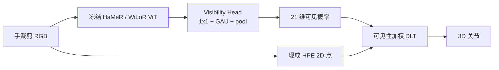
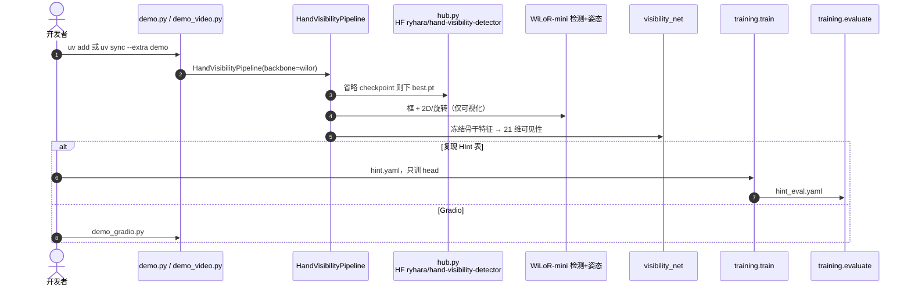

# Hand Visibility Detector：逐关节手部可见性

**Hand Visibility Detector**（*Per-Keypoint Visibility Estimation for Hands*，[arXiv:2608.11574](https://arxiv.org/abs/2608.11574)，[代码](https://github.com/ryhara/hand_visibility_detector)）由 **庆应义塾大学**、**产业技术综合研究所（AIST）**、**欧姆龙 SINIC X** 与 **东京大学** 提出：把「这个手指关节在图里能不能直接看见」从手部姿态估计（HPE）的辅助信号拆成独立任务。冻结大规模预训练 HPE 骨干，只训一个轻量 visibility head，输出 MANO 21 点的可见概率；再拿它给多视 2D 关键点做加权三角化。

## 一句话定义

**HPE 给坐标，HVD 给「这个点能不能信」：冻骨干、只训头，用逐关节可见性压掉被遮挡视角的三角化误差。**

## 英文缩写速查

| 缩写 | 英文全称 | 简要说明 |
|------|----------|----------|
| HVD | Hand Visibility Detector | 本文：独立的逐关节手部可见性估计器 |
| HPE | Hand Pose Estimation | 从图像估计手关节 / MANO 参数 |
| HInt | Hand Interactions in the wild | 含人工逐关节可见标签的野外手数据集 |
| MANO | hand Model with Articulated and Non-rigid deformations | 21 关节参数化手模型，本文输出布局 |
| GAU | Gated Attention Unit | visibility head 里建模空间全局依赖的注意力 |
| DLT | Direct Linear Transformation | 多视 2D 点三角化成 3D |
| mAP | mean Average Precision | 本文按关节平均的可见性二分类 AP |
| WiLoR | Wild Localization and Reconstruction | 冻结骨干之一，也提供下游检测框与 2D 点 |

## 为什么重要

- **坐标总有，可信度经常没有。** 遮挡、出画、手–物交互时，HPE 仍会吐出一个关节位置；遥操作重定向、多视自动标注、接触过滤若把所有点当同等观测，误差会进 3D。
- **可见性值得单独评。** 以往方法（含 Contact4D 的 RTMPose 头）把 visibility 当姿态精度的配角，本身很少在多样野外标签上测泛化。HInt 覆盖 web 与 egocentric，才让这件事可比较。
- **手结构先验比通用视觉更值钱。** 同 head 下 HaMeR / WiLoR 明显强于 DINOv3 与 ImageNet CNN；微调骨干反而毁掉先验。
- **代码能跑。** `HandVisibilityPipeline` + HF `best.pt`，单图 / 视频 / Gradio 都能出 21 维可见分数。

## 核心信息

| 字段 | 内容 |
|------|------|
| 作者 | Ryosei Hara、Masashi Hatano、Rintaro Yanagi、Atsushi Hashimoto、Takuma Yagi、Mariko Isogawa |
| 机构 | 庆应义塾大学（Keio University）；产业技术综合研究所（AIST）；欧姆龙 SINIC X（OMRON SINIC X）；东京大学（The University of Tokyo） |
| 出处 | arXiv:2608.11574（2026-08-12） |
| 骨干 | 冻结 [HaMeR](https://geopavlakos.github.io/hamer/) 或 [WiLoR](../methods/wilor.md) 的 ViT（631M）；发布默认走 WiLoR-mini |
| 输出 | \(V\in[0,1]^{21}\)：每关节「可见」概率（未见 = 遮挡或出画） |
| 训练数据 | HInt：25,273 / 5,374 |
| 开源（截至 2026-08-15） | **已开源、可运行**：[`ryhara/hand_visibility_detector`](https://github.com/ryhara/hand_visibility_detector) + HF 权重 / Space。许可为 **研究/非商用**，叠加上游 |

## 方法与核心结构

| 模块 | 作用 |
|------|------|
| **手裁剪** | 训/评用 GT 框；下游用 WiLoR 检测框。扩 1.25× → 256×256 → 中心 256×192 |
| **冻结 Hand Encoder** | ViT 出 \(F\in\mathbb{R}^{16\times 12\times 1280}\)；参数钉在大规模 HPE 预训练上 |
| **Visibility Head** | 1×1 压到 \(d=256\) → GAU → 21 通道空间均值 → sigmoid。**0.83M**，约占全模型 0.131% |
| **监督** | 逐关节 BCE；出画标 0 |
| **可视化用的姿态** | 关节坐标来自 GT 或现成 HPE，**不参与**可见性损失 |

遮挡关节在自己的像素位置没有直接证据，必须靠整手结构、可见手指和遮挡物关系来推理——这正是大规模 HPE 骨干已经学过的事。所以设计选择是：**别从头训特征，也别为可见性微调骨干。**

### 流程总览

## 源码运行时序图

官方仓 [`ryhara/hand_visibility_detector`](https://github.com/ryhara/hand_visibility_detector) 入口见 [sources/repos/hand_visibility_detector.md](../../sources/repos/hand_visibility_detector.md)：

- **最短路径：** `uv add git+https://github.com/ryhara/hand_visibility_detector.git` → `demo.py image.jpg`（自动下 `best.pt`）。
- **复现论文表：** 自备 [HInt](https://github.com/ddshan/hint)（Ego4D 子集要另下）→ `python -m training.train --config training/configs/hint.yaml` → `training.evaluate`。
- **HaMeR 骨干：** `--backbone hamer` 拉 `best_hamer.pt`，骨干 ckpt 来自官方 Space `geopavlakos/HaMeR`（gated，约 2.5 GB）。

## 工程实践

| 项 | 建议 / 论文设定 |
|----|----------------|
| **何时用** | 多视自动标 3D 手、视觉遥操作要按点降权、手–物遮挡下过滤不可信关节 |
| **何时不用** | 只要整手框置信度、或已经有手套/光学 marker 的可见性；单目要米制 3D 轨迹应走 [Macrodata Hand-Action](../methods/macrodata-egocentric-hand-action.md) 而不是本文 |
| **阈值** | 默认 0.5；0.3–0.7 的 F1 都 > 0.88，不必细抠 |
| **训练税** | 只训 0.83M；H200 约 2.5 h / 10 GB。**不要**微调 WiLoR/HaMeR 骨干（mAP 会从 0.931 掉到 0.622） |
| **推理栈** | 框与姿态默认 WiLoR；可见性是独立头。和 [MediaPipe](./mediapipe.md) 21 点可并存：一个出点，一个出可信度 |
| **许可** | 研究/非商用 + MANO / WiLoR / HaMeR / HInt 叠加；商用前逐条核对 |

## 实验与评测

可见性当作逐关节二分类。三随机种子，报均值±标准差。基线是 Kim et al. 2021（ResNet-50 + 线性头）与 Contact4D 的 RTMPose/CSPNeXt 可见性头，二者都吃 ImageNet 预训练。

| 方法 | mAP ↑ | F1 ↑ |
|------|-------|------|
| Kim et al. 2021 | 0.895 | 0.858 |
| Contact4D 2026 | 0.897 | 0.860 |
| **HVD（本文）** | **0.931** | **0.896** |

骨干消融（同一 head）：HaMeR **0.932**、WiLoR **0.931**、DINOv3 0.897、ViT-H 0.838、CSPNeXt-X 0.800、ResNet-152 0.796。去掉 GAU → 0.887；换成 Kim 线性头 → 0.905。

**下游三角化：** 各视角 WiLoR 2D 点 + DLT。三种加权：无加权、整手检测置信度（Contact4D 用法）、本文逐关节可见性。DexYCB（8 视 / 12,902 帧）、HO3D（2 或 5 视 / 4,854）、H2O（4 视 / 23,391）上，可见性加权的中位、均值、IQR 都最低；视角少、物体遮挡重的 HO3D 均值最多 **−10.1%**。

## 结论

**手部 3D 标注和遥操作缺的往往不是「再准一点的坐标」，而是「这个坐标在当前视角能不能当观测」。**

1. **真影响：冻 HPE 骨干** — 手结构先验比通用视觉强一截；为可见性微调骨干会毁掉它。
2. **真影响：逐关节而不是整手分** — 检测置信度整手共用，压不住「这根手指被杯子挡住、手腕还清楚」。
3. **真影响：HO3D 这类少视角遮挡** — 重投影均值最多降 10.1%；视角越多，加权收益越小但仍同向。
4. **次要代价：标签域** — 主表在 HInt；COCO-WholeBody 的手可见标签作者认为经常错或缺失，只作仓内附加配置。
5. **次要代价：许可** — 能跑，但不是 MIT；叠加 MANO / WiLoR / HaMeR。
6. **部署读法：** 默认阈值 0.5；把 \(\hat{v}_j\) 当三角化权重或遥操作门控，不要指望它单独出 3D。
7. **工程读法：可跑** — `demo.py` 自动下 `best.pt`；复现表再备 HInt。

## 与其他工作对比

| 对照 | 差异读法 |
|------|----------|
| Kim et al. / Contact4D 可见性头 | 也出逐关节分，但骨干是 ImageNet CNN；本文用大规模 HPE 先验，并在 HInt 上直接评可见性 |
| Contact4D 三角化 | 用检测置信度加权 + 可见性 refinement；本文证明 **逐关节** 可见性加权本身就能降重投影 |
| [WiLoR](../methods/wilor.md) | 出框与 MANO；HVD 冻它的特征只回答可见性，不替代重建 |
| [ViDiHand](./paper-vidihand.md) | 视频扩散做 egocentric 4D MANO，代码待发布；HVD 是单帧可见性插件 |
| [Macrodata Hand-Action](../methods/macrodata-egocentric-hand-action.md) | 长程 ego → 世界系 21 点轨迹；HVD 可当检测后的逐点门控，不是轨迹后端 |
| [MediaPipe](./mediapipe.md) | 低成本 21 点；默认没有与 HInt 对齐的逐关节可见性头 |

## 局限与风险

- **单帧、无时序。** 作者把「视频上时间一致的可见性」列为后续工作；闪烁要自己滤波。
- **可见 ≠ 姿态准。** 一个可见关节仍可能定位差；加权只抑制「看不见还硬三角」的那一类误差。
- **框质量会传下去。** 下游用 WiLoR 检手；漏检/错框时 head 看到的不是那只手。
- **数据门槛。** 复现训练要 HInt + 部分 Ego4D；推理权重已公开。
- **许可叠加。** 研究/非商用；MANO 仍走 MPI 条款。

## 关联页面

- [WiLoR](../methods/wilor.md) — 冻结骨干与下游检测/2D 点来源
- [灵巧操作数据管线](../queries/dexterous-manipulation-data-pipeline.md) — 手部感知之后用可见性门控再标注
- [灵巧操作数据采集指南](../queries/dexterous-data-collection-guide.md) — 视觉遥操作遮挡时的逐点降权
- [MediaPipe](./mediapipe.md) — 低成本 21 点上游，可与 HVD 分数叠加
- [自动化标注流水线](../methods/auto-labeling-pipelines.md) — 多视几何标注，不是 VLM 语义标
- [ViDiHand](./paper-vidihand.md) — egocentric 4D 重建对照
- [Macrodata Egocentric Hand-Action](../methods/macrodata-egocentric-hand-action.md) — 长程度量轨迹配方
- [感知栈选型闭环](../queries/robot-perception-stack-selection-loop.md) — 感知输出要被下游忠实消费

## 参考来源

- [hand_visibility_detector_arxiv_2608_11574.md](../../sources/papers/hand_visibility_detector_arxiv_2608_11574.md)
- [hand_visibility_detector 仓库归档](../../sources/repos/hand_visibility_detector.md)
- Hara et al. — <https://arxiv.org/abs/2608.11574>
- 代码 — <https://github.com/ryhara/hand_visibility_detector>

## 推荐继续阅读

- 官方仓 README 与 HF 模型卡 — <https://github.com/ryhara/hand_visibility_detector>
- HInt 数据集 — <https://github.com/ddshan/hint>
- HaMeR — <https://arxiv.org/abs/2312.05251>
- WiLoR — <https://arxiv.org/abs/2409.12259>
- Contact4D — 3DV 2026
