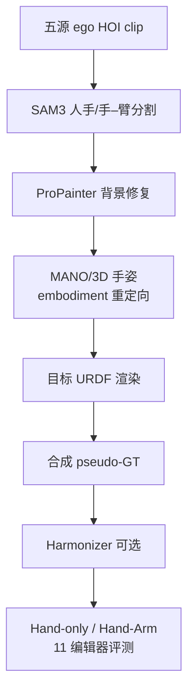
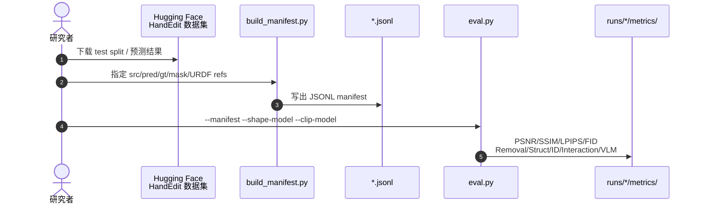

# HandEdit（arXiv:2608.12122）

**HandEdit**（*HandEdit: A Unified Benchmark for Egocentric Human-to-Robot Dexterous Hand Image Editing*，[arXiv:2608.12122](https://arxiv.org/abs/2608.12122)，[项目页](https://handedit.github.io/)，[代码](https://github.com/HandEdit/HandEdit)）由 **复旦大学 / 上海交通大学 / 香港大学** 等提出：把 egocentric 人手的 **embodiment gap** 形式化为 **URDF 条件图像编辑**，并提供 200M+ 实例与统一评测协议。

## 一句话定义

**200M+ URDF 条件 egocentric 编辑基准：五源 human HOI 视频 → 26 灵巧机器人 embodiment；Hand-only / Hand-Arm 双轨 + embodiment-aware 指标；评测工具链与 HF 数据集已开源。**

## 英文缩写速查

| 缩写 | 英文全称 | 简要说明 |
|------|----------|----------|
| URDF | Unified Robot Description Format | 指定目标机器人几何与关节结构 |
| ROI | Region of Interest | 人手+机器人 mask 并集上的局部指标 |
| VLM | Vision-Language Model | 用于编辑质量判断的多模态模型 |
| LPIPS | Learned Perceptual Image Patch Similarity | 感知相似度（越低越好） |

## 为什么重要

- **人视频规模化 vs 机器人 teleop 成本**：EgoDex / ARCTIC 等 ego 数据丰富，但人手与灵巧机器人在外观、运动学、相机几何上差异大，不能直接当 robot-centric 视觉训练。
- **首个系统化 dexterous hand editing benchmark**：相对 InstructPix2Pix / MagicBrush 等通用编辑集，HandEdit 同时要求 **ego + dexterous + URDF-cond + 多 embodiment**（论文 Table 1）。
- **指标分层**：PSNR/LPIPS 不足以代表编辑成功；Removal / Struct / ID / Interaction 等 **embodiment-aware** 指标与 VLM 判断并用。

## 核心信息

| 项 | 内容 |
|----|------|
| **机构** | 复旦大学（Fudan）；上海交通大学（SJTU）；香港大学（HKU）等 |
| **源数据** | EgoDex、ARCTIC、OakInk2、HOI4D、HO-Cap |
| **规模** | 300K+ clips；200M+ 编辑实例；26 URDF（13 hand-only + 13 hand-arm） |
| **开源** | **已开源**：[HandEdit/HandEdit](https://github.com/HandEdit/HandEdit) 评测工具链；[HF 数据集](https://huggingface.co/datasets/HandEdit/HandEdit) |

## 流程总览

## 源码运行时序图

官方仓库 [HandEdit/HandEdit](https://github.com/HandEdit/HandEdit)（归档 [sources/repos/handedit.md](../../sources/repos/handedit.md)）提供 **benchmark 评测** 入口（非完整 200M 伪 GT 构建管线）：

- **最短复现路径：** `conda` 环境 + 下载 DINOv2/CLIP → 准备 pred 与 mask → `build_manifest.py` → `eval.py`。
- **数据构建：** 200M 伪 GT 以 HF 发布物为准；ARCTIC 拒帧审计显示 **retargeting** 是最大失败源（~63%）。

## 工程实践

| 项 | 读法 |
|----|------|
| **双轨** | Hand-only 只换 hand；Hand-Arm 需 **固定 virtual base**（27 候选 IK/碰撞筛） |
| **Baseline** | GPT-Image-2 综合最强；开源编辑器在 Struct/Interaction 上差距更大 |
| **指标** | ROI 指标用 human∪robot mask；勿只用 Full-image LPIPS 选型 |
| **Harmonizer** | 改善光照/边界；主榜仍用原始 composite |
| **下游** | LongCat-Image LoRA 示例：human→Inspire 手，保留物体与接触 |

## 实验与评测

- **11 编辑器**：含 GPT-Image-2 等商用与开源模型；Hand-only 与 Hand-Arm 分轨雷达图对比。
- **主要结论：** 感知质量好 ≠ 编辑任务成功；VLM 判断有用但不够；需 embodiment-aware 指标。

## 与其他工作对比

| 维度 | 读法 |
|------|------|
| **H2R / Phantom / Human2Robot** | 多针对 parallel gripper 或 video translation；HandEdit 专精 **dexterous URDF 条件编辑** |
| **EgoEdit（CVPR'26）** | ego 视频编辑但 **preserve hand**，非人→机 URDF 映射 |
| **[EgoDex](./paper-notebook-egodex-learning-dexterous-manipulation-from-larg.md)** | HandEdit 五源之一；EgoDex 提供 human side 规模，HandEdit 补 robot-side 视觉对齐 |
| **[Bench2Dex](./paper-bench2dex.md)** | 同团队：HandEdit 补 **数据域**；Bench2Dex 补 **仿真 visuotactile 策略** 评测 |

## 结论

**HandEdit 把「人 ego 视频 → 灵巧机器人视觉域」从 ad-hoc inpainting 拉成可度量的 URDF 条件编辑 benchmark；选型时 embodiment 指标优先于 LPIPS。**

1. **评测已开源**：clone 仓库 + HF 数据即可跑官方 metric suite。
2. GPT-Image-2 强但不解决全部 Struct/Interaction；自研模型应报 **双轨 + embodiment 指标**。
3. 伪 GT 构建瓶颈在 **retargeting**；下游训练需知 residual 误差分布。
4. Hand-Arm 轨 virtual base 选择影响一致性——读 Hand-Arm 分数时勿与 Hand-only 直接比绝对值。
5. 与 VLA/BC 联用时：编辑质量是 **视觉域对齐** 一步，仍缺 executable action（见 [Bench2Dex](./paper-bench2dex.md) teleop 线）。

## 关联页面

- [paper-notebook-egodex-learning-dexterous-manipulation-from-larg](./paper-notebook-egodex-learning-dexterous-manipulation-from-larg.md)
- [macrodata-egocentric-hand-action](../methods/macrodata-egocentric-hand-action.md)
- [manipulation](../tasks/manipulation.md)
- [paper-bench2dex](./paper-bench2dex.md)

## 参考来源

- [handedit_arxiv_2608_12122.md](../../sources/papers/handedit_arxiv_2608_12122.md)
- [handedit-github-io.md](../../sources/sites/handedit-github-io.md)
- [handedit.md](../../sources/repos/handedit.md)

## 推荐继续阅读

- [HandEdit Hugging Face 数据集](https://huggingface.co/datasets/HandEdit/HandEdit)
- [arXiv PDF](https://arxiv.org/pdf/2608.12122)
