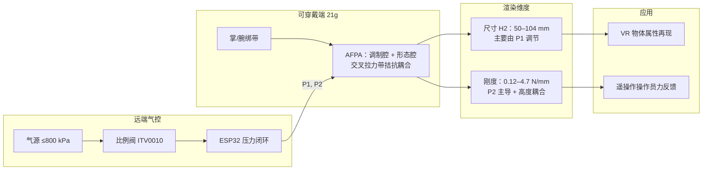

# HapMorph：多维气动触觉属性渲染框架

**HapMorph**（Chen et al., Scuola Superiore Sant'Anna；[arXiv:2509.05433](https://arxiv.org/abs/2509.05433)，[HTML](https://arxiv.org/html/2509.05433v1)）提出基于 **拮抗式织物气动执行器（Antagonistic Fabric-based Pneumatic Actuators, AFPA）** 的可穿戴触觉框架，在轻量形态下 **同时、连续** 调制用户手掌交互面的 **几何尺寸** 与 **机械刚度**，面向 **VR 训练** 与 **遥操作** 中的物体属性再现。

## 一句话定义

> 两个由交叉拉力带耦合的织物 **pouch motor** 执行器构成 AFPA：调节腔 $P_1$ 与形态腔 $P_2$ 在拮抗平衡下 **分别主导输出高度与感知刚度**，使可穿戴部件（21 g）能在 50–104 mm 尺寸范围内呈现可辨的九档尺寸×刚度组合。

## 英文缩写速查

| 缩写 | 英文全称 | 简要说明 |
|------|----------|----------|
| AFPA | Antagonistic Fabric-based Pneumatic Actuator | 拮抗式织物气动执行器，本文核心机构 |
| HRI | Human-Robot Interaction | 人机交互；触觉是远程操控与 VR 的关键通道 |
| VR | Virtual Reality | 虚拟现实中需力触觉再现物体属性 |
| TPU | Thermoplastic Polyurethane | 热塑性聚氨酯涂层织物，用于 pouch motor 制造 |
| DOF | Degrees of Freedom | 扩展架构可呈现高度、侧向位移等多维几何反馈 |
| Teleop | Teleoperation | 遥操作；操作员侧触觉可增强远程抓取感知 |

## 核心信息

| 字段 | 内容 |
|------|------|
| 机构 | 意大利圣安娜高等研究学院（Scuola Superiore Sant'Anna, SSSA）机械智能研究所 |
| 平台 | 掌+腕绑带可穿戴原型；远端气源 + 比例阀 + ESP32 压力闭环 |
| 关键指标 | 可穿戴质量 **21 g**；尺寸 **50–104 mm**；最高刚度 **~4.7 N/mm**（$H_2=15$ mm）；阶跃形态 **~2 s** |
| 感知实验 | 10 人 × 90 trial；9 状态（3 尺寸 × 3 刚度）；准确率 **89.4%**；均值响应 **6.7 s** |

## 为什么重要

- **突破尺寸–刚度耦合：** 单腔气动触觉常因体积–压力关系使几何与刚度绑定；HapMorph 用 **拮抗双腔** 在实验上实现「变尺寸而刚度近似恒定」与「固定尺寸下多档刚度」。
- **可穿戴约束下的多维渲染：** 相对 encountered-type 桌面装置与颗粒 jamming shape display，21 g 级可穿戴形态更适合 **长时间 VR/遥操作** 操作员体验。
- **与机器人栈的正交补位：** 本站 [Tactile Sensing](../concepts/tactile-sensing.md) 多聚焦 **机器人端** 接触感知；HapMorph 补的是 **人类操作员端** 力触觉再现，与 [Teleoperation](../tasks/teleoperation.md) 中 VR 手套、外骨骼力反馈形成对照。
- **软体气动工程可复现：** TPU 织物 CNC 热封 + 缝纫 pouch motor，材料与工艺门槛相对低于高精度电机 encountered-type 系统。

## 流程总览

**机构要点：** 三个 pouch motor 缝成单侧膨胀单元；两个单元拮抗布置——用户接触 **morphing** 侧，对侧 **modulating** 腔通过拉力带限制膨胀，使双腔压力组合映射到 $(H_2, k)$ 平面上的可辨工作点。

## 表征与解耦（实验摘要）

| 维度 | 主要规律 | 数值范围 |
|------|----------|----------|
| 尺寸 $H_2$ | $P_2↑$ 增高；给定 $P_2$ 时 $P_1↑$ 降低 $H_2$（拮抗） | 50–104 mm |
| 动态 | 阶跃 $P_2$: 0→90 kPa 时 $H_2$ 约 10→103 mm / ~2 s | 受供气带宽限制 |
| 刚度 | 压缩量↓ 或 $P_2↑$ → 刚度↑；接触面积增大时更陡 | 0.12–0.46 N/mm（代表工况）；峰值 ~4.7 N/mm |
| 解耦 | 三档 $H_2$ 经 $P_1$/$P_2$ 配平，刚度维持 ~0.1±0.015 N/mm | Fig. 3E |

建模采用 **虚拟功原理**（补充材料）；实验与模型在 $P_1$/$P_2$ 扫描上吻合良好，但存在织物摩擦与弹性带变形导致的 **滞回**。

## 扩展架构

1. **单 pouch 调制器：** 高度–压力更线性，滞回更大，需高级补偿。
2. **内嵌约束线：** 圆柱 → 长方体 → 大圆柱的 **截面形状序列** + 并发刚度控制。
3. **双调制 + 四层形态腔：** 独立 pouch 组经拉力带网络驱动，可呈现 **垂直与侧向位移** 及可变刚度，用于表面朝向等更高维 cues。

## 人类感知实验

- **协议：** 盲fold + 降噪；仅触觉辨别 9 状态；每状态 10 次随机呈现。
- **结果：** 总准确率 **89.4%**；极端组合可达 98%，中间「中尺寸×中刚度」最难（78%）；混淆矩阵显示 **刚度辨别难于尺寸**。
- **时间：** 均值 6.7 s（含 ~2 s 形态过渡与实验记录）；扣除后感知决策约 2–4 s。
- **学习/疲劳：** 分段准确率由近 1.0 降至 ~0.8；手长、性别与表现无显著相关（补充图 S8–S10）。

## 常见误区或局限

1. **「等于机器人触觉传感器」：** HapMorph 渲染的是 **操作员手掌内的虚拟物体属性**，不替代机器人端 F/T 或 GelSight 类传感。
2. **「完全便携」：** 原型仍依赖 **外部气源与阀岛**；作者指出需微型泵与高效阀才能实现电池供电移动使用。
3. **「无滞回高精度」：** 织物–腔体摩擦与弹性带变形带来滞回；精密应用需闭环补偿。
4. **「覆盖纹理/温度」：** 本文仅尺寸+刚度（及扩展形状）；纹理渲染见 Frisoli 组可穿戴 haptics 综述线（Nature Reviews Electrical Engineering, 2024）。
5. **「与数据手套采集等价」：** 这是 **力反馈显示设备**，不是 [数据手套 vs 视觉遥操作](../comparisons/data-gloves-vs-vision-teleop.md) 讨论的手部 **运动采集** 通道。

## 与其他触觉路线对比（定性）

| 维度 | Encountered-type（Takizawa 等） | 颗粒 Jamming | 单腔织物气动 | HapMorph（本文） |
|------|--------------------------------|--------------|--------------|------------------|
| 可穿戴 | 否（固定安装+电机） | 否 | 是 | 是（21 g） |
| 尺寸+刚度 | 是 | 形状+刚度 | 通常耦合 | **解耦**（实验验证） |
| 响应 | 电机限制 | 较慢 | 中等 | ~2 s 阶跃 |
| 制造 | 复杂机械 | 腔体+颗粒 | 织物热封 | 织物热封+缝纫 AFPA |

## 参考来源

- [HapMorph 论文摘录](../../sources/papers/hapmorph_arxiv_2509_05433.md)
- Chen et al., *HapMorph: A Pneumatic Framework for Multi-Dimensional Haptic Property Rendering* (arXiv:2509.05433, 2025)

## 关联页面

- [Teleoperation（遥操作）](../tasks/teleoperation.md) — 操作员侧 VR/力反馈与示范采集主线
- [触觉与力觉专题汇总](../overview/topic-tactile.md) — 机器人触觉闭环 vs 可穿戴 haptic rendering
- [Tactile Sensing](../concepts/tactile-sensing.md) — 机器人端接触感知（正交维度）
- [在 RL 中利用触觉反馈](../queries/tactile-feedback-in-rl.md) — 机器人策略侧触觉，非操作员渲染
- [数据手套 vs 视觉遥操作](../comparisons/data-gloves-vs-vision-teleop.md) — 采集通道选型对照

## 推荐继续阅读

- [arXiv HTML:2509.05433](https://arxiv.org/html/2509.05433v1) — 补充材料 S1–S10 与影片
- Frisoli & Leonardis, *Wearable haptics for virtual reality and beyond* (Nature Reviews Electrical Engineering, 2024) — 同组可穿戴触觉综述
- Takizawa et al., *Encountered-Type Haptic Interface for Representation of Shape and Rigidity* (IEEE ToH, 2017) — 尺寸+刚度早期对照
- Feng et al., *X-crossing pneumatic artificial muscles* (Science Advances, 2023) — pouch/X-crossing 气动肌肉基础
