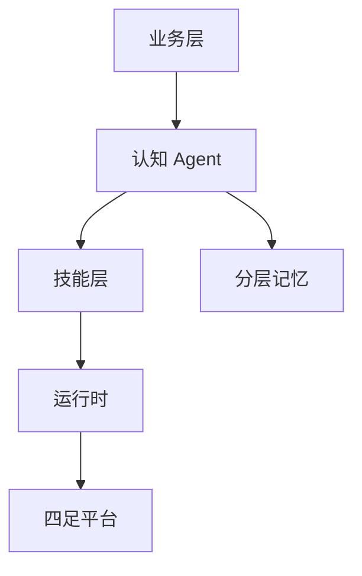

# Harness Robotic OS（arXiv:2609.11225）

**Harness Robotic OS**（*Harness Robotic OS: A Unified Embodied-Agent Runtime for Closed-Loop Quadruped Inspection*，[arXiv:2609.11225](https://arxiv.org/abs/2609.11225)）由 **碧桂园服务；Omni AI；华东师范大学（ECNU）** 提出（公众号周更 ingest 见 [策展索引](../../sources/blogs/wechat_shenlan_weekly_humanoid_quadruped_2026-09-14.md)）。

## 一句话定义

Harness Robotic OS：面向四足闭环巡检的统一具身智能运行时 — unified runtime/skills/cognitive agent/business layers。

## 英文缩写速查

| 缩写 | 英文全称 | 简要说明 |
|------|----------|----------|
| OS | Operating System | 机器人运行时操作系统 |
| SLAM | Simultaneous Localization and Mapping | 同步定位与建图 |
| HRI | Human-Robot Interaction | 人机交互告警 |

## 为什么重要

园区巡检需长时闭环与业务对接；零散脚本难维护多四足任务。

## 核心信息

| 项 | 内容 |
|----|------|
| **机构** | 碧桂园服务；Omni AI；华东师范大学（ECNU） |
| **开源** | **未见/待发布**（步骤 2.5 核查：截至 2026-09-14 无可运行官方仓库） |

## 核心原理

Harness 分层：底层 runtime 调度技能，中层 cognitive agent 规划，上层 business 对接物业流程；共享上下文与分层记忆支撑 nav-detect-alert-report。

### 流程总览

## 源码运行时序图

**不适用** — 本文为理论/硬件/系统/数据类工作，arXiv 未提供可运行训练或部署仓库。

## 工程实践

| 项 | 说明 |
|----|------|
| 开源状态 | 未见官方仓库；以 arXiv 为准 |
| 复现入口 | 论文方法与超参；代码发布后再补 `sources/repos/` |
| 部署注意 | 与物业 API 对接；异常检测模型需持续更新；多机调度未详述。 |

## 实验与评测

住宅小区巡检闭环；检测率、响应时延、误报率。

## 结论

Harness Robotic OS 用分层运行时把四足巡检从演示推进到物业闭环。

1. 四层分离关注点。
2. 共享上下文避免状态碎片化。
3. 分层记忆支撑长时任务。
4. nav-detect-alert-report 是标准环。
5. 工程落地重于单点算法。

## 与其他工作对比

| 对照 | 差异读法 |
|------|----------|
| ROS2 技能拼装 | 缺业务与认知层 |
| 单次演示 pipeline | 无运行时治理 |

## 局限与风险

平台绑定与私有化部署；学术可复现性有限。

## 关联页面

- [autonomous-exploration](../tasks/autonomous-exploration.md)
- [locomotion](../tasks/locomotion.md)
- [./paper-show-harness.md](./paper-show-harness.md)

## 参考来源

- [harness_robotic_os_quadruped_arxiv_2609_11225.md](../../sources/papers/harness_robotic_os_quadruped_arxiv_2609_11225.md)
- [公众号周更策展](../../sources/blogs/wechat_shenlan_weekly_humanoid_quadruped_2026-09-14.md)

## 推荐继续阅读

- [https://arxiv.org/abs/2609.11225](https://arxiv.org/abs/2609.11225)
