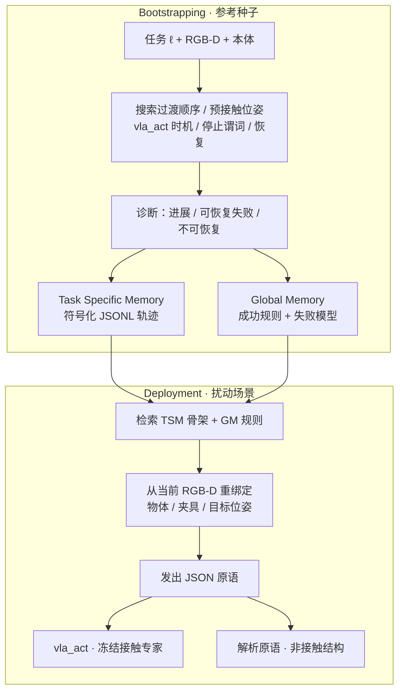
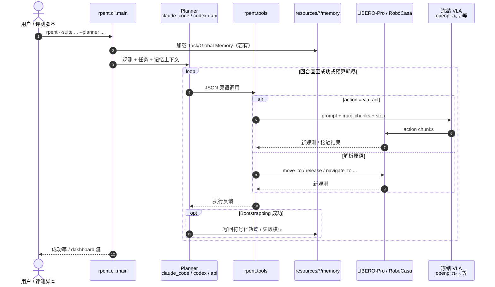

# Harness VLA（Memory-Guided Agentic Manipulation · arXiv:2607.08448）

**Harness VLA**（*Steering Frozen VLAs into Reliable Manipulation Primitives via Memory-Guided Agents*，[arXiv:2607.08448](https://arxiv.org/abs/2607.08448)，[项目页](https://harnessvla.github.io/)，[代码 RPent](https://github.com/RLinf/RPent)；清华 / 跨步智能 / Purdue / CASIA / 无问芯穹 / HKUST / 中关村人工智能研究院）提出 **不微调 VLA、不膨胀技能库** 的 agentic harness：把冻结 Vision-Language-Action 暴露为可重试接触原语 `vla_act`，与固定解析原语（定位、过渡、搬运、导航、释放）由 LLM planner 组合；在参考种子上探索并写入 **Task Specific Memory** 与 **Global Memory**，部署时对扰动场景 **语义/空间重绑定**，而非重放参考坐标。

## 一句话定义

**冻结 VLA 只当接触专家；记忆增强的规划器学习「何时、如何」调用固定原语库，把分布外扰动留给编排与重试，而不是端到端策略本身。**

## 英文缩写速查

| 缩写 | 英文全称 | 简要说明 |
|------|----------|----------|
| VLA | Vision-Language-Action | 冻结的接触密集 visuomotor 策略，经 `vla_act` 调用 |
| TSM | Task Specific Memory | 参考种子成功原语轨迹（JSONL，空间参数符号化） |
| GM | Global Memory | 跨任务可复用成功规则与失败模型 |
| CC | Claude Code | 论文中一种 LLM planner 实例化 |
| C2R | Clean-to-Randomized | RoboTwin 干净场景记忆 → 随机化场景零额外探索迁移 |
| JSON | JavaScript Object Notation | 规划器与环境之间的原语调用契约 |

## 核心信息

| 字段 | 内容 |
|------|------|
| **机构** | 清华大学（Tsinghua）；跨步智能（Striding AI）；普渡大学（Purdue）；中国科学院自动化研究所（CASIA）；无问芯穹（Infinigence AI）；香港科技大学（HKUST）；中关村人工智能研究院（ZGCA） |
| **arXiv** | [2607.08448](https://arxiv.org/abs/2607.08448) |
| **开源** | **已开源** — [`RLinf/RPent`](https://github.com/RLinf/RPent)（`rpent` CLI；文档 [rpent.readthedocs.io](https://rpent.readthedocs.io/en/latest/)） |
| **冻结后端** | LIBERO：π_RLinf（π₀.₅-SFT）；RoboCasa365：RLDX-1；RoboTwin C2R：LingBot-VLA |
| **规划器** | Codex / Claude Code（及 RPent `api` 自定义） |

## 为什么重要

- **第三类「用好已有 VLA」路线：** 相对微调更强 backbone、或 [ASPIRE](../methods/aspire.md) 式 **技能库扩张**，Harness VLA 固定原语词汇，把增益归因于 **编排 + 记忆 + 可重试接触**。
- **与 [DreamSteer](./paper-dreamsteer-vla-deployment-steering.md) 互补：** DreamSteer 在动作 chunk 上做 WM 预演排序；Harness VLA 在 **原语级** 做 agentic 闭环与记忆复用——二者都强调 **冻结权重**。
- **扰动基准上的硬证据：** LIBERO-Pro / RoboCasa365 / RoboTwin C2R 覆盖语义重定向、布局交换、厨房长程与干净→随机化迁移。
- **工程可跟：** 官方仓对接 RLinf + openpi + LIBERO-Pro，仓库内已有 `resources/libero/memory/` 样例记忆。

## 核心原理

### 固定原语库（Table 1 摘要）

| 原语 | 类型 | 角色 |
|------|------|------|
| `move_to` / `move_pose` | 解析·复合 | 末端笛卡尔 / 共变姿态过渡 |
| `rotate_wrist` / `rotate_pitch` | 解析·原子 | 腕偏航/俯仰设定点 |
| `set_gripper` / `release` | 解析·原子 | 开合与释放后条件 |
| `navigate_to` / `move_base` | 解析（厨房） | 移动底座 staging |
| **`vla_act`** | **VLA** | 短 burst 冻结策略；接触密集相位 |

规划器只发 JSON 调用，不直接输出力矩或完整轨迹；部署期 **禁止发明新原语**。

### 流程总览

### 源码运行时序图

对齐 [`RLinf/RPent`](https://github.com/RLinf/RPent) README：`rpent` CLI → planner → 原语工具 → 仿真 / 冻结 VLA。

复现路径：`pip install -e ".[full]"` → 配置 API key 与 `PI05_CHECKPOINT_PATH` → `rpent --suite libero_object_swap ...`；RoboCasa 见 `scripts/run_robocasa.sh`。

## 工程实践

| 项 | 要点 |
|----|------|
| **安装** | `git clone` + `pip install -e ".[full]"`（rlinf + openpi + libero-pro） |
| **权重** | HF `RLinf/rlinf-pi05-libero-130-fullshot-sft` 等 |
| **规划器** | Anthropic / OpenAI 兼容端点；`--dashboard` 可开实时监视 |
| **记忆资产** | 仓内 `resources/libero/memory/` 含任务级 md / 结果 json |
| **开源边界** | Pi0.5+LIBERO-PRO 为默认完整路径；RoboCasa/真机条目以 README Feature Matrix 为准 |

## 实验要点（索引级）

> 数字以 [arXiv:2607.08448](https://arxiv.org/abs/2607.08448) / [项目页](https://harnessvla.github.io/) 为准。

| 设定 | Harness VLA | 对照要点 |
|------|-------------|----------|
| **标准 LIBERO overall** | CC **96.0%** | 冻结 π_RLinf **95.3%**（保持分布内） |
| **LIBERO-Pro overall** | CC **82.4%** / Codex **72.1%** | 相对 RATS 报道总体 **+38.6 pp**；π_RLinf **50.0%** |
| **RoboCasa365 加权总体** | Codex **55.4%** | RLDX-1 **30.0%**（**+25.4 pp**） |
| **RoboTwin C2R** | CC **58.4%** | 同冻结 LingBot-VLA **50.4%**；π₀.₅ **47.9%** |
| **零样本 Goal（无 TSM/GM）** | Goal-T **79.0%** / Goal-S **31.0%** | 位置交换更依赖 bootstrapped 轨迹骨架 |

**机制结论（§3.3）：** (1) 规划器层语义重绑定恢复任务条件行为；(2) 稀疏可重试 `vla_act` 快速超过冻结基线；(3) 解析原语隔离非接触执行，LIBERO 族常在解析步完成成功谓词，厨房/双臂更多在接触相位收官。

## 与其他工作对比

| 维度 | Harness VLA | 微调更强 VLA backbone | ASPIRE（技能库扩张） | DreamSteer（动作 chunk 预演） |
|------|-------------|------------------------|------------------------|--------------------------------|
| VLA 权重 | **冻结** | 微调 / 重训 | 冻结或按需 | **冻结** |
| 技能 / 原语词汇 | **固定**原语库 + `vla_act` | 端到端策略 | **扩张**可验证技能库 | 不改原语，做动作排序 |
| 分布外增益来源 | 编排 + 记忆 + 可重试接触 | 更强表征 / 更多数据 | 新技能覆盖 | WM 预演筛选动作 chunk |
| 记忆机制 | 外置 Task / Global Memory，部署重绑定 | 参数内隐式 | 技能库为主 | 无显式跨任务记忆 |
| 编排 / 干预粒度 | **原语级** agentic JSON 闭环 | 无显式编排 | code-as-policy 组合 | 动作 chunk 级 |

## 局限与风险

- **误区：** 把 Harness VLA 当成「又训了一个更强 VLA」——增益来自 **harness + 记忆**，权重冻结。
- **误区：** 与 [ASPIRE](../methods/aspire.md) 混同——ASPIRE **扩张**可验证技能库；本文 **固定**原语词汇。
- **局限：** 规划器与低层 VLA 仍是 **开环反馈**（论文 §5）；缺联合 RL / 偏好微调；稠密场景下缺细粒度 caption 约束结构推理。
- **工程风险：** 依赖商业 LLM API 与仿真/权重栈；Pre-Alpha 仓接口可能快速演进。

## 关联页面

- [VLA](../methods/vla.md) — 冻结策略作为接触原语的部署语境
- [行为树 × VLA 编排](../concepts/behavior-tree-vla-orchestration.md) — 确定性编排 vs agentic JSON 原语
- [ASPIRE](../methods/aspire.md) — code-as-policy + 技能库扩张对照
- [DreamSteer](./paper-dreamsteer-vla-deployment-steering.md) — 另一类零微调 VLA steering
- [VLA 开源复现景观](../overview/vla-open-source-repro-landscape-2025.md) — RPent / RLinf 栈入口
- [Manipulation](../tasks/manipulation.md) — LIBERO / RoboCasa / RoboTwin 任务背景
- [LingBot-VLA](./lingbot-vla.md) — RoboTwin C2R 冻结后端
- [RLDX-1](./rldx-1.md) — RoboCasa365 冻结后端
- [EventVLA](./paper-eventvla-visual-evidence-memory.md) — 策略内记忆 vs harness 外置记忆

## 推荐继续阅读

- [论文 PDF（arXiv:2607.08448）](https://arxiv.org/pdf/2607.08448)
- [项目页](https://harnessvla.github.io/)
- [RPent 仓库与 Quick Start](https://github.com/RLinf/RPent)
- [RPent 文档](https://rpent.readthedocs.io/en/latest/)

## 参考来源

- [Harness VLA 论文摘录](../../sources/papers/harness_vla_arxiv_2607_08448.md)
- [项目页归档](../../sources/sites/harnessvla-github-io.md)
- [RPent 仓库归档](../../sources/repos/rpent.md)
