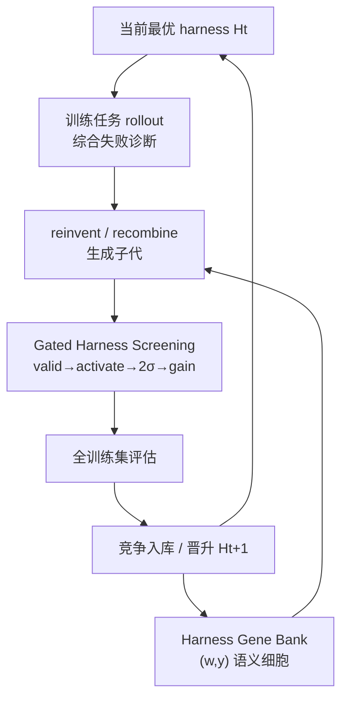

# HarnessBank：可信 Agent-Harness 自进化

**HarnessBank**（[arXiv:2607.13683](https://arxiv.org/abs/2607.13683)）由 **恒心智能（EverMind）/ 盛大集团（Shanda Group）** 提出：在**不更新**任务模型权重的前提下，用独立 evolver 诊断失败、生成 harness 子代，经 **Harness Gene Bank（HGB）** 按语义坐标保留多样高质解，再用 **Gated Harness Screening** 做可统计验证的筛选与入库。

## 一句话定义

**把 agent harness 的自进化做成「语义质量多样性归档 + 门控显著性筛选」，让冻结 LLM 在七类真实 agent 任务上拿到可验证、且多为模型特异的增益。**

## 英文缩写速查

| 缩写 | 英文全称 | 简要说明 |
|------|----------|----------|
| HGB | Harness Gene Bank | 按 (where, why) 语义坐标归档高质 harness |
| GHS | Gated Harness Screening | 有效性→激活→配对显著性→增益的四级门控 |
| VF | Verify-Finalize | 常见补丁：提交前自检，抑制过早收束 |
| TB2 | Terminal-Bench 2 | 终端操作基准之一 |
| GEPA / DGM | GEPA / Darwin Gödel Machine | 文中 prompt 进化与开放自改对照 |

## 为什么重要

- **部署现实：** 权重常封闭或昂贵，**harness 是唯一可改表面**（prompt、知识、runtime、config）。
- **可信进化：** 针对贪心搜索坍缩与噪声自评，用银行保留互补机制 + 配对 \(2\sigma\) 门控抑制 false elites。
- **对本库：** 与 [OpenClaw](./openclaw.md) / [Darwin Skill](./darwin-skill.md) 的「可测改进才保留」同构，但是 **全 harness 表面** 而非单 `SKILL.md`；姐妹篇 [SkillCorpus](./paper-skillcorpus.md) 补「技能层语料」。

## 核心信息

| 项 | 内容 |
|----|------|
| **机构** | 恒心智能（EverMind）；盛大集团（Shanda Group） |
| **任务模型** | 主实验冻结 Qwen3.6-27B；跨模型含 397B / Gemini 等 |
| **可变表面** | prompt / knowledge / runtime / config（kernel 不可变） |
| **开源** | **宣称将开源 / 尚未发布**（acceptance 后；核查日 2026-08-08） |

## 核心原理

### 方法栈

| 模块 | 机制 |
|------|------|
| Task / Evolver | 任务 agent 执行；evolver 只改 harness，不改 \(M\) |
| 语义细胞 | \(c=(w,y)\)：修改位置 × 失败病理；同细胞竞争、跨细胞可重组 |
| 子代生成 | 失败轨迹 **reinvent**；跨细胞机制 **recombine** |
| 门控 | 子集评估：validity → activation → paired significance → gain → 全训练集再评 |
| 入银行 | 竞争选择；质量偏置亲本 + 语义多样性保留 |

### 流程总览

## 源码运行时序图

**不适用（官方可运行代码尚未发布）。** 截至 2026-08-08：论文承诺 acceptance 后公开；GitHub 无 HarnessBank 仓。发布后应补：任务 harness 加载 → evolver 诊断 → 子集门控 → 全量评估 → HGB 更新的 `sequenceDiagram`。

## 工程实践

| 项 | 建议 / 论文设定 |
|----|----------------|
| 何时用 | 冻结 / 闭源骨干，只能改 prompt·runtime·恢复策略时 |
| 门控预算 | 先子集 + 四级门，再全量；勿用单次 \(K{=}1\) 尖峰提拔 |
| 病理→补丁 | thinking-runaway → selective recovery；过早 finalize → VF / 清单 |
| 跨模型 | **勿**假设某一模型进化出的 harness 普适；错配可有害（Omni-MATH Gemini 例） |
| 复现现状 | **等官方代码**；当前只读论文选型 |

## 实验与评测

- **七基准 Test Pass@1：** TB2 +9.3、LiveCode +13.7、Omni-MATH +11.7、BrowseComp+ +13.9、GDPval +9.2、AppWorld +15.4；SWE-bench +5.1（\(n{=}26\)，preliminary）。
- **对照：** 同协议下相对 GEPA / DGM，HarnessBank 在更多密封测试上「过 bar」；DGM 曾因无门控部署回归。
- **消融（TB2）：** 去掉 \(2\sigma\) → false elites↑、轮次跑满 cap；完整设置 0 false elites、约 10 轮停。
- **匹配律：** 病理匹配补丁 credited；错配近零或有害。

## 结论

**HarnessBank 的真贡献是把 harness 自进化从「看起来涨了分」推进到「语义多样归档 + 可统计验证的入选」；可迁移的是诊断—搜索—验证流程，不是某一份普适 harness。**

1. **真影响：门控可信度** — 配对显著性挡住噪声与未激活补丁。
2. **真影响：语义银行** — 跨细胞重组保留非 prompt 杠杆（runtime / config）。
3. **真影响：模型特异修正** — 跨模型实验否定「一份 harness 打天下」。
4. **次要代价：rollout 预算** — 全量评估仍贵；门控只是降成本。
5. **部署读法：** 先固定评测器与 train/test 分裂，再跑进化；小 \(n\) 域勿过度解读。
6. **工程读法：代码未发** — 适合方法选型与对照 Darwin/GEPA/DGM。

## 与其他工作对比

| 对照 | 差异读法 |
|------|----------|
| [Darwin Skill](./darwin-skill.md) | 优化单个 `SKILL.md` + 棘轮；HarnessBank 覆盖全 harness 表面 + HGB |
| [OpenClaw](./openclaw.md) / [SkillCorpus](./paper-skillcorpus.md) | 技能加载与社区语料；HarnessBank 进化的是宿主 harness 本身 |
| [autoresearch](./karpathy-autoresearch.md) | 单文件实验环 + 固定指标；此处指标是 agent Pass@1 + 门控 |
| GEPA / DGM（文内） | prompt-only 或无门控开放自改；本文强调验证与多样性 |

## 局限与风险

- **开源未落地：** 无法核对 evolver 提示与门控实现。
- **依赖可打分任务：** 弱 verifier / 纯主观域难直接套用。
- **病理标签是假设：** 错诊浪费预算（门控可拒），但不能当 ground truth。
- **小样本域：** SWE-bench 测试侧统计力不足。

## 关联页面

- [SkillCorpus](./paper-skillcorpus.md) — 同团队社区技能语料与检索栈
- [OpenClaw](./openclaw.md) — SKILL.md 宿主 harness（SkillCorpus 评测单元之一）
- [Darwin Skill](./darwin-skill.md) — skill 域可测进化对照
- [Hermes Agent](./hermes-agent.md) / [Superpowers](./superpowers-obra.md) — 工程 harness / 技能规约
- [DeepSeek Harness](./deepseek-harness.md) — DeepSeek 官方可组合宿主（Cordis 插件树；实现层对照，非 evolver）
- [AI Auto-Research](../concepts/ai-auto-research.md) — 研究自动化中的验证与共治

## 参考来源

- [harnessbank_arxiv_2607_13683.md](../../sources/papers/harnessbank_arxiv_2607_13683.md) — 论文摘录与开源核查
- [arXiv:2607.13683](https://arxiv.org/abs/2607.13683) — 原文

## 推荐继续阅读

- [HarnessBank PDF](https://arxiv.org/pdf/2607.13683) — 门控与跨模型匹配律细节
- [SkillCorpus（arXiv:2607.15557）](https://arxiv.org/abs/2607.15557) — 技能层生态策展姐妹篇
