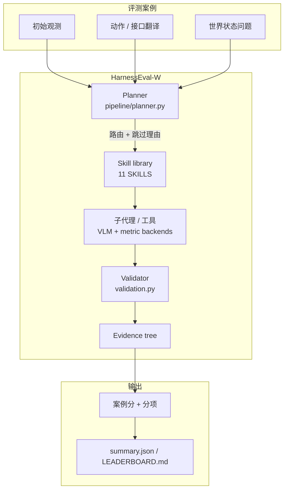
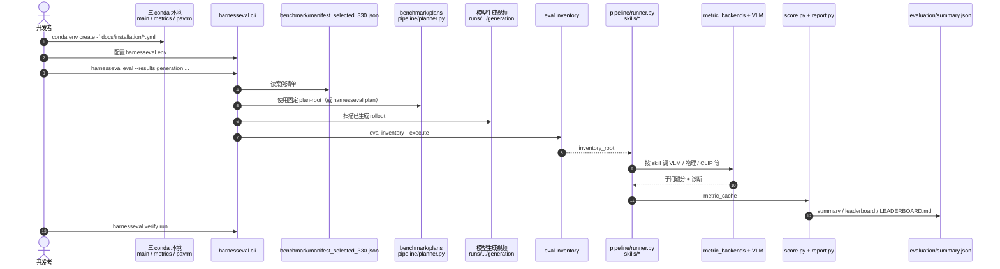

# HarnessEval-W（Agentifying the Evaluation of Visual Worlds）

**HarnessEval-W**（*Agentifying the Evaluation of Visual Worlds*，[arXiv:2608.16859](https://arxiv.org/abs/2608.16859)，[项目页](https://mirros-lab.github.io/HarnessEval-W)，[代码](https://github.com/mirros-lab/harnesseval-w)，[Blog](https://mirros.ai/blog/harnesseval)，2026-08）由 **镜界（MirroS）Team** 提出：把 LLM 生态的 **evaluation harness** 接到 **交互式视觉世界模型**——不套固定 rubric，而是按案例上下文路由可复用技能、把问题拆成可测子问题、让带诊断工具的子代理取证，再由父代理校验并汇总成 **可审计证据树**。发布 **330** 例、评 **18** 个代表模型；人对齐与相对 WBench 的可判别性/稳定性是其主卖点，而不是又一张美学榜。

## 一句话定义

**用「案例路由 → 技能分解 → 子代理取证 → 校验聚合」把世界模型打分做成可检查的推理过程，而不是不可解释的标量。**

## 英文缩写速查

| 缩写 | 英文全称 | 简要说明 |
|------|----------|----------|
| HarnessEval-W | HarnessEval for Worlds | 本文面向交互式世界模型的 agentic 评测基准 |
| I2V | Image-to-Video | 图生视频接口族；主榜 Prompt I2V 分组 |
| VLM | Vision-Language Model | 子代理共用的视觉–语言后端（论文实验钉 GPT-5.5） |
| BT | Bradley–Terry | 由 5000 对 A/B 聚合成模型强度的人类参考序 |
| WBench | Interactive Video World Model Benchmark | 对照协议：Event Edit / Causal Fidelity |
| CLI | Command-Line Interface | 官方入口 `harnesseval eval/plan/generate/verify` |
| HF | Hugging Face | 全量案例托管仍在 README TODO |

## 为什么重要

- **固定视频量纲测不出「干预是否被执行」。** VBench 类质量分、[WorldScore](./paper-worldscore.md) 的相机/布局协议、[EWMBench](./ewmbench.md) 的操纵三轴，都预先规定测什么；交互世界每个案例的动作、时序与可见状态不同，统一提问会问错或漏问。
- **分数要能被审计。** 证据树记录测了哪条技能、哪件工具提供视觉 grounding、哪条子问题失败——这才对排故和后续训数据有用。
- **评测器本身被评过。** Intentional ρ=0.93、Physical 成对准确率相对最近 WBench 协议从 31.9% 提到 71.7%，三次重复包络窄 4.9×，说明「拆成可 grounding 的子问题」同时提高人对齐与稳定性。
- **工程可跑、案例未完全托管。** CLI + 固定 plans + 捆绑 demo 已开源；330 例上 HF 与托管提交服务截至入库日仍待发布。

## 核心信息

| 项 | 内容 |
|----|------|
| **机构** | 镜界（MirroS） |
| **Venue** | arXiv 预印本（2026-08-17） |
| **规模** | 330 例；18 模型；项目页称 5,940 条带完整推理迹的 scored rollouts |
| **接口族** | Prompt I2V / Native action / Camera pose（案例意图翻译成各模型原生输入） |
| **开源** | **已开源评测管线**；全量 HF 案例 **待发布**（见下） |

## 开源状态

核查日：**2026-08-18**（[项目页](https://mirros-lab.github.io/HarnessEval-W)、[GitHub](https://github.com/mirros-lab/harnesseval-w) README / `src/harnesseval/`）。

| 产物 | 状态 |
|------|------|
| 评测代码、11 个 skill、planner/runner、metric backends | **已开源** |
| `benchmark/plans`、捆绑 demo `runs/example/results_example` | **已开源** |
| Hugging Face 全量 / 子集案例 | **待发布** |
| 托管提交评测服务 | **待发布** |
| 项目页 Leaderboard 2026-08-18 V1 | **Coming Soon** |
| 许可 | README 宣称 Apache-2.0；GitHub License 字段未识别 |

## 流程总览

路由 **只看案例、不看被评模型**，保证同案例同问题。

## 核心原理

### 方法栈：世界模型分解

交互式世界模型写成「历史观测 + 未来动作 → 未来观测」，用隐状态边缘化：观测似然 \(S\)、动作条件转移 \(T\)、由历史推断的初态。三轴分别考 **渲染 \(S\)、执行 \(T\)、状态序列是否自洽**。

| 轴 | 细设定 | 代码侧核心 skill（`protocols.py`） |
|----|--------|-----------------------------------|
| Observation | Render / Physical Observation | `render_quality_inspector` 等 4 个 observation skills（每例都跑） |
| Transition | Exploratory / Intentional / Physical | `viewpoint_trajectory_verifier` / `intentional_change_verifier_vlm` / `physical_response_verifier_vlm`（+ 诊断 `physical_law_validator`） |
| Persistence | Drift / Revisit / Offscreen | `drift_degradation_analyzer` / `return_consistency_verifier` / `offscreen_evolution_verifier` |

Probe family 只有 Transition+Persistence 六类；Observation 不是单独 family。项目页案例切分：108 / 51 / 66 与 34 / 34 / 37。

仓内 **11** 个 skill id；博客示意图列 9 个高层名（未单列 motion / appearance）。以 `src/harnesseval/protocols.py` 为准。

### Intentional Change 子问题（论文 Fig. 3）

目标可见、过渡可见、意图变化、目标特异性、终态、锚点保持、无额外事件、可判定。低分应对到具体分支（例如无关人物把方块拿走 → no-extra-event 置零），而不是一句「看起来不对」。

### 案例构建

场景分类六轴采样 → 指定 probe family → 图像生成 agent 出首帧 → 图像 grounding planner 出动作（不得改 family、不得引入图中没有的实体）→ validator 不过则回采样。

## 源码运行时序图

官方仓 [MirroS-Lab/HarnessEval-W](https://github.com/mirros-lab/harnesseval-w) 提供 **评测运行时**（不是训练世界模型）。归档见 [`sources/repos/harnesseval-w.md`](../../sources/repos/harnesseval-w.md)：

- **最短复现：** 装三环境 → 配 `harnesseval.env` → 对 `runs/example/results_example` 跑 `harnesseval eval` 再 `verify run`。
- **全量 330：** 需自备各模型生成视频；清单默认 `benchmark/manifest_selected_330.json`。HF 全量案例待发，不要假设 `download.py` 式一键拉数。
- **源码运行时序图适用范围：** 已发布 **评测栈 + demo**；官方代评服务与 HF 数据集 **不适用**。

## 工程实践

| 项 | 建议 |
|----|------|
| 环境拆分 | README 要求 **三个 conda 环境**（launcher / metrics / PAVRM 物理似然后端），不要混装 |
| 后端成本 | 子代理共用 VLM；论文实验钉同一 GPT-5.5、温度与抽帧。复现人对齐数字需付 API 账 |
| 公平性 | 不要按模型改 routing；plan 应只依赖案例。官方提供 `benchmark/plans` 以免各家自规划 |
| 接口翻译 | 同一案例要保留意图：文本指令 / 相机轨迹 / 原生动作，而不是强行统一成一种控制 |
| 读榜 | Overall 是案例平均；分项只在对应 family 上平均。I2V 总冠军经常在 Intentional/Physical，相机/原生动作族可能在 Revisit/Offscreen 领先 |
| 开源边界 | 可跑评测；**不能**默认 330 例已在 HF、也不能默认项目页活榜已可提交 |

## 实验与评测

### 主榜 Overall（论文 Table 2，330 例）

| 模型 | 接口 | Overall | 读法 |
|------|------|---------|------|
| Seedance 2.0\* | Prompt I2V | **75.5** #1 | Drift 第一；Obs-Q 第二 |
| Wan 2.7\* | Prompt I2V | 75.0 #2 | **Intentional / Physical 第一** |
| Kling 3.0\* | Prompt I2V | 74.4 #3 | Intentional 第二 |
| MiniMax H3 | Prompt I2V | 74.3 #4 | 开源 I2V 前列 |
| Cosmos3-Super | Prompt I2V | 71.9 #7 | 见 [Cosmos 3](./cosmos-3.md) |
| Wan 2.2 | Prompt I2V | 67.7 #11 | 相对 2.7 明显掉 Intentional |
| SANA-WM | Native action | 68.7 #10 | **Offscreen 第一**；Intentional 弱 |
| ABot-World | Native action | 66.1 #14 | Exploratory 第一；见 [ABot-World-0](./paper-abot-world-0.md) |
| HY-WorldPlay 1.5 | Camera pose | 67.1 #12 | **Physical Observation / Revisit 第一** |
| InSpatio-World | Camera pose | 61.4 #18 | 表底 |

\* 闭源。分项冠军不重合：能力来自训练分布，不是单一「更强视频模型」。

### 评测器对齐与稳健性

- 人类：9 模型、5000 A/B → Bradley–Terry。Intentional Spearman **ρ=0.93**（Kendall τ=0.82）；Physical **ρ=0.87**（τ=0.74）。
- 同视频、同 GPT-5.5 对照 WBench Event Edit / Causal Fidelity：Physical 成对准确率 **31.9%→71.7%**，平局 **52.2%→1.8%**；Intentional **60.2%→77.8%**，平局 **36.1%→11.1%**。
- 三次重复拟合包络比 WBench 窄 **4.9×**。

### 轴相关与微调位移

- Render Quality ↔ Physical Observation **r=-0.04**（好看 ≠ 物理上说得通）。
- Intentional ↔ Physical **r=0.98**；Exploratory 与二者近无关。
- Wan 2.2→DreamX-World、HunyuanVideo 1.5→HY-WorldPlay：Revisit 升、Intentional/Physical 降。论文假设微调数据偏探索轨迹。

## 结论

**一句话总判：HarnessEval-W 的真贡献是「可审计的案例级评测工作流」和「人对齐的干预理解」；Overall 冠军只是 I2V 先验的副作用，读分项与证据树比读总分更有用。**

1. **先选轴** — 要交互干预/长程持久用本页；要多场景运镜用 [WorldScore](./paper-worldscore.md)；要操纵末端/场景守恒用 [EWMBench](./ewmbench.md)。
2. **Overall 偏 I2V** — Seedance / Wan 2.7 领先，主要因为 Intentional/Physical 需要语义后果预测；相机/原生动作族可能在 Revisit/Offscreen 反而更好。
3. **好看与物理几乎不相关** — 不要用 Obs-Q 代理 Obs-P 或 Trans-P。
4. **微调会换能力而不是单调变强** — 动作微调常抬探索/回访、打掉指令式物理干预。
5. **复现成本在 VLM 后端** — demo 可本地跑通流程；对齐论文数字需要同一 VLM 配置与全量生成视频。
6. **活案例库尚未托管** — 代码齐、HF 与官方提交服务未齐；引用「330 例可下载」前再核 README TODO。

## 与其他工作对比

| 对照 | 差异读法 |
|------|----------|
| [WorldScore](./paper-worldscore.md) | 固定 Ctrl/Quality/Dynamics + 显式相机布局；本页是 **agentic、案例相关** 的干预/持久评测 |
| [EWMBench](./ewmbench.md) | 操纵域：场景守恒 / EEF / 语义逻辑；本页开放交互世界，无末端轨迹 |
| [GigaWorld-1 / WMBench](./paper-gigaworld-1-policy-evaluation.md) | WM **当策略评估器** 的动作忠实；本页评 **生成世界本身** 是否执行干预 |
| WBench | 固定全局问答/因果分；同视频对照下人对齐与可分性明显弱于本页 |
| VBench / EvalCrafter | 单段视频质量；不测「指定实体是否按指令变、离开再回是否还在」 |

## 局限与风险

- **不是机器人策略 / 操纵基准** — 无成功率、无 EEF、无 sim↔real；勿与 RoboDojo 混读。
- **评测器依赖专有 VLM** — 换后端可能改变绝对分；论文稳健性实验仍在 GPT 族内重复。
- **案例合成管线引入分布** — 图像生成 + LLM 校验的世界不是真机日志；物理干预再强也仍是「生成世界里的物理」。
- **HF 与活榜未齐** — 论文表是快照；项目页 V1 Coming Soon。
- **技能库会变** — 自称 living benchmark；跨版本比较必须钉 `benchmark/plans` 与 skill 版本。

## 关联页面

- [具身评测基准选型闭环（知识链）](../overview/hub-embodied-eval-benchmark.md) — 四层评测入口；本页作 ② 层交互式开放域
- [具身大模型评测基准选型闭环（Query）](../queries/embodied-eval-benchmark-selection-loop.md) — 选型决策链
- [WorldScore](./paper-worldscore.md) — 多场景相机可控世界生成统一榜
- [EWMBench](./ewmbench.md) — 具身操纵视频 WM 三轴
- [Generative World Models](../methods/generative-world-models.md) — 被评对象所在方法谱系
- [Video-as-Simulation](../concepts/video-as-simulation.md) — 像素仿真失效模式（漂移、因果、offscreen）
- [ABot-World-0](./paper-abot-world-0.md) — Native action 被评模型；Exploratory 第一
- [Wan](./paper-wan-video.md) — Wan 2.2/2.7 在 Prompt I2V 族的位置
- [Cosmos 3](./cosmos-3.md) — Cosmos3-Super 在同榜 Prompt I2V 族
- [GigaWorld-1](./paper-gigaworld-1-policy-evaluation.md) — WM 作策略评估器，轴线不同

## 参考来源

- [harnesseval_w_arxiv_2608_16859.md](../../sources/papers/harnesseval_w_arxiv_2608_16859.md)
- [harnesseval-w-github-io.md](../../sources/sites/harnesseval-w-github-io.md)
- [harnesseval-w.md](../../sources/repos/harnesseval-w.md)
- [mirros_harnesseval.md](../../sources/blogs/mirros_harnesseval.md)
- MirroS Team, *HarnessEval-W: Agentifying the Evaluation of Visual Worlds*, [arXiv:2608.16859](https://arxiv.org/abs/2608.16859)

## 推荐继续阅读

- [HarnessEval-W 项目页](https://mirros-lab.github.io/HarnessEval-W) — 覆盖数字与（待上线）榜
- [MirroS-Lab/HarnessEval-W](https://github.com/mirros-lab/harnesseval-w) — 安装、demo eval、贡献新 case/skill
- [HarnessEval 博客](https://mirros.ai/blog/harnesseval) — harness 概念与自我进化评测叙事
- Ying et al., *WBench*, [arXiv:2605.25874](https://arxiv.org/abs/2605.25874) — 论文对照协议
- Duan et al., *WorldScore*, [arXiv:2504.00983](https://arxiv.org/abs/2504.00983) — 固定指标开放域世界生成榜
