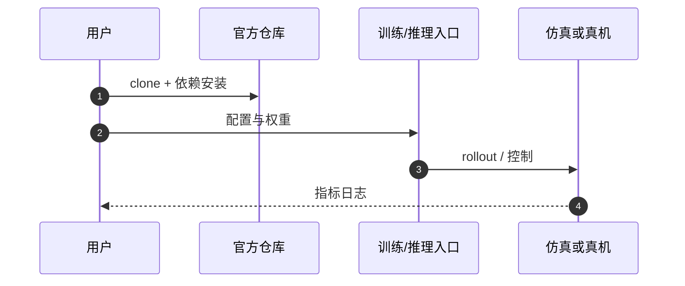

# HarnessPAI

**HarnessPAI**（*An Evolving Harness for Physical AI*，[arXiv:2609.29166](https://arxiv.org/abs/2609.29166)，[代码](https://github.com/Darwin-Agent/HarnessPAI)，[项目页](https://darwin-agent.github.io/HarnessPAI)）收录自 [具身智能小站 12 篇清单](../../sources/blogs/wechat_embodied_station_12_papers_research_checklist_2026-09-26.md)。

## 一句话定义

**Physical AI 把高层推理预算挪到多轮试验：执行时跑固定程序，失败后再演化 harness 与技能库。**

## 英文缩写速查

| 缩写 | 英文全称 | 简要说明 |
|------|----------|----------|
| VLA | Vision-Language-Action | 视觉-语言-动作策略 |
| IL | Imitation Learning | 模仿学习 |
| SR | Success Rate | 任务成功率 |
| WM | World Model | 世界模型 |

## 为什么重要

- 纳入 [12 篇具身研究清单](../../wiki/overview/embodied-research-12-papers-technology-map.md) 主线，与同期 VLA / 接触 / 规划 / 安全论文可横向对照。
- 公众号强调的可操作读法：先看 **任务信息需求**（如 PolyUMI 旋灯泡仍以视觉最优）与 **评测口径**（如 Self-Adaptive 多 trial、BeyondRetarget 仿真片段非真机 SR）。
- 开源状态（步骤 2.5）：**已开源**。

## 核心信息

| 项 | 内容 |
|----|------|
| **arXiv** | [2609.29166](https://arxiv.org/abs/2609.29166) |
| **项目页** | https://darwin-agent.github.io/HarnessPAI |
| **代码** | https://github.com/Darwin-Agent/HarnessPAI |
| **开源** | **已开源** |

## 实验与评测（公众号口径）

- 指标与消融以 [公众号盘点](../../sources/blogs/wechat_embodied_station_12_papers_research_checklist_2026-09-26.md) 与 **原文 PDF** 为准；本页不复制整表。
- 读复现前先核对：样本规模、是否仿真/真机、是否允许多次 attempt。

## 源码运行时序图

```mermaid
sequenceDiagram
  autonumber
  participant U as 用户
  participant R as 官方仓库
  participant M as 训练/推理入口
  participant E as 仿真或真机
  U->>R: clone + 依赖安装
  U->>M: 配置与权重
  M->>E: rollout / 控制
  E-->>U: 指标日志
```

## 结论

**总判：HarnessPAI 适合作为「Physical AI 把高层推理预算挪到多轮试验：执行时跑固定程序，失败后再演…」方向的入口页；细节以 arXiv 与项目页为准。**

1. 与 [12 篇技术地图](../overview/embodied-research-12-papers-technology-map.md) 对照选型，避免与同名不同 arXiv 的工作混淆（如 RAPID vs RAPID-VLM-RL）。
2. 开源为 **已开源** 时优先从项目页 Code 区核实，再写复现计划。
3. 长程 / 部署类条目（AdaHVLA、HarnessPAI、Self-Adaptive VLA）同时记录 **成功率定义** 与 **失败恢复预算**。

## 与其他工作对比

| 对照 | 差异读法 |
|------|----------|
| [π0.5](./paper-pi05-open-world-vla.md) 等纯动作模型 | 摘要：不重训底模，LIBERO-PRO 上较 π0.5 **+61.6 分**；收敛程序还可当廉价专家数据采集器，用其数据微调 π0.5 再 **+38.8 分** |
| Code-as-Policy 基线 | 高层 LLM 持续参与决策；HarnessPAI 选定程序后 **rollout 内无在线高层 LLM 推理**（程序内开环），推理预算挪到跨 rollout 的闭环演化 |
| [AdaHVLA](./paper-adahvla.md) | 同期「演化 harness」路线；AdaHVLA 侧重 VLA 长程执行的多 agent 解耦修订与修订图，HarnessPAI 强调 **模型/本体无关** 并把失败蒸馏为可复用技能 |
| [Harness VLA](./paper-harness-vla.md) | 冻结 VLA 作接触原语、agentic planner 编排；HarnessPAI 以 **代码** 作为组织动作原语的可执行、可演化接口 |
| [RoboHarness](./paper-robo-harness.md) | 把 VLA / RL / TAMP 封装为 agentic skills 并做能力边界管理；HarnessPAI 覆盖桌面臂、家用机器人、扫地机与腿式 agent，RoboCasa atomic 上较 WorldDreamer **+27.2 分** |

## 关联页面

- [具身研究 12 篇技术地图](../overview/embodied-research-12-papers-technology-map.md)
- [Manipulation](../tasks/manipulation.md)
- [VLA](../methods/vla.md)

## 参考来源

- [harnesspai 论文归档](../../sources/papers/harnesspai_arxiv_2609_29166.md)
- [公众号 12 篇清单](../../sources/blogs/wechat_embodied_station_12_papers_research_checklist_2026-09-26.md)

## 推荐继续阅读

- [arXiv:2609.29166](https://arxiv.org/abs/2609.29166)
- [项目页](https://darwin-agent.github.io/HarnessPAI)
