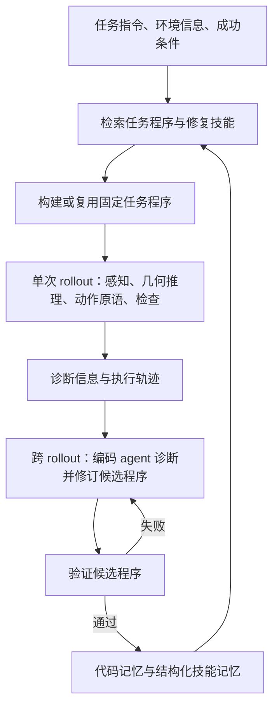

# HarnessPAI: An Evolving Harness for Physical AI（面向 Physical AI 的演化式 Harness）

**HarnessPAI**（[arXiv:2609.29166](https://arxiv.org/abs/2609.29166)，[项目页](https://darwin-agent.github.io/HarnessPAI/)，[GitHub 项目仓库](https://github.com/Darwin-Agent/HarnessPAI)）由 Darwin Agent Team 发布，论文日期为 2026-09-24。论文作者单位包括小米、清华大学、南京大学、上海交通大学等；本页按机构注册表标注已注册机构。

## 一句话定义

HarnessPAI 把代码作为物理智能体的可执行、可演化接口：一次 rollout 内由固定程序编排感知、几何推理、动作原语和检查；rollout 之间再根据执行结果修订程序，并沉淀可复用技能。

## 英文缩写速查

| 缩写 | 英文全称 | 简要说明 |
|---|---|---|
| AI | Artificial Intelligence | 人工智能 |
| LLM | Large Language Model | 大语言模型；选定程序后不参与在线高层 deliberation |
| VLA | Vision-Language-Action | 视觉-语言-动作模型，可作为动作后端之一 |
| WAM | World Action Model | 世界动作模型 |
| PPO | Proximal Policy Optimization | 近端策略优化；论文中的 Walker 后端 |
| SR | Success Rate | 成功率；不同基准的任务口径不可直接合并 |

## 核心机制

论文强调两个时间尺度。**rollout 内**程序保持固定，但并非盲目开环：它可读取当前观测、运行反馈控制、执行预定义检查和恢复逻辑；变化的是程序级决策结构，而非底层感知/动作推理。**rollout 间**编码 agent 查看诊断信息与轨迹，定位失败、检索修复技能、编辑候选程序并验证；通过验证的程序进入代码记忆，修复经验进入结构化技能记忆。任务记忆负责复用已有任务程序，原语库则提供感知、几何控制及学习型动作能力。

## 方法流程图

```mermaid
flowchart TD
  A["任务指令、环境信息、成功条件"] --> B["检索任务程序与修复技能"]
  B --> C["构建或复用固定任务程序"]
  C --> D["单次 rollout：感知、几何推理、动作原语、检查"]
  D --> E["诊断信息与执行轨迹"]
  E --> F["跨 rollout：编码 agent 诊断并修订候选程序"]
  F --> G["验证候选程序"]
  G -->|通过| H["代码记忆与结构化技能记忆"]
  G -->|失败| F
  H --> B
```

可选的准备步骤包括从演示视频抽取工作流、评估动作模型能力和初始化感知模块；它们不是所有任务都必须执行的阶段。

## 评测与结果

论文覆盖桌面机械臂、家用移动机器人、扫地机器人和腿式行走 agent。不同任务用不同指标，不应将所有实验压成单一平均分。

| 基准 / 子集 | 对照 | 对照结果 | HarnessPAI | 论文报告增益 | 读数边界 |
|---|---|---:|---:|---:|---|
| LIBERO-PRO：三套件 × Swap / Task | π₀.₅-LIBERO | 34.9% | 96.5% | +61.6 个百分点 | 50 seeds；15 用于程序演化，另 35 用于评估 |
| RoboCasa Target50：Atomic-Seen，18 tasks | WorldDreamer | 65.0% | 92.2% | +27.2 个百分点 | 同一 20-seed 设置；只代表该任务子集 |
| robosuite：7 个操作任务 | ASPIRE | 81.0% | 96.3% | +15.3 个百分点 | ASPIRE 数值取自先前工作，非同后端受控消融 |
| LIBERO：Spatial / Object / Goal | π₀.₅-LIBERO | 96.9% | 98.1% | +1.2 个百分点 | 50 seeds；基础成功率已高 |

主结果是在动作后端冻结的条件下演化 harness。另有两类结果要分开读：其一，LIBERO-Object 上演化的程序转移至 DreamZero，在 LIBERO-PRO Object 子集上无需重新演化仍取得提升；其二，收敛程序产生的成功轨迹用于单独的 π₀.₅-LIBERO 微调实验，LIBERO-PRO 提升 +38.8 个百分点。后者是下游训练实验，不是冻结后端主评测的结果。

项目页还列有 BEHAVIOR-1K、VacuSim 与 MicroDuck 实验，但它们分别使用任务完成/清洁覆盖率/行走误差等不同口径。MicroDuck 报告的是横向漂移误差，不是成功率；这些跨任务结果不宜直接横向排名。

## 适用范围与限制

- 适合任务可重复、程序可验证、成功条件可检查，且可从失败中积累经验的设置。
- 依赖可用的感知能力、动作原语和检查条件；Harness 组织既有能力，不会自动创造缺失的低层技能。
- 固定程序只消除 rollout 中在线高层 LLM deliberation；感知、动作模型、仿真/硬件和程序开发仍有成本。
- 项目页报告部分基准的程序演化与额外评估 seeds；实际复现仍应逐基准核对任务划分、演化预算、随机种子和 success checker。
- 截至 2026-10-08，论文与项目站点可访问，但研究实现和安装/复现说明尚未公开，暂不能据官方仓库进行代码级复现。

## 源码运行时序图

不适用：截至本页核验日，官方 GitHub 仓库是论文与项目站点配套仓库，研究代码尚未发布，也没有安装和复现说明。上面的图是论文描述的**方法流程**，不是已公开软件的运行时序。

## 与相关工作对比

| 对照 | 差异 |
|---|---|
| [π₀.₅ 开放世界 VLA](./paper-pi05-open-world-vla.md) | HarnessPAI 主结果冻结动作后端，重点在程序组织和反馈演化；另行报告用成功轨迹微调 π₀.₅ 的下游结果。 |
| [AdaHVLA](./paper-adahvla.md) | 同属长程执行与 harness 演化方向；HarnessPAI 强调模型/本体无关、程序记忆和结构化修复技能。 |
| [Harness VLA](./paper-harness-vla.md) | Harness VLA 以 agentic planner 编排 VLA 接触原语；HarnessPAI 把代码作为组织动作原语的可执行接口，并把演化放在 rollout 之间。 |
| [RoboHarness](./paper-robo-harness.md) | RoboHarness 以技能封装与能力边界管理为重点；HarnessPAI 强调从执行诊断中修订程序并复用失败修复经验。 |
| [Physical RSI 1.0](./physical-rsi.md) | 相近的物理智能自改进方向；比较时应区分其系统/基准证据与 HarnessPAI 的论文实验口径，不把项目页宣称直接等同于独立复现。 |

## 结论

**总判：HarnessPAI 提供了一个值得跟踪的“先演化可验证程序，再在 rollout 内稳定复用”的 Physical AI 系统思路；论文报告的增益有吸引力，但当前公开材料尚不足以支持第三方代码级复现。**

1. 研究者可先复核论文中的任务子集、seeds、成功判据和演化预算，尤其区分 15 个演化 seeds 与额外评估 seeds。
2. 复现者应等待官方研究代码与安装说明；不要把当前 GitHub 项目站点仓库误当成可安装框架。
3. 系统设计者可将“rollout 内程序固定、rollout 间程序改进”作为控制高层推理成本的架构选项，并检查反馈信号是否足以定位故障。
4. 比较方法时把冻结动作后端的主实验、跨模型迁移、以及轨迹微调结果分开报告。
5. 部署评估需同时计算感知/动作推理、硬件/仿真、程序维护和开发成本；“无在线高层 LLM”不等于整体零推理成本。

## 关联页面

- [具身研究 12 篇技术地图](../overview/embodied-research-12-papers-technology-map.md)
- [Manipulation](../tasks/manipulation.md)
- [VLA](../methods/vla.md)

## 参考来源

- [论文来源归档](../../sources/papers/harnesspai_arxiv_2609_29166.md)
- [官方项目页来源归档](../../sources/sites/harnesspai.md)
- [官方代码仓库状态归档](../../sources/repos/harnesspai.md)
- [具身智能小站 12 篇清单](../../sources/blogs/wechat_embodied_station_12_papers_research_checklist_2026-09-26.md)

## 推荐继续阅读

- [arXiv:2609.29166](https://arxiv.org/abs/2609.29166)
- [项目页](https://darwin-agent.github.io/HarnessPAI/)
- [GitHub 仓库（代码发布状态）](https://github.com/Darwin-Agent/HarnessPAI)
