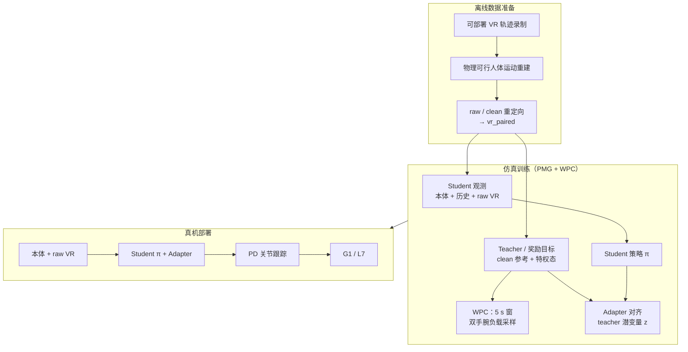

# HEFT

**HEFT**（*Heavy-Payload Full-size Humanoid Teleoperation with Privileged Motion Guidance and Windowed Payload Curriculum*，清华大学 / RobotEra / 上海期智研究院，arXiv:2607.02332）面向 **全尺寸人形重载全身遥操作**：从 **原始、嘈杂的 VR 参考流** 跟踪操作员意图，在 **Unitree G1** 与 **L7**（175 cm、65 kg 全尺寸人形）上用 **单一可部署策略** 同时覆盖 **高动态运动跟踪** 与 **双手总负载至 24 kg** 的搬运、深蹲、推物等任务。方法核心是 **PMG（Privileged Motion Guidance）**、**WPC（Windowed Payload Curriculum）** 与 **RMA 式师生适配器**；官方实现与检查点见 [Axellwppr/motion_tracking](https://github.com/Axellwppr/motion_tracking)。

## 英文缩写速查

| 缩写 | 英文全称 | 简要说明 |
|------|----------|----------|
| HEFT | HEavy-Payload Full-size humanoid Teleoperation | 重载全尺寸人形 VR 遥操作框架 |
| PMG | Privileged Motion Guidance | 部署吃 raw VR，训练用 offline clean 参考作奖励引导 |
| WPC | Windowed Payload Curriculum | 按 5 s 运动窗专家上界采样双手负载课程 |
| VR | Virtual Reality | 全身遥操作参考来源（含噪声与延迟） |
| WBT | Whole-Body Tracking | 全身参考运动跟踪低层接口 |
| RMA | Rapid Motor Adaptation | 师生潜变量对齐；部署仅保留 student + adapter |

## 核心信息

| 字段 | 内容 |
|------|------|
| 机构 | 清华大学（Tsinghua）、RobotEra、上海期智研究院（Shanghai PIL）；通讯 Jianyu Chen |
| 平台 | Unitree **G1**；全尺寸人形 **L7**（175 cm、65 kg） |
| 输入 | 本体感知 + 动作历史 + **原始 VR 参考流** $S_{\mathrm{raw},t}$ |
| 输出 | 关节位置命令 → **PD** 低层跟踪 |
| 仿真 | **mjlab** 1.3.0；三阶段 `train → adapt → finetune` |
| 真机负载 | 双手总负载 **至 24 kg**（不对称搬运、负重深蹲/行走、推物等） |
| 代码 | [motion_tracking](https://github.com/Axellwppr/motion_tracking)（`main` 训练；`sim2real` 部署与 checkpoint） |

## 为什么重要

- **重载与噪声 VR 同时成立：** 多数全身 tracking 假设 **干净重定向参考**；HEFT 明确在 **部署只吃 raw VR** 的前提下，用 **PMG** 把 offline 重建的 clean 运动仅留在训练期作监督，避免在线重建延迟。
- **负载课程按运动片段而非全局常数：** **WPC** 将轨迹切成 **5 s 窗口**，用 clean-reference **专家 rollout** 估计每窗可行负载上界，再随机采样双手腕施力——比单一全局负载日程更贴合支撑、转向、深蹲与摆臂等片段差异。
- **全尺寸真机验证：** 在 **L7** 上展示家务级遥操作、地面拾取、负重深蹲/行走与 **24 kg** 级双手搬运，填补社区在 **175 cm 级别人形** 重载 VR 遥操作上的公开案例空白。
- **与 TWIST2 / SONIC 正交对照：** 论文在 G1 上以 **SONIC、TWIST2 官方权重** 为跟踪基线，在 L7 上重训 TWIST2；HEFT 额外强调 **VR 噪声 + 双手负载** 联合鲁棒，而非仅追求无负载动态跟踪精度。

## 流程总览

## 核心机制（归纳）

### 1）Reference-conditioned payload teleoperation

- 部署观测 $o_t^{\mathrm{dep}}=(S_{\mathrm{prop},t},S_{\mathrm{raw},t})$，策略输出关节目标，由 **PD** 执行。
- 训练时每条轨迹采样 **窗口化负载日程**；奖励对 **对齐后的 clean target** 评估，而非对 raw 直接打分。
- 负载力施加于 **双手腕**；部署 **不观测负载状态**，鲁棒性来自仿真中的负载随机化。

### 2）Privileged Motion Guidance（PMG）

| 步骤 | 内容 |
|------|------|
| 1 | 录制 deployable VR，并 offline 重建物理可行人体运动 |
| 2 | raw / reconstructed 两路 **重定向** 为配对机器人参考 |
| 3 | Actor 输入 **raw**；reward / critic 对 **clean** 评估 |

典型 VR 噪声包括漂移、延迟、体坐标偏置与末端偏移；PMG 把「可部署输入」与「可评估目标」解耦。

### 3）Windowed Payload Curriculum（WPC）

- 按 **5 s** 划分运动窗；用 clean 专家 rollout 估计每窗负载上界 $\bar F_{i,k}$。
- 在 $[0,\bar F_{i,k}\,\mathrm{clip}(p/0.8,0,1)]$ 均匀采样；总负载在双手腕间随机分配，近重力方向施加并平滑。
- 对比 **TWIST2+FC**（FALCON 式力课程迁入 TWIST2）与 **w/o expert**（去掉专家窗上界）。

### 4）师生适配器（部署时可剥离 teacher）

- Teacher：$z_t=E_p(S_{\mathrm{clean},t},S_{\mathrm{priv},t})$。
- Adapter：$\hat z_t=E_a(S_{\mathrm{prop},t},S_{\mathrm{raw},t})$，最小化 $\|\hat z_t-z_t\|_2^2$。
- 部署仅保留 **student + adapter**；重建参考、窗上界、负载与仿真特权全部移除。

## 真机演示（项目页公开）

| 类别 | 示例 |
|------|------|
| 家务遥操作 | 整理、备餐、冰箱装载、搬水壶、书架/显示器摆放、铺床、清洁、蒸汽熨烫等 |
| 基础全身 | locomotion、2 kg 拾放、3 kg 搬运、地面拾取、深蹲、跪姿 |
| 重载 | 10 kg 不对称搬运、2×12 kg 负重深蹲/行走、5 kg 搬运、推物；**总负载至 24 kg** |
| 高动态跟踪 | G1（训练含 5% OmniXtreme）与 L7（SEED 高动态子集）分别评测 |

## 常见误区或局限

- **不是在线运动重建：** PMG 的 clean 参考仅用于 **训练期** reward / teacher；部署仍依赖 **raw VR**，需提前录制并 offline 配对数据，完整 VR→重建→配对 **公开工作流尚未发布**。
- **负载不可直接观测：** 与力传感闭环不同，策略靠仿真随机化学鲁棒；极端未见负载分布或非双手腕施力场景可能失效。
- **数据与标签仍部分闭源：** 完整训练集、WPC 窗标签与 PMG 配对大数据 **计划后续发布**；当前仅有 G1 烟测 memdataset 与 `sim2real` checkpoint。
- **与 TeleGate 路线不同：** [TeleGate](./paper-telegate.md) 用 **门控冻结专家** 解决多动态类跟踪；HEFT 坚持 **单策略** 覆盖重载 + 高动态 + 噪声 VR，工程上更贴近「一条 LLC 跟 VR」部署。

## 与其他页面的关系

- VR 便携采集对照：[paper-twist2.md](./paper-twist2.md)、[paper-twist.md](./paper-twist.md)
- 规模化无负载跟踪：[sonic-motion-tracking.md](../methods/sonic-motion-tracking.md)
- 惯性动捕门控专家遥操作：[paper-telegate.md](./paper-telegate.md)
- 任务语境：[teleoperation.md](../tasks/teleoperation.md)、[loco-manipulation.md](../tasks/loco-manipulation.md)
- 代码栈：[axellwppr-motion-tracking.md](./axellwppr-motion-tracking.md)

## 实验与评测（项目页）

| 持出集 | 指标 / 用途 |
|--------|-------------|
| 8 条噪声 VR（DVR） | PMG：无负载跟踪；水平根误差等 |
| 100 高动态 SEED | 高动态成功率、MPJPE、体坐标速度/角速度误差 |
| 100 随机 SEED | 一般跟踪 + **0–30 kg** 双手负载扫描（WPC） |

G1 对比 **SONIC**、**TWIST2** 官方 checkpoint；L7 对比重训 **TWIST2**。PMG 消融含 w/o noise、w/ noise；WPC 消融含 w/o expert、TWIST2+FC。

## 参考来源

- [heft-project.md](../../sources/sites/heft-project.md) — 官方项目页一手摘录
- [heft_arxiv_2607_02332.md](../../sources/papers/heft_arxiv_2607_02332.md) — 论文与仓库策展归档
- [axellwppr_motion_tracking.md](../../sources/repos/axellwppr_motion_tracking.md) — 训练/导出/部署管线
- 论文：<https://arxiv.org/abs/2607.02332>

## 推荐继续阅读

- [HEFT 项目页](https://heft.axell.top/)
- [motion_tracking GitHub](https://github.com/Axellwppr/motion_tracking)（`sim2real` 分支检查点）
- [TWIST2（便携 VR 采集对照）](./paper-twist2.md)
- [SONIC（规模化 tracking 对照）](../methods/sonic-motion-tracking.md)
- [TeleGate（门控专家遥操作对照）](./paper-telegate.md)
